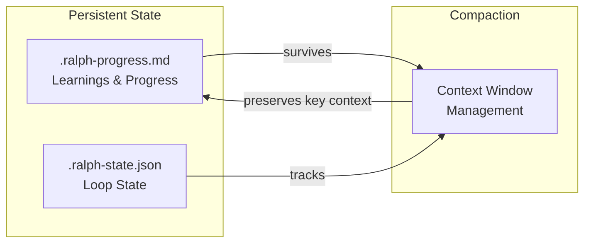

# Ralph Specum

Spec-driven development with smart compaction. A CLI tool and Claude Code plugin that combines the Ralph Wiggum agentic loop with structured specification workflow and specialized sub-agents.

## Features

- **Spec-Driven Workflow**: Generates research, requirements, design, and tasks from a goal description
- **Sub-Agent Delegation**: Specialized agents for each phase (research-analyst, product-manager, architect-reviewer, task-planner, spec-executor)
- **POC-First Workflow**: Make it work, then make it right (Phase 1: POC, Phase 2: Refactor, Phase 3: Test, Phase 4: Quality)
- **Smart Compaction**: Strategic context management between phases and tasks
- **Persistent Progress**: Learnings and state survive compaction via progress file
- **Two Modes**: Interactive (pause per phase for discussion) or fully autonomous
- **Standalone CLI**: Run as a Bun-powered CLI tool without Claude Code plugin

## Installation

### CLI Installation (Recommended)

```bash
# Clone the repository
git clone https://github.com/tzachbon/ralph-specum.git
cd ralph-specum

# Run the installer
./install.sh
```

The installer will:
1. Check for Bun (and offer to install it if missing)
2. Install ralph-specum to `~/.ralph-specum`
3. Add `ralph-specum` to your PATH

**Uninstall:**
```bash
./install.sh --uninstall
```

### From Claude Code Marketplace

```bash
# Add the marketplace
/plugin marketplace add tzachbon/ralph-specum

# Install the plugin
/plugin install ralph-specum@ralph-specum

# Restart Claude Code to load
```

### From GitHub Repository (Plugin)

```bash
# Clone the repo
git clone https://github.com/tzachbon/ralph-specum.git

# Install from local path
/plugin install /path/to/ralph-specum

# Or install directly from GitHub
/plugin install https://github.com/tzachbon/ralph-specum
```

## Quick Start

### Using the CLI

```bash
# Start interactive workflow
ralph-specum "Add user authentication with JWT tokens"

# Start autonomous workflow
ralph-specum "Refactor database layer" --mode auto

# Check status
ralph-specum status

# Show help
ralph-specum help
```

### Using Claude Code Plugin

```
/ralph-specum "Add user authentication with JWT tokens" --mode interactive --dir ./spec
```

This will:
1. Create feature directory: `./spec/add-user-authentication-with-jwt-tokens/`
2. Invoke `research-analyst` agent to generate `research.md` and pause
3. Invoke `product-manager` agent to generate `requirements.md` and pause
4. You can discuss/refine the requirements, then `/ralph-specum:approve`
5. Invoke `architect-reviewer` agent to generate `design.md` and pause
6. After approval, invoke `task-planner` for POC-first `tasks.md`
7. After approval, `spec-executor` runs tasks autonomously with compaction

## CLI Commands

| Command | Description |
|---------|-------------|
| `ralph-specum "goal"` | Start a new spec-driven workflow |
| `ralph-specum run "goal"` | Start workflow (explicit command) |
| `ralph-specum approve` | Approve current phase and continue |
| `ralph-specum implement [phase]` | Execute tasks (1, 2, 3, 4, or all) |
| `ralph-specum status` | Show current workflow status |
| `ralph-specum cancel` | Cancel active workflow and cleanup |
| `ralph-specum help` | Show help |

## CLI Options

| Option | Default | Description |
|--------|---------|-------------|
| `-m, --mode` | `interactive` | `interactive` or `auto` |
| `-d, --dir` | `./spec` | Directory for spec files |
| `-i, --max-iterations` | `10` | Max loop iterations |
| `-v, --version` | | Show version |
| `-h, --help` | | Show help |
| `-q, --quiet` | | Suppress output |
| `--debug` | | Show debug information |
| `--keep-specs` | | Keep spec files when canceling |

## Examples

```bash
# Interactive mode (recommended for new projects)
ralph-specum "Add dark mode toggle to settings"

# Autonomous mode (for well-defined tasks)
ralph-specum "Create REST API for products" --mode auto

# Custom spec directory
ralph-specum "Build notification system" --dir ./specs/notifications

# Execute only Phase 1 (POC)
ralph-specum implement 1

# Execute all tasks
ralph-specum implement all

# Check status with verbose output
ralph-specum status --verbose

# Cancel and keep generated specs
ralph-specum cancel --keep-specs
```

## Sub-Agent Architecture

Each phase delegates to a specialized agent:

| Phase | Agent | Purpose |
|-------|-------|---------|
| Research | `research-analyst` | Feasibility, best practices, risk assessment |
| Requirements | `product-manager` | User stories, acceptance criteria, business value |
| Design | `architect-reviewer` | Architecture, patterns, technical decisions |
| Tasks | `task-planner` | POC-first breakdown, quality gates |
| Execution | `spec-executor` | Autonomous task implementation |

### Research Analyst Agent

Creates research findings with:
- Executive summary and recommendation
- External research (best practices, similar solutions)
- Internal research (codebase patterns, constraints)
- Feasibility assessment (1-5 complexity rating)
- Risks, blockers, and mitigations
- Open questions

### Product Manager Agent

Creates requirements with:
- User stories with testable acceptance criteria
- Functional requirements (FR-*) with priorities
- Non-functional requirements (NFR-*)
- Glossary, out-of-scope, dependencies

### Architect Reviewer Agent

Creates design with:
- Architecture diagrams (mermaid)
- Component design and interfaces
- Technical decisions with rationale
- File structure matrix
- Test strategy

### Task Planner Agent

Creates POC-first tasks:
- **Phase 1: Make It Work** - Validate idea fast
- **Phase 2: Refactoring** - Clean up code
- **Phase 3: Testing** - Unit/integration/e2e
- **Phase 4: Quality Gates** - Lint, types, CI

### Spec Executor Agent

Executes tasks autonomously:
- Reads Do/Files/Done when/Verify from each task
- Commits after verification passes
- Updates progress file
- Handles errors gracefully

## POC-First Workflow

Every spec follows the POC-first approach:

```
Phase 1 (POC) → Phase 2 (Refactor) → Phase 3 (Testing) → Phase 4 (Quality)
```

### Phase 1: Make It Work
- Focus on proving the concept
- Skip tests, accept hardcoded values
- Only type check must pass
- Goal: Working prototype

### Phase 2: Refactoring
- Clean up code structure
- Add proper error handling
- Remove hardcoded values

### Phase 3: Testing
- Unit tests for components
- Integration tests for flows
- E2E tests for user journeys

### Phase 4: Quality Gates
- Lint check
- Type check
- All tests pass
- CI verification

## Task Structure

Each task in tasks.md includes:

```markdown
### TASK-01: Create auth middleware
- **Do**: Create JWT validation middleware
- **Files**: src/middleware/auth.ts
- **Done when**: Middleware validates tokens
- **Verify**: `npm run typecheck`
- **Commit**: `feat(auth): add JWT validation middleware`
- _Requirements: FR-1, AC-1.1_
- _Design: Auth Component_
```

## Interactive Mode Features

When a phase completes in interactive mode:
1. **Discuss/refine**: Give feedback, Claude revises the phase docs
2. **Approve**: `ralph-specum approve` to advance with compaction

No need to approve immediately. Keep iterating until satisfied.

## State Management



### Smart Compaction

Each phase transition uses targeted compaction:

| Phase | Preserves |
|-------|-----------|
| Research | Executive summary, feasibility, risks, recommendations |
| Requirements | User stories, acceptance criteria, FR/NFR, glossary |
| Design | Architecture, patterns, file paths |
| Tasks | Task list, dependencies, quality gates |
| Per-task | Current task context only |

## Files Generated

Spec files are organized under a feature-named subdirectory derived from your goal:

```
<dir>/
└── <feature-name>/           # e.g., "add-user-authentication-with-jwt"
    ├── research.md           # Research findings and feasibility
    ├── requirements.md       # User stories, acceptance criteria
    ├── design.md             # Architecture, patterns, file matrix
    ├── tasks.md              # POC-first task breakdown
    ├── .ralph-state.json     # Loop state (deleted on completion)
    └── .ralph-progress.md    # Progress and learnings (deleted on completion)
```

The feature name is automatically derived from the goal:
- Converted to kebab-case (lowercase, hyphens)
- Truncated to 50 characters max
- Example: `"Add user authentication with JWT"` → `add-user-authentication-with-jwt`

## Project Structure

```
ralph-specum/
├── cli/                      # Bun CLI application
│   ├── bin/
│   │   └── ralph-specum      # Executable entry point
│   ├── src/
│   │   ├── index.js          # CLI router
│   │   ├── commands/         # Command handlers
│   │   ├── agents/           # Agent invocation
│   │   ├── state/            # State management
│   │   └── utils/            # Utilities
│   └── package.json
├── agents/                   # Agent prompt files
│   ├── research-analyst.md
│   ├── product-manager.md
│   ├── architect-reviewer.md
│   ├── task-planner.md
│   └── spec-executor.md
├── templates/                # Output templates
│   ├── research.md
│   ├── requirements.md
│   ├── design.md
│   ├── tasks.md
│   └── progress.md
├── commands/                 # Claude Code plugin commands
├── skills/                   # Claude Code skills
├── hooks/                    # Claude Code hooks
├── .claude-plugin/           # Plugin configuration
├── install.sh                # CLI installer
└── README.md
```

## Requirements

- **Bun** >= 1.0.0 (automatically installed by install.sh)
- **Claude Code CLI** (optional, for agent invocation)
- **GitHub CLI** (optional, for PR creation)

## Troubleshooting

### Loop not continuing?

1. Check if in interactive mode waiting for `ralph-specum approve`
2. Verify `.ralph-state.json` exists in the feature directory
3. Check iteration count hasn't exceeded max

### Lost context after compaction?

1. Check `.ralph-progress.md` for preserved state
2. Learnings should persist across compactions
3. The skill always reads progress file first

### Resume after crash?

```bash
ralph-specum status                    # Check current state
ralph-specum approve                   # Continue from where you left off
```

If `.ralph-state.json` exists, it resumes from current state.

### Cancel and restart?

```bash
ralph-specum cancel --keep-specs      # Cancel but keep generated files
ralph-specum "your goal"              # Start fresh
```

## Credits

- Inspired by the [Ralph Wiggum](https://ghuntley.com/ralph/) agentic loop pattern
- Sub-agent patterns from [Morphite](https://github.com/Morphite-ai/morphite-ai)
- Built for [Claude Code](https://claude.ai/code)

## License

MIT
