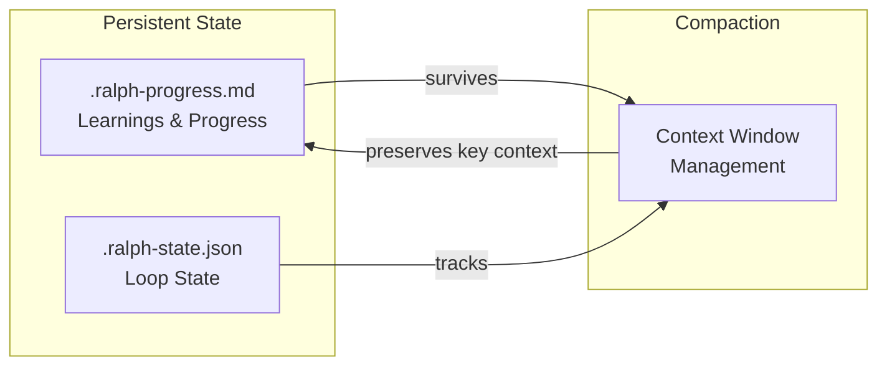

# Ralph Specum

Spec-driven development with smart compaction. A Claude Code plugin that combines the Ralph Wiggum agentic loop with structured specification workflow and specialized sub-agents.

## Features

- **Spec-Driven Workflow**: Generates requirements, design, and tasks from a goal description
- **Sub-Agent Delegation**: Specialized agents for each phase (product-manager, architect-reviewer, task-planner, spec-executor)
- **POC-First Workflow**: Make it work, then make it right (Phase 1: POC, Phase 2: Refactor, Phase 3: Test, Phase 4: Quality)
- **Smart Compaction**: Strategic context management between phases and tasks
- **Persistent Progress**: Learnings and state survive compaction via progress file
- **Two Modes**: Interactive (pause per phase for discussion) or fully autonomous

## Installation

### From Marketplace (Recommended)

```bash
# Add the marketplace
/plugin marketplace add tzachbon/ralph-specum

# Install the plugin
/plugin install ralph-specum@ralph-specum

# Restart Claude Code to load
```

### From GitHub Repository

```bash
# Clone the repo
git clone https://github.com/tzachbon/ralph-specum.git

# Install from local path
/plugin install /path/to/ralph-specum

# Or install directly from GitHub
/plugin install https://github.com/tzachbon/ralph-specum
```

## Quick Start

### Interactive Mode (Recommended)

```
/ralph-specum "Add user authentication with JWT tokens" --mode interactive --dir ./spec
```

This will:
1. Create feature directory: `./spec/add-user-authentication-with-jwt-tokens/`
2. Spawn fresh Claude via `! claude -p` with `product-manager` agent to generate `requirements.md` and pause
3. You can discuss/refine the requirements, then `/ralph-specum:approve`
4. Spawn fresh Claude via `! claude -p` with `architect-reviewer` agent to generate `design.md` and pause
5. After approval, spawn fresh Claude with `task-planner` for POC-first `tasks.md`
6. After approval, `spec-executor` runs tasks autonomously (each task = fresh context)

### Autonomous Mode

```
/ralph-specum "Refactor database layer" --mode auto --dir ./spec --max-iterations 15
```

Creates `./spec/refactor-database-layer/` and runs through all phases without pausing. Compacts automatically between phases and tasks.

## Commands

| Command | Description |
|---------|-------------|
| `/ralph-specum "goal" [options]` | Start the spec-driven loop |
| `/ralph-specum:approve` | Approve current phase (interactive mode) |
| `/ralph-specum:implement [phase]` | Start/resume task execution |
| `/ralph-specum:cancel` | Cancel active loop and cleanup |
| `/ralph-specum:help` | Show help |

## Options

| Option | Default | Description |
|--------|---------|-------------|
| `--mode` | `interactive` | `interactive` or `auto` |
| `--dir` | `./spec` | Directory for spec files |
| `--max-iterations` | `10` | Max loop iterations |

## Sub-Agent Architecture

Each phase spawns a **fresh Claude instance** via `! claude -p` with the specialized agent prompt. This ensures clean context for each phase, avoiding context bloat:

| Phase | Agent | Purpose |
|-------|-------|---------|
| Requirements | `product-manager` | User stories, acceptance criteria, business value |
| Design | `architect-reviewer` | Architecture, patterns, technical decisions |
| Tasks | `task-planner` | POC-first breakdown, quality gates |
| Execution | `spec-executor` | Autonomous task implementation |

### Product Manager Agent

Creates requirements with:
- User stories with testable acceptance criteria
- Functional requirements (FR-*) with priorities
- Non-functional requirements (NFR-*)
- Glossary, out-of-scope, dependencies

### Architect Reviewer Agent

Creates design with:
- Architecture diagrams (mermaid)
- Component design and interfaces
- Technical decisions with rationale
- File structure matrix
- Test strategy

### Task Planner Agent

Creates POC-first tasks:
- **Phase 1: Make It Work** - Validate idea fast
- **Phase 2: Refactoring** - Clean up code
- **Phase 3: Testing** - Unit/integration/e2e
- **Phase 4: Quality Gates** - Lint, types, CI

### Spec Executor Agent

Executes tasks autonomously:
- Reads Do/Files/Done when/Verify from each task
- Commits after verification passes
- Updates progress file
- Handles errors gracefully

## POC-First Workflow

Every spec follows the POC-first approach:

```
Phase 1 (POC) → Phase 2 (Refactor) → Phase 3 (Testing) → Phase 4 (Quality)
```

### Phase 1: Make It Work
- Focus on proving the concept
- Skip tests, accept hardcoded values
- Only type check must pass
- Goal: Working prototype

### Phase 2: Refactoring
- Clean up code structure
- Add proper error handling
- Remove hardcoded values

### Phase 3: Testing
- Unit tests for components
- Integration tests for flows
- E2E tests for user journeys

### Phase 4: Quality Gates
- Lint check
- Type check
- All tests pass
- CI verification

## Task Structure

Each task in tasks.md includes:

```markdown
- [ ] 1.1 Create auth middleware
  - **Do**: Create JWT validation middleware
  - **Files**: src/middleware/auth.ts
  - **Done when**: Middleware validates tokens
  - **Verify**: Manual test with curl
  - **Commit**: `feat(auth): add JWT validation middleware`
  - _Requirements: FR-1, AC-1.1_
  - _Design: Auth Component_
```

## Interactive Mode Features

When a phase completes in interactive mode:
1. **Discuss/refine**: Give feedback, Claude revises the phase docs
2. **Approve**: `/ralph-specum:approve` to advance with compaction

No need to approve immediately. Keep iterating until satisfied.

## State Management



### Smart Compaction

Each phase transition uses targeted compaction:

| Phase | Preserves |
|-------|-----------|
| Requirements | User stories, acceptance criteria, FR/NFR, glossary |
| Design | Architecture, patterns, file paths |
| Tasks | Task list, dependencies, quality gates |
| Per-task | Current task context only |

## Files Generated

Spec files are organized under a feature-named subdirectory derived from your goal:

```
<dir>/
└── <feature-name>/           # e.g., "add-user-authentication-with-jwt"
    ├── requirements.md       # User stories, acceptance criteria
    ├── design.md             # Architecture, patterns, file matrix
    ├── tasks.md              # POC-first task breakdown
    ├── .ralph-state.json     # Loop state (deleted on completion)
    └── .ralph-progress.md    # Progress and learnings (deleted on completion)
```

The feature name is automatically derived from the goal:
- Converted to kebab-case (lowercase, hyphens)
- Truncated to 50 characters max
- Example: `"Add user authentication with JWT"` → `add-user-authentication-with-jwt`

## Plugin Structure

```
ralph-specum/
├── .claude-plugin/
│   ├── plugin.json
│   └── marketplace.json
├── agents/
│   ├── product-manager.md
│   ├── architect-reviewer.md
│   ├── task-planner.md
│   └── spec-executor.md
├── commands/
│   ├── ralph-loop.md
│   ├── implement.md
│   ├── approve.md
│   ├── cancel-ralph.md
│   └── help.md
├── skills/
│   └── spec-workflow/
│       └── SKILL.md
├── hooks/
│   ├── hooks.json
│   └── scripts/
│       └── stop-handler.sh
├── templates/
│   ├── requirements.md
│   ├── design.md
│   ├── tasks.md
│   └── progress.md
└── README.md
```

## Troubleshooting

### Loop not continuing?

1. Check if in interactive mode waiting for `/ralph-specum:approve`
2. Verify `.ralph-state.json` exists in the feature directory (e.g., `./spec/<feature-name>/`)
3. Check iteration count hasn't exceeded max

### Lost context after compaction?

1. Check `.ralph-progress.md` for preserved state
2. Learnings should persist across compactions
3. The skill always reads progress file first

### Resume after crash?

```
/ralph-specum "your goal" --dir ./your-spec
```

If `.ralph-state.json` exists, it resumes from current state.

### Cancel and restart?

```
/ralph-specum:cancel --dir ./your-spec
/ralph-specum "your goal" --dir ./your-spec
```

## Credits

- Inspired by the [Ralph Wiggum](https://ghuntley.com/ralph/) agentic loop pattern
- Sub-agent patterns from [Morphite](https://github.com/Morphite-ai/morphite-ai)
- Built for [Claude Code](https://claude.ai/code)

## License

MIT
