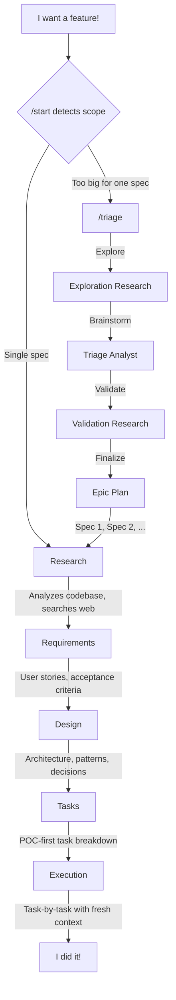
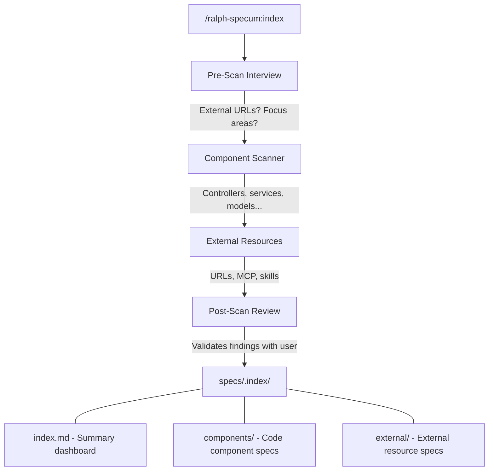

<div align="center">


# Smart Ralph

### *"Me fail specs? That's unpossible!"*

[](https://opensource.org/licenses/MIT)
[](https://claude.ai/code)
[](http://makeapullrequest.com)

**Spec-driven development for Claude Code and Codex. Task-by-task execution with fresh context per task.**

Self-contained execution loop. No external dependencies.

[Quick Start](#-quick-start) | [Commands](#-commands) | [How It Works](#-how-it-works) | [Troubleshooting](#-troubleshooting)

</div>

---

## What is this?

Smart Ralph is a Claude Code plugin that turns your vague feature ideas into structured specs, then executes them task-by-task. Like having a tiny product team in your terminal.

```text
You: "Add user authentication"
Ralph: *creates research.md, requirements.md, design.md, tasks.md*
Ralph: *executes each task with fresh context*
Ralph: "I'm helping!"
```

## Why "Ralph"?

Named after the [Ralph agentic loop pattern](https://ghuntley.com/ralph/) and everyone's favorite Springfield student. Ralph doesn't overthink. Ralph just does the next task. Be like Ralph.

---

## Installation

### Claude Code

```bash
# Install Smart Ralph
/plugin marketplace add tzachbon/smart-ralph
/plugin install ralph-specum@smart-ralph

# Restart Claude Code
```

### Codex

Codex support ships as a versioned package under `platforms/codex/`. Current package version: `4.8.4`.

Install the primary skill from this repo:

Prompt to send to Codex:

```text
Use $skill-installer to install the Smart Ralph Codex skill from repo `tzachbon/smart-ralph` at path `platforms/codex/skills/ralph-specum`.
First ask whether to install globally under `$CODEX_HOME/skills` or project-local inside this repo.
Before installing, check whether an existing install already has a `manifest.json` version for Smart Ralph Codex.
Compare that installed version to `platforms/codex/manifest.json` in this repo.
If no install exists or the versions differ, run the installer for the selected target.
If the versions match, say it is already up to date and skip reinstalling.
```

```bash
python3 "$CODEX_HOME/skills/.system/skill-installer/scripts/install-skill-from-github.py" \
  --repo tzachbon/smart-ralph \
  --path platforms/codex/skills/ralph-specum
```

Install the helper bundle when you want explicit skill entrypoints:

Prompt to send to Codex:

```text
Use $skill-installer to install the Smart Ralph Codex skills from repo `tzachbon/smart-ralph` at these paths:
- `platforms/codex/skills/ralph-specum`
- `platforms/codex/skills/ralph-specum-start`
- `platforms/codex/skills/ralph-specum-triage`
- `platforms/codex/skills/ralph-specum-research`
- `platforms/codex/skills/ralph-specum-requirements`
- `platforms/codex/skills/ralph-specum-design`
- `platforms/codex/skills/ralph-specum-tasks`
- `platforms/codex/skills/ralph-specum-implement`
- `platforms/codex/skills/ralph-specum-status`
- `platforms/codex/skills/ralph-specum-switch`
- `platforms/codex/skills/ralph-specum-cancel`
- `platforms/codex/skills/ralph-specum-index`
- `platforms/codex/skills/ralph-specum-refactor`
- `platforms/codex/skills/ralph-specum-feedback`
- `platforms/codex/skills/ralph-specum-help`
First ask whether to install globally under `$CODEX_HOME/skills` or project-local inside this repo.
Before installing, check whether an existing Smart Ralph Codex install already has a `manifest.json` version.
Compare that installed version to `platforms/codex/manifest.json` in this repo.
If no install exists or the versions differ, run the installer for the selected target.
If the versions match, say it is already up to date and skip reinstalling.
```

```bash
python3 "$CODEX_HOME/skills/.system/skill-installer/scripts/install-skill-from-github.py" \
  --repo tzachbon/smart-ralph \
  --path \
    platforms/codex/skills/ralph-specum \
    platforms/codex/skills/ralph-specum-start \
    platforms/codex/skills/ralph-specum-triage \
    platforms/codex/skills/ralph-specum-research \
    platforms/codex/skills/ralph-specum-requirements \
    platforms/codex/skills/ralph-specum-design \
    platforms/codex/skills/ralph-specum-tasks \
    platforms/codex/skills/ralph-specum-implement \
    platforms/codex/skills/ralph-specum-status \
    platforms/codex/skills/ralph-specum-switch \
    platforms/codex/skills/ralph-specum-cancel \
    platforms/codex/skills/ralph-specum-index \
    platforms/codex/skills/ralph-specum-refactor \
    platforms/codex/skills/ralph-specum-feedback \
    platforms/codex/skills/ralph-specum-help
```

Upgrade prompt to send to Codex:

```text
Use $skill-installer to update the Smart Ralph Codex install from repo `tzachbon/smart-ralph`.
First ask whether the current install lives globally under `$CODEX_HOME/skills` or project-local inside this repo.
Check the installed Smart Ralph Codex `manifest.json` version and compare it to `platforms/codex/manifest.json` in this repo.
Only if the versions differ, reinstall these paths into the selected target:
- `platforms/codex/skills/ralph-specum`
- `platforms/codex/skills/ralph-specum-start`
- `platforms/codex/skills/ralph-specum-triage`
- `platforms/codex/skills/ralph-specum-research`
- `platforms/codex/skills/ralph-specum-requirements`
- `platforms/codex/skills/ralph-specum-design`
- `platforms/codex/skills/ralph-specum-tasks`
- `platforms/codex/skills/ralph-specum-implement`
- `platforms/codex/skills/ralph-specum-status`
- `platforms/codex/skills/ralph-specum-switch`
- `platforms/codex/skills/ralph-specum-cancel`
- `platforms/codex/skills/ralph-specum-index`
- `platforms/codex/skills/ralph-specum-refactor`
- `platforms/codex/skills/ralph-specum-feedback`
- `platforms/codex/skills/ralph-specum-help`
If the versions match, say it is already up to date and do not reinstall.
Then restart Codex.
```

More Codex packaging details, including the package manifest at `platforms/codex/manifest.json`, live in [`platforms/codex/README.md`](platforms/codex/README.md).

<details>
<summary>Troubleshooting & alternative methods</summary>

**Install from GitHub directly:**
```bash
/plugin install https://github.com/tzachbon/smart-ralph
```

**Local development:**
```bash
git clone https://github.com/tzachbon/smart-ralph.git
claude --plugin-dir ./smart-ralph/plugins/ralph-specum
```

</details>

---

## Quick Start

### Codex

Use `$ralph-specum` as the default Codex surface. Helper skills mirror the explicit phase entrypoints:

```text
$ralph-specum
$ralph-specum-start
$ralph-specum-triage
$ralph-specum-research
$ralph-specum-requirements
$ralph-specum-design
$ralph-specum-tasks
$ralph-specum-implement
$ralph-specum-status
```

The helper skill package also includes `$ralph-specum-switch`, `$ralph-specum-cancel`, `$ralph-specum-index`, `$ralph-specum-refactor`, `$ralph-specum-feedback`, and `$ralph-specum-help`.

Use `$ralph-specum-triage` first when the goal is large, cross-cutting, or likely to become multiple specs. Use `$ralph-specum-start` for a single spec or to resume an existing one.

Codex Ralph is approval-gated by default. After each spec artifact, Ralph stops and asks you to approve the current artifact, request changes, or continue to the next step. Quick or autonomous flow happens only when you explicitly ask for it.

### Claude Code

```bash
# The smart way (auto-detects resume or new)
/ralph-specum:start user-auth Add JWT authentication

# Quick mode (skip spec phases, auto-generate everything)
/ralph-specum:start "Add user auth" --quick

# The step-by-step way
/ralph-specum:new user-auth Add JWT authentication
/ralph-specum:requirements
/ralph-specum:design
/ralph-specum:tasks
/ralph-specum:implement
```

---

## Commands

For Codex, the equivalent public surface is the primary `$ralph-specum` skill plus the installable helper skills under `platforms/codex/skills/`.

| Command | What it does |
|---------|--------------|
| `/ralph-specum:start [name] [goal]` | Smart entry: resume existing or create new |
| `/ralph-specum:start [goal] --quick` | Quick mode: auto-generate all specs and execute |
| `/ralph-specum:new <name> [goal]` | Create new spec, start research |
| `/ralph-specum:research` | Run/re-run research phase |
| `/ralph-specum:requirements` | Generate requirements from research |
| `/ralph-specum:design` | Generate technical design |
| `/ralph-specum:tasks` | Break design into executable tasks |
| `/ralph-specum:implement` | Execute tasks one-by-one |
| `/ralph-specum:index` | Scan codebase and generate component specs |
| `/ralph-specum:status` | Show all specs and progress |
| `/ralph-specum:switch <name>` | Change active spec |
| `/ralph-specum:triage [name] [goal]` | Decompose large features into multiple specs (epics) |
| `/ralph-specum:cancel` | Cancel loop, cleanup state |
| `/ralph-specum:help` | Show help |

---

## How It Works


```mermaid
flowchart TD
    A["I want a feature!"] --> B{"/start detects scope"}
    B -->|Single spec| C[Research]
    B -->|"Too big for one spec"| T["/triage"]

    C -->|Analyzes codebase, searches web| D[Requirements]
    D -->|User stories, acceptance criteria| E[Design]
    E -->|Architecture, patterns, decisions| F[Tasks]
    F -->|POC-first task breakdown| G[Execution]
    G -->|Task-by-task with fresh context| H["I did it!"]

    T -->|Explore| T1[Exploration Research]
    T1 -->|Brainstorm| T2[Triage Analyst]
    T2 -->|Validate| T3[Validation Research]
    T3 -->|Finalize| T4["Epic Plan"]
    T4 -->|"Spec 1, Spec 2, ..."| C
```

### The Agents

Each phase uses a specialized sub-agent:

| Phase | Agent | Superpower |
|-------|-------|------------|
| Triage | `triage-analyst` | Feature decomposition, dependency graphs, interface contracts |
| Research | `research-analyst` | Web search, codebase analysis, feasibility checks |
| Requirements | `product-manager` | User stories, acceptance criteria, business value |
| Design | `architect-reviewer` | Architecture patterns, technical trade-offs |
| Tasks | `task-planner` | POC-first breakdown, task sequencing |
| Execution | `spec-executor` | Autonomous implementation, quality gates |

### Task Execution Workflow

Tasks follow a 4-phase structure:

1. **Make It Work** - POC validation, skip tests initially
2. **Refactoring** - Clean up the code
3. **Testing** - Unit, integration, e2e tests
4. **Quality Gates** - Lint, types, CI checks

Current Ralph planning also supports:
- `--tasks-size fine|coarse` to control task granularity
- approval checkpoints between spec phases outside quick mode
- `[P]` markers for low-conflict parallel tasks
- `[VERIFY]` and VE tasks for explicit verification work
- epic planning through `/ralph-specum:triage` or `$ralph-specum-triage`

---

## Codebase Indexing

Starting with v2.12.0, Smart Ralph can scan existing codebases and auto-generate component specs, making legacy code discoverable during new feature research.

### Why Index?

When starting a new feature on an existing codebase, the **research phase benefits from knowing what's already built**. Without indexing, the research agent has limited visibility into your codebase structure.

The `/ralph-specum:index` command:

- Scans your codebase for controllers, services, models, helpers, and migrations
- Generates searchable specs for each component
- Indexes external resources (URLs, MCP servers, installed skills)
- Makes existing code discoverable in `/ralph-specum:start`

### Quick Start

```bash
# Full interactive indexing (recommended for first-time)
/ralph-specum:index

# Quick mode - skip interviews, batch scan only
/ralph-specum:index --quick

# Dry run - preview what would be indexed
/ralph-specum:index --dry-run

# Index specific directory
/ralph-specum:index --path=src/api/

# Force regenerate all specs
/ralph-specum:index --force
```

### How It Works


```mermaid
flowchart TD
    A["/ralph-specum:index"] --> B[Pre-Scan Interview]
    B -->|External URLs? Focus areas?| C[Component Scanner]
    C -->|Controllers, services, models...| D[External Resources]
    D -->|URLs, MCP, skills| E[Post-Scan Review]
    E -->|Validates findings with user| F["specs/.index/"]
    F --- G["index.md - Summary dashboard"]
    F --- H["components/ - Code component specs"]
    F --- I["external/ - External resource specs"]
```

### Options

| Option | Description |
|--------|-------------|
| `--path=<dir>` | Limit indexing to specific directory |
| `--type=<types>` | Filter by type: controllers, services, models, helpers, migrations |
| `--exclude=<patterns>` | Patterns to exclude (e.g., test, mock) |
| `--dry-run` | Preview without writing files |
| `--force` | Regenerate all specs (overwrites existing) |
| `--changed` | Regenerate only git-changed files |
| `--quick` | Skip interviews, batch scan only |

### Recommended: Index Before Research

**For best results, run `/ralph-specum:index` before starting new features on an existing codebase.**

The research phase searches indexed specs to discover relevant existing components. Without an index, you may miss important context about what's already built.

```bash
# First time on a codebase? Index it first
/ralph-specum:index

# Then start your feature
/ralph-specum:start my-feature Add user authentication
```

When you run `/ralph-specum:start`:

1. If no index exists, you'll see a hint suggesting to run `/ralph-specum:index`
2. The spec scanner searches both regular specs AND indexed specs
3. Indexed components appear in "Related Specs" during research

### What Gets Indexed

**Components** (detected by path/name patterns):
- Controllers: `**/controllers/**/*.{ts,js,py,go}`
- Services: `**/services/**/*.{ts,js,py,go}`
- Models: `**/models/**/*.{ts,js,py,go}`
- Helpers: `**/helpers/**/*.{ts,js,py,go}`
- Migrations: `**/migrations/**/*.{ts,js,sql}`

**External Resources** (discovered via interview):
- URLs (fetched via WebFetch)
- MCP servers (queried for tools/resources)
- Installed skills (commands/agents documented)

**Default Excludes**:
`node_modules`, `vendor`, `dist`, `build`, `.git`, `__pycache__`, test files

---

## Project Structure

```text
smart-ralph/
├── .claude-plugin/
│   └── marketplace.json
├── plugins/
│   ├── ralph-specum/           # Spec workflow (self-contained)
│   │   ├── .claude-plugin/
│   │   │   └── plugin.json
│   │   ├── agents/             # Sub-agent definitions
│   │   ├── commands/           # Slash commands
│   │   ├── hooks/              # Stop watcher (controls execution loop)
│   │   ├── templates/          # Spec templates
│   │   └── schemas/            # Validation schemas
│   └── ralph-speckit/          # Spec-kit methodology
│       ├── .claude-plugin/
│       │   └── plugin.json
│       ├── agents/             # spec-executor, qa-engineer
│       ├── commands/           # /speckit:* commands
│       └── templates/          # Constitution, spec, plan templates
└── README.md
```

### Your Specs

Specs live in `./specs/` in your project:

```text
./specs/
├── .current-spec           # Active spec name
└── my-feature/
    ├── .ralph-state.json   # Loop state (deleted on completion)
    ├── .progress.md        # Progress tracking
    ├── research.md
    ├── requirements.md
    ├── design.md
    └── tasks.md
```

---

## Ralph Speckit (Spec-Kit Methodology)

**ralph-speckit** is an alternative plugin implementing [GitHub's spec-kit methodology](https://github.com/github/spec-kit) with constitution-first governance.

### Key Differences from ralph-specum

| Feature | ralph-specum | ralph-speckit |
|---------|--------------|---------------|
| Directory | `./specs/` | `.specify/specs/` |
| Naming | `my-feature/` | `001-feature-name/` |
| Constitution | None | `.specify/memory/constitution.md` |
| Spec structure | research, requirements, design, tasks | spec (WHAT/WHY), plan (HOW), tasks |
| Traceability | Basic | Full FR/AC annotations |

### Installation

```bash
/plugin install ralph-speckit@smart-ralph
```

### Quick Start

```bash
# Initialize constitution (first time only)
/speckit:constitution

# Create and develop a feature
/speckit:start user-auth "Add JWT authentication"
/speckit:specify
/speckit:plan
/speckit:tasks
/speckit:implement
```

### Commands

| Command | What it does |
|---------|--------------|
| `/speckit:constitution` | Create/update project constitution |
| `/speckit:start <name> [goal]` | Create new feature with auto ID |
| `/speckit:specify` | Define feature spec (WHAT/WHY) |
| `/speckit:plan [tech]` | Create technical plan with research |
| `/speckit:tasks` | Generate task breakdown by user story |
| `/speckit:implement` | Execute tasks task-by-task |
| `/speckit:status` | Show current feature status |
| `/speckit:switch <name>` | Switch active feature |
| `/speckit:cancel` | Cancel execution loop |
| `/speckit:clarify` | Optional: clarify ambiguous requirements |
| `/speckit:analyze` | Optional: check spec consistency |

### Feature Directory Structure

```text
.specify/
├── memory/
│   └── constitution.md       # Project-level principles
├── .current-feature          # Active feature pointer
└── specs/
    ├── 001-user-auth/
    │   ├── .speckit-state.json
    │   ├── .progress.md
    │   ├── spec.md           # Requirements (WHAT/WHY)
    │   ├── research.md
    │   ├── plan.md           # Technical design (HOW)
    │   └── tasks.md
    └── 002-payment-flow/
        └── ...
```

### When to Use Which

- **ralph-specum**: Quick iterations, personal projects, simple features
- **ralph-speckit**: Enterprise projects, team collaboration, audit trails needed

---

## Troubleshooting

**Task keeps failing?**
After max iterations, the loop stops. Check `.progress.md` for errors. Fix manually, then `/ralph-specum:implement` to resume.

**Want to start over?**
`/ralph-specum:cancel` cleans up state files. Then start fresh.

**Resume existing spec?**
Just `/ralph-specum:start` - it auto-detects and continues where you left off.

**More issues?** See the full [Troubleshooting Guide](TROUBLESHOOTING.md).

---

## Breaking Changes

### v3.0.0

**Self-contained execution loop (no more ralph-loop dependency)**

Starting with v3.0.0, Smart Ralph is fully self-contained. The execution loop is handled by the built-in stop-hook.

**Migration from v2.x:**
1. Update Smart Ralph to v3.0.0+
2. Restart Claude Code
3. Existing specs continue working. No spec file changes needed.
4. You can optionally uninstall ralph-loop if you don't use it elsewhere

**What changed:**
- Ralph Loop dependency removed
- Stop-hook now controls the execution loop directly
- `/implement` runs the loop internally (no external invocation)
- `/cancel` only cleans up Smart Ralph state files

**Why:**
- Simpler installation (one plugin instead of two)
- No version compatibility issues between plugins
- Self-contained workflow

### v2.0.0

**Ralph Loop dependency required** *(superseded by v3.0.0)*

v2.0.0 delegated task execution to the Ralph Loop plugin. This is no longer required as of v3.0.0.

---

## Contributing

PRs welcome! This project is friendly to first-time contributors.

1. Fork it
2. Create your feature branch (`git checkout -b feature/amazing`)
3. Commit your changes
4. Push to the branch
5. Open a PR

---

## Credits

- [Ralph agentic loop pattern](https://ghuntley.com/ralph/) by Geoffrey Huntley
- Built for [Claude Code](https://claude.ai/code)
- Inspired by every developer who wished their AI could just figure out the whole feature

---

<div align="center">

**Made with confusion and determination**

*"The doctor said I wouldn't have so many nosebleeds if I kept my finger outta there."*

MIT License

</div>
