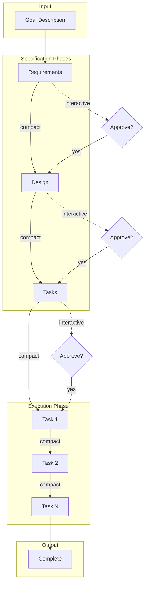
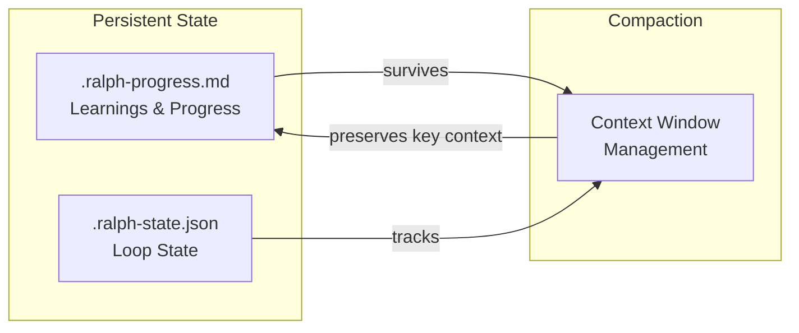

# Ralph Specum

Spec-driven development with smart compaction. A Claude Code plugin that combines the Ralph Wiggum agentic loop with structured specification workflow.

## Features

- **Spec-Driven Workflow**: Automatically generates requirements, design, and tasks from a goal description
- **Smart Compaction**: Strategic context management between phases and tasks
- **Persistent Progress**: Learnings and state survive compaction via progress file
- **Two Modes**: Interactive (pause per phase) or fully autonomous
- **BMAD Bridge**: Import BMAD planning artifacts (PRD, epics, architecture) into smart-ralph specs via `/ralph-bmad:import`
- **Loop Safety**: Pre-loop git checkpoint, circuit breaker, per-task metrics, and read-only detection
- **Role Boundaries**: Mechanical enforcement of file access rules per agent role

## Installation

### From Marketplace (Recommended)

```bash
# Add the marketplace
/plugin marketplace add tzachbon/ralph-specum

# Install the plugin
/plugin install ralph-specum@ralph-specum

# Restart Claude Code to load
```

### From GitHub Repository

```bash
# Clone the repo
git clone https://github.com/tzachbon/ralph-specum.git

# Install from local path
/plugin install /path/to/ralph-specum

# Or install directly from GitHub
/plugin install https://github.com/tzachbon/ralph-specum
```

### Local Development

```bash
# Clone and link for development
git clone https://github.com/tzachbon/ralph-specum.git
cd ralph-specum
/plugin install .
```

## Quick Start

### Interactive Mode (Recommended)

```
/ralph-specum "Add user authentication with JWT tokens" --mode interactive --dir ./auth-spec
```

This will:
1. Generate `requirements.md` and pause for approval
2. After `/ralph-specum:approve`, generate `design.md` and pause
3. After approval, generate `tasks.md` and pause
4. After approval, execute all tasks (compacting after each)

### Autonomous Mode

```bash
# The smart way (auto-detects resume or new)
/ralph-specum:start user-auth Add JWT authentication

# Quick mode (skip spec phases, auto-generate everything)
/ralph-specum:start "Add user auth" --quick

# The step-by-step way
/ralph-specum:new user-auth Add JWT authentication
/ralph-specum:requirements
/ralph-specum:design
/ralph-specum:tasks
/ralph-specum:implement
```

---

## Commands

| Command | Description |
|---------|-------------|
| `/ralph-specum "goal" [options]` | Start the spec-driven loop |
| `/ralph-specum:approve` | Approve current phase (interactive mode) |
| `/ralph-specum:cancel` | Cancel active loop and cleanup |
| `/ralph-specum:help` | Show help |

---

## How It Works


```mermaid
flowchart TB
    subgraph Input
        G[Goal Description]
    end

    subgraph Spec["Specification Phases"]
        R[Requirements]
        D[Design]
        T[Tasks]
    end

    subgraph Exec["Execution Phase"]
        E1[Task 1]
        E2[Task 2]
        EN[Task N]
    end

    subgraph Output
        C[Complete]
    end

    G --> R
    R -->|compact| D
    D -->|compact| T
    T -->|compact| E1
    E1 -->|compact| E2
    E2 -->|compact| EN
    EN --> C

    R -.->|interactive| A1{Approve?}
    D -.->|interactive| A2{Approve?}
    T -.->|interactive| A3{Approve?}

    A1 -->|yes| D
    A2 -->|yes| T
    A3 -->|yes| E1
```

### State Management


```mermaid
flowchart LR
    subgraph Files["Persistent State"]
        P[".ralph-progress.md<br/>Learnings & Progress"]
        S[".ralph-state.json<br/>Loop State"]
    end

    subgraph Compaction
        CM[Context Window<br/>Management]
    end

    P -->|survives| CM
    S -->|tracks| CM
    CM -->|preserves key context| P
```

### Smart Compaction

Each phase transition uses targeted compaction:

| Phase | Preserves |
|-------|-----------|
| Requirements | User stories, acceptance criteria, FR/NFR, glossary |
| Design | Architecture, patterns, file paths |
| Tasks | Task list, dependencies, quality gates |
| Per-task | Current task context only |

### Progress File

The `.ralph-progress.md` file carries state across compactions:

```markdown
# Ralph Progress

## Current Goal
**Phase**: execution
**Task**: 3/7 - Implement auth flow
**Objective**: Create login/logout endpoints

## Completed
- [x] Task 1: Setup scaffolding
- [x] Task 2: Database schema
- [ ] Task 3: Auth flow (IN PROGRESS)

## Learnings
- Project uses Zod for validation
- Rate limiting exists in middleware/

## Next Steps
1. Complete JWT generation
2. Add refresh tokens
```

## Files Generated

In your spec directory:

| File | Purpose |
|------|---------|
| `requirements.md` | User stories, acceptance criteria |
| `design.md` | Architecture, patterns, file matrix |
| `tasks.md` | Phased task breakdown |
| `.ralph-state.json` | Loop state (deleted on completion) |
| `.ralph-progress.md` | Progress and learnings (deleted on completion) |

## Configuration

### Max Iterations

Default: 50 iterations. The loop stops if this limit is reached to prevent infinite loops.

### Templates

Templates in `templates/` can be customized for your project's needs.

## Troubleshooting

### Loop not continuing?

1. Check if in interactive mode waiting for `/ralph-specum:approve`
2. Verify `.ralph-state.json` exists in spec directory
3. Check iteration count hasn't exceeded max

### Lost context after compaction?

1. Check `.ralph-progress.md` for preserved state
2. Learnings should persist across compactions
3. The skill always reads progress file first

### Cancel and restart?

```
/ralph-specum:cancel --dir ./your-spec
/ralph-specum "your goal" --dir ./your-spec
```

## Development

### Plugin Structure

```text
smart-ralph/
├── .claude-plugin/
│   └── marketplace.json
├── commands/
│   ├── ralph-loop.md
│   ├── cancel-ralph.md
│   ├── approve.md
│   └── help.md
├── skills/
│   └── spec-workflow/
│       └── SKILL.md
├── hooks/
│   ├── hooks.json
│   └── scripts/
│       └── stop-handler.sh
├── templates/
│   ├── requirements.md
│   ├── design.md
│   ├── tasks.md
│   └── progress.md
└── README.md
```

## Credits

- [Ralph agentic loop pattern](https://ghuntley.com/ralph/) by Geoffrey Huntley
- Built for [Claude Code](https://claude.ai/code)
- Inspired by every developer who wished their AI could just figure out the whole feature

---

<div align="center">

**Made with confusion and determination**

*"The doctor said I wouldn't have so many nosebleeds if I kept my finger outta there."*

MIT License

</div>
