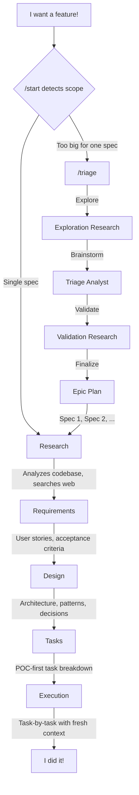

<div align="center">


# Smart Ralph

### *"Me fail specs? That's unpossible!"*

[](https://opensource.org/licenses/MIT)
[](https://claude.ai/code)
[](http://makeapullrequest.com)

**Spec-driven development for Claude Code and Codex.**

Smart Ralph turns a feature request into a structured spec, then executes it one task at a time with fresh context. The execution loop is self-contained and has no external plugin dependencies.

[How it works](#how-it-works) | [Installation](#installation) | [Quick start](#quick-start) | [Commands](#commands) | [Troubleshooting](#troubleshooting)

</div>

---

## How it works

Smart Ralph creates research, requirements, design, and task files before implementation. Large goals can start with triage, which splits the work into dependency-aware specs.

The spec files stay in the project, so you can review or edit each phase before execution. Smart Ralph records progress between tasks and can resume after a stopped session.


```mermaid
flowchart TD
    A["I want a feature!"] --> B{"/start detects scope"}
    B -->|Single spec| C[Research]
    B -->|"Too big for one spec"| T["/triage"]

    C -->|Analyzes codebase, searches web| D[Requirements]
    D -->|User stories, acceptance criteria| E[Design]
    E -->|Architecture, patterns, decisions| F[Tasks]
    F -->|POC-first task breakdown| G[Execution]
    G -->|Task-by-task with fresh context| H["I did it!"]

    T -->|Explore| T1[Exploration Research]
    T1 -->|Brainstorm| T2[Triage Analyst]
    T2 -->|Validate| T3[Validation Research]
    T3 -->|Finalize| T4["Epic Plan"]
    T4 -->|"Spec 1, Spec 2, ..."| C
```

## Installation

### Claude Code

```bash
/plugin marketplace add tzachbon/smart-ralph
/plugin install ralph-specum@smart-ralph
```

Restart Claude Code after installation.

### Codex

```bash
codex plugin marketplace add tzachbon/smart-ralph \
  --sparse .agents/plugins \
  --sparse plugins/ralph-specum-codex
codex plugin add ralph-specum@smart-ralph
```

Start a new Codex task after installation. Run `/hooks`, review the bundled Stop hook, and trust it if you want automatic task execution. Until then, run `$ralph-specum-implement` once per task.

The [Codex installation guide](plugins/ralph-specum-codex/README.md#installation) covers updates, local development with `codex plugin marketplace add .`, and migration from the old `platforms/codex/` skills.

For local Claude Code development, clone this repository and run `claude --plugin-dir ./plugins/ralph-specum`.

## Quick start

### Codex

```text
$ralph-specum-start user-auth "Add JWT authentication"
```

Use `$ralph-specum` when you want Smart Ralph to choose the next action. Codex asks for approval after each spec artifact unless you request quick or autonomous execution. Start with `$ralph-specum-triage` when a goal spans several features or systems.

### Claude Code

```bash
/ralph-specum:start user-auth "Add JWT authentication"
```

Add `--quick` to generate the spec and start execution without stopping between phases. Run `/ralph-specum:start` without arguments to resume the active spec.

## Commands

Claude Code uses `/ralph-specum:<name>`. Codex uses `$ralph-specum-<name>` and folds `new` into `$ralph-specum-start`.

| Command | What it does |
|---------|--------------|
| `/ralph-specum:start [name] [goal]` | Resume a spec or create one |
| `/ralph-specum:start [goal] --quick` | Generate all spec phases and execute |
| `/ralph-specum:new <name> [goal]` | Create a spec and start research |
| `/ralph-specum:triage [name] [goal]` | Split a large goal into an epic |
| `/ralph-specum:research` | Run or repeat research |
| `/ralph-specum:requirements` | Generate requirements from research |
| `/ralph-specum:design` | Generate the technical design |
| `/ralph-specum:tasks` | Break the design into executable tasks |
| `/ralph-specum:implement` | Execute tasks one at a time |
| `/ralph-specum:index` | Generate searchable codebase specs |
| `/ralph-specum:refactor` | Update requirements, design, or tasks |
| `/ralph-specum:status` | Show specs and progress |
| `/ralph-specum:switch <name>` | Change the active spec |
| `/ralph-specum:cancel` | Cancel execution and remove loop state |
| `/ralph-specum:feedback [message]` | Submit feedback or report an issue |
| `/ralph-specum:help` | Show command and workflow help |

## Execution model

Smart Ralph gives each phase to a focused agent.

| Phase | Agent | Responsibility |
|-------|-------|----------------|
| Triage | `triage-analyst` | Split features and map dependencies |
| Research | `research-analyst` | Inspect the codebase and check feasibility |
| Requirements | `product-manager` | Write user stories and acceptance criteria |
| Design | `architect-reviewer` | Define architecture and trade-offs |
| Tasks | `task-planner` | Create a POC-first task sequence |
| Execution | `spec-executor` | Implement tasks and run quality gates |

Tasks follow four phases:

1. Make it work: validate the approach with a POC.
2. Refactoring: clean up the working implementation.
3. Testing: add unit, integration, and end-to-end coverage.
4. Quality gates: run lint, type, and CI checks.

Planning controls include:

- `--tasks-size fine|coarse` for task granularity
- `[P]` for low-conflict parallel tasks
- `[VERIFY]` and VE tasks for explicit verification
- approval checkpoints between spec phases outside quick mode

Smart Ralph stores progress in `.progress.md` and marks completed work in `tasks.md`. Each implementation task starts with fresh context.

## Codebase indexing

`/ralph-specum:index` scans an existing project and writes searchable component specs under `specs/.index/`. Research agents use that index to find code that the project already has.

```bash
/ralph-specum:index
/ralph-specum:index --quick
/ralph-specum:index --dry-run
/ralph-specum:index --path=src/api/
```

| Option | Effect |
|--------|--------|
| `--path=<dir>` | Scan one directory |
| `--type=<types>` | Limit component types |
| `--exclude=<patterns>` | Skip matching paths |
| `--dry-run` | Preview without writing specs |
| `--force` | Regenerate the index |
| `--changed` | Regenerate Git-changed files |
| `--quick` | Skip interviews |

The scanner detects controllers, services, models, helpers, and migrations. It can also record external URLs, MCP servers, and installed skills. Run the index before starting a feature in a codebase that Smart Ralph has not seen.

The generated index has a summary dashboard, component specs, and external resource specs. Research searches both feature specs and indexed specs when it gathers context.

## Project structure

Plugin source lives in `plugins/ralph-specum/` for Claude Code, `plugins/ralph-specum-codex/` for Codex, and `plugins/ralph-speckit/` for the Spec-Kit workflow.

Smart Ralph writes feature specs inside the project where you run it:

```text
specs/
|-- .current-spec
`-- my-feature/
    |-- .ralph-state.json
    |-- .progress.md
    |-- research.md
    |-- requirements.md
    |-- design.md
    `-- tasks.md
```

Smart Ralph deletes `.ralph-state.json` when execution finishes. It keeps `.progress.md` so later tasks can recover decisions and learnings.

Epic plans live under `specs/_epics/<name>/`. Their state files track which specs are ready, blocked, or complete.

## Ralph Speckit

`ralph-speckit` is the alternative plugin for [GitHub's Spec-Kit methodology](https://github.com/github/spec-kit). It adds a project constitution and requirement-to-task traceability.

| Feature | ralph-specum | ralph-speckit |
|---------|--------------|---------------|
| Directory | `specs/` | `.specify/specs/` |
| Naming | `my-feature/` | `001-feature-name/` |
| Governance | Per-spec workflow | Project constitution |
| Main files | Research, requirements, design, tasks | Spec, plan, tasks |
| Best fit | Fast iteration | Team governance and audit trails |

```bash
/plugin install ralph-speckit@smart-ralph
/speckit:constitution
/speckit:start user-auth "Add JWT authentication"
/speckit:specify
/speckit:plan
/speckit:tasks
/speckit:implement
```

The plugin also includes `/speckit:status`, `/speckit:switch`, `/speckit:cancel`, `/speckit:clarify`, and `/speckit:analyze`. See the [Ralph Speckit guide](plugins/ralph-speckit/README.md) for its file layout and command details.

## Troubleshooting

- Repeated task failure: read `.progress.md`, fix the reported problem, then run `/ralph-specum:implement`.
- Start over: run `/ralph-specum:cancel`, then start a new spec.
- Resume work: run `/ralph-specum:start`. Ralph finds the active spec.

See the [Troubleshooting Guide](TROUBLESHOOTING.md) for installation, state, hook, and recovery problems.

## Upgrading

Smart Ralph v3.0.0 moved execution into the plugin's Stop hook. Projects that used v2.x no longer need the separate Ralph Loop plugin.

Update Smart Ralph, restart Claude Code, and resume. Existing spec files need no migration. You can uninstall Ralph Loop if no other workflow uses it. Check [GitHub releases](https://github.com/tzachbon/smart-ralph/releases) for later changes.

## Contributing

PRs are welcome. Read [CONTRIBUTING.md](CONTRIBUTING.md) for setup, tests, and pull request guidance.

## Credits

Smart Ralph takes its name from the [Ralph agentic loop pattern](https://ghuntley.com/ralph/) and Springfield's most determined student. Ralph does the next task. Be like Ralph.

- Built for [Claude Code](https://claude.ai/code) and [OpenAI Codex](https://github.com/openai/codex)
- Inspired by developers who wanted their coding agent to handle the whole feature

---

<div align="center">

**Made with confusion and determination**

*"The doctor said I wouldn't have so many nosebleeds if I kept my finger outta there."*

[MIT License](LICENSE)

</div>
