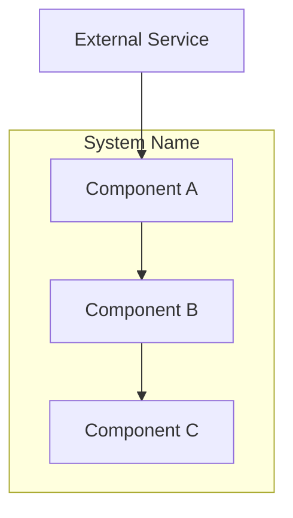
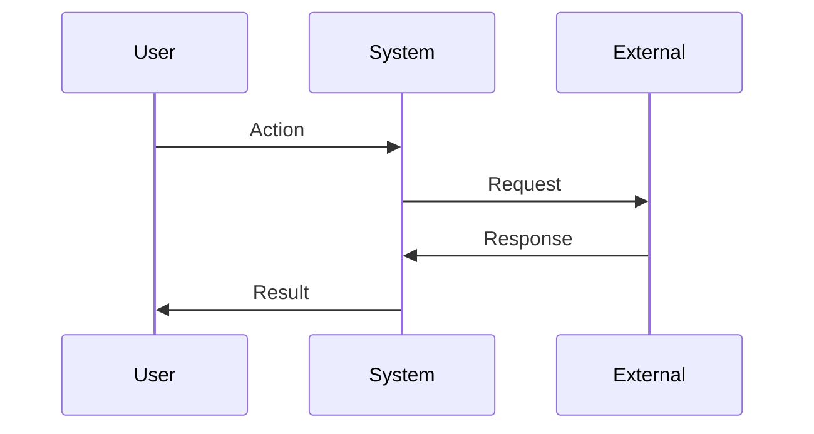

# Design Phase

## Overview

The design phase translates requirements into a technical blueprint. It answers three questions:

1. **How is it structured?** -- Define architecture, components, and their boundaries.
2. **How does data flow?** -- Document the sequence of operations from input to output.
3. **Why these choices?** -- Record technical decisions with alternatives considered and rationale.

Design produces `design.md` in the spec directory and sets `awaitingApproval: true` in state so the user reviews the design before moving to tasks.

### Inputs

- `specs/<name>/requirements.md` -- User stories, acceptance criteria, functional and non-functional requirements.
- `specs/<name>/research.md` -- Codebase patterns, existing conventions, external findings.
- `specs/<name>/.progress.md` -- Original goal and accumulated learnings.
- `specs/<name>/.ralph-state.json` -- Current state (should have `phase: "design"`).

### Output

- `specs/<name>/design.md` -- Technical design document (see template below).
- Updated `.ralph-state.json` with `awaitingApproval: true`.
- Appended learnings in `.progress.md`.

---

## Steps

### 1. Read Requirements and Research

Read `requirements.md` and `research.md` to understand the full context:

```bash
SPEC_DIR="./specs/<name>"
cat "$SPEC_DIR/requirements.md"
cat "$SPEC_DIR/research.md"
```

Extract key inputs:
- User stories and acceptance criteria (what must be built)
- Functional requirements with priorities (what matters most)
- Non-functional requirements (constraints on how it works)
- Existing codebase patterns (conventions to follow)
- Technical constraints and risks

### 2. Analyze the Codebase

Before designing, explore the existing codebase for patterns:

- **Find related files**: Search for files matching keywords from the requirements.
- **Read existing implementations**: Look for architectural patterns the new feature should follow.
- **Check dependencies**: Identify shared modules, utilities, and libraries to leverage.
- **Note conventions**: Observe naming, structure, error handling, and testing patterns.

Record file paths and code snippets as evidence for design decisions.

### 3. Define Architecture

Create a high-level architecture showing component boundaries and relationships:

```markdown
## Architecture

### Component Diagram


```

List each component with its purpose and responsibilities:

```markdown
### Components

#### Component A
**Purpose**: [What this component does]
**Responsibilities**:
- [Responsibility 1]
- [Responsibility 2]
```

### 4. Document Data Flow

Show how data moves through the system:

```markdown
### Data Flow



1. [Step one of data flow]
2. [Step two]
3. [Step three]
```

### 5. Record Technical Decisions

For each significant technical choice, document what was considered and why:

```markdown
## Technical Decisions

| Decision | Options Considered | Choice | Rationale |
|----------|-------------------|--------|-----------|
| [Decision 1] | A, B, C | B | [Why B was chosen] |
| [Decision 2] | X, Y | X | [Why X was chosen] |
```

Base decisions on research findings and codebase analysis. Reference specific patterns found.

### 6. Define File Structure

Map requirements to files that will be created or modified:

```markdown
## File Structure

| File | Action | Purpose |
|------|--------|---------|
| [src/path/file.ts] | Create | [Purpose] |
| [src/path/existing.ts] | Modify | [What changes] |
```

### 7. Define Interfaces

Document key interfaces and data shapes:

```markdown
## Interfaces

[Use the project's language and conventions for interface definitions]
```

### 8. Document Error Handling and Edge Cases

```markdown
## Error Handling

| Error Scenario | Handling Strategy | User Impact |
|----------------|-------------------|-------------|
| [Scenario 1] | [How handled] | [What user sees] |

## Edge Cases

- **[Edge case 1]**: [How handled]
- **[Edge case 2]**: [How handled]
```

### 9. Define Test Strategy

Based on requirements, outline what needs testing:

```markdown
## Test Strategy

### Unit Tests
- [Component/function to test]
- Mock requirements: [what to mock]

### Integration Tests
- [Integration point to test]

### E2E Tests (if UI)
- [User flow to test]
```

### 10. Write design.md

Create `specs/<name>/design.md` with all sections organized into the standard format (see Output Format below).

### 11. Update State and Progress

Update `.ralph-state.json` to signal completion:

```bash
SPEC_DIR="./specs/<name>"
jq '.awaitingApproval = true' "$SPEC_DIR/.ralph-state.json" > /tmp/state.json && mv /tmp/state.json "$SPEC_DIR/.ralph-state.json"
```

Append any significant discoveries to the `## Learnings` section of `.progress.md`:

- Architectural constraints discovered during design
- Trade-offs made and their rationale
- Existing patterns that must be followed
- Technical debt that may affect implementation
- Integration points that are complex or risky

---

## Advanced

### Output Format: design.md Template

```markdown
# Design: <Feature Name>

## Overview

[Technical approach summary in 2-3 sentences]

## Architecture

### Component Diagram


### Components

#### Component A
**Purpose**: [What this component does]
**Responsibilities**:
- [Responsibility 1]
- [Responsibility 2]

#### Component B
**Purpose**: [What this component does]
**Responsibilities**:
- [Responsibility 1]
- [Responsibility 2]

### Data Flow


1. [Step one of data flow]
2. [Step two]
3. [Step three]

## Technical Decisions

| Decision | Options Considered | Choice | Rationale |
|----------|-------------------|--------|-----------|
| [Decision 1] | A, B, C | B | [Why B was chosen] |
| [Decision 2] | X, Y | X | [Why X was chosen] |

## File Structure

| File | Action | Purpose |
|------|--------|---------|
| [src/path/file.ts] | Create | [Purpose] |
| [src/path/existing.ts] | Modify | [What changes] |

## Interfaces

[Interface definitions using project conventions]

## Error Handling

| Error Scenario | Handling Strategy | User Impact |
|----------------|-------------------|-------------|
| [Scenario 1] | [How handled] | [What user sees] |
| [Scenario 2] | [How handled] | [What user sees] |

## Edge Cases

- **[Edge case 1]**: [How handled]
- **[Edge case 2]**: [How handled]

## Dependencies

| Package | Version | Purpose |
|---------|---------|---------|
| [package] | [version] | [purpose] |

## Security Considerations

- [Security requirement or approach]

## Performance Considerations

- [Performance approach or constraint]

## Test Strategy

### Unit Tests
- [Component/function to test]
- Mock requirements: [what to mock]

### Integration Tests
- [Integration point to test]

### E2E Tests (if UI)
- [User flow to test]

## Existing Patterns to Follow

Based on codebase analysis:
- [Pattern 1 found in codebase]
- [Pattern 2 to maintain consistency]
```

### Design Quality Checklist

Before finalizing, verify:

- [ ] Architecture satisfies all functional requirements
- [ ] Component boundaries are clear with single responsibilities
- [ ] Interfaces are well-defined between components
- [ ] Data flow is documented end-to-end
- [ ] Technical decisions include alternatives and rationale
- [ ] File structure maps to requirements
- [ ] Error handling covers all identified scenarios
- [ ] Test strategy covers key acceptance criteria
- [ ] Design follows existing codebase patterns
- [ ] Non-functional requirements addressed (performance, security)
- [ ] Set `awaitingApproval: true` in state file
- [ ] Appended learnings to `.progress.md`

### Anti-Patterns

- **Never design without reading the codebase** -- Project-specific patterns override generic best practices.
- **Never skip alternatives** -- Every decision should show what else was considered.
- **Never ignore non-functional requirements** -- Performance and security are architecture concerns.
- **Never design in isolation** -- Reference requirements by ID (FR-1, AC-1.1) to maintain traceability.
- **Never omit error handling** -- Every component must have a failure mode strategy.
