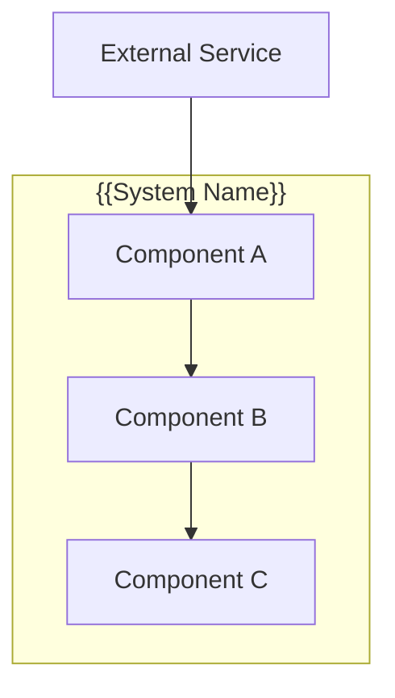
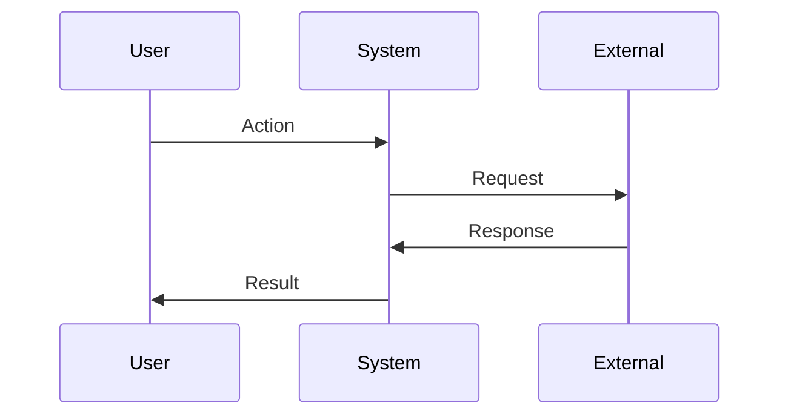

# Design: {{FEATURE_NAME}}

## Overview

{{Technical approach summary in 2-3 sentences}}

## Architecture

### Component Diagram


```mermaid
graph TB
    subgraph System["{{System Name}}"]
        A[Component A] --> B[Component B]
        B --> C[Component C]
    end
    External[External Service] --> A
```

### Components

#### Component A
**Purpose**: {{What this component does}}
**Responsibilities**:
- {{Responsibility 1}}
- {{Responsibility 2}}

#### Component B
**Purpose**: {{What this component does}}
**Responsibilities**:
- {{Responsibility 1}}
- {{Responsibility 2}}

### Data Flow


```mermaid
sequenceDiagram
    participant User
    participant System
    participant External
    User->>System: Action
    System->>External: Request
    External->>System: Response
    System->>User: Result
```

1. {{Step one of data flow}}
2. {{Step two}}
3. {{Step three}}

## Technical Decisions

| Decision | Options Considered | Choice | Rationale |
|----------|-------------------|--------|-----------|
| {{Decision 1}} | A, B, C | B | {{Why B was chosen}} |
| {{Decision 2}} | X, Y | X | {{Why X was chosen}} |

## File Structure

| File | Action | Purpose |
|------|--------|---------|
| {{src/path/file.ts}} | Create | {{Purpose}} |
| {{src/path/existing.ts}} | Modify | {{What changes}} |

## Interfaces

```typescript
interface {{ComponentInput}} {
  {{param}}: {{type}};
}

interface {{ComponentOutput}} {
  success: boolean;
  result?: {{type}};
  error?: string;
}
```

## Error Handling

| Error Scenario | Handling Strategy | User Impact |
|----------------|-------------------|-------------|
| {{Scenario 1}} | {{How handled}} | {{What user sees}} |
| {{Scenario 2}} | {{How handled}} | {{What user sees}} |

## Edge Cases

- **{{Edge case 1}}**: {{How handled}}
- **{{Edge case 2}}**: {{How handled}}

## Dependencies

| Package | Version | Purpose |
|---------|---------|---------|
| {{package}} | {{version}} | {{purpose}} |

## Security Considerations

- {{Security requirement or approach}}

## Performance Considerations

- {{Performance approach or constraint}}

## Concurrency & Ordering Risks

This section documents sequence-critical operations and their required order. If no risks identified, explicitly state "None identified."

| Operation | Required Order | Risk if Inverted |
|---|---|---|
| Example: Initialize resource before concurrent access | Resource must be initialized before any concurrent readers/writers | Race condition: readers may see uninitialized state |

> **Note**: If no concurrency risks exist for this design, write "None identified." in the table body.

## Test Strategy

<!-- MANDATORY: architect-reviewer must fill every row before marking design complete.
     spec-executor reads this section before writing any test file.
     An empty or vague Test Strategy causes spec-executor to ESCALATE. -->

### Test Double Policy

| Type | What it does | When to use |
|---|---|---|
| **Stub** | Returns predefined data, no behavior | Isolate SUT from external I/O when only the SUT's output matters |
| **Fake** | Simplified real implementation (e.g. in-memory DB) | Integration tests needing real behavior without real infrastructure |
| **Mock** | Verifies interactions (call args, call count) | Only when the interaction itself is the observable outcome (e.g. "email sent", "API called") |
| **Fixture** | Predefined data state, not code | Any test that needs known initial data — does not replace code, prepares data |

> Rule: if it lives in this repo and is not an I/O boundary, test it real — do not stub it.

### Mock Boundary

<!-- Use actual component names from this design. Do NOT use generic layer names ("Database", "HTTP").
     Columns: unit test | integration test — they differ. Fill both.
     Each cell must use one of: stub / fake / mock / none
       mock  → the interaction IS the observable outcome (assert it was called)
       stub  → only the SUT's return value matters (don't assert the call)
       fake  → real behavior, simplified infrastructure (e.g. in-memory DB)
       none  → test it real (own logic, no I/O)
-->

| Component (from this design) | Unit test | Integration test | Rationale |
|---|---|---|---|
| {{ComponentA}} | {{stub / fake / mock / none}} | {{stub / fake / mock / none}} | {{Why this type at each level}} |
| {{ComponentB}} | {{stub / fake / mock / none}} | {{stub / fake / mock / none}} | {{Why this type at each level}} |

### Fixtures & Test Data

<!-- The architect knows the domain model. Specify what data state each component needs.
     The executor cannot infer this — it must be explicit here. -->

| Component | Required state | Form |
|---|---|---|
| {{ComponentA}} | {{e.g. Invoice with 2 line items}} | {{Factory fn / fixture file / inline constants}} |
| {{E2E flows}} | {{e.g. Seed user with role X}} | {{Seed script, documented in Verification Contract}} |

### Test Coverage Table

| Component / Function | Test type | What to assert | Test double |
|---|---|---|---|
| {{ComponentA.methodX}} | unit | {{Returns expected value for input Y}} | none |
| {{ComponentA → ExternalService}} | integration | {{Response mapped to domain model correctly}} | stub HTTP |
| {{User flow: action → result}} | e2e | {{URL changes, user sees expected state}} | none (real env) |

Test types:
- **unit**: pure logic, no I/O, runs fast. Stub only true I/O boundaries.
- **integration**: two or more real modules wired together. Use Fake or real test DB, not mocks.
- **e2e**: full flow, real environment. No doubles of any kind.

> **Cross-table consistency**: every row in Mock Boundary must have a matching row in Coverage Table
> and vice versa. If Mock Boundary says "mock" for a component, Coverage Table must assert an
> interaction ("assert X was called"), not a return value.

### Skip Policy

Tests marked `.skip` / `xit` / `xdescribe` / `test.skip` are FORBIDDEN unless:
1. The functionality is not yet implemented
2. A GitHub issue reference is in the skip reason: `it.skip('TODO: #123 — reason', ...)`

### Test File Conventions

<!-- Fill from codebase scan — do NOT leave as template text -->

- Test runner: {{vitest / jest / ...}}
- Test file location: {{co-located `*.test.ts` / `__tests__/` / ...}}
- Integration test pattern: {{e.g. `*.integration.test.ts`}}
- E2E test pattern: {{e.g. `*.e2e.ts` / Playwright spec files}}
- Mock cleanup: {{afterEach with mockClear/mockReset / vi.restoreAllMocks}}
- Fixture/factory location: {{e.g. `src/test/factories/` / co-located `*.factory.ts`}}

## Existing Patterns to Follow

Based on codebase analysis:
- {{Pattern 1 found in codebase}}
- {{Pattern 2 to maintain consistency}}
