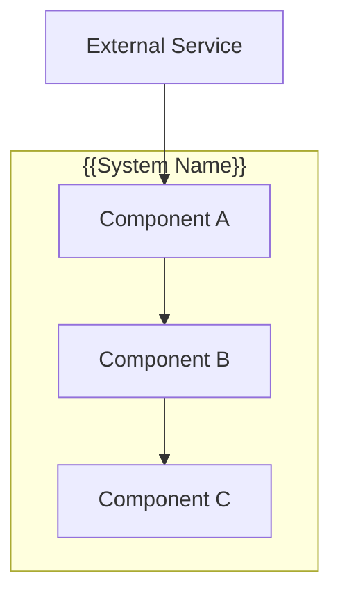
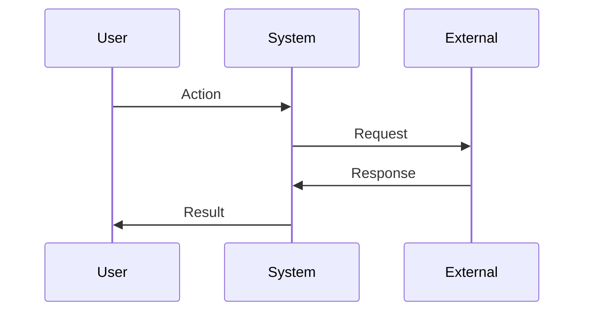

# Design: {{FEATURE_NAME}}

## Overview

{{Technical approach summary in 2-3 sentences}}

## Architecture

### Component Diagram



### Components

#### Component A
**Purpose**: {{What this component does}}
**Responsibilities**:
- {{Responsibility 1}}
- {{Responsibility 2}}

#### Component B
**Purpose**: {{What this component does}}
**Responsibilities**:
- {{Responsibility 1}}
- {{Responsibility 2}}

### Data Flow



1. {{Step one of data flow}}
2. {{Step two}}
3. {{Step three}}

## Technical Decisions

| Decision | Options Considered | Choice | Rationale |
|----------|-------------------|--------|-----------|
| {{Decision 1}} | A, B, C | B | {{Why B was chosen}} |
| {{Decision 2}} | X, Y | X | {{Why X was chosen}} |

## File Structure

| File | Action | Purpose |
|------|--------|---------|
| {{src/path/file.ts}} | Create | {{Purpose}} |
| {{src/path/existing.ts}} | Modify | {{What changes}} |

## Interfaces

```typescript
interface {{ComponentInput}} {
  {{param}}: {{type}};
}

interface {{ComponentOutput}} {
  success: boolean;
  result?: {{type}};
  error?: string;
}
```

## Error Handling

| Error Scenario | Handling Strategy | User Impact |
|----------------|-------------------|-------------|
| {{Scenario 1}} | {{How handled}} | {{What user sees}} |
| {{Scenario 2}} | {{How handled}} | {{What user sees}} |

## Edge Cases

- **{{Edge case 1}}**: {{How handled}}
- **{{Edge case 2}}**: {{How handled}}

## Dependencies

| Package | Version | Purpose |
|---------|---------|---------|
| {{package}} | {{version}} | {{purpose}} |

## Security Considerations

- {{Security requirement or approach}}

## Performance Considerations

- {{Performance approach or constraint}}

## Test Strategy

### Unit Tests
- {{Component/function to test}}
- Mock requirements: {{what to mock}}

### Integration Tests
- {{Integration point to test}}

### E2E Tests (if UI)
- {{User flow to test}}

## Existing Patterns to Follow

Based on codebase analysis:
- {{Pattern 1 found in codebase}}
- {{Pattern 2 to maintain consistency}}
