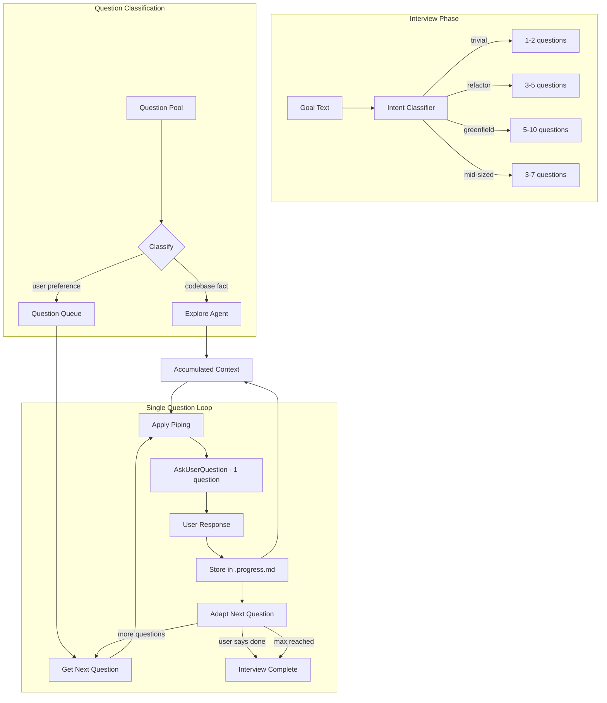
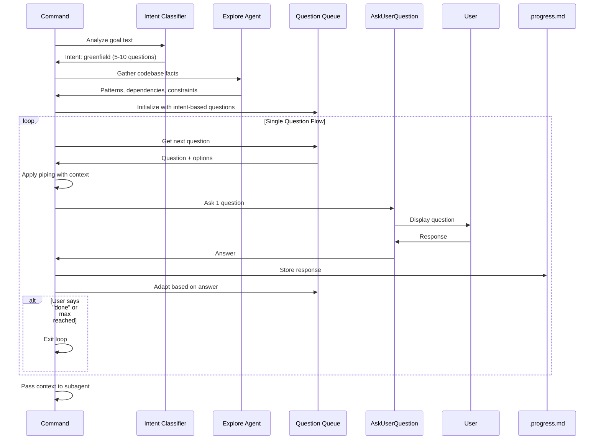

# Technical Design: Adaptive Interview System

## Design Inputs

From requirements:
- Single question per AskUserQuestion call (never batch)
- Question classification: codebase fact vs user preference
- Intent classification: trivial/refactor/greenfield/mid-sized
- Continuous interview until user signals completion
- Parameter chain, question piping, spec awareness (from prior design)

From oh-my-claudecode research:
- Planner agent asks ONE question at a time
- Questions classified before asking (facts gathered via agents, not user)
- Interview continues until user explicitly says "done"
- Intent classification determines interview depth

Architecture style: Extend existing command files

## Architecture Overview

Transform the interview system from **fixed question batches** to **dynamic single-question flow**:

1. **Intent Classifier** - Analyze goal to determine task complexity → question depth
2. **Question Queue** - Dynamic queue of questions based on intent + prior context
3. **Single Question Loop** - Ask one question, adapt next based on answer
4. **Completion Detection** - Recognize when user signals "done"
5. **Context Accumulator** - Store all responses in `.progress.md`

Key insight from oh-my-claudecode: **Never ask users about codebase facts** - use Explore agent instead.

## Architecture Diagram



## Data Flow



## Technical Decisions

| Decision | Options | Choice | Rationale |
|----------|---------|--------|-----------|
| Questions per call | Batch (current) vs Single | Single | oh-my-claude pattern - better UX, allows adaptation |
| Question source | Fixed list vs Dynamic queue | Dynamic queue | Adapts to intent and prior answers |
| Codebase facts | Ask user vs Use agent | Use Explore agent | Users shouldn't answer questions the codebase can |
| Completion signal | Fixed count vs User signal | User signal + max | Continuous until "done" but with safety max |
| Intent detection | Manual vs Auto-classify | Auto-classify from goal | Matches oh-my-claude pattern |
| Question order | Fixed vs Adaptive | Adaptive | Next question depends on prior answer |

## Component Design

### 1. Intent Classifier

**Location**: Each command file, at start of interview section

**Purpose**: Analyze goal text to determine task complexity and question depth

**Algorithm**:
```
1. Extract keywords from goal text
2. Match against intent patterns:
   - TRIVIAL: "fix typo", "small change", "quick", "simple"
   - REFACTOR: "refactor", "restructure", "reorganize", "clean up"
   - GREENFIELD: "new feature", "add", "build", "implement", "create"
   - MID_SIZED: (default) scoped features
3. Return intent + question count range
```

**Output**:
```typescript
interface IntentResult {
  intent: "trivial" | "refactor" | "greenfield" | "mid-sized";
  minQuestions: number;  // Minimum before allowing "done"
  maxQuestions: number;  // Maximum before auto-concluding
  focus: string;         // What to emphasize in questions
}
```

**Mapping**:
| Intent | Min | Max | Focus |
|--------|-----|-----|-------|
| trivial | 1 | 2 | Fast turnaround |
| refactor | 3 | 5 | Safety, test coverage, risk |
| greenfield | 5 | 10 | Discovery, patterns, scope |
| mid-sized | 3 | 7 | Boundaries, deliverables |

### 2. Question Classification

**Location**: Before adding questions to queue

**Purpose**: Filter out codebase facts, keep only user preferences

**Classification Matrix**:
| Question Type | Examples | Action |
|---------------|----------|--------|
| Codebase fact | "What patterns exist?", "Where is X?" | → Explore agent |
| Preference | "Speed vs quality?", "Priority?" | → Question queue |
| Requirement | "Deadline?", "Must-haves?" | → Question queue |
| Scope | "Include Y?", "Out of scope?" | → Question queue |
| Constraint | "Performance requirements?" | → Question queue |
| Risk tolerance | "Refactoring acceptable?" | → Question queue |

**Pre-interview Exploration**:
Before asking user questions, spawn Explore agent to gather:
- Existing patterns related to goal
- Dependencies and constraints
- Similar implementations
- Test coverage status (for refactor intent)

### 3. Dynamic Question Queue

**Location**: Each command file, "Question Queue" section

**Purpose**: Maintain adaptive queue of questions based on intent and context

**Structure**:
```typescript
interface QuestionQueue {
  questions: Question[];
  askedCount: number;
  minRequired: number;
  maxAllowed: number;
}

interface Question {
  id: string;
  text: string;           // With {var} placeholders
  header: string;         // Short label (max 12 chars)
  options: Option[];      // 2-4 options
  priority: "required" | "optional";
  skipIf?: string;        // Condition to skip (e.g., "constraints_known")
  followUp?: Question;    // Context-specific follow-up
}
```

**Question Pools by Intent**:

**Trivial Intent (1-2 questions)**:
1. "What specifically needs to change?" [required]
2. "Any constraints I should know about?" [optional]

**Refactor Intent (3-5 questions)**:
1. "What's driving this refactor?" [required]
2. "What's your risk tolerance for this change?" [required]
3. "Are there tests covering this code?" [required - via Explore]
4. "Should we update tests as part of this?" [optional]
5. "Any performance concerns?" [optional]

**Greenfield Intent (5-10 questions)**:
1. "What problem does this solve for users?" [required]
2. "Who are the primary users?" [required]
3. "What's the priority: speed, quality, or completeness?" [required]
4. "Any must-have constraints?" [required]
5. "Should this integrate with existing components?" [optional]
6. "What's the success criteria?" [required]
7. "Any security considerations?" [optional]
8. "Performance requirements?" [optional]
9. "What's explicitly out of scope?" [optional]
10. "Any other context I should know?" [optional, always last]

**Mid-sized Intent (3-7 questions)**:
1. "What's the core deliverable?" [required]
2. "What's the priority tradeoff?" [required]
3. "What's explicitly out of scope?" [required]
4. "Any dependencies or blockers?" [optional]
5. "Testing approach?" [optional]
6. "Deployment considerations?" [optional]
7. "Any other context?" [optional, always last]

### 4. Single Question Loop

**Location**: Each command file, "Interview" section

**Purpose**: Ask ONE question at a time, adapt based on response

**Loop Structure**:
```
WHILE (not done AND askedCount < maxAllowed):
    1. Get next question from queue
    2. Check skipIf condition
    3. Apply question piping ({var} replacement)
    4. Call AskUserQuestion with EXACTLY 1 question
    5. Store response in .progress.md
    6. Check for completion signal in response
    7. Adapt queue based on response (add follow-ups, skip related)
    8. Increment askedCount

IF askedCount >= minRequired AND (user_signal OR askedCount >= maxAllowed):
    Interview complete
```

**Completion Signals** (detected in user response):
- "done", "that's enough", "proceed", "let's continue"
- "no more questions", "ready to proceed"
- Selecting "No additional context" option

### 5. Context Accumulator

**Location**: Each command file, after each question

**Purpose**: Store all responses in `.progress.md` under structured sections

**Storage Format**:
```markdown
## Interview Responses

### Intent
- Classification: greenfield
- Question range: 5-10

### Goal Interview (from start.md)
- Problem: Adding new functionality
- Constraints: Must integrate with existing auth
- Success: Users can login with OAuth

### Research Interview (from research.md)
- Technical approach: Follow existing patterns
- Known constraints: Performance critical

### Requirements Interview (from requirements.md)
- Primary users: End users via UI
- Priority: Code quality and maintainability
- Out of scope: Admin panel

### Design Interview (from design.md)
- Architecture: Extend existing
- Tech constraints: None

### Tasks Interview (from tasks.md)
- Testing depth: Standard unit + integration
- Deployment: Feature flag needed
```

### 6. Question Piping

**Location**: Before each AskUserQuestion call

**Syntax**: `{variable_name}` replaced with accumulated context

**Available Variables**:
| Variable | Source | Example |
|----------|--------|---------|
| `{goal}` | Original goal | "Add OAuth login" |
| `{intent}` | Intent classification | "greenfield" |
| `{problem}` | Goal interview | "Adding new functionality" |
| `{constraints}` | Prior interviews | "Must integrate with auth" |
| `{users}` | Requirements interview | "End users via UI" |
| `{priority}` | Requirements interview | "Code quality" |
| `{patterns}` | Explore agent | "Existing auth uses JWT" |

**Example Piping**:
```
Before: "Given your {intent} goal of {goal}, what's the priority?"
After:  "Given your greenfield goal of Add OAuth login, what's the priority?"
```

### 7. Spec Scanner (unchanged from prior design)

**Location**: `start.md` and `research.md`

**Purpose**: Surface related specs (max 3) before interview

**Display Format**:
```
Related specs found:
- auth-refactor: "Restructure auth module for better testability..."
- user-profile: "Add user profile page with settings..."
```

## File Modifications

| File | Changes |
|------|---------|
| commands/start.md | Replace batch interview with single-question loop; add intent classifier; add spec scanner |
| commands/research.md | Replace batch interview; add Explore pre-fetch for codebase facts; single-question loop |
| commands/requirements.md | Replace batch interview; single-question loop; read research context |
| commands/design.md | Replace batch interview; single-question loop; read requirements context |
| commands/tasks.md | Replace batch interview; single-question loop; read design context |

## Interview Section Template

Each command file's interview section follows this template:

```markdown
### Interview

<mandatory>
**Skip interview if --quick flag detected in $ARGUMENTS.**
</mandatory>

#### Step 1: Intent Classification

Analyze the goal to determine interview depth:

| Signal | Intent | Questions |
|--------|--------|-----------|
| "fix", "typo", "small", "quick" | trivial | 1-2 |
| "refactor", "restructure", "clean" | refactor | 3-5 |
| "add", "new", "build", "implement" | greenfield | 5-10 |
| (default) | mid-sized | 3-7 |

#### Step 2: Pre-fetch Codebase Facts (optional)

For greenfield/mid-sized intents, use Explore agent to gather:
- Existing patterns related to goal
- Dependencies
- Similar implementations

DO NOT ask user about codebase facts.

#### Step 3: Single Question Loop

<mandatory>
Ask ONE question at a time using AskUserQuestion.
NEVER include multiple questions in one call.
</mandatory>

For each question in queue:
1. Check if answer already exists (parameter chain)
2. Apply piping with accumulated context
3. Ask single question
4. Store response in .progress.md
5. Check for completion signal
6. Adapt next question based on response

#### Step 4: Completion Check

Interview complete when:
- User signals done ("done", "proceed", "that's enough")
- Minimum questions asked AND user selects "No additional context"
- Maximum questions reached

#### Step 5: Accumulate Context

Store all responses in .progress.md "Interview Responses" section.
Pass accumulated context to subagent delegation.
```

## Error Handling

| Error | Handling |
|-------|----------|
| Intent classification fails | Default to mid-sized |
| Explore agent fails | Proceed without codebase facts |
| Piping variable missing | Use original question text |
| User response unclear | Ask clarifying follow-up |
| Max questions exceeded | Auto-conclude, proceed |

## Test Strategy

| FR | Test | Steps | Expected |
|----|------|-------|----------|
| FR-1 | Single question | Run interview | Each AskUserQuestion has 1 question |
| FR-2 | Classification | Check interview questions | No codebase-fact questions to user |
| FR-3 | Intent | Start with "quick fix" goal | Only 1-2 questions asked |
| FR-3 | Intent | Start with "build new feature" | 5+ questions asked |
| FR-4 | Continuous | Answer without "done" signal | Interview continues |
| FR-4 | Continuous | Say "done" after min questions | Interview concludes |
| FR-5 | Parameter chain | Answer constraint in phase 1 | Phase 2 skips constraint question |
| FR-6 | Piping | Complete goal interview | Next question contains goal text |
| FR-7 | Spec awareness | Have related specs | Summaries shown before interview |
| FR-10 | Quick mode | Use --quick flag | No questions asked |

## Implementation Order

1. **Define intent classifier** - Add to start.md first
2. **Create question pools** - Define questions per intent
3. **Implement single-question loop** - Replace batch pattern in start.md
4. **Add context accumulator** - Store responses in .progress.md
5. **Add question piping** - {var} replacement
6. **Propagate to other commands** - research.md, requirements.md, design.md, tasks.md
7. **Add Explore pre-fetch** - Gather codebase facts before user questions
8. **Test all intents** - Trivial, refactor, greenfield, mid-sized

## Sources

- [oh-my-claudecode planner.md](https://github.com/Yeachan-Heo/oh-my-claudecode/blob/main/agents/planner.md) - Single question pattern, question classification
- [jarrodwatts interview.md](https://github.com/jarrodwatts/claude-code-config/blob/main/commands/interview.md) - Continuous interview until complete
- [oh-my-claudecode analyst.md](https://github.com/Yeachan-Heo/oh-my-claudecode/blob/main/agents/analyst.md) - Requirements analysis, gap detection
