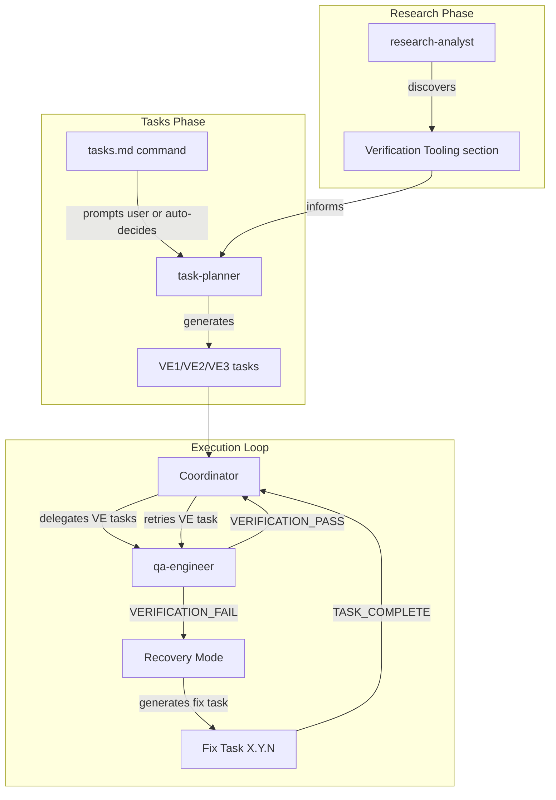
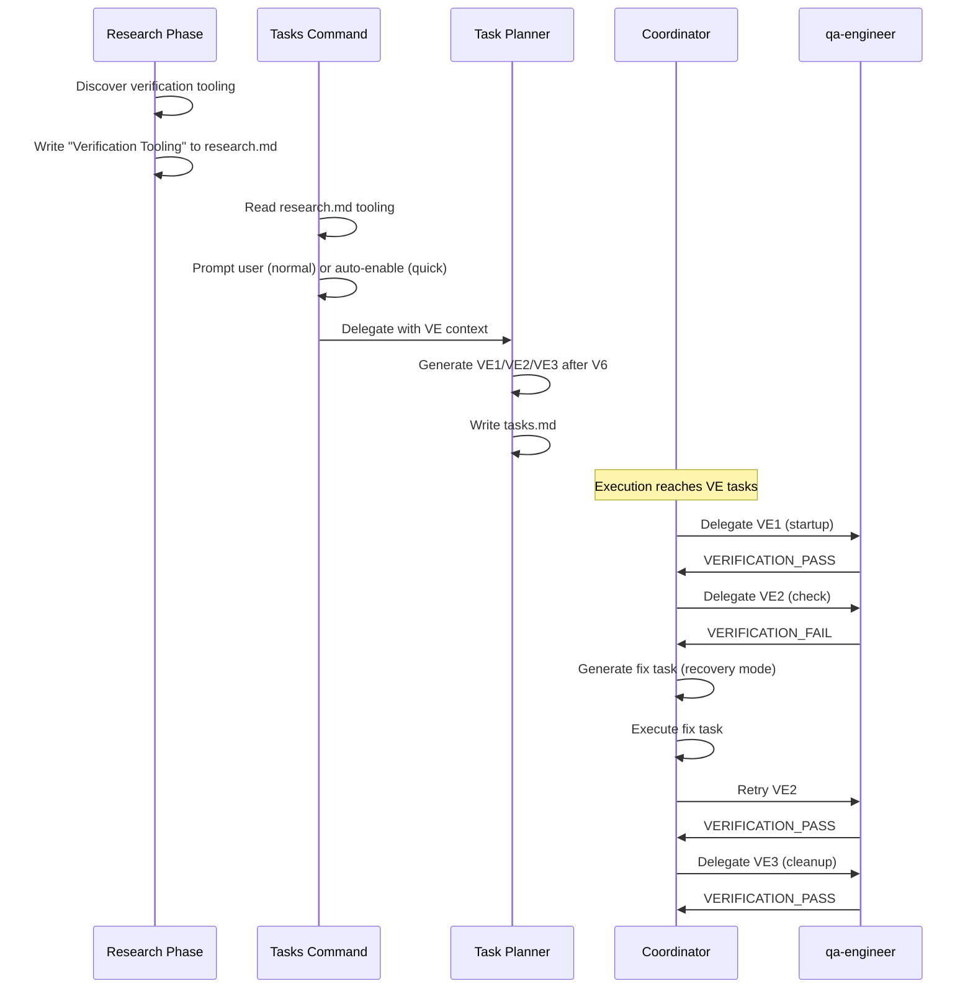

# Design: Autonomous E2E Verification

## Overview

Extend the existing V-series verification sequence (V4/V5/V6) with VE (Verify E2E) tasks that spin up real infrastructure and test built features as a user would. VE tasks are standard `[VERIFY]` tasks delegated to qa-engineer, inserted after V6 and before Phase 5 (PR Lifecycle). The verify-fix-reverify loop reuses existing recovery mode (fixTaskMap, fix task generation) with no new loop mechanism.

## Architecture



## Components

### 1. Research Phase: Verification Tooling Discovery

**Purpose**: Discover project-specific E2E verification tools during research so task-planner has concrete commands.

**Where**: New research topic in parallel-research.md topic identification and research-analyst.md.

**Detection logic** (run by research-analyst or Explore):

```bash
# Dev server detection
cat package.json | jq -r '.scripts | to_entries[] | select(.key | test("dev|start|serve")) | "\(.key): \(.value)"'

# Browser automation deps
cat package.json | jq -r '[.dependencies, .devDependencies] | add | to_entries[] | select(.key | test("playwright|puppeteer|cypress|selenium")) | .key' 2>/dev/null

# E2E config files
ls playwright.config.* cypress.config.* .puppeteerrc* 2>/dev/null

# Port detection from scripts
cat package.json | jq -r '.scripts.dev // .scripts.start // empty' | grep -oE ':\d{4}|PORT=\d{4}|\d{4}'

# Health endpoints (API projects)
grep -r "health\|ping\|ready" src/routes/ src/api/ app/api/ 2>/dev/null | head -5

# Docker detection
ls Dockerfile docker-compose.yml docker-compose.yaml 2>/dev/null
```

**Output format** (appended to research.md):

```markdown
## Verification Tooling

| Tool | Command | Detected From |
|------|---------|---------------|
| Dev Server | `npm run dev` | package.json scripts.dev |
| Port | 3000 | package.json scripts.dev |
| Browser Automation | playwright | package.json devDependencies |
| E2E Config | playwright.config.ts | File exists |
| Health Endpoint | /api/health | src/routes/health.ts |

**Project Type**: web (has dev server + browser automation)
**Verification Strategy**: Start dev server, run Playwright tests or curl endpoints
```

If nothing found:
```markdown
## Verification Tooling

No automated E2E tooling detected. Verification will use basic checks:
- Build succeeds: `<build cmd>`
- No runtime errors on import

**Project Type**: library (no dev server, no browser deps)
**Verification Strategy**: Build + import check only
```

### 2. Tasks Command: VE Prompt

**Where**: `commands/tasks.md` Step 2 (Interview section).

**Normal mode**: Add question to brainstorming dialogue territory:

```markdown
**Tasks Exploration Territory** (hints, not a script):
- ...existing items...
- **E2E verification** -- add autonomous end-to-end verification tasks? (default YES). What should be tested end-to-end?
```

Store in `.progress.md`:
```markdown
### Tasks Interview (from tasks.md)
- ...existing...
- E2E verification: YES/NO -- [strategy or "auto"]
```

**Quick mode**: Auto-enable VE tasks. Pass `veEnabled: true, veStrategy: "auto"` context to task-planner delegation.

**Delegation prompt addition** (Step 3, task-planner dispatch):

```text
E2E Verification: [enabled/disabled]
Verification Tooling from research.md: [paste Verification Tooling section]
Strategy: [user's chosen strategy or "auto-decide based on project type"]
```

### 3. Task Planner: VE Task Generation

**Where**: `agents/task-planner.md` -- new VE section.

**VE task placement**: After V6, before Phase 5 (PR Lifecycle). VE tasks extend the V-series: V4 -> V5 -> V6 -> VE1 -> VE2 -> VE3.

**Project type detection** (from research.md Verification Tooling section):

| Project Type | Detection Signal | VE Approach |
|-------------|-----------------|-------------|
| Web App | Dev server + browser deps | Start server, curl/browser check |
| API | Dev server + health endpoint | Start server, curl endpoints |
| CLI | Binary/script in package.json | Run CLI commands, check output |
| Mobile | iOS/Android deps | Simulator launch (if available) |
| Library | No dev server, no UI | Build + import check only |

**VE task template** (3-5 tasks):

```markdown
- [ ] VE1 [VERIFY] E2E startup: launch infrastructure
  - **Do**:
    1. Start dev server: `<dev cmd> &`
    2. Record PID: `echo $! > /tmp/ve-pids.txt`
    3. Wait for ready: `timeout 60 bash -c 'until curl -sf http://localhost:<port>; do sleep 2; done'`
  - **Verify**: `curl -sf http://localhost:<port> > /dev/null && echo "Server responding"`
  - **Done when**: Server responding on port <port>
  - **Commit**: None

- [ ] VE2 [VERIFY] E2E check: <critical user flow>
  - **Do**:
    1. <Test critical flow via curl/browser/CLI>
    2. Verify expected output/response
  - **Verify**: `<curl/test command with expected output check>`
  - **Done when**: Critical flow returns expected result
  - **Commit**: None

- [ ] VE3 [VERIFY] E2E cleanup: teardown infrastructure
  - **Do**:
    1. Kill by PID: `cat /tmp/ve-pids.txt | xargs kill 2>/dev/null || true`
    2. Kill by port: `lsof -ti :<port> | xargs kill -9 2>/dev/null || true`
    3. Remove PID file: `rm -f /tmp/ve-pids.txt`
    4. Verify port free: `! lsof -i :<port> > /dev/null 2>&1`
  - **Verify**: `! lsof -i :<port> > /dev/null 2>&1 && echo "Port free"`
  - **Done when**: No processes on port, PID file removed
  - **Commit**: None
```

**VE task rules**:
- Always sequential (never `[P]`)
- Always use `[VERIFY]` tag (delegated to qa-engineer)
- VE-cleanup MUST always run, even if VE-check tasks fail
- Max 5 VE tasks (1 startup + 1-3 checks + 1 cleanup)
- Commands come from research.md Verification Tooling, not hardcoded
- If no tooling detected: generate 1 VE task (build + import check) + cleanup

### 4. Phase Rules Extension

**Where**: `references/phase-rules.md` -- new section between V6 and Phase 5.

**Addition after "Final Verification Sequence"**:

```markdown
## VE Tasks (E2E Verification)

After V6 completes, VE (Verify E2E) tasks exercise the built feature with real infrastructure.

**Placement**: V4 -> V5 -> V6 -> VE1 -> VE2 -> VE3 -> Phase 5

**Structure** (3-5 tasks):
- VE-startup: Launch infrastructure (dev server, build, etc.)
- VE-check(s): Test critical user flows against running infrastructure
- VE-cleanup: Kill processes, free ports, remove temp files

**Rules**:
- Always sequential (infrastructure state dependency)
- Always `[VERIFY]` tagged (delegated to qa-engineer)
- VE-cleanup MUST run even if VE-check tasks fail
- Commands from research.md Verification Tooling section
- Recovery mode always enabled for VE tasks (verify-fix-reverify)
- Max 3 verify-fix-reverify iterations per VE task (reuses maxFixTasksPerOriginal)

**When omitted**: Quick mode auto-enables. Normal mode: user can skip.
Library-type projects get minimal VE (build + import only).
```

### 5. Quality Checkpoints Extension

**Where**: `references/quality-checkpoints.md` -- new section.

**Addition after "VF Task for Fix Goals"**:

```markdown
## VE Tasks (E2E Verification)

VE tasks are `[VERIFY]` tasks that test the built feature end-to-end by spinning up real infrastructure.

### VE Task Format

```markdown
- [ ] VE1 [VERIFY] E2E startup: <infrastructure description>
  - **Do**: Start infrastructure, record PIDs, wait for ready
  - **Verify**: Health check command
  - **Done when**: Infrastructure responding
  - **Commit**: None

- [ ] VE2 [VERIFY] E2E check: <flow description>
  - **Do**: Test critical user flow
  - **Verify**: Flow produces expected output
  - **Done when**: Expected response received
  - **Commit**: None

- [ ] VE3 [VERIFY] E2E cleanup: teardown all infrastructure
  - **Do**: Kill PIDs, kill by port, remove temp files
  - **Verify**: Port is free
  - **Done when**: No orphaned processes
  - **Commit**: None
```

### Verify-Fix-Reverify Loop

VE failures trigger the existing recovery mode pattern:
1. qa-engineer outputs VERIFICATION_FAIL for VE-check task
2. Coordinator generates fix task via fixTaskMap (same as any recovery)
3. Fix task executes, then VE-check retries
4. Max 3 iterations (reuses maxFixTasksPerOriginal)
5. VE-cleanup ALWAYS runs last regardless of prior failures

### VE-Cleanup Guarantee

VE-cleanup must run even if prior VE tasks fail. The coordinator must:
1. Track VE-cleanup task index separately
2. If a VE-check hits max retries, skip to VE-cleanup instead of stopping
3. VE-cleanup uses both PID-based and port-based kill for reliability
```

### 6. Coordinator Integration

**Where**: No changes to `references/coordinator-pattern.md`. VE tasks are standard `[VERIFY]` tasks -- the coordinator already handles them via qa-engineer delegation and recovery mode.

**How it works** (existing mechanisms):

| VE Event | Coordinator Behavior | Mechanism |
|----------|---------------------|-----------|
| VE task detected | Delegate to qa-engineer | Existing [VERIFY] detection |
| VERIFICATION_PASS | Mark [x], advance taskIndex | Standard verification handling |
| VERIFICATION_FAIL | Generate fix task, retry VE | Existing recovery mode (fixTaskMap) |
| Max retries exceeded | Skip to VE-cleanup | **New**: VE-cleanup guarantee |

**VE-cleanup guarantee**: This is the ONE addition to coordinator logic. When a VE task (not VE-cleanup) hits max retries, instead of stopping execution entirely, the coordinator should skip forward to the VE-cleanup task (identifiable by "E2E cleanup" in task description). After cleanup completes, THEN stop with the error.

**Implementation**: Add to coordinator-pattern.md's "Max Retries" section:

```markdown
**VE Task Exception**: If the failed task is a VE task (description contains "E2E" and
`[VERIFY]`), do not stop immediately. Instead:
1. Log the VE failure in .progress.md
2. Skip to VE-cleanup task (search forward for "E2E cleanup" in tasks.md)
3. Execute VE-cleanup
4. THEN output the error and stop
```

## Data Flow



## Technical Decisions

| Decision | Options Considered | Choice | Rationale |
|----------|-------------------|--------|-----------|
| VE task naming | New phase (Phase E2E) vs extend V-series | Extend V-series (VE1/VE2/VE3) | Avoids restructuring phase numbering; VE is logically part of final verification |
| Loop mechanism | New loop vs reuse recovery mode | Reuse recovery mode | fixTaskMap/fix task generation already handles verify-fix-reverify; zero new code for loop |
| Agent for VE tasks | New agent vs qa-engineer | qa-engineer | VE tasks are standard [VERIFY] tasks; qa-engineer already handles command verification |
| Cleanup reliability | PID-only vs PID + port fallback | PID + port fallback | PIDs can be lost; lsof port-based kill catches orphans |
| VE task placement | After V6, before Phase 5 | After V6, before Phase 5 | Tests real artifact before PR creation; cleanup before PR lifecycle |
| Recovery mode for VE | Require --recovery-mode flag | Always enabled for VE tasks | VE failures are expected and recoverable; requiring flag adds friction |
| Project type detection | Runtime detection vs research-based | Research-based | Research already runs before tasks; avoids duplicate detection logic |
| PID storage | State file vs temp file | /tmp/ve-pids.txt | Simple, no state file pollution; cleanup removes it |

## File Structure

| File | Action | Purpose |
|------|--------|---------|
| `plugins/ralph-specum/agents/task-planner.md` | Modify | Add VE task generation section with template and project-type rules |
| `plugins/ralph-specum/references/phase-rules.md` | Modify | Add VE section after V6 documentation |
| `plugins/ralph-specum/references/quality-checkpoints.md` | Modify | Add VE task format spec and cleanup guarantee |
| `plugins/ralph-specum/commands/tasks.md` | Modify | Add VE prompt to interview territory and delegation context |
| `plugins/ralph-specum/references/parallel-research.md` | Modify | Add "Verification Tooling" as a research topic category |
| `plugins/ralph-specum/agents/research-analyst.md` | Modify | Add verification tooling discovery section |
| `plugins/ralph-specum/templates/tasks.md` | Modify | Add VE task template after V6 in both POC and TDD workflows |
| `plugins/ralph-specum/references/coordinator-pattern.md` | Modify | Add VE-cleanup guarantee (skip-to-cleanup on max retries) |

## Error Handling

| Error Scenario | Handling Strategy | User Impact |
|----------------|-------------------|-------------|
| Dev server fails to start (VE1) | VERIFICATION_FAIL -> recovery mode generates fix -> retry VE1 | Automatic fix attempt, max 3 retries |
| VE-check fails (VE2) | VERIFICATION_FAIL -> fix task -> retry VE2 | Automatic fix attempt |
| Max retries on VE task | Skip to VE-cleanup -> cleanup -> THEN stop with error | No orphaned processes; clear error message |
| No verification tooling found | Generate minimal VE (build + import check) | Graceful degradation |
| Port already in use | VE-startup detects via lsof, kills existing process | Cleanup before start |
| VE-cleanup fails | Both PID and port-based kill; verify with lsof | Double-kill strategy |
| Timeout waiting for server | 60s timeout in startup wait loop | Fails fast, retries via recovery |

## Edge Cases

- **Library projects**: No dev server -> VE tasks reduced to build + import check
- **Port conflicts**: VE-startup checks port first, kills existing if occupied
- **Quick mode + no tooling**: Auto-generates minimal VE tasks (build only)
- **User declines VE (normal mode)**: No VE tasks generated, behavior identical to today
- **Existing specs without VE**: Execute identically (backward compatible)
- **VE-cleanup after all VE-checks fail**: Cleanup always runs (coordinator skip-to-cleanup)
- **Multiple dev servers**: PID file tracks all PIDs; cleanup kills all

## Test Strategy

### Unit Tests
- Not applicable (plugin is markdown-based, no testable code)

### Integration Tests
- Generate tasks for a web project spec and verify VE tasks appear after V6
- Generate tasks for a library spec and verify minimal VE tasks
- Verify quick mode auto-enables VE without prompt
- Verify normal mode prompts and stores response

### E2E Tests
- Full spec lifecycle: research (discovers tooling) -> tasks (generates VE) -> implement (executes VE tasks)
- VE failure recovery: simulate VERIFICATION_FAIL, verify fix task generated, verify retry
- VE-cleanup guarantee: simulate max retries, verify cleanup still runs

## Existing Patterns to Follow

Based on codebase analysis:
- **[VERIFY] task format**: VE tasks follow exact same Do/Verify/Done when/Commit format as V1-V6
- **Recovery mode pattern**: VE verify-fix-reverify reuses fixTaskMap, fix task generation, maxFixTasksPerOriginal
- **qa-engineer delegation**: VE tasks delegated identically to other [VERIFY] tasks
- **Research topic pattern**: "Verification Tooling" follows same structure as "Quality Commands"
- **Interview territory pattern**: VE prompt follows existing brainstorming dialogue hints
- **Task template pattern**: VE section in templates/tasks.md follows existing phase structure

## Implementation Steps

1. Add "Verification Tooling" discovery to `research-analyst.md` (detection logic, output format)
2. Add "Verification Tooling" topic category to `parallel-research.md`
3. Add VE interview question to `commands/tasks.md` Step 2 and delegation context to Step 3
4. Add VE task generation section to `agents/task-planner.md` (template, project-type rules, placement)
5. Add VE section to `references/phase-rules.md` (after V6, rules, when omitted)
6. Add VE section to `references/quality-checkpoints.md` (format, cleanup guarantee)
7. Add VE task template to `templates/tasks.md` (both POC and TDD workflows)
8. Add VE-cleanup guarantee to `references/coordinator-pattern.md` (skip-to-cleanup on max retries)
