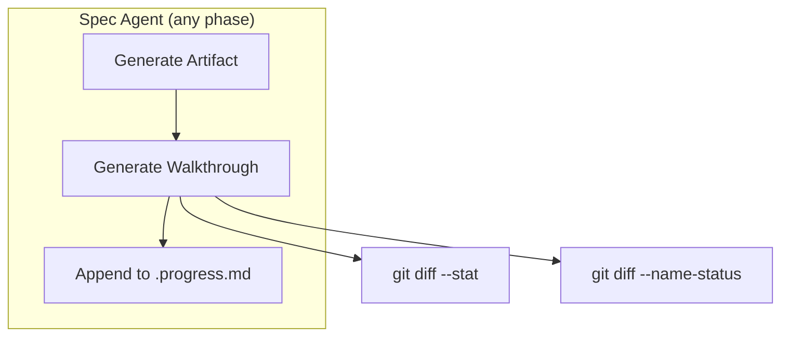
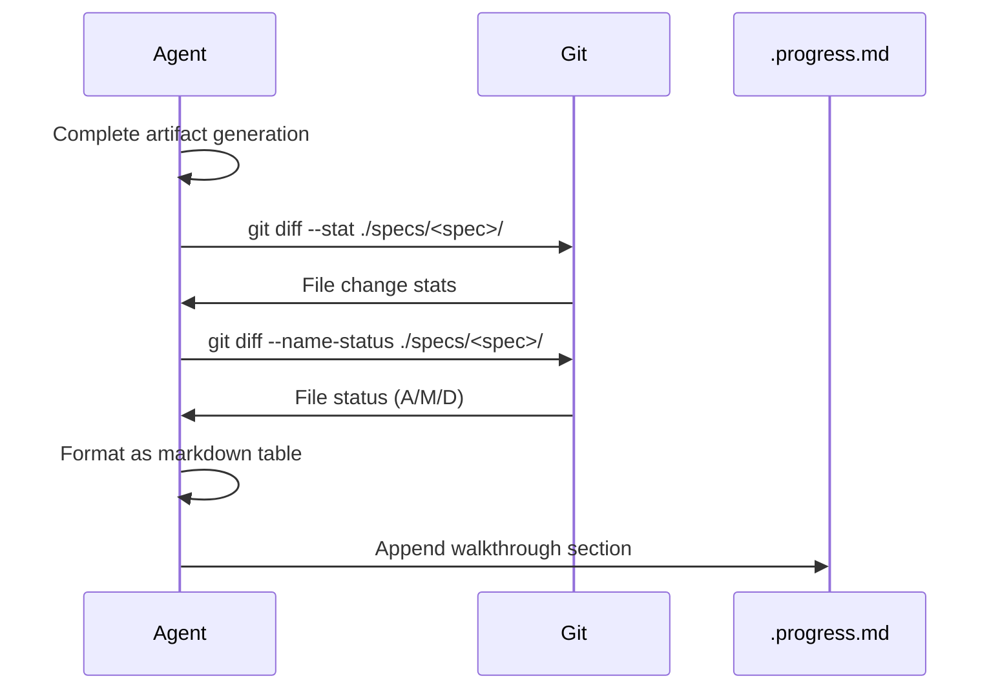

# Design: Phase Walkthrough

## Overview

Add a "Phase Walkthrough" section to each spec agent's output. After generating artifacts, agents call git diff to summarize changes, format as scannable markdown, and append to .progress.md.

## Architecture

### Component Diagram



### Components

#### Walkthrough Generator (inline in each agent)
**Purpose**: Generate scannable summary of phase changes
**Responsibilities**:
- Run git diff commands for change detection
- Format output as markdown table
- Append to .progress.md under "## Phase Walkthrough" section

#### Progress File (`.progress.md`)
**Purpose**: Persistent storage for walkthroughs
**Responsibilities**:
- Store walkthrough for each completed phase
- Preserve historical walkthroughs
- Provide single location for developer review

### Data Flow



1. Agent completes its primary task (generate research/requirements/design/tasks)
2. Agent runs git diff for spec directory
3. Agent formats results as markdown
4. Agent appends to .progress.md

## Technical Decisions

| Decision | Options Considered | Choice | Rationale |
|----------|-------------------|--------|-----------|
| Change detection | Manual file tracking, Git diff | Git diff | Accurate, handles all edge cases |
| Storage location | Separate file, Console only, .progress.md | .progress.md | Persistent, already used for progress |
| Format | Prose, Bullets, Table | Table | Most scannable per communication style |
| When to generate | During task, After phase | After phase | Cleaner, complete picture |

## File Structure

| File | Action | Purpose |
|------|--------|---------|
| `agents/research-analyst.md` | Modify | Add walkthrough generation section |
| `agents/product-manager.md` | Modify | Add walkthrough generation section |
| `agents/architect-reviewer.md` | Modify | Add walkthrough generation section |
| `agents/task-planner.md` | Modify | Add walkthrough generation section |
| `templates/progress.md` | Modify | Add Phase Walkthrough section template |

## Interfaces

### Walkthrough Output Format

```markdown
## Phase Walkthrough: <phase-name>

| File | Status | Changes |
|------|--------|---------|
| ./specs/<spec>/research.md | Created | +45 lines |
| ./specs/<spec>/.progress.md | Modified | +12/-3 lines |

**Summary**: <phase> phase complete. <N> file(s) created/modified.

Deep dive: Review files above for full content.
```

### Git Commands Used

```bash
# Get file status (Added/Modified/Deleted)
git diff --name-status HEAD~1 -- ./specs/<spec>/

# Get line change stats
git diff --stat HEAD~1 -- ./specs/<spec>/

# If no previous commit for comparison, use:
git status --porcelain ./specs/<spec>/
```

## Error Handling

| Error Scenario | Handling Strategy | User Impact |
|----------------|-------------------|-------------|
| Git not available | Skip walkthrough, log warning | No walkthrough, phase still completes |
| No changes detected | Note "No file changes" | Minimal walkthrough |
| Large diff (>50 files) | Truncate with "...and N more" | Summary still useful |

## Edge Cases

- **First commit in spec**: Use `git status --porcelain` instead of diff
- **Uncommitted changes**: Include in walkthrough as "staged" or "unstaged"
- **Binary files**: Show filename only, no line counts

## Dependencies

| Package | Version | Purpose |
|---------|---------|---------|
| git | Any | Change detection |

## Security Considerations

- No sensitive data in walkthrough (only file paths and line counts)

## Performance Considerations

- Git diff is fast (<1s for typical spec directories)
- Walkthrough generation adds <5s to phase completion

## Test Strategy

### Unit Tests
- Not applicable (markdown agent files)

### Integration Tests
- Run spec phase, verify walkthrough appended to .progress.md
- Verify walkthrough format matches design

### E2E Tests
- Complete spec from start, verify all phase walkthroughs present

## Existing Patterns to Follow

Based on codebase analysis:
- Communication style: brevity-first, tables over prose
- Agent output: structured sections with headers
- .progress.md: append learnings and completed sections
