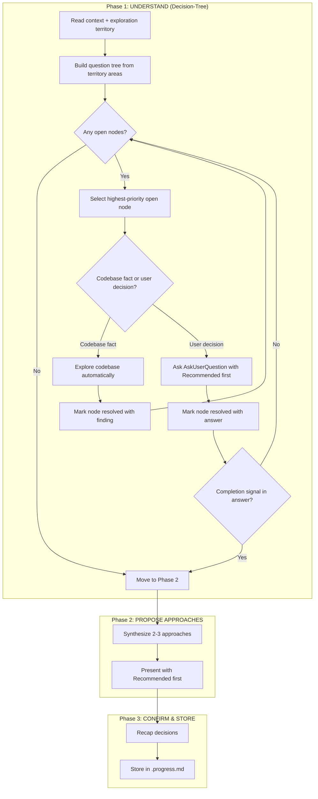
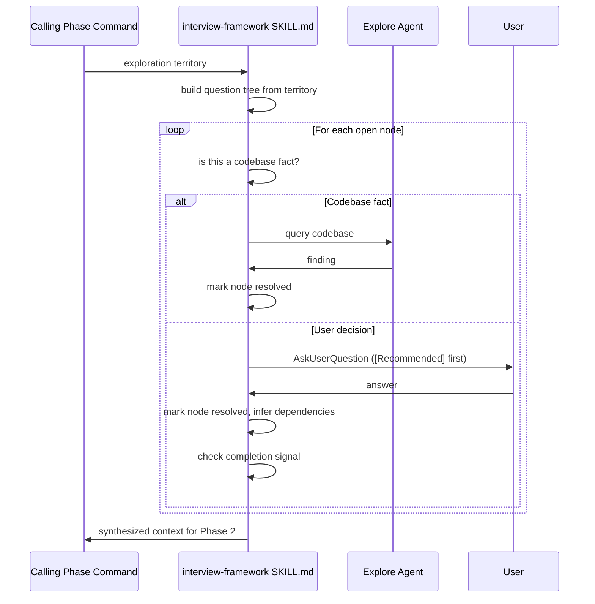

# Design: Adopt Grill-Me Interview

## Overview

Rewrite Phase 1 of `SKILL.md` from a count-bounded WHILE loop into a decision-tree traversal that tracks open/resolved question nodes. Each question leads with `[Recommended]` plus rationale. The codebase-first rule moves from `goal-interview.md` into `SKILL.md` as the canonical location, and the duplicate block in `goal-interview.md` is deleted.

## Architecture



## New Phase 1 Algorithm

Full pseudocode replacing the existing WHILE loop:

```text
UNDERSTAND:
  1. Read all available context:
     - .progress.md (prior phase answers, intent, goal)
     - Prior artifacts (research.md, requirements.md, etc.)
     - Original goal text
  2. Read the exploration territory provided by the calling command
  3. Identify what is UNKNOWN vs what is already decided
     - If prior phases already covered a topic, mark it RESOLVED. Skip it.
  4. Build the question tree:
     nodes = []
     for each area in exploration_territory:
       nodes.append({ topic: area, status: OPEN, dependency: [], finding: null })
     # Dependency ordering: if topic B requires knowing topic A first,
     # set B.dependency = [A]. Do not ask B until A is RESOLVED.

  DECISION-TREE TRAVERSAL:
    while any node.status == OPEN:
      # Select next node: first OPEN node whose dependencies are all RESOLVED
      node = next_unblocked_open_node(nodes)
      if node is null: break  # All remaining nodes are blocked (shouldn't happen)

      # Codebase-first check
      if node.topic is a codebase FACT (not a user decision):
        finding = explore_codebase(node.topic)
        node.status = RESOLVED
        node.finding = finding
        log: "Discovered: [topic] -> [finding]"
        continue

      # Ask user
      recommended = derive_recommendation(node.topic, context, prior_answers)
      AskUserQuestion:
        question: "[Context-aware question]. [Recommended: recommended.rationale]"
        options:
          - "[Recommended] [recommended.option]"
          - "[Alternative 1]"
          - "[Alternative 2 if needed]"
          - "Other"

      node.status = RESOLVED
      node.finding = user_answer

      # Resolve any dependent nodes that this answer makes obvious
      for dep_node in nodes where node in dep_node.dependency:
        if dep_node can be inferred from node.finding:
          dep_node.status = RESOLVED
          dep_node.finding = inferred_value
          log: "Inferred: [dep_topic] -> [inferred_value]"

      # Completion signal check
      if user_answer contains completion_signal:
        break

    -> Move to PROPOSE APPROACHES
```

**Key rules for question generation:**
- Each question builds on prior answers in this dialogue AND prior phases.
- Reference specific things the user said ("You mentioned X -- does that mean...").
- Never ask something `.progress.md` already answers.
- Never ask a generic question. Every question must be grounded in the user's context.
- If you have enough context to propose meaningful approaches, stop and move on. Do not exhaust every open node mechanically. This is an intentional early-exit from the `while any node.status == OPEN` loop. The loop provides completeness; this rule provides efficiency.

## Codebase-First Rule (New Section for SKILL.md)

This section replaces the duplicate block removed from `goal-interview.md`. Exact content:

```markdown
## Codebase-First Exploration

Before asking any question, determine whether the answer is a **codebase fact** or a **user decision**:

- **Codebase fact**: something discoverable by reading code, config, or existing specs (e.g., which framework is used, whether an interface already exists, what a file currently does). Use the Explore agent to find it. Never ask the user.
- **User decision**: a preference, priority, trade-off, or constraint that only the user can answer (e.g., which approach to take, what the success criteria are, what's in scope). Ask via AskUserQuestion.

Only ask what you cannot discover yourself.
```

## Recommendation Format

Every question asked via `AskUserQuestion` in Phase 1 leads with the recommended option:

```yaml
AskUserQuestion:
  question: "[Context-aware question referencing prior answers]. [One sentence rationale for the recommendation.]"
  options:
    - "[Recommended] [Option text -- the AI's suggested answer]"
    - "[Alternative 1]"
    - "[Alternative 2 if needed]"
    - "Other"
```

Rules:
- `[Recommended]` is a label prefix on the first option only.
- The rationale sits in the question text, not the option label.
- Option count still 2-4 max (Option Limit Rule preserved).
- If there is no meaningful recommendation (truly symmetric choice), omit the `[Recommended]` label rather than placing it arbitrarily.

Example:

```yaml
AskUserQuestion:
  question: "Where should the spec live? You only have one specs directory configured, so the default is fine unless you want to reorganize."
  options:
    - "[Recommended] ./specs/ (default)"
    - "Let me configure a different path"
    - "Other"
```

## Component Changes

### SKILL.md

| Section | Change | Details |
|---------|--------|---------|
| Intent-Based Depth Scaling table | **Delete** | Remove entirely. No cap replacement. |
| Completion Signal Detection | **Modify** | Remove `if askedCount >= minRequired` guard. Keep signal list and skip behavior. |
| Phase 1 WHILE loop | **Rewrite** | Replace with decision-tree pseudocode (see above). |
| Codebase-First Exploration | **Add** | New section (see exact content above). |
| Option Limit Rule | **Keep** | Unchanged. |
| Phase 2 PROPOSE APPROACHES | **Keep** | Unchanged. |
| Phase 3 CONFIRM & STORE | **Keep** | Unchanged. |
| Adaptive Depth (Other Responses) | **Keep** | Unchanged. |
| Context Accumulator Pattern | **Keep** | Unchanged. |

**Before (Completion Signal Detection):**
```text
if askedCount >= minRequired:
  for signal in completionSignals:
    if signal in userResponse.lower():
      -> SKIP remaining questions, move to PROPOSE APPROACHES
```

**After:**
```text
for signal in completionSignals:
  if signal in userResponse.lower():
    -> SKIP remaining questions, move to PROPOSE APPROACHES
```

### goal-interview.md

Remove lines 32-38 (the `<mandatory>` XML block):
```xml
<mandatory>
**Before asking any question, check: is this a codebase fact or a user decision?**
- Codebase fact -> Use Explore agent to find the answer automatically
- User decision -> Ask via AskUserQuestion

Never ask the user about things you can discover from the code.
</mandatory>
```

The surrounding prose (`## Brainstorming Dialogue` section) references `SKILL.md` for the full algorithm -- that reference stays. The removal leaves the section reading: "Apply adaptive dialogue from `${CLAUDE_PLUGIN_ROOT}/skills/interview-framework/SKILL.md`." followed directly by the exploration territory block. That is coherent and complete.

### plugin.json

Bump `"version": "4.8.4"` to `"version": "4.9.0"` (minor: new behavior).

### marketplace.json

Bump matching entry from `"version": "4.8.4"` to `"version": "4.9.0"`.

### tests/interview-framework.bats (new file)

See Test Strategy below.

### CLAUDE.md

No doc update required. CLAUDE.md documents Ralph's architecture and development workflow. The interview algorithm is internal plugin behavior, not workflow docs. The existing overview section mentions the interview framework by name but does not describe its algorithm -- nothing there needs updating.

## Test Strategy

File: `tests/interview-framework.bats`

Tests verify the static content of `SKILL.md` as the source of truth. No runtime execution of the interview algorithm is possible in bats (it runs in Claude's context), so tests assert structural invariants.

```bash
#!/usr/bin/env bats
# Interview Framework Content Tests
# Verifies SKILL.md contains required algorithm sections and patterns.

SKILL_FILE="plugins/ralph-specum/skills/interview-framework/SKILL.md"
GOAL_INTERVIEW="plugins/ralph-specum/references/goal-interview.md"

@test "SKILL.md exists" {
    [ -f "$SKILL_FILE" ]
}

@test "SKILL.md has Codebase-First Exploration section" {
    grep -q "## Codebase-First Exploration" "$SKILL_FILE"
}

@test "SKILL.md codebase-first section distinguishes facts from decisions" {
    grep -q "Codebase fact" "$SKILL_FILE"
    grep -q "User decision" "$SKILL_FILE"
}

@test "SKILL.md has decision-tree traversal (not WHILE loop)" {
    grep -q "DECISION-TREE" "$SKILL_FILE"
    # WHILE loop should be gone
    ! grep -q "WHILE askedCount" "$SKILL_FILE"
}

@test "SKILL.md has [Recommended] label pattern" {
    grep -q "\[Recommended\]" "$SKILL_FILE"
}

@test "SKILL.md completion signal check has no minRequired guard" {
    ! grep -q "askedCount >= minRequired" "$SKILL_FILE"
}

@test "SKILL.md has no Intent-Based Depth Scaling table" {
    ! grep -q "Intent-Based Depth Scaling" "$SKILL_FILE"
}

@test "SKILL.md preserves Option Limit Rule" {
    grep -q "Option Limit Rule" "$SKILL_FILE"
}

@test "SKILL.md preserves Phase 2 PROPOSE APPROACHES" {
    grep -q "PROPOSE APPROACHES" "$SKILL_FILE"
}

@test "SKILL.md preserves Phase 3 CONFIRM & STORE" {
    grep -q "CONFIRM & STORE" "$SKILL_FILE"
}

@test "goal-interview.md does not contain duplicate codebase-first mandatory block" {
    ! grep -q "is this a codebase fact or a user decision" "$GOAL_INTERVIEW"
}

@test "goal-interview.md still references SKILL.md for adaptive dialogue" {
    grep -q "skills/interview-framework/SKILL.md" "$GOAL_INTERVIEW"
}

@test "plugin.json version is 4.9.0" {
    grep -q '"version": "4.9.0"' "plugins/ralph-specum/.claude-plugin/plugin.json"
}

@test "marketplace.json ralph-specum version is 4.9.0" {
    version=$(jq -r '.plugins[] | select(.name == "ralph-specum") | .version' ".claude-plugin/marketplace.json")
    [ "$version" = "4.9.0" ]
}
```

## File Change Summary

| File | Action | Change |
|------|--------|--------|
| `plugins/ralph-specum/skills/interview-framework/SKILL.md` | Modify | Delete Intent-Based Depth Scaling table; remove `askedCount >= minRequired` guard; rewrite Phase 1 WHILE loop as decision-tree; add Codebase-First Exploration section; add `[Recommended]` convention to question format docs |
| `plugins/ralph-specum/references/goal-interview.md` | Modify | Delete `<mandatory>` codebase-first block (lines 32-38) |
| `plugins/ralph-specum/.claude-plugin/plugin.json` | Modify | Bump version 4.8.4 -> 4.9.0 |
| `.claude-plugin/marketplace.json` | Modify | Bump ralph-specum version 4.8.4 -> 4.9.0 |
| `tests/interview-framework.bats` | Create | 14 bats tests verifying SKILL.md structural invariants |

## Technical Decisions

| Decision | Options Considered | Choice | Rationale |
|----------|-------------------|--------|-----------|
| Algorithm structure | WHILE loop (keep), decision-tree (rewrite), event-driven | Decision-tree | Matches grill-me's dependency-ordered traversal; makes skipping and inference explicit; user interview confirmed this |
| Question cap removal | Remove entirely, keep as soft advisory, replace with token budget | Remove entirely | Caps created artificial cutoffs; completion signals are the correct termination mechanism |
| Codebase-first location | Keep in goal-interview.md, move to SKILL.md, both | Move to SKILL.md, delete from goal-interview.md | Single source of truth; all phases benefit, not just goal; requirements interview confirmed this |
| `[Recommended]` placement | In question text, as first option label, separate field | First option label with rationale in question | Most visible position; rationale belongs in question where context is set |
| Test approach | Runtime (not possible in bats), content assertions, schema validation | Content assertions on SKILL.md | bats runs shell; no Claude runtime available; content tests are the correct contract |
| Version bump | Patch, minor, major | Minor (4.8.4 -> 4.9.0) | New behavior (decision-tree, recommendation format) without breaking the tool interface |

## Data Flow



## Edge Cases

- **No open nodes after context read**: If `.progress.md` already covers all territory areas, Phase 1 exits immediately and moves to PROPOSE APPROACHES without asking anything.
- **All remaining nodes are blocked**: A dependency cycle would block traversal. This should not occur if the implementer orders dependencies correctly. If it does, the algorithm falls through to PROPOSE APPROACHES with whatever is resolved.
- **User answers "Other" on a Recommended option**: Follow the existing Adaptive Depth rules (context-specific follow-up, max 5 rounds). Do not re-present the `[Recommended]` label in follow-ups.
- **Symmetric choice (no good recommendation)**: Omit `[Recommended]` rather than forcing it. The rule is "lead with recommendation when you have one," not "always label something."
- **goal-interview.md after deletion**: The `## Brainstorming Dialogue` section will read: paragraph referencing SKILL.md, then the `## Goal Exploration Territory` section. The `<mandatory>` block deletion leaves no orphaned text.

## Existing Patterns to Follow

- bats test files use `#!/usr/bin/env bats` header, `load 'helpers/setup.bash'` when using test helpers (the new file does not need helpers -- it only reads files).
- All tests in the suite use flat `@test "description"` blocks with no nesting.
- SKILL.md uses fenced code blocks with `text` language tag for pseudocode.
- SKILL.md uses `yaml` language tag for `AskUserQuestion` examples.
- Version strings in plugin.json and marketplace.json must match exactly (checked at plugin load time).
