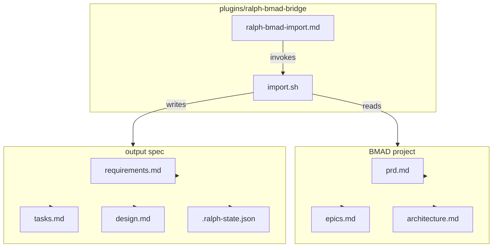

# Design: BMAD Bridge Plugin

## Overview

A bash+jq plugin that deterministically maps BMAD planning artifacts (PRD, epics, architecture) into smart-ralph spec files. The implementation is a single script (`scripts/import.sh`) with inline parsing functions — no separate modules, no dependencies beyond bash 4+ and jq 1.6+.

## Architecture



## Components

### 1. CLI Wrapper
**Location:** `plugins/ralph-bmad-bridge/commands/ralph-bmad-import.md`
**Purpose:** Claude Code slash command that invokes the import script.
**Responsibilities:**
- Parse `$ARGUMENTS` for two positional args (`<bmad-project-path> <spec-name>`)
- Extract BMAD path and spec name
- Invoke `scripts/import.sh` with extracted args
- Relay exit code to Claude Code

```bash
# Invocation pattern
bash "${CLAUDE_PLUGIN_ROOT}/scripts/import.sh" "$BMAD_PATH" "$SPEC_NAME"
exit $?
```

### 2. Main Import Script
**Location:** `plugins/ralph-bmad-bridge/scripts/import.sh`
**Purpose:** Core logic — path resolution, parsing, file generation.
**Responsibilities:**
- Validate inputs (paths exist, target dir not overwritten)
- Resolve BMAD project root and artifact paths
- Parse BMAD artifacts → write smart-ralph spec files
- Validate output files and print summary

**Functions:**
| Function | Args | Output |
|----------|------|--------|
| `resolve_bmad_paths` | project_root | Sets shell variables: BMAD_PRD, BMAD_EPICS, BMAD_ARCH (absolute paths, exported); also detects which artifacts exist and sets artifact_found flags |
| `validate_inputs` | bmad_root, spec_name | Returns 0/1, prints errors to stderr |
| `write_frontmatter` | file, phase, spec_name, total | Writes YAML frontmatter block |
| `generate_requirements` | prd_path | requirements.md |
| `generate_tasks` | epics_path | tasks.md |
| `generate_design` | arch_path | design.md |
| `write_state` | spec_name | .ralph-state.json |
| `print_summary` | counts | stdout summary + warnings |

### 3. PRD Parser
**Location:** `scripts/import.sh` function `parse_prd_frs()` and `parse_prd_nfrs()`
**Purpose:** Extract functional and non-functional requirements from PRD.
**Responsibilities:**
- Find `## Functional Requirements` section, parse `- FR#: [Actor] can [capability]`
- Convert each FR to a User Story (As a/I want/So that)
- Build Functional Requirements table
- Find `## Non-Functional Requirements`, parse `###` subsections
- Map NFR subsections to NFR table

**Parsing logic:**
```bash
# Extract FR lines (state-machine: between ## heading and next ## heading)
awk '/^## Functional Requirements$/{found=1; next} /^## /{if(found) exit; } found && /^- FR[0-9]+:/ { ... }' "$PRD_PATH"
```

### 4. Epics Parser
**Location:** `scripts/import.sh` function `parse_epics()`
**Purpose:** Extract stories and acceptance criteria from epics.md.
**Responsibilities:**
- State-machine parser tracking current epic number and story number
- Extract `### Story N.M:` blocks with title, Given/When/Then ACs
- Build FR coverage map from epics.md `### FR Coverage Map` section
- Generate tasks.md Phase 1 task entries

**Parsing logic:**
```bash
# State-machine: track current epic/story context
# When ### Story N.M: found -> start new story block
# Collect Given/When/Then lines until next heading or EOF
```

### 5. Architecture Parser
**Location:** `scripts/import.sh` function `parse_architecture()`
**Purpose:** Map architecture.md sections to design.md format.
**Responsibilities:**
- Find sections matching "decisions", "architecture", "technology", "stack" → Technical Decisions table
- Find "project structure" or "file structure" sections → File Structure table
- Map `##` headings to design.md section headings
- Handle missing architecture.md gracefully (placeholder output)

### 6. Output Validator
**Location:** `scripts/import.sh` function `validate_output()`
**Purpose:** Verify generated files match smart-ralph template structure.
**Responsibilities:**
- Check required frontmatter fields (spec, phase, created)
- Check required top-level sections per template
- Count and report mapped items
- List warnings for unmapped content

## Technical Decisions

| Decision | Options Considered | Choice | Rationale |
|----------|-------------------|--------|-----------|
| Single monolithic script vs. module files | Multiple bash files vs. single script | Single `import.sh` | <500 line constraint; bash function modules add overhead with minimal benefit |
| Auto-discovery vs. explicit path args | `--prd --epics --arch` vs. convention-based discovery | Convention-based defaults (`prd.md`, `epics.md`, `architecture.md` in `_bmad-output/planning-artifacts/`) | Simpler CLI; explicit args can be added later if needed; per requirements, user provides project root |
| PRD parser: awk vs. grep+sed | `grep -A` vs. `awk` state-machine vs. `sed` | `awk` state-machine | Robust section boundary detection; single pass; standard POSIX tool |
| NFR handling when missing | Skip silently vs. warn vs. error | Skip silently (not an error) | Per AC-3.5: "NFR table is omitted from output (not an error)" |
| Epics handling when missing | Error vs. warn+minimal output | Warning + minimal task ("Manual review required") | Per AC-4.6: graceful degradation |
| Architecture handling when missing | Error vs. warn+placeholder | Warning + placeholder "Architecture input not provided" | Per AC-5.5 |
| Target dir overwrite protection | Overwrite vs. warn vs. error | Hard error: fail if target spec directory already exists | Per hard invariants in requirements.md |
| .ralph-state.json generation | Yes vs. No | Yes, with defaults | Required for immediate execution readiness; minimal values (phase=tasks, taskIndex=0) |
| Testing approach | npm test + BATS vs. no tests | BATS-style inline tests (no npm dependency) | No test runner exists; bash-only plugin; BATS needs npm install; inline self-test is simpler |
| Latency validation | Manual timing vs. automated benchmark | `time` command in test harness, assert < 5s for typical project | NFR-2 requires < 5s; test harness will run `time import.sh` against fixture project and assert exit 0 |

## File Structure

| File | Action | Purpose |
|------|--------|---------|
| `plugins/ralph-bmad-bridge/.claude-plugin/plugin.json` | Create | Plugin manifest (name, version, description) |
| `plugins/ralph-bmad-bridge/commands/ralph-bmad-import.md` | Create | Slash command frontmatter invoking import.sh |
| `plugins/ralph-bmad-bridge/scripts/import.sh` | Create | Main parsing and generation logic |
| `specs/<spec-name>/requirements.md` | Generate | Output: mapped FRs and NFRs from PRD |
| `specs/<spec-name>/tasks.md` | Generate | Output: mapped stories from epics.md |
| `specs/<spec-name>/design.md` | Generate | Output: mapped architecture sections |
| `specs/<spec-name>/.ralph-state.json` | Generate | Output: execution state |

## Error Handling

| Error Scenario | Handling Strategy | User Impact |
|----------------|-------------------|-------------|
| BMAD project path does not exist | Validate early, exit 1, message to stderr | "Error: BMAD project path not found: $BMAD_PATH" |
| Target spec directory already exists | Check `test -d "specs/$SPEC_NAME"`, exit 1 | "Error: Spec directory already exists: specs/$SPEC_NAME" |
| jq not available | Check `command -v jq` at script start, exit 1 | "Error: jq is required but not installed" |
| No recognized BMAD artifacts | After scanning all paths, check file counts | Exit 1 with "Error: No recognized BMAD artifacts found at $BMAD_PATH" (per requirements "Escalate if" guidance) |
| PRD missing Functional Requirements section | Proceed with other mappings, warn | Warning printed; requirements.md has minimal content |
| PRD missing Non-Functional Requirements section | Omit NFR table (not an error) | Silent; NFR section not written |
| Epics file missing | Generate minimal tasks.md with single manual review task | Warning printed; tasks.md is valid but needs manual work |
| Architecture file missing | Generate minimal design.md with placeholder | Warning printed; design.md is valid |
| Malformed FR line (doesn't match `- FR#: ...` pattern) | Skip line, count as warning | Warning in summary: "X FR lines skipped (malformed)" |
| Malformed story block (no Given/When/Then) | Use story title + goal as task description | No error; task has placeholder Verify section |

## Edge Cases

- **BMAD output paths are configurable** — BMAD uses `_bmad-output/` by default but path can be customized. Script tries `_bmad-output/planning-artifacts/` first, then falls back to checking project root directly.
- **PRD sections in arbitrary order** — BMAD PRD is interactive/facilitated; sections may appear in different orders. Parser uses section heading matching, not positional assumptions.
- **Epics.md with zero stories** — Valid epics.md with no `### Story N.M:` blocks. Generates empty Phase 1 with a "No stories found — manual task creation required" placeholder.
- **FR coverage map with missing FRs** — Coverage map may reference FRs not found in PRD. Script only includes coverage refs for FRs that exist in the mapped set.
- **Architecture.md with no recognizable sections** — All prose, no "decisions", "structure", or "technology" headings. Script generates design.md with Overview and all `##` headings mapped as-is, with empty Technical Decisions and File Structure tables.
- **Concurrent import calls** — Not supported; script should fail if called concurrently for the same spec name. (Low priority; single-user Claude Code context makes this unlikely.)

## Security Considerations

- **Path traversal**: Validate BMAD project path is absolute or resolve to absolute path before use. Reject paths containing `..` that escape the project.
- **No LLM calls**: Hard invariant — script must never call any API, LLM, or external service.
- **File scope**: Script only writes to `specs/<spec-name>/` and reads from BMAD project path. Never modifies files outside these scopes.
- **Input sanitization**: Spec name validated against pattern `^[a-z0-9-]+$` (matches schema constraint). BMAD path validated as existing directory.

## Performance Considerations

- Single-pass awk parsing per artifact (no multiple greps over the same file)
- File I/O: N+1 reads (one per artifact) + N writes (one per output file)
- For typical BMAD projects (< 100KB per artifact), parsing should complete in < 2s
- jq used only for .ralph-state.json generation (tiny input)
- NFR-2 validation: test harness includes `time import.sh` assertion against fixture project with < 5s timeout

## Test Strategy

### Test Double Policy

| Type | What it does | When to use |
|---|---|---|
| **Stub** | Returns predefined data, no behavior | Not applicable — bash script tests the script directly |
| **Fake** | Simplified real implementation (e.g. in-memory) | Not applicable — parsing is the real implementation |
| **Mock** | Verifies interactions (call args, call count) | Asserting functions were called with correct arguments |
| **Fixture** | Predefined data state, not code | Test input BMAD markdown files |

> Rule: this is a standalone bash script. Test it real — feed it actual BMAD markdown input, verify output. No fakes or mocks needed.

### Mock Boundary

| Component (from this design) | Unit test | Integration test | Rationale |
|---|---|---|---|
| `parse_prd_frs` | Stub (fake PRD file) | Stub (fake PRD file) | Parsing logic tested by feeding markdown fixtures, asserting output content |
| `parse_prd_nfrs` | Stub (fake PRD file) | Stub (fake PRD file) | Same as FRs — I/O boundary is the input file, test by providing fixture |
| `parse_epics` | Stub (fake epics file) | Stub (fake epics file) | State-machine parser — test with known input → verify task output |
| `parse_architecture` | Stub (fake arch file) | Stub (fake arch file) | Section mapping — test with known sections → verify design sections |
| `validate_output` | None | Real (against generated files) | Self-validation — run on actual output, assert pass/fail |
| `import.sh` (full flow) | None | Real (full pipeline) | Integration test — BMAD input → smart-ralph output, assert file contents |

### Fixtures & Test Data

| Component | Required state | Form |
|---|---|---|
| `parse_prd_frs` | PRD with `## Functional Requirements` section containing 3 FR lines in `- FR#: [Actor] can [capability]` format | Inline heredoc or temp file |
| `parse_prd_nfrs` | PRD with `## Non-Functional Requirements` section containing 2 `###` subsections | Inline heredoc or temp file |
| `parse_epics` | Epics.md with overview, FR coverage map, 2 epics each with 1 `### Story N.M:` block containing Given/When/Then ACs | Inline heredoc or temp file |
| `parse_architecture` | Architecture.md with `## Core Decisions` section and `## Project Structure` section | Inline heredoc or temp file |
| `validate_output` | Generated requirements.md, tasks.md, design.md with frontmatter and required sections | Generated by integration test run |
| `import.sh` (full flow) | Complete BMAD mini-project with all 3 artifacts (prd.md, epics.md, architecture.md) | Directory structure with 3 markdown files |

### Test Coverage Table

| Component / Function | Test type | What to assert | Test double |
|---|---|---|---|
| `validate_inputs` | unit | Returns 1 when BMAD path doesn't exist; returns 1 when target spec dir exists; returns 0 when both valid | none |
| `parse_prd_frs` | unit | Extracts FR text, builds User Story format, generates FR table rows with correct IDs | Stub (fake PRD file) |
| `parse_prd_nfrs` | unit | Extracts NFR subsections, builds NFR table with metric/target columns | Stub (fake PRD file) |
| `parse_epics` | unit | Extracts story titles, Given/When/Then ACs, generates task blocks with FR refs | Stub (fake epics file) |
| `parse_architecture` | unit | Maps "decisions" sections to Technical Decisions table, maps "project structure" to File Structure table | Stub (fake arch file) |
| `write_frontmatter` | unit | Writes correct YAML frontmatter with spec/phase/created/total_tasks fields | none |
| `validate_output` | unit | Passes when frontmatter has required fields, fails when fields missing | None (real) |
| `import.sh` (full flow) | integration | Given a mini BMAD project, output spec files have correct frontmatter, mapped FRs mapped to stories, tasks generated from stories | Real (mini BMAD project fixture) |
| `import.sh` (error paths) | integration | Exits non-zero for missing BMAD path, exits non-zero for existing target dir, prints warnings for missing artifacts | Real (no BMAD project) |

### Test File Conventions

- Test runner: bash with shebang `#!/usr/bin/env bash`, using a simple `run_test` assertion function (see infrastructure note)
- Test file location: `plugins/ralph-bmad-bridge/tests/test-import.sh`
- Integration test pattern: single bash script that creates temp BMAD fixture directory, runs import.sh, asserts output file existence and content
- E2E test pattern: run full import with mini BMAD project fixture, then run `/ralph-specum:implement` (dry-run) to verify generated spec is executable
- Mock cleanup: `trap 'rm -rf "$TMPDIR"' EXIT` on all test scripts
- Fixture/factory location: inline heredocs in test script (no external fixture files needed for < 500 line script)

### Infrastructure Note

No test runner exists in this repository. The executor should create a minimal test harness:

```bash
#!/usr/bin/env bash
# plugins/ralph-bmad-bridge/tests/test-import.sh
set -euo pipefail

TMPDIR=$(mktemp -d)
trap 'rm -rf "$TMPDIR"' EXIT

SCRIPT_DIR="$(cd "$(dirname "${BASH_SOURCE[0]}")/.." && pwd)"
IMPORT_SCRIPT="$SCRIPT_DIR/scripts/import.sh"

run_test() {
    local name="$1"; shift
    if "$@" 2>/dev/null; then
        echo "PASS: $name"
    else
        echo "FAIL: $name"
        exit 1
    fi
}
```

## Implementation Steps

1. Create plugin directory structure: `plugins/ralph-bmad-bridge/commands/`, `plugins/ralph-bmad-bridge/scripts/`
2. Write `plugin.json` with name `ralph-bmad-bridge`, version `0.1.0`
3. Write `commands/ralph-bmad-import.md` with Claude Code frontmatter that parses `$ARGUMENTS` and calls `import.sh`
4. Write `import.sh` with `validate_inputs`, `resolve_bmad_paths`, `write_frontmatter` functions
5. Implement `parse_prd_frs` and `parse_prd_nfrs` using awk state-machine (FR extraction + NFR subsection mapping)
6. Implement `parse_epics` state machine (story extraction + AC parsing + FR coverage map)
7. Implement `parse_architecture` (section matching + table generation)
8. Implement `validate_output` (frontmatter validation + section checks + summary printing)
9. Implement `write_state` to generate `.ralph-state.json` with defaults (phase=tasks, taskIndex=0)
10. Implement `print_summary` to report mapped item counts and warnings to stdout
11. Create test script `tests/test-import.sh` with fixture-based unit and integration tests
12. Register in `.claude-plugin/marketplace.json`

## Unresolved Questions
- Should the plugin version in marketplace.json be `0.1.0` or start at `1.0.0`? (Recommend `0.1.0` since this is new)

## Resolved Decisions
- **Phase 2-5 template sections**: Decision: Include Phase 2-5 template placeholders (empty sections). Phase 1 populated from stories. Rationale: Generated tasks.md must be immediately usable by `/ralph-specum:implement` which expects the full phase structure. This matches the implementation decision already made in tasks.md.
