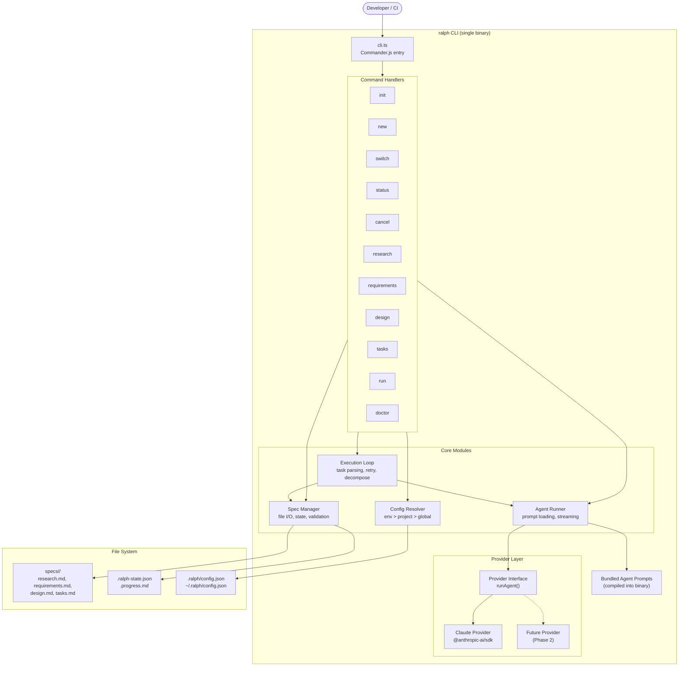

# Design: Smart Ralph CLI

## 1. Overview

Smart Ralph CLI is a monolithic Node.js/TypeScript binary (`ralph`) that replicates the Smart Ralph plugin's spec-driven workflow as a standalone tool. It uses Commander.js for argument parsing, a provider abstraction for AI calls (Claude-only in Phase 1), and a while-loop execution engine that replaces the plugin's stop-hook pattern. All agent prompts are bundled into the compiled binary, and the CLI reads/writes the same spec file format as the plugin for full interoperability.

## 2. Architecture Diagram



## 3. Component Responsibilities

### CLI Entry (`cli.ts`)

**Purpose**: Parse arguments, register commands, set global options, handle top-level errors.

- Inputs: `process.argv`
- Outputs: Dispatches to command handler, sets exit code
- Responsibilities:
  - Register all subcommands with Commander.js
  - Define global flags: `--debug`, `--no-color`, `--json`
  - Catch unhandled rejections, format errors, set exit codes
  - Lazy-load command handlers (fast `--help` and `--version`)

### Command Handlers (`commands/`)

**Purpose**: One file per CLI command. Thin wrappers that validate input, call core modules, format output.

- Inputs: Parsed args and options from Commander.js
- Outputs: Stdout/stderr, exit codes
- Responsibilities:
  - Validate command-specific arguments (spec name format, required flags)
  - Call Spec Manager, Agent Runner, or Execution Loop as needed
  - Format output (color for TTY, plain for pipes, JSON for `--json`)
  - Prompt for confirmation where needed (skip in `--headless`)

### Spec Manager (`lib/spec-manager.ts`)

**Purpose**: All file I/O for spec directories, state files, and task parsing.

- Inputs: Spec name or path, state updates
- Outputs: Parsed spec data, state objects, task lists
- Key interfaces:
  - `createSpec(name, goal)` -- scaffold spec directory with stubs
  - `getActiveSpec()` -- read `.current-spec`, return spec path
  - `setActiveSpec(name)` -- write `.current-spec`
  - `readState(specPath)` -- parse `.ralph-state.json`, apply defaults
  - `writeState(specPath, state)` -- atomic write with temp file + rename
  - `parseTasks(specPath)` -- parse `tasks.md` checkboxes into task objects
  - `markTaskComplete(specPath, index)` -- flip `[ ]` to `[x]` in tasks.md
  - `readSpecFile(specPath, phase)` -- read research/requirements/design/tasks markdown
  - `writeSpecFile(specPath, phase, content)` -- write phase output
- Validation: Spec name regex, state schema (zod), file existence checks

### Config Resolver (`lib/config.ts`)

**Purpose**: Resolve provider configuration from env vars, project config, or global config.

- Resolution order: env vars > `.ralph/config.json` > `~/.ralph/config.json`
- Inputs: Environment, filesystem
- Outputs: `RalphConfig` object with provider name, model, API key env var name
- Key interfaces:
  - `resolveConfig()` -- return merged config or null
  - `writeConfig(path, config)` -- write config file (used by `ralph init`)
  - `getApiKey(config)` -- read actual key from the env var named in config

### Agent Runner (`lib/agent-runner.ts`)

**Purpose**: Load bundled prompts, build context, call provider, stream output to terminal.

- Inputs: Agent name, `AgentContext` (spec files, progress, task block)
- Outputs: `AgentResult` (content written to spec file, token usage)
- Responsibilities:
  - Load system prompt from bundled prompts by agent name
  - Build user message from context (spec files, codebase snippets)
  - Call `provider.runAgent()` with streaming callback
  - Write streamed content to terminal and collect full response
  - Return structured result with content and metadata

### Execution Loop (`lib/execution-loop.ts`)

**Purpose**: Drive task-by-task execution with retry, decompose-on-failure, and state persistence.

- Inputs: Spec path, config, options (headless, max iterations)
- Outputs: Exit code (0 = all complete, 1 = failure)
- Responsibilities:
  - Parse tasks from tasks.md
  - Main while loop: pick next incomplete task, delegate to Agent Runner
  - Update `.ralph-state.json` after each task
  - Retry failed tasks (up to 3 attempts)
  - Decompose failed tasks into subtasks on repeated failure
  - Detect and execute parallel task groups (`[P]` markers)
  - Write progress to `.progress.md`
  - Signal completion or failure with appropriate exit code

### Provider Interface + Factory (`providers/`)

**Purpose**: Abstract AI API calls behind a single interface. Factory picks implementation by provider name.

- Inputs: Provider name string
- Outputs: Provider implementation
- Responsibilities:
  - `createProvider(name)` -- factory function, returns provider instance
  - Each provider implements the `Provider` interface
  - Claude provider: streaming, tool use support, conversation management

### Bundled Agent Prompts (`agents/`)

**Purpose**: System prompts for each agent role, compiled into the binary.

- Agents: research-analyst, product-manager, architect-reviewer, task-planner, spec-executor
- Format: Plain text (frontmatter stripped from plugin originals)
- Loaded by Agent Runner at runtime via import

## 4. File Structure

```
packages/cli/
  package.json
  tsconfig.json
  tsup.config.ts
  src/
    cli.ts                          # Commander.js entry point, global options
    commands/
      init.ts                       # ralph init [--global]
      new.ts                        # ralph new <name> "<goal>"
      switch.ts                     # ralph switch <name>
      status.ts                     # ralph status [name] [--json]
      cancel.ts                     # ralph cancel [name]
      research.ts                   # ralph research [name] [--force]
      requirements.ts               # ralph requirements [name] [--force]
      design.ts                     # ralph design [name] [--force]
      tasks.ts                      # ralph tasks [name] [--tasks-size] [--force]
      run.ts                        # ralph run [name] [--headless]
      doctor.ts                     # ralph doctor
    providers/
      interface.ts                  # Provider type, AgentContext, AgentResult
      factory.ts                    # createProvider(name) factory
      claude.ts                     # Claude implementation via @anthropic-ai/sdk
    agents/
      index.ts                      # Prompt registry (name -> string)
      research-analyst.ts           # Bundled prompt
      product-manager.ts            # Bundled prompt
      architect-reviewer.ts         # Bundled prompt
      task-planner.ts               # Bundled prompt
      spec-executor.ts              # Bundled prompt
    lib/
      spec-manager.ts               # Spec file I/O, state management
      config.ts                     # Config resolution (env > project > global)
      execution-loop.ts             # Task loop, retry, decompose
      agent-runner.ts               # Prompt loading, provider calls, streaming
      task-parser.ts                # Parse tasks.md checkbox format
      output.ts                     # Prefixed logging, color, JSON mode
      errors.ts                     # Error types, user-facing messages
    types/
      index.ts                      # All shared TypeScript types
  test/
    commands/                       # Unit tests per command
    providers/                      # Provider mock + Claude integration
    lib/                            # Spec manager, task parser, config tests
    fixtures/                       # Sample spec dirs, tasks.md files
    integration/                    # End-to-end: init -> new -> status -> cancel
```

## 5. Key Interfaces

```typescript
// --- Provider ---

interface Provider {
  readonly name: string;

  runAgent(
    agentName: string,
    context: AgentContext,
    options?: RunAgentOptions
  ): Promise<AgentResult>;
}

interface AgentContext {
  systemPrompt: string;
  specName: string;
  specPath: string;
  /** Existing spec files content keyed by phase name */
  specFiles: Record<string, string>;
  /** Task block text (for spec-executor) */
  taskBlock?: string;
  /** Progress file content */
  progress?: string;
  /** Additional context (codebase snippets, user goal) */
  additionalContext?: string;
}

interface RunAgentOptions {
  /** Called with each streamed text chunk */
  onStream?: (chunk: string) => void;
  /** Model override (defaults to config) */
  model?: string;
  /** Max tokens for response */
  maxTokens?: number;
  /** Enable tool use (file read/write, bash) */
  tools?: boolean;
}

interface AgentResult {
  content: string;
  tokensUsed: { input: number; output: number };
  stopReason: 'end_turn' | 'max_tokens' | 'tool_use';
}

// --- Spec State ---

interface SpecState {
  source: 'spec' | 'plan' | 'direct';
  name: string;
  basePath: string;
  phase: 'research' | 'requirements' | 'design' | 'tasks' | 'execution';
  taskIndex: number;
  totalTasks: number;
  taskIteration: number;
  maxTaskIterations: number;
  globalIteration: number;
  maxGlobalIterations: number;
  recoveryMode: boolean;
  granularity?: 'fine' | 'coarse';
  /** Preserved fields from earlier phases */
  commitSpec?: boolean;
  relatedSpecs?: RelatedSpec[];
  epicName?: string;
  /** Parallel execution tracking */
  parallelGroup?: ParallelGroup;
  taskResults?: Record<string, TaskResult>;
  /** Recovery mode tracking */
  fixTaskMap?: Record<string, FixTaskEntry>;
  modificationMap?: Record<string, ModificationEntry>;
  /** CLI-specific fields use cli_ prefix */
  cli_startedAt?: string;
  cli_lastTaskAt?: string;
}

interface RelatedSpec {
  name: string;
  relevance: 'high' | 'medium' | 'low';
  reason: string;
  mayNeedUpdate?: boolean;
}

interface ParallelGroup {
  startIndex: number;
  endIndex: number;
  taskIndices: number[];
}

interface TaskResult {
  status: 'pending' | 'success' | 'failed';
  error?: string;
}

interface FixTaskEntry {
  attempts: number;
  fixTaskIds: string[];
  lastError?: string;
}

interface ModificationEntry {
  count: number;
  modifications: Array<{
    id: string;
    type: 'SPLIT_TASK' | 'ADD_PREREQUISITE' | 'ADD_FOLLOWUP';
    reason?: string;
  }>;
}

// --- Config ---

interface RalphConfig {
  provider: string;
  model: string;
  apiKeyEnvVar: string;
}

// --- Task ---

interface ParsedTask {
  index: number;
  id: string;
  title: string;
  completed: boolean;
  parallel: boolean;
  body: {
    do: string;
    files: string[];
    doneWhen: string;
    verify: string;
    commit: string;
    requirementsRefs?: string[];
    designRefs?: string[];
  };
  tags: string[];
}
```

## 6. Technical Decisions

| Decision | Choice | Rationale | Alternatives Considered |
|----------|--------|-----------|------------------------|
| CLI framework | Commander.js v12 | Zero dependencies, fast startup (~20ms), excellent TS support | Yargs (heavier), oclif (plugin system overkill), Clipanion (less ecosystem) |
| Bundler | tsup | Single-file output, tree-shaking, fast builds, proven in CLI tools | esbuild (lower-level), Rollup (more config), Bun compile (less mature) |
| AI SDK | @anthropic-ai/sdk | Direct streaming support, tool use, maintained by Anthropic | Vercel AI SDK (extra abstraction), raw fetch (more work) |
| Validation | zod | Config and state schema validation, good TS inference, small footprint | JSON Schema + ajv (heavier), io-ts (less ergonomic) |
| Package location | packages/cli/ | Monorepo co-location with plugin, shared types possible later | Separate repo (harder to keep formats in sync) |
| Architecture | Monolithic single package | Ship fast, all code in one place, refactor later if needed | Layered packages (premature for Phase 1) |
| Agent prompts | Compiled into binary | No runtime file loading, versioned with CLI, no path resolution issues | Runtime loading from node_modules or project dir (fragile) |
| Config file path | .ralph/config.json | Avoids collision with plugin's .claude/ dir, clear ownership | .ralphrc (dotfile convention), XDG dirs (cross-platform complexity) |
| State compatibility | Same schema, cli_ prefix for new fields | Full interop with plugin, no migration needed | Separate state format (breaks interop goal) |
| Execution loop | while loop in process | Direct replacement for stop-hook, simpler control flow | Child process per task (overhead), worker threads (complexity) |
| Terminal output | chalk + ora | Color output with TTY detection, spinner for AI calls | cli-color (fewer features), nanospinner (smaller but less maintained) |
| Testing | vitest | Fast, native TS support, compatible with Node.js test patterns | Jest (slower startup), Node test runner (less mature assertion lib) |

## 7. Execution Loop Design

The execution loop replaces the plugin's stop-hook pattern with a standard while loop. The plugin's coordinator delegates tasks via the `Task` tool and relies on a shell-script stop-hook to keep the loop running. The CLI internalizes this as a single async function.

### Loop Flow

```mermaid
flowchart TD
    Start([ralph run]) --> Parse["Parse tasks.md<br/>Find first incomplete task"]
    Parse --> Check{taskIndex >= totalTasks?}
    Check -->|Yes| Complete["Mark complete<br/>Delete .ralph-state.json<br/>Exit 0"]
    Check -->|No| ReadTask["Read task block at taskIndex"]
    ReadTask --> IsParallel{Task has [P] marker?}
    IsParallel -->|Yes| CollectGroup["Collect consecutive [P] tasks<br/>(max 5 per batch)"]
    CollectGroup --> RunParallel["Promise.all: run each task<br/>through Agent Runner"]
    RunParallel --> ParallelResult{All succeeded?}
    ParallelResult -->|Yes| AdvanceGroup["Advance taskIndex past group<br/>Update state"]
    AdvanceGroup --> Check
    ParallelResult -->|No| HandleFail
    IsParallel -->|No| RunTask["Call Agent Runner<br/>with spec-executor prompt + task block"]
    RunTask --> Verify{Task succeeded?<br/>TASK_COMPLETE signal?}
    Verify -->|Yes| Advance["Mark [x] in tasks.md<br/>Advance taskIndex<br/>Reset taskIteration<br/>Update .ralph-state.json"]
    Advance --> Check
    Verify -->|No| HandleFail{taskIteration < maxRetries?}
    HandleFail -->|Yes, retry| Retry["Increment taskIteration<br/>Update state<br/>Re-run task"]
    Retry --> RunTask
    HandleFail -->|No, max retries hit| Decompose{Recovery mode on?}
    Decompose -->|Yes| GenFix["Generate fix subtasks<br/>Insert into tasks.md<br/>Update fixTaskMap"]
    GenFix --> Check
    Decompose -->|No| Fail["Log failure details<br/>Exit 1"]
```

### Task Parsing

Tasks are parsed from `tasks.md` using the same checkbox format as the plugin:

```
- [ ] **1.1** Task title [P]
  - **Do**: Implementation steps
  - **Files**: file1.ts, file2.ts
  - **Done when**: Success criteria
  - **Verify**: `npm test`
  - **Commit**: `feat: add thing`
```

The parser:
1. Splits on top-level `- [` markers
2. Extracts: ID (e.g., `1.1`), title, completion status, tags (`[P]`, `[VERIFY]`, `[RED]`, `[GREEN]`, `[YELLOW]`)
3. Parses body fields: Do, Files, Done when, Verify, Commit
4. Detects parallel groups: consecutive tasks with `[P]` tag (max 5 per batch)

### State Management

After each task completes or fails:
1. Read current `.ralph-state.json`
2. Merge updated fields (taskIndex, taskIteration, globalIteration, taskResults)
3. Atomic write: write to `.ralph-state.json.tmp`, then `rename()`
4. Update `.progress.md` with task outcome and learnings

This atomic write pattern prevents corruption if the process is killed mid-write.

### Retry and Decompose

Retry logic (matches plugin behavior):
1. First failure: retry immediately (taskIteration 2)
2. Second failure: retry with extended context from previous errors (taskIteration 3)
3. Third failure (max retries): stop with error, or decompose if recovery mode is on

Decompose-on-failure (recovery mode):
1. Analyze the failure output to identify the root cause
2. Generate 1-3 fix subtasks targeting the specific failure
3. Insert fix tasks into tasks.md immediately after the failed task
4. Update `fixTaskMap` in state with attempt count and fix task IDs
5. Cap at `maxFixTasksPerOriginal` (3) to prevent infinite fix chains
6. Resume loop; the next iteration picks up the first fix task

### Parallel Execution

When consecutive tasks carry the `[P]` marker:
1. Collect all consecutive `[P]` tasks into a group (max 5)
2. Run all tasks concurrently via `Promise.all`, each with its own Agent Runner call
3. Track individual results in `taskResults` state field
4. If any task fails, retry only that task (up to max retries)
5. Advance past the group only when all tasks in the group succeed

## 8. Provider Abstraction Design

### Factory Pattern

```typescript
// providers/factory.ts
function createProvider(config: RalphConfig): Provider {
  switch (config.provider) {
    case 'claude':
      return new ClaudeProvider(config);
    default:
      throw new RalphError(
        `Unknown provider: ${config.provider}`,
        `Supported providers: claude. Check your config with "ralph doctor".`
      );
  }
}
```

Adding a new provider requires:
1. Create `providers/<name>.ts` implementing the `Provider` interface
2. Add a case to the factory switch
3. Document the required env var in `ralph init` and `ralph doctor`

No plugin system, no dynamic loading, no registration. Just a switch statement and an interface.

### Claude Provider Implementation

```typescript
// providers/claude.ts
class ClaudeProvider implements Provider {
  readonly name = 'claude';
  private client: Anthropic;

  constructor(config: RalphConfig) {
    const apiKey = process.env[config.apiKeyEnvVar];
    if (!apiKey) {
      throw new RalphError(
        `API key not found in environment variable: ${config.apiKeyEnvVar}`,
        `Set it with: export ${config.apiKeyEnvVar}=your-key`
      );
    }
    this.client = new Anthropic({ apiKey });
  }

  async runAgent(
    agentName: string,
    context: AgentContext,
    options?: RunAgentOptions
  ): Promise<AgentResult> {
    const stream = this.client.messages.stream({
      model: options?.model ?? 'claude-sonnet-4-20250514',
      max_tokens: options?.maxTokens ?? 16384,
      system: context.systemPrompt,
      messages: [{ role: 'user', content: this.buildUserMessage(context) }],
    });

    let content = '';
    for await (const event of stream) {
      if (event.type === 'content_block_delta' && event.delta.type === 'text_delta') {
        content += event.delta.text;
        options?.onStream?.(event.delta.text);
      }
    }

    const finalMessage = await stream.finalMessage();
    return {
      content,
      tokensUsed: {
        input: finalMessage.usage.input_tokens,
        output: finalMessage.usage.output_tokens,
      },
      stopReason: finalMessage.stop_reason as AgentResult['stopReason'],
    };
  }
}
```

Key behaviors:
- Streaming by default. The `onStream` callback writes chunks to the terminal in real time.
- Tool use support planned for Phase 1 execution (spec-executor needs file read/write, bash). Implemented as Anthropic tool definitions passed to the API, with a tool-call loop that executes locally and feeds results back.
- Conversation management for multi-turn execution: the Agent Runner maintains a message array per task, appending tool results as assistant/user turns.

## 9. Error Handling Strategy

### Error Types

```typescript
class RalphError extends Error {
  constructor(
    message: string,
    public readonly suggestion: string,
    public readonly exitCode: number = 1
  ) {
    super(message);
  }
}

class ConfigError extends RalphError {
  constructor(message: string) {
    super(message, 'Run "ralph init" to set up configuration.');
  }
}

class SpecNotFoundError extends RalphError {
  constructor(name: string) {
    super(
      `Spec "${name}" not found.`,
      'Run "ralph new <name> <goal>" to create a spec, or "ralph status" to list existing specs.'
    );
  }
}

class ProviderError extends RalphError {
  constructor(message: string, provider: string) {
    super(message, `Check your ${provider} API key and model settings with "ralph doctor".`);
  }
}

class TaskFailedError extends RalphError {
  constructor(taskId: string, attempts: number, lastError: string) {
    super(
      `Task ${taskId} failed after ${attempts} attempts: ${lastError}`,
      'Fix the issue manually, then re-run "ralph run" to resume from this task.',
      1
    );
  }
}
```

### User-Facing Message Format

All output uses a consistent prefix system:

| Prefix | Meaning | Color |
|--------|---------|-------|
| `+` | Success | Green |
| `-` | Error | Red |
| `!` | Warning | Yellow |
| `>` | Info/progress | Cyan |
| (none) | Streamed AI output | Default |

Example:
```
> Starting research for "cli-support-gsd-v2"...
+ Research complete. Written to specs/cli-support-gsd-v2/research.md
- Error: API key not found in environment variable: ANTHROPIC_API_KEY
  Set it with: export ANTHROPIC_API_KEY=your-key
```

### Debug Mode

`--debug` enables:
- Full stack traces on errors (hidden by default)
- API request/response logging (headers, token counts, timing)
- State file reads/writes logged with content
- Provider connection details

### Exit Codes

| Code | Meaning |
|------|---------|
| 0 | Success |
| 1 | General error (task failure, API error, invalid input) |
| 2 | Configuration error (missing config, missing API key) |

## 10. Test Strategy

### Unit Tests (`test/commands/`, `test/lib/`)

Each command handler tested in isolation with mocked dependencies:

- **Spec Manager tests**: Create/read/write spec files, state serialization/deserialization, task parsing, atomic writes, name validation
- **Config tests**: Resolution order (env > project > global), missing config handling, config file writing
- **Task Parser tests**: Checkbox parsing, parallel group detection, tag extraction, malformed input handling
- **Output tests**: TTY vs non-TTY formatting, JSON mode, color disable

### Provider Mock

```typescript
class MockProvider implements Provider {
  readonly name = 'mock';
  responses: Map<string, string> = new Map();

  async runAgent(agentName: string, context: AgentContext): Promise<AgentResult> {
    const content = this.responses.get(agentName) ?? `Mock response for ${agentName}`;
    return { content, tokensUsed: { input: 0, output: 0 }, stopReason: 'end_turn' };
  }
}
```

Used by all command tests and integration tests. No real API calls in CI.

### Integration Tests (`test/integration/`)

End-to-end workflows against a temp directory:

1. **Spec lifecycle**: `init` -> `new` -> `status` -> `switch` -> `cancel`
2. **Phase execution**: `new` -> mock `research` -> mock `requirements` -> check file contents
3. **Run loop**: Pre-populated `tasks.md` with mock provider -> verify state transitions, task completion, progress updates
4. **Resume**: Interrupt mid-run -> re-run -> verify resume from correct task
5. **Headless mode**: Verify no prompts, correct exit codes, clean stdout

### Coverage Target

80% line coverage (NFR-5). Focus coverage on:
- Spec Manager (file I/O edge cases, state merging)
- Task Parser (format variations, edge cases)
- Execution Loop (retry logic, decompose, parallel groups)
- Error paths (missing files, API failures, corrupt state)

## 11. Migration Path

### Compatibility Guarantees

The CLI reads and writes the exact same file format as the Smart Ralph plugin v3.0.0+:

| Artifact | Format | Compatibility |
|----------|--------|---------------|
| `specs/<name>/research.md` | Markdown | Identical. Plugin and CLI produce the same structure. |
| `specs/<name>/requirements.md` | Markdown | Identical. |
| `specs/<name>/design.md` | Markdown | Identical. |
| `specs/<name>/tasks.md` | Markdown checkboxes | Identical. Same `- [ ]` / `- [x]` format, same task block structure. |
| `.ralph-state.json` | JSON | Compatible. CLI adds fields with `cli_` prefix; plugin ignores unknown fields. |
| `.progress.md` | Markdown | Identical. Same append-only format. |
| `.current-spec` | Plain text (spec name) | Identical. |
| `.ralph/config.json` | JSON | CLI-only. Plugin uses `.claude/ralph-specum.local.md`. No conflict. |

### Transition for Plugin Users

1. **No migration step required.** Install the CLI alongside the plugin. Both tools operate on the same `specs/` directory.
2. **Start a spec in either tool, continue in the other.** A spec created by `ralph new` can be executed by `/ralph-specum:implement`, and vice versa.
3. **State file handoff works.** If the plugin wrote `.ralph-state.json`, `ralph run` reads it and resumes. The `cli_` prefixed fields are additive.
4. **Config is separate.** The CLI uses `.ralph/config.json` for provider config. The plugin uses Claude Code's built-in provider. No overlap or conflict.

### What Changes for Plugin Users

Nothing. The plugin continues to work exactly as before. The CLI is an additional way to run the same workflow. Users who want CI/headless execution or prefer a standalone binary use the CLI. Users who prefer the Claude Code integration keep using the plugin.
