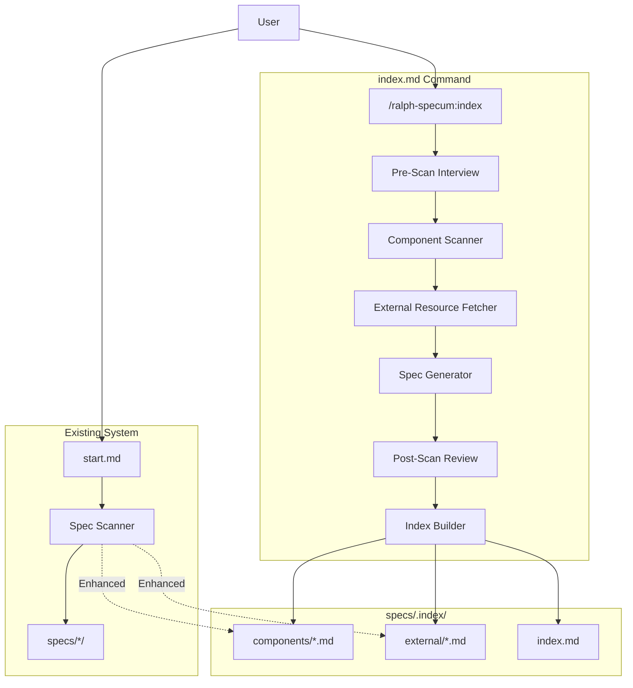
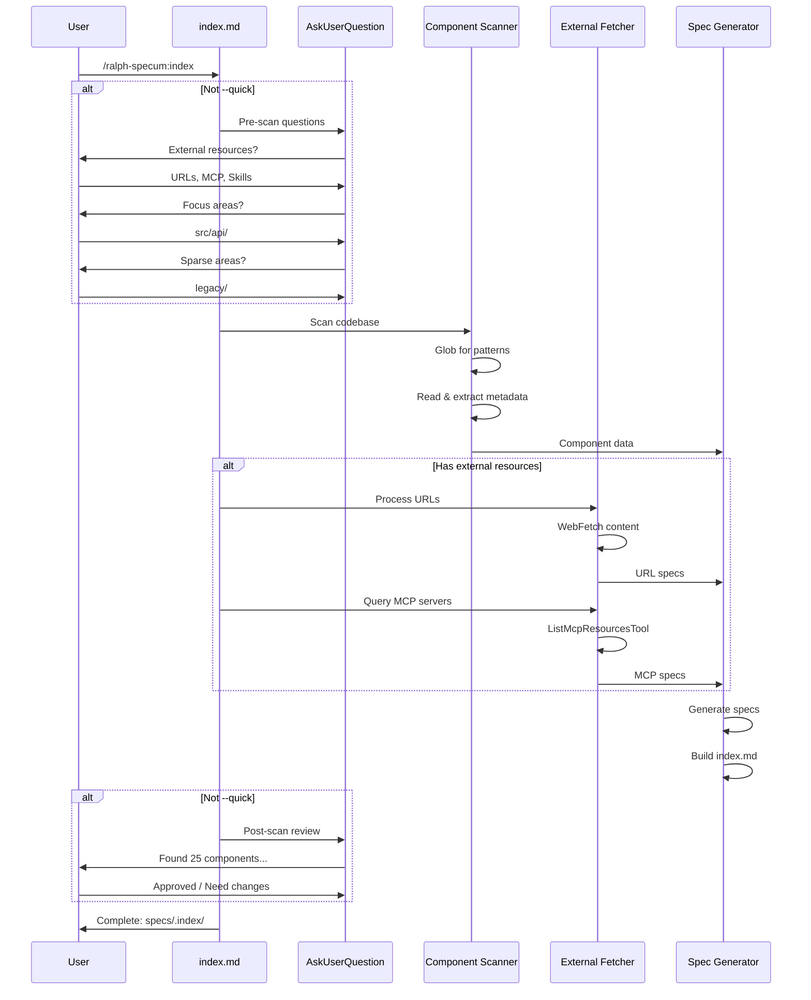

# Design: Codebase Indexing

## Overview

Add `/ralph-specum:index` command that scans codebases and external resources to auto-generate component specs in `specs/.index/`. Uses interview-driven discovery (pre-scan for external resources, post-scan for validation) with `--quick` bypass. Enhances spec scanner in `start.md` to search indexed specs during research.

## Design Inputs

Interview responses that informed this design:

| Question | Response |
|----------|----------|
| Architecture style | Extend existing architecture - add /ralph-specum:index command following existing plugin patterns |
| Technology constraints | No constraints - use whatever tools and patterns work best |
| Integration approach | Use existing APIs and interfaces - integrate with spec scanner, research analyst, existing templates |

## Architecture



## Components

### 1. Index Command (`commands/index.md`)

**Purpose**: Entry point orchestrating the indexing workflow.

**Responsibilities**:
- Parse arguments: `--path`, `--type`, `--exclude`, `--dry-run`, `--force`, `--changed`, `--quick`
- Conduct pre-scan interview (unless `--quick`)
- Invoke component scanner
- Process external resources from interview
- Conduct post-scan review (unless `--quick`)
- Generate final output

**Interface**:
```text
/ralph-specum:index [options]

Options:
  --path=<dir>      Limit to directory (default: project root)
  --type=<types>    Comma-separated: controllers,services,models,helpers,migrations
  --exclude=<pats>  Comma-separated patterns to exclude
  --dry-run         Preview without writing files
  --force           Regenerate all specs
  --changed         Regenerate only git-changed files
  --quick           Skip interview, batch scan only
```

### 2. Component Scanner

**Purpose**: Detect and categorize code components.

**Responsibilities**:
- Walk directories using Glob
- Categorize by path patterns
- Extract code metadata (functions, exports, dependencies)
- Generate component specs from template

**Detection Patterns**:

| Category | Glob Pattern | File Pattern |
|----------|-------------|--------------|
| Controllers | `**/controllers/**/*.{ts,js,py,go}` | `*controller*`, `*Controller*` |
| Services | `**/services/**/*.{ts,js,py,go}` | `*service*`, `*Service*` |
| Models | `**/models/**/*.{ts,js,py,go}` | `*model*`, `*Model*` |
| Helpers | `**/helpers/**/*.{ts,js,py,go}` | `*helper*`, `*Helper*`, `*util*` |
| Migrations | `**/migrations/**/*.{ts,js,sql}` | `*migration*` |

**Default Excludes**:
```text
node_modules, vendor, dist, build, .git, __pycache__,
*.test.*, *.spec.*, *_test.*, test/, tests/, spec/, specs/
```

### 3. External Resource Fetcher

**Purpose**: Fetch and process external documentation sources.

**Responsibilities**:
- Process URLs via WebFetch
- Query MCP servers via ListMcpResourcesTool
- Introspect installed skills
- Generate external resource specs

**Resource Types**:

| Type | Discovery | Spec Output |
|------|-----------|-------------|
| URL | Interview: "Any docs URLs?" | Content summary, key sections |
| MCP Server | ListMcpResourcesTool | Server name, tools list, resources |
| Skill | Plugin introspection | Commands, agents, description |

### 4. Spec Generator

**Purpose**: Create markdown spec files from analyzed data.

**Responsibilities**:
- Apply component spec template
- Apply external resource template
- Calculate content hash for change detection
- Write to `specs/.index/`

### 5. Index Builder

**Purpose**: Create and maintain the index summary.

**Responsibilities**:
- Generate `specs/.index/index.md`
- Track counts by category
- Maintain last-indexed timestamp
- List external resources with fetch dates

### 6. Spec Scanner Enhancement

**Purpose**: Extend start.md to search indexed specs.

**Modification to `start.md`** (lines 573-665):
- Add search of `specs/.index/components/*.md`
- Add search of `specs/.index/external/*.md`
- Integrate results into "Related Specs" display

## Data Flow



## Technical Decisions

| Decision | Options | Choice | Rationale |
|----------|---------|--------|-----------|
| Storage location | `specs/.index/` vs `.ralph-index/` | `specs/.index/` | Follows existing spec structure, searchable by scanner |
| Interview approach | CLI flags vs interview | Interview-driven | User requested (US-9), matches existing Ralph patterns |
| Component detection | AST parsing vs regex | Regex + Glob | Simpler, sufficient for metadata extraction, works across languages |
| External resources | Manifest file vs interview | Interview | More flexible, user can provide any type |
| MCP documentation | List all tools vs summarize | List tools with brief descriptions | Comprehensive but scannable |
| Change detection | Git diff vs content hash | Both (hash stored, git for --changed) | Supports non-git repos and explicit git mode |
| Gitignore indexed specs | Yes vs No | Recommend No (commit them) | Useful for team, searchable in PRs, not truly regeneratable (external resources) |

## File Structure

| File | Action | Purpose |
|------|--------|---------|
| `commands/index.md` | Create | Main command orchestration |
| `templates/component-spec.md` | Create | Template for code components |
| `templates/external-spec.md` | Create | Template for external resources |
| `templates/index-summary.md` | Create | Template for index.md dashboard |
| `commands/start.md` | Modify | Add hint when no index, enhance scanner |
| `schemas/spec.schema.json` | Modify | Add indexState definition |

## Templates

### Component Spec Template

```markdown
---
type: component-spec
generated: true
source: {{SOURCE_PATH}}
hash: {{CONTENT_HASH}}
category: {{CATEGORY}}
indexed: {{TIMESTAMP}}
---

# {{COMPONENT_NAME}}

## Purpose
{{AUTO_GENERATED_SUMMARY}}

## Location
`{{SOURCE_PATH}}`

## Public Interface

### Exports
{{#each EXPORTS}}
- `{{this}}`
{{/each}}

### Methods
| Method | Parameters | Description |
|--------|------------|-------------|
{{#each METHODS}}
| {{name}} | {{params}} | {{description}} |
{{/each}}

## Dependencies
{{#each DEPENDENCIES}}
- `{{this}}`
{{/each}}

## AI Context
**Keywords**: {{KEYWORDS}}
**Related files**: {{RELATED_FILES}}
```

### External Resource Spec Template

```markdown
---
type: external-spec
generated: true
source-type: {{SOURCE_TYPE}}
source-id: {{SOURCE_ID}}
fetched: {{FETCH_TIMESTAMP}}
---

# {{RESOURCE_NAME}}

## Source
- **Type**: {{SOURCE_TYPE}}
- **URL/ID**: {{SOURCE_ID}}
- **Fetched**: {{FETCH_TIMESTAMP}}

## Summary
{{CONTENT_SUMMARY}}

## Key Sections
{{#each SECTIONS}}
### {{title}}
{{content}}
{{/each}}

## AI Context
**Keywords**: {{KEYWORDS}}
**Related components**: {{RELATED_COMPONENTS}}
```

### Index Summary Template

```markdown
---
type: index-summary
generated: true
indexed: {{TIMESTAMP}}
---

# Codebase Index

## Overview

| Category | Count | Last Updated |
|----------|-------|--------------|
{{#each CATEGORIES}}
| {{name}} | {{count}} | {{lastUpdated}} |
{{/each}}
| **Total** | **{{TOTAL}}** | {{TIMESTAMP}} |

## Components

### Controllers
{{#each CONTROLLERS}}
- [{{name}}](components/{{file}}) - {{purpose}}
{{/each}}

### Services
{{#each SERVICES}}
- [{{name}}](components/{{file}}) - {{purpose}}
{{/each}}

[... repeat for each category ...]

## External Resources

| Resource | Type | Fetched |
|----------|------|---------|
{{#each EXTERNAL}}
| [{{name}}](external/{{file}}) | {{type}} | {{fetched}} |
{{/each}}

## Index Settings

- **Excluded patterns**: {{EXCLUDES}}
- **Indexed paths**: {{PATHS}}
```

## Interview Flow

### Pre-Scan Interview Questions

| # | Question | Key | Options |
|---|----------|-----|---------|
| 1 | Are there any external documentation URLs I should index? | `externalUrls` | No external docs / Yes, I have URLs / Other |
| 2 | Are there any MCP servers or skills I should document? | `externalTools` | No MCP/skills / Yes, I have some / Other |
| 3 | Are there specific directories to focus on? | `focusAreas` | Index everything / Focus on specific areas / Other |
| 4 | Are there code areas lacking comments that need extra attention? | `sparseAreas` | No sparse areas / Yes, some areas / Other |

### Post-Scan Review Questions

| # | Question | Key | Options |
|---|----------|-----|---------|
| 1 | I found {{count}} components. Does this seem complete? | `componentCount` | Yes, looks complete / Missing some / Too many / Other |
| 2 | The external resources look correct? | `externalResources` | Yes, correct / Need changes / Other |
| 3 | Any areas I should re-scan or adjust? | `adjustments` | No, looks good / Yes, please adjust / Other |

## Error Handling

| Error Scenario | Handling Strategy | User Impact |
|----------------|-------------------|-------------|
| No components found | Warning + suggest broader patterns | "No components found. Try `--path=src/` or check patterns." |
| External URL unreachable | Skip with warning, continue | "Warning: Could not fetch https://... - skipping" |
| MCP server unavailable | Skip with warning, continue | "Warning: MCP server 'x' not responding - skipping" |
| Git not available (--changed) | Error, suggest --force | "Git required for --changed. Use --force instead." |
| Permission denied | Skip file with warning | "Warning: Cannot read path/to/file - skipping" |
| Already indexed (no --force) | Skip silently in batch, note in summary | Shows count of "skipped (already indexed)" |
| Dry run | Show preview, no writes | Table of what would be generated |

## Edge Cases

- **Empty codebase**: Show message "No indexable components found" with suggestions
- **Monorepo**: Respect `--path` filter, default to full scan
- **No git**: `--changed` fails gracefully, other modes work
- **Mixed languages**: Detect patterns work across JS/TS, Python, Go
- **Very large codebase**: Batch processing, progress indicator, respect excludes
- **Existing index**: Skip unless `--force` or `--changed`
- **Interrupted indexing**: Partial index is valid, can resume with `--force`

## Test Strategy

### Unit Tests (via manual verification)

| Component | Test Case |
|-----------|-----------|
| Pattern matching | Controllers in various paths detected |
| Metadata extraction | Exports, methods, dependencies extracted |
| Template rendering | Spec files generate correctly |
| Hash calculation | Same content = same hash |
| Argument parsing | All flags work correctly |

### Integration Tests

| Test Case | Verification |
|-----------|--------------|
| Full scan | Run on sample repo, verify specs created |
| External URL | Fetch real URL, verify spec content |
| MCP server | Query local MCP, verify documentation |
| Dry run | No files created, output matches |
| Force regenerate | Existing specs overwritten |
| Changed only | Only git-modified files regenerated |

### E2E Tests

| Flow | Steps |
|------|-------|
| First-time indexing | Run index, verify specs/.index/ created |
| Research integration | Run start, verify indexed specs appear |
| Interview flow | Complete pre/post interview, verify responses captured |
| Quick mode | Run with --quick, verify no prompts |

## Performance Considerations

- **Glob batching**: Use single Glob call per pattern, not per file
- **Parallel fetching**: Fetch external URLs in parallel (up to 5 concurrent)
- **Lazy reading**: Only Read files that match patterns
- **Progress indicator**: Show "Scanning... 50/100 files" for large repos
- **Timeout**: External fetches timeout at 30s

## Security Considerations

- **No credentials in specs**: Never store auth tokens or passwords
- **URL validation**: Only fetch HTTP/HTTPS URLs
- **Path traversal**: Validate `--path` stays within repo
- **Gitignore respect**: Always exclude `.env`, credentials files

## Existing Patterns to Follow

Based on codebase analysis:
- **Command structure**: Follow `research.md`, `requirements.md` patterns with frontmatter
- **Interview flow**: Use AskUserQuestion with options like existing phases
- **State management**: Use `.ralph-state.json` for tracking
- **Output format**: Show walkthrough summary after completion
- **Agent delegation**: Coordinator pattern (index.md orchestrates, doesn't implement)

## Implementation Steps

1. Create `templates/component-spec.md` - component spec template
2. Create `templates/external-spec.md` - external resource template
3. Create `templates/index-summary.md` - index dashboard template
4. Create `commands/index.md` - main command with interview + scanning
5. Modify `commands/start.md` - add index hint (around line 571) and enhance spec scanner (lines 573-665)
6. Modify `schemas/spec.schema.json` - add index-related state definitions
7. Test: dry-run mode on sample directory
8. Test: full index on ralph-specum plugin itself
9. Test: external URL fetch
10. Test: research phase discovers indexed specs
