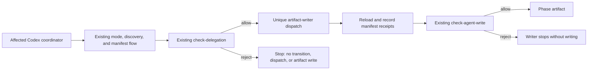

# Design: Codex phase interviews as a hard gate

## Overview

Make the existing `phase_gate.py` the explicit, shared transition boundary in the Codex coordinator contracts. This is a documentation-contract and regression-seam change: it does not add a hook, middleware, state machine, dependency, or new helper command.

Every affected coordinator will invoke the current delegation check immediately before its transition or child dispatch; every artifact writer will retain the current write check immediately before writing. A failed check in either mode stops the current invocation. A normal-mode failure after terminal interview state, or an exact `--quick` failure, makes the next explicit invocation rerun discovery and start a fresh manifest/interview identity before beginning its interview; terminal `bypassed_quick` state and its discovery revision are never reused.

## Architecture

### Component Diagram



### Components

#### Existing phase-gate helper

**Purpose**: Remain the only executable authority for mode normalization, tuple provenance, interview terminal state, delegation, and writer receipts.

**Responsibilities**:

- Keep `check-delegation`, `check-agent-write`, `record-skill-load`, and exact quick authorization semantics unchanged.
- Clear a prior interview through the existing changed-manifest behavior when a fresh recovery identity is recorded.

#### Shared interview framework

**Purpose**: Define one hard-transition invariant that every affected coordinator follows.

**Responsibilities**:

- State that a nonzero gate result stops before a phase transition, child dispatch, or target-artifact write.
- Define fresh-next-explicit-invocation recovery and retain exact `--quick` as the narrow question-and-approval bypass.

#### Affected coordinator contracts

**Purpose**: Apply the shared invariant at the existing `start`, `triage`, `research`, `requirements`, `design`, `tasks`, and primary-fallback boundaries.

**Responsibilities**:

- Run the shared rule immediately before creating a writer or advancing the phase.
- Pass the unchanged manifest, identity tuple, helper path, and unique dispatch identity to writers.

## Data Flow

1. Parse mode at phase entry. Only the literal `--quick` authorizes quick mode; `-q`, variants, and natural-language requests do not.
2. Complete the existing discovery and manifest reload, then establish the immutable `phase`, `interviewId`, `discoveryRevision`, and `contextDigest` tuple.
3. In normal mode, finish the current interview and record explicit `approve-and-delegate`; with exact `--quick`, record `bypassed_quick` instead. Both paths retain manifest and provenance checks.
4. Immediately before a phase transition or child dispatch, run the existing `check-delegation` for that tuple. A failure ends this invocation before the transition, dispatch, or target-artifact write.
5. A normal-mode failed gate occurs after the interview has reached a terminal state. On the next explicit invocation, the coordinator creates a new `interviewId` and records a fresh manifest before `begin-interview`; no separate failure marker is needed because `begin-interview` resumes only a matching `collecting` or `awaiting_confirmation` interview, while the fresh manifest identity clears the terminal prior interview through the existing `record-skill-load` fingerprint behavior. An exact `--quick` failure follows the same stop boundary: its next explicit invocation reruns discovery, records a fresh `phaseSkillLoad` and interview identity, and creates a new `bypassed_quick` receipt instead of reusing the terminal receipt or discovery revision. A matching in-progress interview that has not reached a failed transition boundary still resumes normally.
6. A permitted writer reloads every manifest source, records its receipts under a unique dispatch identity, and runs the existing `check-agent-write` before writing the artifact.
7. Triage follows the same flow with its existing `.epic-state.json` as `STATE`; it preserves the existing epic-state and multi-writer behavior.

## Technical Decisions

| Decision | Options Considered | Choice | Rationale |
|----------|-------------------|--------|-----------|
| Enforcement boundary | New hook or middleware; change `phase_gate.py`; use the existing helper | Existing helper | It already fails closed for missing, partial, stale, and mismatched interviews and verifies writer provenance. |
| Coordinator coverage | Per-phase ad hoc wording; one shared invariant plus explicit coordinator references | Shared invariant plus matrix references | Keeps the policy in one source while making each actual dispatch boundary unambiguous. |
| Failed-gate recovery | Continue in place; fresh recovery on the next explicit invocation | Fresh next invocation | Prevents a failed state from being reused while preserving a normal matching in-progress interview before any failed gate path. |
| Quick mode | Broader shortcut aliases; reuse terminal quick state; literal authorization only | Exact `--quick` only with fresh retry identity | Preserves the current narrow bypass and all non-interview checks while preventing terminal quick-state reuse. |
| Regression coverage | New runtime framework; existing Bats contract seam | Extend `tests/codex-phase-flow.bats` | The affected behavior is coordinator instruction enforcement; the existing helper-level Bats suite remains unchanged. |

## File Structure

| File | Action | Purpose |
|------|--------|---------|
| `plugins/ralph-specum-codex/skills/interview-framework-codex/SKILL.md` | Modify | Add the named hard-transition invariant and fail-closed boundary. |
| `plugins/ralph-specum-codex/skills/interview-framework-codex/references/algorithm.md` | Modify | Specify exact `--quick`, gate order, quick retry freshness, normal-mode stop behavior, and fresh-next-invocation recovery without changing helper semantics. |
| `plugins/ralph-specum-codex/skills/ralph-specum/SKILL.md` | Modify | Make the primary fallback apply the invariant for the affected phase matrix only. |
| `plugins/ralph-specum-codex/skills/ralph-specum-start/SKILL.md` | Modify | Gate fresh and resumed research dispatch; describe fresh recovery after a failed normal-mode boundary. |
| `plugins/ralph-specum-codex/skills/ralph-specum-triage/SKILL.md` | Modify | Apply the invariant before every triage artifact writer while retaining `.epic-state.json`. |
| `plugins/ralph-specum-codex/skills/ralph-specum-research/SKILL.md` | Modify | Gate direct research dispatch and stop on failure. |
| `plugins/ralph-specum-codex/skills/ralph-specum-requirements/SKILL.md` | Modify | Gate direct requirements dispatch and stop on failure. |
| `plugins/ralph-specum-codex/skills/ralph-specum-design/SKILL.md` | Modify | Gate direct design dispatch and stop on failure. |
| `plugins/ralph-specum-codex/skills/ralph-specum-tasks/SKILL.md` | Modify | Gate direct task-planner dispatch and stop on failure. |
| `tests/codex-phase-flow.bats` | Modify | Add one table-driven coordinator-contract regression seam for fresh, direct, resumed, triage, and exact-quick paths. |
| `plugins/ralph-specum-codex/.codex-plugin/plugin.json` | Modify | Bump the Codex plugin patch version once, from `4.12.3` to `4.12.5`. |

No change is proposed for `.claude-plugin/marketplace.json`, `plugins/ralph-specum-codex/scripts/phase_gate.py`, the byte-identical Claude helper, artifact-agent templates, hooks, schemas, or `tests/phase-gates.bats`.

## Interfaces

No interface, state field, or command is added. The coordinators and writers continue to use the existing commands:

```text
phase_gate.py check-delegation STATE --phase PHASE --interview-id ID --discovery-revision REV --context-digest SHA256
phase_gate.py check-agent-write STATE --phase PHASE --interview-id ID --context-digest SHA256 --discovery-revision REV --agent UNIQUE_DISPATCH_ID
```

A successful delegation check permits the existing dispatch packet. A failed command is terminal for that invocation; it is not converted to a warning or bypassed by a coordinator.

## Error Handling

| Error Scenario | Handling Strategy | User Impact |
|----------------|-------------------|-------------|
| Missing, partial, stale, mismatched, or unapproved normal interview | Let the existing delegation check fail; stop before transition, dispatch, or artifact write. | The next explicit affected-phase invocation starts a fresh interview identity. |
| Matching active interview that has not attempted the transition | Keep the existing resume tuple and persisted answers. | The user continues the current interview instead of losing valid progress. |
| Failed exact `--quick` delegation with terminal bypass state | Stop before transition, dispatch, or artifact write; the next explicit invocation reruns discovery and records a fresh manifest/interview identity. | Terminal `bypassed_quick` state and its discovery revision are not reused; only matching `collecting` or `awaiting_confirmation` states can resume. |
| Core manifest or provenance failure | Keep the existing helper failure and stop behavior. | No child runs until a valid manifest is reloaded. |
| Missing writer receipts or hash mismatch | Keep `check-agent-write` as the last pre-write guard. | The child writes no artifact and reports the failure. |
| Non-exact quick request | Treat it as normal/interactive mode under the existing mode parser. | Questions and explicit approval remain required. |

## Edge Cases

- **Exact quick mode**: `--quick` creates only the existing `bypassed_quick` interview receipt; it still completes discovery, manifest loading, parent delegation, child receipt recording, and child write checks. After a failed delegation check, the next explicit invocation reruns discovery and creates a fresh phase-load/interview identity instead of reusing terminal quick state or its discovery revision.
- **Fresh versus resumed recovery**: A partial interview can resume only while it remains the current valid interview flow. Once a normal-mode or exact `--quick` delegation check failed, a later explicit invocation creates a fresh identity rather than reusing terminal state or its discovery revision; only matching `collecting` or `awaiting_confirmation` statuses resume.
- **Triage**: Each artifact-producing triage child gets the same parent gate and its own unique writer identity; `.epic-state.json` remains the state file.
- **Prototype evidence**: The selector is clean and the terminal `quick-149-no-prototype` record has `sourceDisposition: not_created`; it contributes no design evidence or implementation work.
- **Unaffected phases**: `implement` and `refactor` keep their existing flows and are outside this gate matrix.

## Dependencies

| Package | Version | Purpose |
|---------|---------|---------|
| New packages | None | Reuse Python, the existing helper, and CI-provisioned Bats. |

## Security Considerations

- Keep the existing hash-checked manifest, immutable identity tuple, and unique writer-receipt checks intact.
- Restrict the bypass to `quickAuthorization.source == "--quick"`; no alternate flag or natural-language input becomes authorization.
- Fail closed before a child can create an artifact when interview provenance is invalid.

## Performance Considerations

- Add no polling, hook, process, dependency, or state-machine work.
- Reuse the existing gate commands at the already documented dispatch and writer boundaries; the small extra contract checks do not add a new runtime path.

## Test Strategy

### Bats Regression Seam

Extend the existing `tests/codex-phase-flow.bats` coordinator matrix rather than creating another test harness. Its single table-driven contract assertion will require the primary fallback plus `start`, `triage`, `research`, `requirements`, `design`, and `tasks` to state all of the following:

- A fresh normal start cannot transition, dispatch, or write until explicit approval and `check-delegation` succeed.
- A direct or resumed phase stops on missing, partial, stale, mismatched, or unapproved interview state; a later explicit invocation uses fresh recovery.
- A matching in-progress interview remains resumable before it crosses the failed-gate boundary.
- Only exact `--quick` bypasses questions and final approval, while discovery, fresh retry identity, manifest reload, `check-delegation`, receipt recording, and `check-agent-write` remain mandatory; terminal `bypassed_quick` state is never reused after a failed quick gate.
- Triage uses `.epic-state.json` and applies the boundary to every artifact writer.

Keep the existing helper-level assertions in `tests/phase-gates.bats` unchanged, then run:

```bash
bats tests/phase-gates.bats tests/codex-phase-flow.bats
```

### Existing Patterns to Follow

- Use the current `phase_skills`/text-contract Bats pattern for the coordinator matrix.
- Preserve state through the existing merge helpers instead of replacing state objects.
- Reuse the current manifest packet and unique dispatch identity flow for all artifact writers.

## Implementation Status

Planned only. No implementation, version update, commit, or push is included in this design phase.
