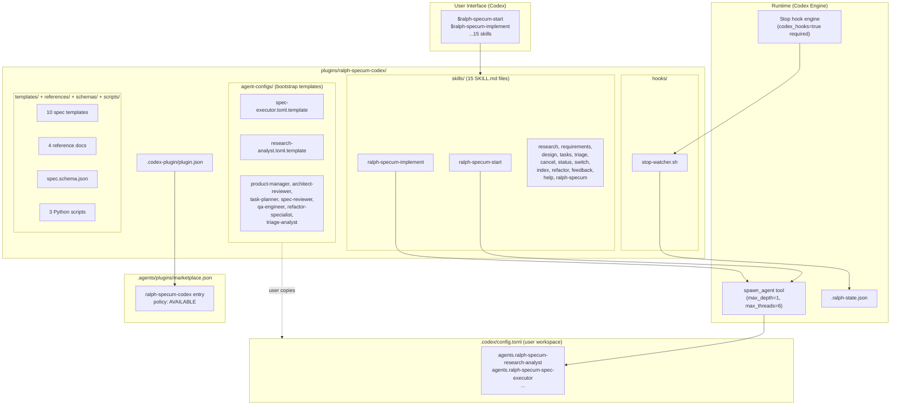
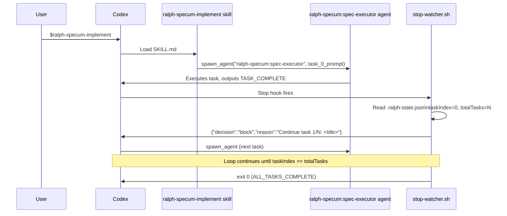

# Design: Codex Plugin Sync

## Overview

Replace `platforms/codex/` (v4.8.4, skills-only) with `plugins/ralph-specum-codex/` (v4.9.1, full Codex plugin). The plugin ships 15 skills as the user-facing interface, 9 agent bootstrap config templates that users merge into `.codex/config.toml`, a Stop hook for automated task looping, and all templates/references/scripts from the Claude plugin. A single CI script enforces version parity across three files (Claude plugin, Codex plugin, marketplace).

---

## Architecture



---

## Plugin Directory Structure

```
plugins/ralph-specum-codex/
├── .codex-plugin/
│   └── plugin.json                          # Manifest (only file here)
├── skills/
│   ├── ralph-specum/SKILL.md                # Bootstrap/help (main entry)
│   ├── ralph-specum-start/SKILL.md          # start + new merged
│   ├── ralph-specum-research/SKILL.md
│   ├── ralph-specum-requirements/SKILL.md
│   ├── ralph-specum-design/SKILL.md
│   ├── ralph-specum-tasks/SKILL.md
│   ├── ralph-specum-implement/SKILL.md      # Includes manual loop fallback
│   ├── ralph-specum-cancel/SKILL.md
│   ├── ralph-specum-status/SKILL.md
│   ├── ralph-specum-switch/SKILL.md
│   ├── ralph-specum-triage/SKILL.md
│   ├── ralph-specum-refactor/SKILL.md
│   ├── ralph-specum-index/SKILL.md
│   ├── ralph-specum-feedback/SKILL.md
│   └── ralph-specum-help/SKILL.md
├── agent-configs/                           # Bootstrap templates (not loaded by Codex)
│   ├── README.md                            # Install instructions
│   ├── research-analyst.toml.template
│   ├── product-manager.toml.template
│   ├── architect-reviewer.toml.template
│   ├── task-planner.toml.template
│   ├── spec-executor.toml.template
│   ├── spec-reviewer.toml.template
│   ├── qa-engineer.toml.template
│   ├── refactor-specialist.toml.template
│   └── triage-analyst.toml.template
├── hooks/
│   └── stop-watcher.sh                      # Execution loop controller
├── templates/
│   ├── research.md
│   ├── requirements.md
│   ├── design.md
│   ├── tasks.md                             # Synced from Claude (588-line version)
│   ├── progress.md
│   ├── epic.md                              # NEW: was missing from platforms/codex/
│   ├── component-spec.md
│   ├── external-spec.md
│   ├── index-summary.md
│   └── settings-template.md                 # Synced from Claude (79-line version)
├── references/
│   ├── parity-matrix.md                     # Claude<->Codex feature mapping + version delta
│   ├── workflow.md                          # Hook-driven + manual execution paths
│   ├── state-contract.md
│   └── path-resolution.md
├── schemas/
│   └── spec.schema.json                     # Copied from Claude plugin
├── scripts/
│   ├── resolve_spec_paths.py
│   ├── merge_state.py
│   └── count_tasks.py
└── README.md
```

---

## Component Design

### Skills (15 total)

**Naming**: `$ralph-specum-<phase>` (dollar-sign invocation, no slash prefix in Codex).

**Format**: Each skill is `skills/<name>/SKILL.md`. Must conform to Agent Skills standard (name, description, instructions sections). Under 2000 words per file (progressive disclosure).

**Content structure**:

```
# <Skill Name>

## Description
<One sentence purpose>

## Instructions

### When to use
...

### Steps
...

### Agent to spawn
spawn_agent("<ralph-specum:agent-name>", prompt="...")

### References
[workflow](../../references/workflow.md)
```

**Skill inventory and source mapping**:

| Codex Skill | Claude Source | Action | Notes |
|-------------|--------------|--------|-------|
| `ralph-specum` | `commands/help.md` | Adapt | Bootstrap entry + help |
| `ralph-specum-start` | `commands/start.md` + `commands/new.md` | Merge | start+new combined |
| `ralph-specum-research` | `commands/research.md` | Adapt | Swap Task->spawn_agent |
| `ralph-specum-requirements` | `commands/requirements.md` | Adapt | Swap Task->spawn_agent |
| `ralph-specum-design` | `commands/design.md` | Adapt | Swap Task->spawn_agent |
| `ralph-specum-tasks` | `commands/tasks.md` | Adapt | Swap Task->spawn_agent |
| `ralph-specum-implement` | `commands/implement.md` | Rewrite | Stop hook loop + manual fallback section |
| `ralph-specum-cancel` | `commands/cancel.md` | Adapt | No Task tool refs |
| `ralph-specum-status` | `commands/status.md` | Adapt | Add hook availability check |
| `ralph-specum-switch` | `commands/switch.md` | Copy | Minimal adaptation |
| `ralph-specum-triage` | `commands/triage.md` | Adapt | Swap Task->spawn_agent |
| `ralph-specum-refactor` | `commands/refactor.md` | Adapt | Swap Task->spawn_agent |
| `ralph-specum-index` | `commands/index.md` | Adapt | Swap Task->spawn_agent |
| `ralph-specum-feedback` | `commands/feedback.md` | Copy | Minimal adaptation |
| `ralph-specum-help` | `commands/help.md` | Adapt | Codex-specific invocation syntax |

**Key adaptation**: Replace all `Task tool` / coordinator pattern references with `spawn_agent("<agent>", prompt="...")`. Codex has no `Task` tool; `spawn_agent` is the equivalent.

**`ralph-specum-implement` special structure**:

```markdown
## Instructions

### Automatic Loop (requires codex_hooks=true)
1. Invoke $ralph-specum-implement
2. spawn_agent("ralph-specum:spec-executor", prompt=<task prompt>)
3. Stop hook reads .ralph-state.json, emits next-task prompt or exits

### Manual Loop (hooks disabled or Windows)
1. Invoke $ralph-specum-implement
2. Check .ralph-state.json for taskIndex/totalTasks
3. spawn_agent("ralph-specum:spec-executor", prompt=<task N prompt>)
4. Re-invoke $ralph-specum-implement to continue to task N+1
5. Repeat until taskIndex >= totalTasks
```

---

### Agent Bootstrap Templates

**Why templates, not live agent configs**: Codex agents are defined in `config.toml` under `agents.<name>` keys. Plugins cannot inject into a user's `config.toml` automatically. Templates ship with the plugin; users follow `agent-configs/README.md` to paste the relevant sections into their `.codex/config.toml`.

**Template format** (`.toml.template` extension signals "not a live config"):

```toml
# ralph-specum:spec-executor
# Paste this block into .codex/config.toml under [agents]
[agents.ralph-specum-spec-executor]
description = "Executes one implementation task from the current spec"
config_file = ""
nickname_candidates = ["executor", "ralph-executor"]

# developer_instructions goes at the top level of config.toml:
# [developer_instructions]
# ralph_specum_spec_executor = """
# <system prompt content>
# TASK_COMPLETE / ALL_TASKS_COMPLETE protocol...
# """
```

**Note**: Exact TOML field names (`developer_instructions` placement, `config_file` vs inline instructions) must be confirmed against live Codex docs before authoring all 9 templates. The design shows the expected structure; implementation task must verify before writing.

**Agent roster and sources**:

| Agent | Claude Source | New/Copy | Priority |
|-------|--------------|----------|----------|
| `ralph-specum:research-analyst` | `agents/research-analyst.md` | Adapt | High |
| `ralph-specum:product-manager` | `agents/product-manager.md` | Adapt | High |
| `ralph-specum:architect-reviewer` | `agents/architect-reviewer.md` | Adapt | High |
| `ralph-specum:task-planner` | `agents/task-planner.md` | Adapt | High |
| `ralph-specum:spec-executor` | `agents/spec-executor.md` | Adapt | High (must include TASK_COMPLETE protocol) |
| `ralph-specum:triage-analyst` | `agents/triage-analyst.md` | Adapt | High |
| `ralph-specum:spec-reviewer` | `agents/spec-reviewer.md` | Adapt | Medium |
| `ralph-specum:qa-engineer` | `agents/qa-engineer.md` | Adapt | Medium |
| `ralph-specum:refactor-specialist` | `agents/refactor-specialist.md` | Adapt | Medium |

All 9 agents now exist as markdown in `plugins/ralph-specum/agents/`. The 3 previously "net-new" agents (spec-reviewer, qa-engineer, refactor-specialist) have Claude sources to adapt from.

---

### Stop Hook

**File**: `hooks/stop-watcher.sh`

**Declaration in plugin.json**:

```json
{
  "hooks": {
    "Stop": "hooks/stop-watcher.sh"
  }
}
```

**Note**: Exact `plugin.json` hook declaration field names must be verified against Codex plugin API docs during implementation. The key insight from research: Stop hook receives `{"decision": "block", "reason": "..."}` output format.

**Logic** (adapted from `plugins/ralph-specum/hooks/scripts/stop-watcher.sh`):

```
Read stdin JSON (cwd, transcript_path)
Locate .ralph-state.json via specs/.current-spec
If no state file → exit 0 (no-op)
If ALL_TASKS_COMPLETE in transcript → exit 0
If taskIndex >= totalTasks → print ALL_TASKS_COMPLETE, exit 0
Else → output {"decision": "block", "reason": "Continue to task N/M: <task title>"}
```

**Differences from Claude stop-watcher**:
- Output format is `{"decision": "block", "reason": "..."}` (Codex API), not a Claude continuation prompt
- No `${CLAUDE_PLUGIN_ROOT}` env var; use relative path from script location
- No `path-resolver.sh` sourcing (Python scripts handle path resolution instead)
- Codex passes cwd in stdin JSON; same pattern as Claude hook

**Fallback**: When `[features] codex_hooks = true` is absent or on Windows, the hook is simply not called. The manual loop in `ralph-specum-implement` SKILL.md covers this case.

---

### Plugin Manifest

```json
{
  "name": "ralph-specum-codex",
  "version": "4.9.1",
  "description": "Spec-driven development with task-by-task execution. Research, requirements, design, tasks, autonomous implementation, and epic triage.",
  "author": { "name": "tzachbon" },
  "license": "MIT",
  "keywords": ["ralph", "spec-driven", "research", "requirements", "design", "tasks", "autonomous", "epic", "triage"],
  "skills": "./skills",
  "hooks": {
    "Stop": "./hooks/stop-watcher.sh"
  }
}
```

---

### Marketplace Entry

File: `.agents/plugins/marketplace.json` (append to existing file)

```json
{
  "name": "ralph-specum-codex",
  "description": "Spec-driven development: research, requirements, design, tasks, autonomous implementation.",
  "version": "4.9.1",
  "source": {
    "source": "local",
    "path": "./plugins/ralph-specum-codex"
  },
  "policy": {
    "installation": "AVAILABLE"
  }
}
```

---

### Python Scripts

All 3 scripts copy from `platforms/codex/skills/ralph-specum/scripts/` with path updates only:

| Script | Change Needed |
|--------|--------------|
| `resolve_spec_paths.py` | Update any hardcoded `platforms/codex/` root references |
| `merge_state.py` | None expected |
| `count_tasks.py` | None expected |

Scripts remain callable from skills via `bash -c "python3 plugins/ralph-specum-codex/scripts/..."`.

---

## Execution Loop Design

### Hook-Driven Path (primary)



**State management**: Identical to Claude plugin. `.ralph-state.json` fields (`taskIndex`, `totalTasks`, `phase`, `name`, `basePath`) are the coordination primitive. `spec-executor` increments `taskIndex` after each task. `.progress.md` accumulates learnings.

**Constraint**: `max_depth=1` means `spec-executor` cannot itself spawn sub-agents. All orchestration is flat: the Stop hook drives the outer loop; `spec-executor` handles one task at a time.

### Manual Fallback Path

When Stop hooks are disabled (Windows, or `codex_hooks=false`):

1. User runs `$ralph-specum-implement`
2. Skill calls `spawn_agent("ralph-specum:spec-executor", <task_0_prompt>)`
3. Task completes, agent outputs `TASK_COMPLETE`
4. User checks `.ralph-state.json` (`taskIndex`, `totalTasks`)
5. User re-invokes `$ralph-specum-implement` → skill reads state, constructs next task prompt
6. Repeat until `taskIndex >= totalTasks` (executor outputs `ALL_TASKS_COMPLETE`)

The `ralph-specum-implement` skill must include state-reading logic to know which task prompt to construct on each re-invocation, using the Python scripts for path resolution.

---

## Migration Plan

### Phase 1: Create plugin (new commit)

1. Create `plugins/ralph-specum-codex/` directory tree
2. Write `.codex-plugin/plugin.json`
3. Migrate 15 skills from `platforms/codex/skills/ralph-specum/` with content sync
4. Sync templates (add `epic.md`, update `tasks.md`, update `settings-template.md`)
5. Copy/adapt 4 references (add `verification-layers`, `failure-recovery` content to `workflow.md`)
6. Copy `schemas/spec.schema.json`
7. Copy and path-fix 3 Python scripts
8. Write `hooks/stop-watcher.sh`
9. Write 9 `agent-configs/*.toml.template` files
10. Append marketplace entry to `.agents/plugins/marketplace.json`
11. Write `README.md`

### Phase 2: Tests and CI (same or next commit)

12. Create `tests/codex-plugin.bats` (new test file for plugin structure)
13. Update `tests/codex-platform.bats` paths from `platforms/codex/` to `plugins/ralph-specum-codex/`
14. Update `tests/codex-platform-scripts.bats` paths
15. Write `tests/helpers/version-sync.sh` (CI version-check script)
16. Update `.github/workflows/bats-tests.yml` trigger paths
17. Create `.github/workflows/codex-version-check.yml` (or update existing) for version sync

### Phase 3: Cleanup (separate commit, after tests pass)

18. Delete `platforms/codex/`
19. Remove any remaining `platforms/codex/` references in docs
20. Update repo `CLAUDE.md` / `README.md`

### Content delta to resolve (v4.8.4 -> v4.9.1)

| Item | Action |
|------|--------|
| `tasks.md` template (192 -> 588 lines) | Replace with Claude version |
| `settings-template.md` (24 -> 79 lines) | Replace with Claude version |
| `epic.md` template (missing) | Add from Claude plugin |
| Verification layers reference (missing) | Add content to `workflow.md` |
| Failure recovery reference (missing) | Add content to `workflow.md` |
| Intent classification reference (missing) | Add to `workflow.md` or new ref |
| Skills: qa-engineer, refactor-specialist, spec-reviewer (missing in platforms/codex) | New agent-configs from Claude agents/ |

---

## Technical Decisions

| Decision | Options | Choice | Rationale |
|----------|---------|--------|-----------|
| Agent config delivery | (A) Standalone TOML files in plugin, (B) Bootstrap templates users copy to config.toml | B | Codex agents are `config.toml` keys, not standalone files. Plugin cannot inject into user config. Templates are the only viable delivery mechanism. |
| Script language for hook | Python vs Shell | Shell | Consistent with Claude plugin stop-watcher pattern. Shell is sufficient for JSON parsing with jq. Python scripts handle the complex path resolution separately. |
| `new` skill | Separate skill vs merged into `start` | Merged | `start` already handles the new-spec case via state detection. A separate `new` skill would duplicate logic. Consistent with AC-3.3. |
| Reference consolidation | Keep 4 separate refs vs add 11 from Claude | Add content to existing refs | Codex plugin has 4 references; Claude has 15. Merge the critical missing content (verification-layers, failure-recovery, intent-classification) into `workflow.md` and `parity-matrix.md` rather than exploding the reference count. |
| Parity matrix format | New doc vs update existing | Update existing `parity-matrix.md` | Already exists in `platforms/codex/`. Add a "Version Delta" section per AC-4.1. |
| Template file names | `.toml` vs `.toml.template` | `.toml.template` | Signals "not a live config" to users and tooling. Prevents accidental loading by Codex config parsers. |

---

## File Inventory

### New Files

| File | Purpose | Effort |
|------|---------|--------|
| `plugins/ralph-specum-codex/.codex-plugin/plugin.json` | Manifest | XS |
| `plugins/ralph-specum-codex/skills/*/SKILL.md` (15 files) | Skill definitions | L (content sync per skill) |
| `plugins/ralph-specum-codex/agent-configs/*.toml.template` (9 files) | Agent bootstrap templates | M (extract from Claude agents/) |
| `plugins/ralph-specum-codex/agent-configs/README.md` | Install instructions | S |
| `plugins/ralph-specum-codex/hooks/stop-watcher.sh` | Execution loop controller | M |
| `plugins/ralph-specum-codex/templates/epic.md` | Missing template | XS (copy from Claude) |
| `plugins/ralph-specum-codex/templates/*.md` (9 other templates) | Spec templates | S (copy + sync) |
| `plugins/ralph-specum-codex/references/parity-matrix.md` | Feature mapping + delta | M |
| `plugins/ralph-specum-codex/references/workflow.md` | Execution paths | M (add missing content) |
| `plugins/ralph-specum-codex/references/state-contract.md` | State file spec | XS (copy) |
| `plugins/ralph-specum-codex/references/path-resolution.md` | Path resolution docs | XS (copy) |
| `plugins/ralph-specum-codex/schemas/spec.schema.json` | JSON schema | XS (copy) |
| `plugins/ralph-specum-codex/scripts/*.py` (3 files) | Python helpers | S (copy + path fix) |
| `plugins/ralph-specum-codex/README.md` | Plugin docs | S |
| `tests/codex-plugin.bats` | Plugin structure tests | M |
| `tests/helpers/version-sync.sh` | Version comparison script | S |

### Modified Files

| File | Change | Effort |
|------|--------|--------|
| `tests/codex-platform.bats` | Update paths to `plugins/ralph-specum-codex/` | S |
| `tests/codex-platform-scripts.bats` | Update paths | S |
| `.agents/plugins/marketplace.json` | Append plugin entry | XS |
| `.github/workflows/bats-tests.yml` | Add trigger paths for `plugins/ralph-specum-codex/` | XS |
| `.github/workflows/codex-version-check.yml` | Update or create version-sync job | S |

### Deleted Files (Phase 3)

| File | Notes |
|------|-------|
| `platforms/codex/` (entire directory) | Separate commit after tests pass |

---

## Test Strategy

### `tests/codex-plugin.bats` (new file)

```bash
@test "plugin.json exists and is valid JSON"
@test "plugin.json has required fields: name, version, description"
@test "plugin.json version matches claude plugin version"
@test "all 15 SKILL.md files exist"
@test "each SKILL.md has name, description, instructions sections"
@test "no SKILL.md exceeds 2000 words"
@test "all 9 agent-config templates exist"
@test "all 10 templates exist"
@test "all 4 references exist"
@test "spec.schema.json exists"
@test "all 3 python scripts exist"
@test "stop-watcher.sh is executable"
@test "marketplace.json contains ralph-specum-codex entry"
@test "marketplace version matches plugin.json version"
```

### `tests/helpers/version-sync.sh`

```bash
#!/usr/bin/env bash
# Compares versions across three files. Exits 1 if any mismatch.
CLAUDE_VER=$(jq -r .version plugins/ralph-specum/.claude-plugin/plugin.json)
CODEX_VER=$(jq -r .version plugins/ralph-specum-codex/.codex-plugin/plugin.json)
MARKET_VER=$(jq -r '.plugins[] | select(.name=="ralph-specum-codex") | .version' .agents/plugins/marketplace.json)

if [ "$CLAUDE_VER" != "$CODEX_VER" ] || [ "$CODEX_VER" != "$MARKET_VER" ]; then
  echo "VERSION MISMATCH: claude=$CLAUDE_VER codex=$CODEX_VER marketplace=$MARKET_VER"
  exit 1
fi
```

### Updated Tests

- `tests/codex-platform.bats`: Replace `platforms/codex/` with `plugins/ralph-specum-codex/` throughout
- `tests/codex-platform-scripts.bats`: Same path update

### CI Changes

- `.github/workflows/bats-tests.yml`: Add `plugins/ralph-specum-codex/**` to trigger paths
- Version sync job: run `tests/helpers/version-sync.sh` on PRs touching `plugins/ralph-specum*/` or `marketplace.json`

---

## Risk Register

| Risk | Likelihood | Impact | Mitigation |
|------|-----------|--------|-----------|
| Stop hook `plugin.json` declaration syntax wrong | Medium | High | Treat as research-first task. Fetch Codex plugin API docs before writing. If syntax is wrong, hook silently fails (no crash); fallback path covers users. |
| Stop hook experimental flag never stabilizes | Low | Medium | Manual fallback is fully documented and functional without hooks. Plugin is usable either way. |
| TOML agent field names incorrect (`developer_instructions` vs `instructions`) | Medium | Medium | Templates labeled `.toml.template` won't be parsed by Codex. Wrong field names cause silent failure (agent uses defaults). Verify against live docs before writing all 9. |
| `platforms/codex/` tests break before migration is complete | Low | Low | Tests updated in Phase 2 before Phase 3 deletion. Old tests keep passing until Phase 3. |
| Content delta introduces behavioral regressions | Low | Medium | Parity matrix documents every behavioral change. Each changed skill is explicitly audited vs Claude counterpart. |
| `max_depth=1` prevents complex orchestration | Known | Low | Already accounted for: all orchestration is flat. Skills spawn agents directly; agents do not re-spawn. |

---

## Existing Patterns to Follow

- **BATS test structure**: See `tests/codex-platform.bats` for `repo_root()` helper pattern and `assert_python` for Python script testing
- **CI trigger paths**: Follow `bats-tests.yml` pattern (`plugins/**/*.sh`, `tests/**/*.bats`)
- **Plugin manifest structure**: Follow `plugins/ralph-specum/.claude-plugin/plugin.json` for field names
- **Stop hook stdin parsing**: Follow `plugins/ralph-specum/hooks/scripts/stop-watcher.sh` for jq-based cwd extraction and state file location logic
- **Skill naming**: `ralph-specum-<phase>` (dash-separated, lowercase) matches existing `platforms/codex/skills/` convention

---

## Unresolved Questions

1. **Stop hook `plugin.json` field**: Exact key for declaring hook path in manifest (e.g., `"hooks": {"Stop": "..."}` vs another structure). Must verify before implementing AC-8.4.
2. **TOML agent field names**: `developer_instructions` at top-level vs `system_prompt` inside agent block. Must verify before authoring all 9 templates.
3. **Marketplace existing structure**: Confirm `.agents/plugins/marketplace.json` already exists and its current JSON structure before appending.

---

## Implementation Steps

1. Verify Codex plugin API docs for Stop hook declaration syntax and TOML agent field names (research-first)
2. Create `plugins/ralph-specum-codex/` directory and `.codex-plugin/plugin.json`
3. Copy + adapt all 15 skills (content-sync from `platforms/codex/skills/` + apply v4.8.4->v4.9.1 delta)
4. Write `hooks/stop-watcher.sh` (adapt Claude stop-watcher for Codex `decision:block` output format)
5. Sync all 10 templates (add `epic.md`, replace `tasks.md` and `settings-template.md` with Claude versions)
6. Copy 4 references; add missing content (verification-layers, failure-recovery, intent-classification) to `workflow.md`
7. Copy `schemas/spec.schema.json` and 3 Python scripts (update any hardcoded paths)
8. Write 9 `agent-configs/*.toml.template` files (adapt from `plugins/ralph-specum/agents/*.md`)
9. Write `agent-configs/README.md` with install instructions
10. Append entry to `.agents/plugins/marketplace.json`
11. Write `plugins/ralph-specum-codex/README.md`
12. Create `tests/codex-plugin.bats` with all structure tests
13. Write `tests/helpers/version-sync.sh`
14. Update `tests/codex-platform.bats` and `tests/codex-platform-scripts.bats` (path migration)
15. Update `.github/workflows/bats-tests.yml` trigger paths
16. Update or create version-sync CI workflow
17. Verify full test suite passes
18. Delete `platforms/codex/` in separate commit + update any remaining references
