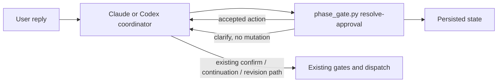
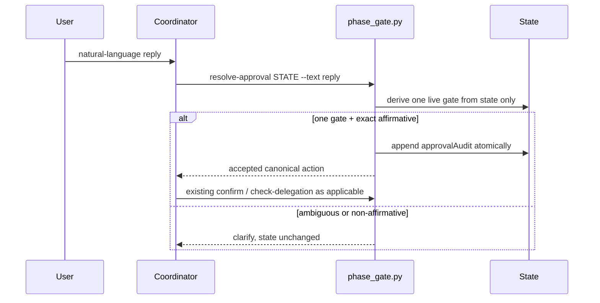

# Design: Contextual Approval Replies

## Overview

Add one `resolve-approval` command to the existing, byte-identical `phase_gate.py` helpers. It proves there is exactly one persisted approval action, accepts only a small deterministic affirmative grammar, atomically appends an audit entry, and returns the existing canonical action; coordinators still run `confirm`, delegation, and writer checks themselves.

## Architecture

### Component Diagram



### Components

#### Shared phase-gate helper

**Files**: `plugins/ralph-specum/scripts/phase_gate.py` and `plugins/ralph-specum-codex/scripts/phase_gate.py`

Add `resolve-approval STATE --text TEXT`. Under the existing state lock, it derives candidates only from current state, chooses one only when there is exactly one valid candidate, and appends the audit before returning JSON:

```json
{"decision":"accepted","gateId":"final-approval","action":"approve-and-delegate"}
```

For unclear user input or zero/multiple/stale candidates it returns `{"decision":"clarify","reason":"..."}` and leaves approval state unchanged. Malformed state remains a hard helper rejection; it is never treated as approval.

#### Persisted approval context

Extend both identical schemas with optional state and epic-state fields:

```json
{
  "approvalGate": {
    "id": "artifact:research:continue-to-requirements",
    "phase": "research",
    "kind": "artifact",
    "action": "continue-to-requirements"
  },
  "approvalAudit": [{
    "originalReply": "looks good, continue",
    "normalizedAction": "continue-to-requirements",
    "gateId": "artifact:research:continue-to-requirements"
  }]
}
```

`approvalGate` is one object, not a list. `kind` is `artifact` or `revision`; a revision gate additionally requires a nonblank persisted `feedback` field. The resolver accepts either a valid sole pending `phaseInterview` confirmation (which does not depend on `awaitingApproval`) or an `awaitingApproval: true` descriptor matching the current phase, never both. These optional fields preserve legacy states.

### Data Flow



1. Derive a pre-delegation candidate only from `phaseInterview.status == "awaiting_confirmation"` with exactly one pending confirmation ID; normalize it to `approve-and-delegate` and use that ID as `gateId`.
2. Derive an artifact or revision candidate only when `awaitingApproval: true` and a valid persisted `approvalGate` matches the current phase. Do not infer one from prompt text, prior messages, `awaitingApproval` alone, or audit history.
3. Accept only an exact, normalized affirmative phrase after rejecting question marks, quotation characters, and any mixed/negated/revision/unrelated text. Generic phrases include the issue examples `approve`, `yes`, `go ahead`, `looks good`, `looks good, continue`, `continue`, and `do it`; an action-naming phrase such as `start research` must match the active action ID after normalization.
4. Append `originalReply`, `normalizedAction`, and `gateId` only on acceptance. Keep `classify-reply` unchanged for active interview decision frontiers.
5. Route the returned action through the current canonical path. Pre-delegation calls `confirm --source approve-and-delegate` and then `check-delegation`; artifact continuation and revision dispatch retain their existing verification and fresh writer packets. Clear or replace a descriptor only after that action succeeds.

## Technical Decisions

| Decision | Options Considered | Choice | Rationale |
|----------|--------------------|--------|-----------|
| Intent handling | Global classifier change; prompt-only checks; state-aware helper | State-aware helper | Keeps active-question semantics intact and makes resume deterministic. |
| Active action model | Infer from visible choices; list of actions; one optional descriptor | One optional descriptor | A single object makes the one-action safety rule structural. |
| Text recognition | NLP/dependency; broad heuristic; finite normalized grammar | Finite grammar | Fails closed and needs no new dependency. |
| State ownership | Manual audit writes; helper-owned audit append | Helper-owned audit append | Preserves atomic writes and prevents prompt drift. |

## File Structure

| File | Action | Purpose |
|------|--------|---------|
| `plugins/ralph-specum/scripts/phase_gate.py` | Modify | Add resolver, descriptor validation, and atomic audit append. |
| `plugins/ralph-specum-codex/scripts/phase_gate.py` | Modify identically | Preserve shared-helper parity. |
| `plugins/ralph-specum/schemas/spec.schema.json` | Modify | Define `approvalGate` and `approvalAudit` for spec and epic state. |
| `plugins/ralph-specum-codex/schemas/spec.schema.json` | Modify identically | Preserve schema parity. |
| `plugins/ralph-specum/references/normal-mode-gates.md` | Modify | Make the resolver the Claude approval-gate fallback and require descriptors only for one-action gates. |
| `plugins/ralph-specum/skills/interview-framework/{SKILL.md,references/algorithm.md}` | Modify | Preserve decision-frontier classification while allowing contextual final confirmation. |
| `plugins/ralph-specum-codex/references/{workflow.md,state-contract.md}` | Modify | Document shared resolver, descriptor lifecycle, and audit ownership. |
| `plugins/ralph-specum-codex/skills/interview-framework-codex/{SKILL.md,references/algorithm.md}` | Modify | Apply the same interview boundary on Codex. |
| `plugins/ralph-specum/commands/{research,requirements,design,tasks}.md` | Modify only their artifact-review clauses | Clear stale descriptors for their multi-option prompts and defer contextual fallback to the shared contract. |
| `plugins/ralph-specum-codex/skills/{ralph-specum,ralph-specum-start,ralph-specum-triage,ralph-specum-research,ralph-specum-requirements,ralph-specum-design,ralph-specum-tasks}/SKILL.md` | Modify only conflicting approval clauses | Replace their current blanket control-only rejection with the shared one-action rule. |
| `tests/phase-gates.bats` | Modify | Exercise helper behavior, state safety, audit, resume, and parity. |
| `tests/claude-phase-flow.bats` | Modify | Verify Claude gate contract references the resolver and no stale contradiction remains. |
| `tests/codex-phase-flow.bats` | Modify | Verify Codex gate contract and the 4.12.1 manifest. |
| `plugins/ralph-specum/.claude-plugin/plugin.json`, `.claude-plugin/marketplace.json`, `plugins/ralph-specum-codex/.codex-plugin/plugin.json` | Modify | Bump applicable plugin metadata from 4.12.0 to 4.12.1. |

## Interfaces

```text
phase_gate.py resolve-approval STATE --text TEXT

accepted -> {"decision":"accepted","gateId":ID,"action":ACTION}
clarify  -> {"decision":"clarify","reason":REASON}
```

The resolver is an intent-to-canonical-action adapter, not an authorization bypass. It never invokes an agent, changes an interview status, or advances a phase itself. Prompt handlers must first preserve exact canonical choices; use this command only for a contextual fallback.

## Error Handling

| Error Scenario | Handling Strategy | User Impact |
|----------------|-------------------|-------------|
| No/multiple/stale action candidates | Return `clarify` without a write. | One focused clarification. |
| Question, quote/history, revision request, negation, mixed, or unrelated text | Do not match the exact grammar. | One focused clarification. |
| Revision gate lacks feedback | Treat descriptor as invalid and do not dispatch. | One focused clarification. |
| Manifest/delegation/writer check fails after acceptance | Existing command rejects the action. | No delegation; existing gate failure is reported. |

## Edge Cases

- **Active decision frontier**: `yes` remains `control_only` through unchanged `classify-reply` (FR-6).
- **Multi-option artifact review**: Persist no descriptor, so a free-text affirmative cannot select review, prototype, continuation, or revision (FR-1, FR-3, FR-4).
- **Resume**: Re-evaluate the current descriptor and phase state; never reconstruct intent from chat text or old audit records (FR-4, FR-5).
- **Triage**: Apply the same optional fields to epic state because its approval gate uses `.epic-state.json` (FR-1, FR-8).

## Dependencies

No new dependency. Use the Python standard library and existing Bats/jq tooling (FR-8).

## Security Considerations

- Authorization requires both a finite affirmative grammar and exactly one current state-backed action (FR-1, FR-4).
- The audit is append-only through the helper's existing atomic writer (FR-5).
- Existing manifest provenance, `confirm`, `check-delegation`, and `check-agent-write` remain authoritative (FR-2, FR-7).

## Performance Considerations

State inspection and bounded string normalization are O(length of reply); no network call or model inference is added.

## Test Strategy

### Unit Tests

- Extend `tests/phase-gates.bats` for both helpers: accepted pre-delegation and descriptor replies, canonical action output, audit fields, unchanged `classify-reply`, revision-feedback requirement, no-op rejection state snapshots, stale/multiple gates, quote/question/negation/mixed/unrelated replies, and reloaded-state resume.
- Assert helper and schema copies remain byte-for-byte identical and schema exposes the optional fields for both state types (FR-4, FR-5, FR-6, FR-8).

### Integration Tests

- Extend `tests/claude-phase-flow.bats` and `tests/codex-phase-flow.bats` to require resolver guidance at approval handoffs, one-descriptor-only behavior, revision feedback precondition, and the 4.12.1 release metadata.
- Run `bats tests/phase-gates.bats`, `bats tests/claude-phase-flow.bats`, `bats tests/codex-phase-flow.bats`, `bats tests/*.bats`, and `cmp` for helper/schema pairs.

### E2E Tests

No UI exists. The Bats state-transition tests are the end-to-end workflow boundary.

## Existing Patterns to Follow

- Reuse `normalize_answer`, `state_lock`, `write_state`, `confirm`, `check-delegation`, and artifact writer provenance checks rather than adding a second flow.
- Keep paired helper/schema files copied identically and let existing parity tests enforce it.
- Use `locked_state.py` only for coordinator-owned descriptor setup/clear; the resolver owns audit append.
