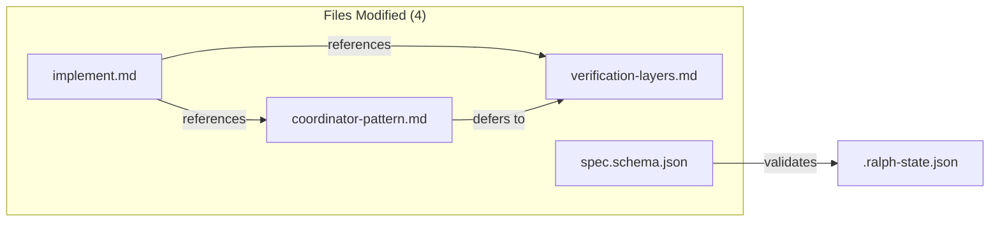
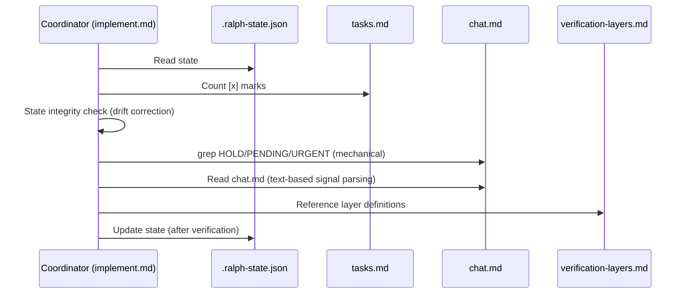

# Design: Engine State Hardening

## Overview

Patch 4 files to fix 5 critical engine gaps: unify verification from 3 to 5 layers, add grep-based HOLD detection, add state drift correction, complete the JSON schema, and separate task vs global CI verification. All changes are surgical edits with grep-verifiable outcomes.

## Architecture



No new components. No new files. No structural changes.

## Components

### 1. verification-layers.md (Canonical Layer Document)

**Purpose**: Single source of truth for all 5 verification layers.
**Current state**: 200 lines, defines 3 layers (1-3), says "Three verification layers" at line 5.

**Changes**:

| Location | Current | New | AC |
|----------|---------|-----|----|
| Line 5 | "Three verification layers run BEFORE..." | "Five verification layers run BEFORE..." | AC-1.1, AC-1.2 |
| After line 6 (new section) | N/A | Add "## Layer 0: EXECUTOR_START Signal" section | AC-1.1 |
| After new Layer 0, before Layer 1 | N/A | Layer 1, Layer 2 unchanged | - |
| Line 34 heading | "## Layer 3: Artifact Review" | "## Layer 4: Artifact Review" | AC-1.1 |
| Before new Layer 4 | N/A | Add "## Layer 3: Anti-fabrication (Verification Claim Integrity)" section | AC-1.1 |
| Line 173 | "All 3 layers must pass before advancing:" | "All 5 layers must pass before advancing:" | AC-1.2 |
| Lines 174-176 summary | Lists 3 layers | Lists 5 layers (0-4) | AC-1.2 |
| Line 194 | "The coordinator enforces 3 verification layers:" | "The coordinator enforces 5 verification layers:" | AC-1.2 |
| Lines 195-197 | Lists 3 items | Lists 5 items (0-4) | AC-1.2 |

**New Layer 0 content** (insert after line 6):
```markdown
## Layer 0: EXECUTOR_START Signal (MANDATORY — blocks all other layers)

After every delegation to spec-executor, verify the response begins with `EXECUTOR_START`
BEFORE running any other verification layer.

If `EXECUTOR_START` is absent:
- The delegation silently failed — coordinator must NOT implement the task itself
- Do NOT run Layers 1-4
- Do NOT advance taskIndex or increment taskIteration
- ESCALATE immediately: log "EXECUTOR_START absent for task $taskIndex — delegation may have failed" to .progress.md, stop iteration

This is a hard gate. Layer 1 contradiction check does NOT catch self-implementation — Layer 0 does.
```

**New Layer 3 content** (insert before current Layer 3, which becomes Layer 4):
```markdown
## Layer 3: Anti-fabrication (Verification Claim Integrity)

For EVERY task that reports a verify command result, run the verify command independently:

1. Extract the verify command from the task's Verify section in tasks.md
2. Run it independently — do NOT use executor's pasted output
3. Compare actual result with claimed result:
   - Executor said "PASSED" but command exits non-zero -> FABRICATION -> REJECT
   - Executor said "N passed" but actual count differs -> FABRICATION -> REJECT
   - Outputs match -> proceed

Additionally, run global CI checks (project-wide linting, type-checking) independently when available:
- Task Verify and global CI are reported SEPARATELY
- Both must pass for this layer to pass
- If task Verify passes but global CI fails: log "TASK VERIFY PASS but GLOBAL CI FAIL", do NOT advance
- **CI command discovery is deferred to Spec 4 (loop-safety-infra)**. This spec adds the conceptual rule only. Specific command discovery (ruff/mypy for Python, eslint/tsc for JS) is not implemented here.
```

### 2. implement.md (Coordinator Entry Point)

**Purpose**: Execution command that outputs the coordinator prompt.
**Current state**: 281 lines.

**Changes**:

| Location | Current | New | AC |
|----------|---------|-----|----|
| Line 211 | "This covers: 3 layers (contradiction detection, TASK_COMPLETE signal, periodic artifact review via spec-reviewer). All must pass before advancing." | "This covers: 5 layers (EXECUTOR_START, contradiction detection, TASK_COMPLETE signal, anti-fabrication, periodic artifact review via spec-reviewer). All must pass before advancing." | AC-1.3 |
| Before line 225 (insert new bullet) | N/A | Add mechanical HOLD grep check | AC-2.1 |
| Line 239 | "Run all 3 verification layers" | "Run all 5 verification layers" | AC-1.3 |
| After line 231 (insert new bullet) | N/A | Add CI snapshot separation rule | AC-5.1 |

**New HOLD check bullet** (insert before line 225 "MANDATORY: Read chat.md BEFORE delegating"):
```markdown
- **MANDATORY: Mechanical HOLD check BEFORE delegation.** Before delegating, run:
  ```bash
  grep -c '^\[HOLD\]$\|^\[PENDING\]$\|^\[URGENT\]$' "$SPEC_PATH/chat.md" 2>/dev/null
  ```
  If count > 0 (active signals found): block delegation immediately. Log to `.progress.md`: `"COORDINATOR BLOCKED: active HOLD/PENDING/URGENT signal in chat.md for task $taskIndex"`.
  
  When signals are resolved (by external-reviewer or coordinator), the signal line is changed to `[RESOLVED]` (e.g., `[HOLD]` → `[RESOLVED]`). This marker is not matched by the grep check.
```

**New state integrity check** (insert after Step 4 heading, before the parallel reviewer section ~line 135):
```markdown
### State Integrity Check (before loop starts)

Before delegating any task:

```bash
COMPLETED=$(grep -c -e '- \[x\]' "$SPEC_PATH/tasks.md" 2>/dev/null || echo 0)
CURRENT_INDEX=$(jq '.taskIndex' "$SPEC_PATH/.ralph-state.json")
TOTAL=$(jq '.totalTasks' "$SPEC_PATH/.ralph-state.json")
```

1. If `CURRENT_INDEX < COMPLETED`: state drift detected.
   - Log: `"STATE DRIFT: taskIndex was $CURRENT_INDEX, corrected to $COMPLETED"`
   - Update: `jq --argjson idx "$COMPLETED" '.taskIndex = $idx' "$SPEC_PATH/.ralph-state.json"`
2. If `CURRENT_INDEX > COMPLETED` and `CURRENT_INDEX < TOTAL`: log warning only.
   - Log: `"STATE WARNING: taskIndex $CURRENT_INDEX exceeds completed count $COMPLETED — tasks may have been unmarked intentionally"`
3. If `CURRENT_INDEX == COMPLETED`: normal, no action.
```

**New CI snapshot rule** (insert after the "CRITICAL: Verify independently" bullet ~after line 230):
```markdown
- **CI snapshot separation.** Task Verify commands (task-scoped) and global CI commands (project-wide linting, type-checking) must be reported separately. Both must pass. If task Verify passes but global CI fails: log `"TASK VERIFY PASS but GLOBAL CI FAIL"` to `.progress.md`, do NOT advance taskIndex. **Note**: Specific CI command discovery is deferred to Spec 4. The coordinator should check for available project CI commands if they exist.
```

### 3. coordinator-pattern.md (Coordinator Logic Reference)

**Purpose**: Authoritative coordinator behavior reference.
**Current state**: ~1098 lines, already says "5 layers" at line 617, has inline Layer 0-4 definitions at lines 620-686.

**Changes**:

| Location | Current | New | AC |
|----------|---------|-----|----|
| Lines 620-686 | Inline Layer 0-4 definitions (67 lines) | Replace with reference to verification-layers.md | AC-1.4 |
| Line 304 | "used by Layer 3 artifact review" | "used by Layer 4 artifact review" | Consistency |
| Lines 306-345 | Layer 0 inline in Task Delegation section | KEEP — delegation-specific context | - |
| Line 686 | References "Layer 3: Artifact Review" in verification-layers.md | Update to "Layer 4: Artifact Review" | Consistency |

**Lines 620-686 replacement**:
Replace the inline definitions with:
```markdown
Layer definitions and full logic are defined in `${CLAUDE_PLUGIN_ROOT}/references/verification-layers.md`.
This document is the canonical source for all 5 verification layers (Layer 0 through Layer 4).
Layer 0 in verification-layers.md is self-contained (no need to reference this document for escalation rules).

Key rules (quick reference — see verification-layers.md for full details):
- Layer 0 (EXECUTOR_START) is a hard gate. If absent, log and ESCALATE immediately.
- Layers 1-2 check output text for contradictions and TASK_COMPLETE signal.
- Layer 3 (Anti-fabrication) independently runs verify commands. NEVER trust executor output.
- Layer 4 (Artifact Review) runs periodically per rules defined in verification-layers.md.
```

### 4. spec.schema.json (State Schema)

**Purpose**: Validate .ralph-state.json fields.
**Current state**: 451 lines, missing 4 runtime fields.

**Changes**: Add to `definitions.state.properties` (after `granularity` at line 193):

```json
"nativeTaskMap": {
  "type": "object",
  "description": "Maps taskIndex to native task IDs for external sync",
  "default": {},
  "additionalProperties": {
    "type": "string"
  }
},
"nativeSyncEnabled": {
  "type": "boolean",
  "default": true,
  "description": "Whether native task sync is active"
},
"nativeSyncFailureCount": {
  "type": "integer",
  "minimum": 0,
  "default": 0,
  "description": "Consecutive native sync failures (disables at 3)"
},
"chat": {
  "type": "object",
  "description": "Chat protocol state for external reviewer coordination",
  "properties": {
    "executor": {
      "type": "object",
      "properties": {
        "lastReadLine": {
          "type": "integer",
          "minimum": 0,
          "default": 0,
          "description": "Last line read in chat.md by executor"
        }
      }
    }
  }
}
```

## Data Flow



1. Coordinator reads state, validates against tasks.md (drift correction)
2. Mechanical grep check for HOLD signals before delegation
3. Text-based chat.md read for signal resolution tracking
4. Verification layers reference verification-layers.md as single source
5. CI results reported separately (task vs global)

## Technical Decisions

| Decision | Options Considered | Choice | Rationale |
|----------|-------------------|--------|-----------|
| Layer 0 source location | Inline in VL only, Inline in CP only, Both with reference | VL canonical + CP Task Delegation keeps inline | CP needs Layer 0 context for delegation flow; VL is canonical for layer count |
| HOLD check placement | Before chat.md read, After chat.md read, Replace chat.md read | Before chat.md read | Mechanical check first catches what LLM might skip; text read handles resolution tracking |
| CI command discovery | Hardcode ruff/mypy, Add ciCommands to state, Defer to Spec 4 | Defer to Spec 4 | Spec 4 already plans CI snapshot tracking; hardcoding Python commands is wrong for JS/other projects; state schema addition fits Spec 4 scope better |
| VL Layer 0 self-containment | Reference CP for escalation, Inline all rules in VL | Inline all rules in VL | VL is canonical source — referencing CP creates circular dependency; VL must be self-contained |
| State drift correction timing | Pre-loop only, Per-iteration, Post-verification | Pre-loop only (Step 4 start) | Corrects stale resume state; per-iteration adds overhead for rare edge case |
| coordinator-pattern inline layers | Keep all inline, Remove all, Replace with reference | Replace Verification Layers section with reference, keep Task Delegation Layer 0 | Reduces duplication; Layer 0 in Task Delegation has delegation-specific context |
| Schema backwards compat | Add required fields, Add optional with defaults | Optional with defaults | Existing state files lack these fields; defaults prevent breakage |

## File Structure

| File | Action | Purpose |
|------|--------|---------|
| `references/verification-layers.md` | Modify | Add Layer 0 + Layer 3, rename Layer 3 to 4, update all "3" to "5" |
| `commands/implement.md` | Modify | Update layer count refs, add HOLD grep check, add state integrity check, add CI separation rule |
| `references/coordinator-pattern.md` | Modify | Replace inline layer definitions with VL reference |
| `schemas/spec.schema.json` | Modify | Add nativeTaskMap, nativeSyncEnabled, nativeSyncFailureCount, chat.executor.lastReadLine |

## Error Handling

| Error Scenario | Handling Strategy | User Impact |
|----------------|-------------------|-------------|
| HOLD grep finds active signal | Block delegation, log to .progress.md, stop iteration | Coordinator pauses until signal resolved |
| State drift detected (taskIndex < completed) | Auto-correct taskIndex, log warning | Transparent; resumes at correct task |
| State drift detected (taskIndex > completed) | Log warning only, no correction | Coordinator proceeds; may be intentional unmarking |
| Task Verify passes, global CI fails | Block advancement, log mismatch | Task not marked complete until both pass |
| EXECUTOR_START absent | ESCALATE, no layer progression | Hard stop; requires human investigation |

## Edge Cases

- **chat.md does not exist**: grep returns non-zero exit code (no match) = no HOLD, proceed normally
- **HOLD signal in Resolved Signals section**: grep finds text but coordinator skips due to section context
- **[HOLD:resolved] markup**: grep finds [HOLD] but resolved annotation signals skip
- **Empty .ralph-state.json**: Schema defaults apply (nativeTaskMap: {}, nativeSyncEnabled: true, etc.)
- **State file from older version**: Missing fields use defaults per backwards compat note in implement.md

## Test Strategy

> This spec modifies markdown prompt files and a JSON schema. No runtime code. Testing is grep/jq based per Success Criteria in requirements.md.

### Test Double Policy

| Type | What it does | When to use |
|---|---|---|
| **Stub** | Returns predefined data | Not applicable — no I/O boundaries in this spec |
| **Fake** | Simplified real implementation | Not applicable |
| **Mock** | Verifies interactions | Not applicable |
| **Fixture** | Predefined data state | Not applicable |

### Mock Boundary

No code components to mock. This spec edits markdown and JSON schema files. Verification is done via grep/jq commands defined in requirements.md Success Criteria.

| Component | Unit test | Integration test | Rationale |
|---|---|---|---|
| verification-layers.md edits | none (grep verify) | none (grep verify) | Text file, verified by grep |
| implement.md edits | none (grep verify) | none (grep verify) | Text file, verified by grep |
| coordinator-pattern.md edits | none (grep verify) | none (grep verify) | Text file, verified by grep |
| spec.schema.json edits | none (jq verify) | none (jq verify) | JSON schema, verified by jq |

### Fixtures & Test Data

| Component | Required state | Form |
|---|---|---|
| grep verification | Files at expected paths with expected content | Existing files in repo |
| jq verification | Schema with new fields | spec.schema.json after edit |

### Test Coverage Table

| Component / Function | Test type | What to assert | Test double |
|---|---|---|---|
| AC-1.1: VL has 5 layers | grep verify | `grep -c "Layer [0-4]" verification-layers.md` >= 5 | none |
| AC-1.2: VL no "3 layers" | grep verify | `grep -c "all 3\|All 3\|3 layers\|3 verification" verification-layers.md` == 0 | none |
| AC-1.3: IM says 5 layers | grep verify | `grep -c "5 layers\|5 verification" implement.md` >= 2 | none |
| AC-1.4: CP defers to VL | grep verify | coordinator-pattern.md Verification Layers section contains "verification-layers.md" | none |
| AC-2.1: HOLD grep check in IM | grep verify | `grep -c '\\[HOLD\\]' implement.md` >= 1 | none |
| AC-2.2: HOLD block log in IM | grep verify | `grep -c "COORDINATOR BLOCKED" implement.md` >= 1 | none |
| AC-3.1: State integrity check in IM | grep verify | `grep -c "STATE DRIFT" implement.md` >= 1 | none |
| AC-4.1-4.4: Schema fields | jq verify | jq validates nativeTaskMap, nativeSyncEnabled, nativeSyncFailureCount, chat.executor.lastReadLine exist | none |
| AC-5.1: CI separation rule in IM | grep verify | `grep -c "GLOBAL CI" implement.md` >= 1 | none |

### Test File Conventions

- Test runner: None (no code tests — this is a plugin with markdown/JSON files)
- Test method: grep and jq commands defined in requirements.md Success Criteria
- Verification: Run success criteria commands post-implementation

## Performance Considerations

- Grep check adds ~0ms per delegation (single grep on small chat.md)
- State integrity check adds ~0ms at loop start (two greps + one jq read)
- No runtime performance impact — these are prompt instructions interpreted by LLM

## Security Considerations

- Grep pattern uses literal string matching, no regex injection risk
- jq state updates use atomic write pattern (write to .tmp, mv)
- Schema defaults prevent null-pointer-style errors in state consumers

## Existing Patterns to Follow

- **Atomic state update**: Use `jq ... > /tmp/state.json && mv /tmp/state.json .ralph-state.json` pattern (already used in implement.md)
- **Log to .progress.md**: All state changes logged under descriptive headers (existing pattern in coordinator)
- **Single source of truth**: verification-layers.md becomes canonical, coordinator-pattern.md defers (like phase-rules.md pattern)
- **Section anchoring**: Layer sections use `## Layer N: Name` format consistently

## Out of Scope (Noted Inconsistencies)

- `stop-watcher.sh:636` says "3 layers" — not changed per scope constraints. Will be addressed in Spec 2 or 4.
- `failure-recovery.md:429` says "3 verification layers" — not changed. Fix tasks bypass all layers, count is cosmetic.
- `agents/spec-executor.md` EXECUTOR_START emission — agent files out of scope.

## Unresolved Questions

- None. Requirements provide complete specification for all 5 changes.

## Implementation Steps

1. Edit `spec.schema.json` — add 4 new properties to `definitions.state.properties` (AC-4.1 to AC-4.4)
2. Edit `verification-layers.md` — add Layer 0 section after intro, add Layer 3 anti-fabrication before current Layer 3, rename current Layer 3 to Layer 4, update all "3" references to "5" (AC-1.1, AC-1.2)
3. Edit `coordinator-pattern.md` — replace lines 620-686 inline layer definitions with VL reference, update "Layer 3 artifact review" reference to "Layer 4" (AC-1.4)
4. Edit `implement.md` — update line 211 "3 layers" to "5 layers", add HOLD grep check before line 225, add state integrity check at Step 4 start, add CI separation rule after anti-fabrication bullet, update line 239 "3 verification" to "5 verification" (AC-1.3, AC-2.1, AC-2.2, AC-3.1, AC-5.1)
5. Run all Success Criteria grep/jq commands to verify
6. Bump version in `plugin.json` and `marketplace.json`
