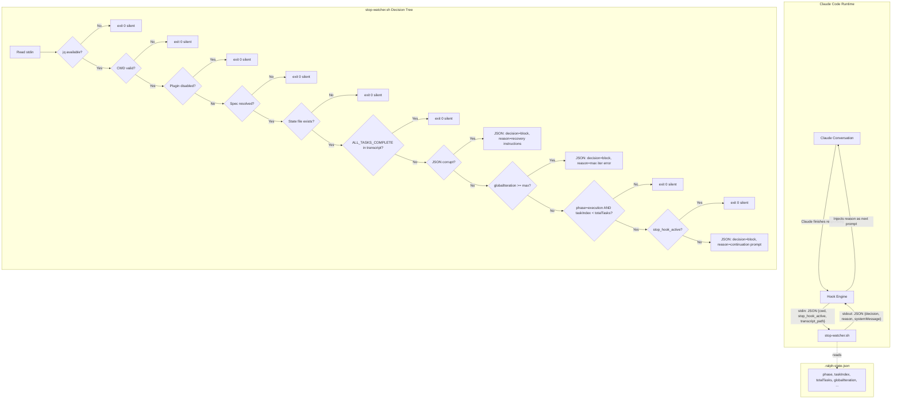
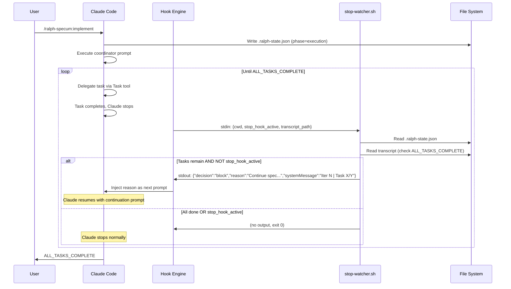

# Design: Fix Stop Hook JSON Output Format

## Overview

Change stop-watcher.sh lines 90-97 and 144-161 from plain text `cat <<EOF` output to JSON `{"decision":"block","reason":"...","systemMessage":"..."}` via `jq -n`. Add `stop_hook_active` guard from hook input. Update all bats tests to assert JSON. Remove ralph-wiggum from settings, bump version.

## Architecture



## Data Flow



## Components

### Component 1: JSON Output for Continuation (Lines 144-161)

**Purpose**: Replace `cat <<EOF` with `jq -n` JSON block decision

**Current** (broken):
```bash
cat <<EOF
Continue spec: $SPEC_NAME (Task $((TASK_INDEX + 1))/$TOTAL_TASKS, Iter $GLOBAL_ITERATION)
## State
Path: $SPEC_PATH | Index: $TASK_INDEX | ...
## Resume
1. Read $SPEC_PATH/.ralph-state.json and $SPEC_PATH/tasks.md
...
EOF
```

**New**:
```bash
REASON=$(cat <<EOF
Continue spec: $SPEC_NAME (Task $((TASK_INDEX + 1))/$TOTAL_TASKS, Iter $GLOBAL_ITERATION)

## State
Path: $SPEC_PATH | Index: $TASK_INDEX | Iteration: $TASK_ITERATION/$MAX_TASK_ITER | Recovery: $RECOVERY_MODE

## Resume
1. Read $SPEC_PATH/.ralph-state.json and $SPEC_PATH/tasks.md
2. Delegate task $TASK_INDEX to spec-executor (or qa-engineer for [VERIFY])
3. On TASK_COMPLETE: verify, update state, advance
4. If taskIndex >= totalTasks: delete state file, output ALL_TASKS_COMPLETE

## Critical
- Delegate via Task tool - do NOT implement yourself
- Verify all 4 layers before advancing (see implement.md Section 7)
- On failure: increment taskIteration, retry or generate fix task if recoveryMode
EOF
)

SYSTEM_MSG="Ralph-specum iteration $GLOBAL_ITERATION | Task $((TASK_INDEX + 1))/$TOTAL_TASKS"

jq -n \
  --arg reason "$REASON" \
  --arg msg "$SYSTEM_MSG" \
  '{
    "decision": "block",
    "reason": $reason,
    "systemMessage": $msg
  }'
```

### Component 2: JSON Output for Corrupt State Error (Lines 90-97)

**Purpose**: Replace plain text error with JSON block decision so Claude receives recovery instructions

**Current**:
```bash
cat <<EOF
ERROR: Corrupt state file at $SPEC_PATH/.ralph-state.json

Recovery options:
1. Reset state: /ralph-specum:implement (reinitializes from tasks.md)
2. Cancel spec: /ralph-specum:cancel
EOF
```

**New**:
```bash
REASON=$(cat <<EOF
ERROR: Corrupt state file at $SPEC_PATH/.ralph-state.json

Recovery options:
1. Reset state: /ralph-specum:implement (reinitializes from tasks.md)
2. Cancel spec: /ralph-specum:cancel
EOF
)

jq -n \
  --arg reason "$REASON" \
  --arg msg "Ralph-specum: corrupt state file" \
  '{
    "decision": "block",
    "reason": $reason,
    "systemMessage": $msg
  }'
```

### Component 3: JSON Output for Max Iterations Error (Lines 112-122)

**Purpose**: Replace plain text max-iterations error with JSON block decision

**Current**:
```bash
cat <<EOF
ERROR: Maximum global iterations ($MAX_GLOBAL) reached.

This safety limit prevents infinite execution loops.

Recovery options:
1. Review .progress.md for failure patterns
2. Fix issues manually, then run: /ralph-specum:implement
3. Cancel and restart: /ralph-specum:cancel
EOF
```

**New**:
```bash
REASON=$(cat <<EOF
ERROR: Maximum global iterations ($MAX_GLOBAL) reached.

This safety limit prevents infinite execution loops.

Recovery options:
1. Review .progress.md for failure patterns
2. Fix issues manually, then run: /ralph-specum:implement
3. Cancel and restart: /ralph-specum:cancel
EOF
)

jq -n \
  --arg reason "$REASON" \
  --arg msg "Ralph-specum: max iterations ($MAX_GLOBAL) reached" \
  '{
    "decision": "block",
    "reason": $reason,
    "systemMessage": $msg
  }'
```

### Component 4: `stop_hook_active` Guard

**Purpose**: Prevent infinite rapid re-invocation when Claude is already continuing from a previous stop hook block

**Location**: After the `phase=execution && taskIndex < totalTasks` check (line 131), before constructing the continuation prompt

**Implementation**:
```bash
# Guard: skip if already in stop-hook continuation to prevent infinite loop
STOP_HOOK_ACTIVE=$(echo "$INPUT" | jq -r '.stop_hook_active // false' 2>/dev/null || echo "false")
if [ "$STOP_HOOK_ACTIVE" = "true" ]; then
    echo "[ralph-specum] stop_hook_active=true, skipping continuation to prevent re-invocation loop" >&2
    exit 0
fi
```

**Placement rationale**: This check goes inside the `if [ "$PHASE" = "execution" ] && [ "$TASK_INDEX" -lt "$TOTAL_TASKS" ]` block, before the JSON output. This means:
- Silent exits (no state file, wrong phase, tasks complete) are unaffected
- Error outputs (corrupt state, max iterations) still fire regardless of `stop_hook_active` (they need Claude to receive recovery instructions)
- Only the continuation prompt is guarded

### Component 5: Test Helper `assert_json_block`

**Purpose**: Parse JSON output and validate `decision`, `reason`, `systemMessage` fields

**Location**: `tests/helpers/setup.bash`

```bash
# Assert output is valid JSON with decision="block"
# Usage: assert_json_block
assert_json_block() {
    # Must be valid JSON
    if ! echo "$output" | jq empty 2>/dev/null; then
        echo "Expected valid JSON output"
        echo "Actual output: $output"
        return 1
    fi

    # Must have decision="block"
    local decision
    decision=$(echo "$output" | jq -r '.decision')
    if [ "$decision" != "block" ]; then
        echo "Expected decision='block', got: $decision"
        echo "Full output: $output"
        return 1
    fi
}

# Assert JSON reason field contains expected text
# Usage: assert_json_reason_contains "expected text"
assert_json_reason_contains() {
    local expected="$1"
    local reason
    reason=$(echo "$output" | jq -r '.reason // empty')
    if [[ "$reason" != *"$expected"* ]]; then
        echo "Expected JSON reason to contain: $expected"
        echo "Actual reason: $reason"
        return 1
    fi
}

# Assert JSON systemMessage field contains expected text
# Usage: assert_json_system_message_contains "expected text"
assert_json_system_message_contains() {
    local expected="$1"
    local msg
    msg=$(echo "$output" | jq -r '.systemMessage // empty')
    if [[ "$msg" != *"$expected"* ]]; then
        echo "Expected JSON systemMessage to contain: $expected"
        echo "Actual systemMessage: $msg"
        return 1
    fi
}
```

### Component 6: Test Hook Input with `stop_hook_active` Control

**Purpose**: Existing `create_hook_input()` hardcodes `stop_hook_active: true`. Need variant with `false` for continuation tests.

**Change**: Parameterize `create_hook_input()` to accept optional `stop_hook_active` value.

**Current** (line 64-74 of setup.bash):
```bash
create_hook_input() {
    local cwd="${1:-$TEST_WORKSPACE}"
    cat <<EOF
{
  "cwd": "$cwd",
  "stop_hook_active": true,
  "session_id": "test-session"
}
EOF
}
```

**New**:
```bash
create_hook_input() {
    local cwd="${1:-$TEST_WORKSPACE}"
    local stop_hook_active="${2:-false}"
    cat <<EOF
{
  "cwd": "$cwd",
  "stop_hook_active": $stop_hook_active,
  "session_id": "test-session"
}
EOF
}
```

**Breaking change**: Default switches from `true` to `false`. This is intentional -- in real Claude Code usage, `stop_hook_active` is `false` on the first stop and `true` on subsequent stops. Tests for continuation should use `false` (simulating first stop). A new test for the guard validates `true` behavior.

**Impact on `run_stop_watcher()`**: Currently calls `create_hook_input` with no args, getting `true`. After change, gets `false`. This means continuation tests will now correctly produce JSON output (previously they worked by accident since the script didn't check this field).

**Impact on `create_hook_input_with_transcript()`**: Also needs the parameter:

```bash
create_hook_input_with_transcript() {
    local transcript_path="${1:-}"
    local cwd="${2:-$TEST_WORKSPACE}"
    local stop_hook_active="${3:-false}"
    cat <<EOF
{
  "cwd": "$cwd",
  "stop_hook_active": $stop_hook_active,
  "session_id": "test-session",
  "transcript_path": "$transcript_path"
}
EOF
}
```

## Technical Decisions

| Decision | Options Considered | Choice | Rationale |
|----------|-------------------|--------|-----------|
| `stop_hook_active` guard location | A) Before all output (blocks errors too) B) Only before continuation prompt C) No guard | B) Only before continuation | Errors (corrupt state, max iter) should always reach Claude for recovery. Only continuation risks infinite loops. |
| `stop_hook_active` default in tests | A) Keep `true` B) Change to `false` | B) `false` | Real first-stop has `false`. Tests should simulate realistic behavior. Guard test explicitly passes `true`. |
| `reason` field content | A) Full implement.md prompt B) Current abbreviated prompt C) Minimal one-liner | B) Abbreviated (current content) | Matches existing design note about token efficiency. Full prompt is in implement.md (source of truth). |
| Error output format | A) Keep plain text for errors B) JSON for all output | B) JSON for all | Consistent format. Claude receives recovery instructions via `reason` field instead of silent failure. |
| Version bump | A) 3.1.2 (patch) B) 3.2.0 (minor) | B) 3.2.0 | New feature (working loop) -- not a bugfix. Changes observable behavior. |
| `systemMessage` content | A) Same as reason B) Short status line C) Omit | B) Short status | User sees this in UI. Keep it concise: iteration count + task progress. |
| Heredoc for reason | A) Inline `jq --arg` B) Capture in variable first | B) Variable capture | Multi-line `reason` content with special chars. Capture in `$REASON` variable via heredoc, then pass to `jq --arg`. Avoids escaping issues. |

## File Structure

| File | Action | Purpose |
|------|--------|---------|
| `plugins/ralph-specum/hooks/scripts/stop-watcher.sh` | Modify | Change 3 output blocks to JSON, add `stop_hook_active` guard |
| `tests/helpers/setup.bash` | Modify | Add JSON assertion helpers, parameterize `stop_hook_active` in hook input helpers |
| `tests/stop-hook.bats` | Modify | Update assertions from plain text to JSON format |
| `tests/integration.bats` | Modify | Update assertions from plain text to JSON format |
| `tests/state-management.bats` | Modify | Update assertions that check for "Continue" text to use JSON helpers |
| `.claude/settings.json` | Modify | Remove `ralph-wiggum@claude-plugins-official` entry |
| `plugins/ralph-specum/.claude-plugin/plugin.json` | Modify | Bump version 3.1.1 -> 3.2.0 |
| `.claude-plugin/marketplace.json` | Modify | Bump version 3.1.1 -> 3.2.0 |

## Error Handling

| Error Scenario | Handling Strategy | User Impact |
|----------------|-------------------|-------------|
| Corrupt state file | JSON `decision: "block"` with recovery instructions in `reason` | Claude outputs recovery options; user sees "corrupt state file" in systemMessage |
| Max iterations exceeded | JSON `decision: "block"` with error + recovery in `reason` | Claude outputs recovery options; user sees "max iterations" in systemMessage |
| Missing jq | Silent exit 0 (unchanged) | No loop continuation; Claude stops. User must install jq. |
| Empty/invalid hook input | Silent exit 0 (unchanged) | No loop continuation; Claude stops normally |
| `stop_hook_active=true` | Silent exit 0 with stderr log | Prevents infinite rapid re-invocation. Claude stops. Next natural stop (stop_hook_active=false) will re-trigger. |
| ALL_TASKS_COMPLETE in transcript | Silent exit 0 (unchanged) | Loop terminates as expected |
| Plugin disabled | Silent exit 0 (unchanged) | No loop, Claude stops normally |

## Edge Cases

- **`stop_hook_active=true` + corrupt state**: Error JSON still output (guard is only on continuation path). Claude receives recovery instructions.
- **`stop_hook_active=true` + max iterations**: Error JSON still output (guard is only on continuation path). Claude receives recovery instructions.
- **Reason field with special JSON chars**: Handled by `jq --arg` which auto-escapes. No manual escaping needed.
- **Very long reason field**: `jq --arg` handles arbitrary length strings. No truncation needed.
- **Race condition on state file write**: Existing 2-second wait preserved. No change needed.
- **Quick mode**: User noted quick mode caveat. The `stop_hook_active` guard may need to be skipped in quick mode. For now, defer this -- quick mode is not in scope.

## Test Strategy

### Test Changes Summary

All tests that assert `assert_output_contains "Continue spec"` need updating to:
1. `assert_json_block` (valid JSON with `decision: "block"`)
2. `assert_json_reason_contains "Continue spec: test-spec"` (reason has continuation prompt)

All tests that assert `assert_output_contains "ERROR:"` need updating to:
1. `assert_json_block` (valid JSON with `decision: "block"`)
2. `assert_json_reason_contains "ERROR:"` (reason has error text)

All tests that assert `assert_output_not_contains "Continue spec"` need updating to:
1. Stay as `[ -z "$output" ]` for silent exits (no JSON at all)
2. OR `assert_output_not_contains "decision"` for cases that should produce no JSON

### stop-hook.bats Changes

| Test | Current Assertion | New Assertion |
|------|-------------------|---------------|
| "outputs continuation prompt when tasks remain (taskIndex=0)" | `assert_output_contains "Continue spec: test-spec"` | `assert_json_block` + `assert_json_reason_contains "Continue spec: test-spec"` + `assert_json_reason_contains ".ralph-state.json"` + `assert_json_reason_contains "spec-executor"` + `assert_json_reason_contains "ALL_TASKS_COMPLETE"` |
| "outputs continuation prompt when tasks remain (midway)" | `assert_output_contains "Continue spec: test-spec"` | `assert_json_block` + `assert_json_reason_contains "Continue spec: test-spec"` |
| "outputs continuation prompt when one task remains" | `assert_output_contains "Continue spec: test-spec"` | `assert_json_block` + `assert_json_reason_contains "Continue spec: test-spec"` |
| "outputs error message for corrupt JSON" | `assert_output_contains "ERROR: Corrupt state file"` | `assert_json_block` + `assert_json_reason_contains "ERROR: Corrupt state file"` + `assert_json_reason_contains "Recovery options"` |
| "handles corrupt JSON gracefully" | `assert_output_not_contains "Continue spec"` | `assert_json_reason_contains "ERROR: Corrupt"` (reason has error, not continuation) |
| "continues normally when plugin is enabled" | `assert_output_contains "Continue spec: test-spec"` | `assert_json_block` + `assert_json_reason_contains "Continue spec: test-spec"` |

### New Tests Required

| Test | Purpose |
|------|---------|
| "exits silently when stop_hook_active is true" | Pass `stop_hook_active: true` in input, verify no output |
| "outputs JSON when stop_hook_active is false" | Pass `stop_hook_active: false` in input, verify JSON block |
| "JSON output has systemMessage field" | Verify `systemMessage` present in continuation JSON |
| "JSON output has all three fields" | Verify `decision`, `reason`, `systemMessage` all present |
| "max iterations error is JSON format" | Verify max iter error outputs JSON not plain text |

### integration.bats Changes

All `assert_output_contains "Continue spec"` become `assert_json_block` + `assert_json_reason_contains "Continue spec"`.

Content assertions (`assert_output_contains ".ralph-state.json"`, `"tasks.md"`, `"spec-executor"`, `"ALL_TASKS_COMPLETE"`) become `assert_json_reason_contains` equivalents.

### state-management.bats Changes

Three tests check stop hook output:
- "stop hook uses taskIndex for continuation check" -> `assert_json_reason_contains "Continue spec"`
- "stop hook silent when taskIndex equals totalTasks" -> unchanged (`assert_output_not_contains`)
- "stop hook reads phase from state file" -> `assert_json_reason_contains "Continue"`
- "stop hook enforces maxGlobalIterations limit" -> `assert_json_block` + `assert_json_reason_contains "Maximum global iterations"`
- "stop hook allows execution when under maxGlobalIterations" -> `assert_json_reason_contains "Continue"`

## Performance Considerations

- `jq -n` adds ~10ms per invocation vs `cat <<EOF`. Negligible vs 2-second race condition sleep.
- Heredoc capture into variable (`REASON=$(cat <<EOF ...)`) is a bash built-in, zero overhead.
- No new file I/O. Existing file reads unchanged.

## Security Considerations

- `jq --arg` properly escapes all user-controlled strings (spec names, paths). No injection risk.
- No new external commands introduced.
- No network calls.

## Existing Patterns to Follow

- Existing `cat <<EOF` pattern for multi-line text (reused for `$REASON` variable)
- Existing `jq -r` pattern for reading state file (same tool, just adding `jq -n` for output)
- Existing `echo "..." >&2` pattern for stderr logging (unchanged)
- Existing guard pattern: early `exit 0` for all non-applicable cases
- Test pattern: `run run_stop_watcher` + assert helpers

## Implementation Steps

1. **Add test helpers** to `tests/helpers/setup.bash`: `assert_json_block`, `assert_json_reason_contains`, `assert_json_system_message_contains`
2. **Parameterize** `create_hook_input()` and `create_hook_input_with_transcript()` with `stop_hook_active` parameter (default `false`)
3. **Update stop-watcher.sh**: Add `stop_hook_active` guard inside the continuation block
4. **Update stop-watcher.sh**: Convert corrupt state error (lines 90-97) to JSON format
5. **Update stop-watcher.sh**: Convert max iterations error (lines 112-122) to JSON format
6. **Update stop-watcher.sh**: Convert continuation prompt (lines 144-161) to JSON format
7. **Update stop-hook.bats**: Change all assertions to use JSON helpers
8. **Add new tests** to stop-hook.bats: `stop_hook_active` guard, JSON field validation
9. **Update integration.bats**: Change all assertions to use JSON helpers
10. **Update state-management.bats**: Change stop-hook-related assertions to JSON helpers
11. **Modify .claude/settings.json**: Remove `ralph-wiggum@claude-plugins-official`
12. **Bump versions**: plugin.json 3.1.1 -> 3.2.0, marketplace.json 3.1.1 -> 3.2.0
13. **Run `bats tests/*.bats`** to verify all tests pass
