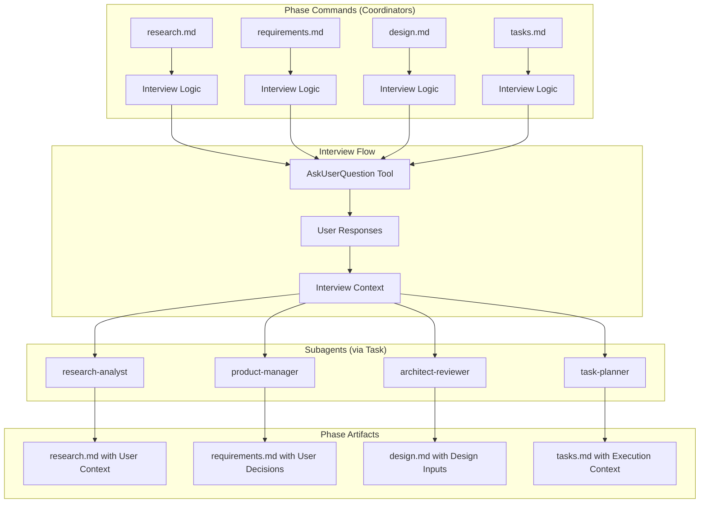
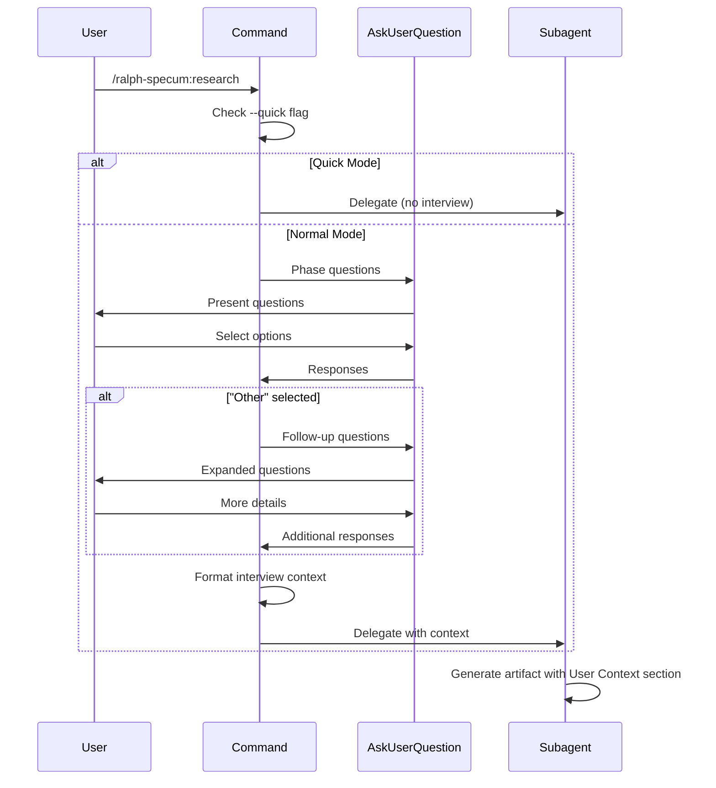

# Design: Goal Interview

## Overview

Add user interview capability to Ralph Specum's 4 phase commands (research, requirements, design, tasks) using the AskUserQuestion tool. Interviews happen at command level before Task delegation since AskUserQuestion is unavailable in subagents. Additionally remove deprecated "tools" field from 5 agent files.

## Architecture



## Components

### Component: Interview Logic (per command)

**Purpose**: Conduct phase-specific user interviews before delegating to subagents

**Responsibilities**:
- Check for --quick flag to skip interviews
- Ask phase-relevant questions using AskUserQuestion
- Handle "Other" selections to trigger follow-up questions
- Collect and format responses for artifact storage
- Pass interview context to subagent delegation

**Interfaces**:

```typescript
// AskUserQuestion Tool Schema (existing)
interface AskUserQuestionInput {
  questions: Array<{
    question: string;
    options: string[];  // 2-4 options
  }>;
  multiSelect?: boolean;  // Allow multiple selections
}

interface AskUserQuestionOutput {
  responses: string[];  // User selections or "Other" text
}

// Interview Context (to pass to subagents)
interface InterviewContext {
  phase: 'research' | 'requirements' | 'design' | 'tasks';
  responses: Array<{
    question: string;
    answer: string;
    isOtherResponse: boolean;
  }>;
  quickMode: boolean;
}
```

### Component: Phase-Specific Question Sets

**Purpose**: Define targeted questions for each phase

**Research Phase Questions**:
1. Technical implementation preferences (framework, patterns)
2. Prior experience with similar systems
3. Known constraints or limitations
4. Success criteria beyond the obvious

**Requirements Phase Questions**:
1. Primary user types and personas
2. Edge cases and error scenarios to consider
3. Priority tradeoffs (speed vs quality vs scope)
4. Non-functional requirements (performance, security, accessibility)

**Design Phase Questions**:
1. Architecture preferences (monolith, microservices, modular)
2. Technology constraints (must use, cannot use)
3. Integration requirements with existing systems
4. UI/UX preferences if applicable

**Tasks Phase Questions**:
1. Testing requirements and depth
2. Deployment considerations
3. Quality gate thresholds
4. Timeline/milestone preferences

### Component: Agent File Cleanup

**Purpose**: Remove deprecated "tools" field from agent frontmatter

**Files to Modify**:
| File | Line to Remove |
|------|----------------|
| agents/research-analyst.md | Line 5: `tools: [Read, Write, Edit, Glob, Grep, WebFetch, WebSearch, Task]` |
| agents/product-manager.md | Line 5: `tools: [Read, Write, Edit, Glob, Grep, WebSearch, Task]` |
| agents/architect-reviewer.md | Line 5: `tools: [Read, Write, Edit, Bash, Glob, Grep, Task]` |
| agents/task-planner.md | Line 5: `tools: [Read, Write, Edit, Glob, Grep, Task]` |
| agents/plan-synthesizer.md | Line 6: `tools: [Read, Write, Edit, Glob, Grep, Task]` |

## Data Flow



1. User invokes phase command (e.g., /ralph-specum:research)
2. Command checks for --quick flag in $ARGUMENTS
3. If --quick, skip to subagent delegation
4. Otherwise, invoke AskUserQuestion with phase-specific questions
5. User selects from options or provides "Other" text
6. If "Other" detected, expand with follow-up questions
7. Format responses into interview context
8. Delegate to subagent via Task tool, including interview context in prompt
9. Subagent generates artifact with dedicated section for interview responses

## Technical Decisions

| Decision | Options Considered | Choice | Rationale |
|----------|-------------------|--------|-----------|
| Question location | Separate template file, Inline in commands | Inline in commands | User preference from interview. Reduces file count, keeps questions near their usage |
| Interview depth trigger | Word count analysis, Explicit "Other" detection, Sentiment analysis | "Other" detection | Simple, deterministic, matches AskUserQuestion design. User selects Other when options insufficient |
| Interview storage | Separate file, State file, Artifact sections | Artifact sections | User preference. Keeps context with generated content. Each phase artifact has dedicated section |
| Quick mode handling | Partial skip, Full skip, Default answers | Full skip | User preference. --quick means no user interaction at all |
| Follow-up limit | Unlimited, Fixed count | 5 rounds max | Prevents interview fatigue, configurable default from requirements |
| Convergence detection | Category coverage, User signal, Round count | Category coverage + max rounds | Practical balance. Stop when all question categories asked or max reached |

## File Structure

| File | Action | Purpose |
|------|--------|---------|
| plugins/ralph-specum/commands/research.md | Modify | Add AskUserQuestion to allowed-tools, add interview logic before Task delegation |
| plugins/ralph-specum/commands/requirements.md | Modify | Add AskUserQuestion to allowed-tools, add interview logic before Task delegation |
| plugins/ralph-specum/commands/design.md | Modify | Add AskUserQuestion to allowed-tools, add interview logic before Task delegation |
| plugins/ralph-specum/commands/tasks.md | Modify | Add AskUserQuestion to allowed-tools, add interview logic before Task delegation |
| plugins/ralph-specum/agents/research-analyst.md | Modify | Remove "tools:" line from frontmatter |
| plugins/ralph-specum/agents/product-manager.md | Modify | Remove "tools:" line from frontmatter |
| plugins/ralph-specum/agents/architect-reviewer.md | Modify | Remove "tools:" line from frontmatter |
| plugins/ralph-specum/agents/task-planner.md | Modify | Remove "tools:" line from frontmatter |
| plugins/ralph-specum/agents/plan-synthesizer.md | Modify | Remove "tools:" line from frontmatter |

## Interview Logic Template

Each command file will follow this structure for interview logic:

```markdown
## Interview (Before Delegation)

<mandatory>
**Skip interview if --quick flag detected in $ARGUMENTS.**

If NOT quick mode, conduct interview using AskUserQuestion before delegating to subagent.
</mandatory>

### Quick Mode Check

Check if `--quick` appears in `$ARGUMENTS`. If present, skip directly to "Execute <Phase>".

### Phase Interview

Use AskUserQuestion to gather context:

[Phase-specific questions defined here - 2-3 initial questions]

### Adaptive Depth

If user selects "Other" for any question:
1. Ask follow-up question to clarify
2. Continue until clarity reached or 5 rounds complete

### Interview Context Format

After interview, format responses as:

```
Interview Responses:
- [Question 1]: [Answer]
- [Question 2]: [Answer]
...
```

Include this context in the Task delegation prompt.
```

## Error Handling

| Error Scenario | Handling Strategy | User Impact |
|----------------|-------------------|-------------|
| AskUserQuestion timeout (60s) | Treat as skip, proceed with defaults | Warning displayed, continues without that response |
| No responses received | Treat as intentional skip | Proceeds with minimal context |
| Invalid option selection | Re-prompt with same question | Transparent retry |
| --quick flag with partial answers | --quick always skips all, ignore partial | Clean behavior |
| Subagent fails after interview | Interview context still logged in .progress.md | User can review what was captured |

## Edge Cases

- **Empty goal**: Interview still asked, may yield generic questions
- **Extremely long "Other" responses**: Accept as-is, truncate in display if needed
- **Multiple --quick flags**: Treat same as single --quick
- **--quick anywhere in arguments**: Detected regardless of position
- **Interrupted interview**: Partial responses lost, user must restart command
- **No AskUserQuestion tool available**: Skip interview, log warning, proceed

## Test Strategy

### Unit Tests

Not applicable. Plugin commands are markdown definitions executed by Claude Code runtime.

### Integration Tests

Manual verification for each command:
1. Invoke command without --quick
2. Verify AskUserQuestion prompts appear
3. Select options and verify context passed to subagent
4. Verify interview responses appear in generated artifact
5. Test "Other" selection triggers follow-up
6. Test --quick flag skips all interview prompts

### E2E Tests

Full workflow validation:
1. `/ralph-specum:new test-interview Test goal`
2. Verify research interview, check research.md has "User Context" section
3. `/ralph-specum:requirements` - verify requirements interview
4. `/ralph-specum:design` - verify design interview
5. `/ralph-specum:tasks` - verify tasks interview
6. Compare with `--quick` mode that skips all

### Agent File Tests

Verify tools field removal:
1. Read each agent file
2. Confirm no "tools:" line in frontmatter
3. Verify agent still functions when invoked via Task

## Performance Considerations

- AskUserQuestion has 60s timeout per call
- Interview adds 1-3 minutes per phase in normal mode
- --quick mode has zero interview overhead
- Max 5 follow-up rounds prevents runaway sessions

## Security Considerations

- User responses stored in spec artifacts only
- No sensitive data collection in default questions
- Interview responses visible in git history (same as other spec content)

## Existing Patterns to Follow

Based on codebase analysis:

1. **AskUserQuestion usage in new.md** (lines 26-31):
   - Simple single question format
   - Used only when required information missing

2. **AskUserQuestion usage in start.md** (lines 48-88):
   - Multi-option format for branch strategy
   - Conditional logic based on context

3. **Quick mode bypass** (start.md lines 127-132):
   - Check flag position in $ARGUMENTS
   - Skip all interactive elements when --quick present

4. **Coordinator pattern** (all phase commands):
   - Commands are coordinators, not implementers
   - ALL substantive work delegated to subagents via Task
   - Commands handle: validation, state, coordination

5. **State management**:
   - .ralph-state.json for phase/task tracking
   - .progress.md for learnings and context
   - Phase artifacts for generated content

## Artifact Section Names

| Phase | Section Name | Contents |
|-------|--------------|----------|
| Research | "User Context" | Interview responses about technical preferences, constraints |
| Requirements | "User Decisions" | Interview responses about priorities, personas, edge cases |
| Design | "Design Inputs" | Interview responses about architecture, technology, integration |
| Tasks | "Execution Context" | Interview responses about testing, deployment, quality |

## Question Format Examples

### Research Phase

```
AskUserQuestion:
  questions:
    - question: "What technical approach do you prefer for this feature?"
      options:
        - "Follow existing patterns in codebase (Recommended)"
        - "Introduce new patterns/frameworks"
        - "Hybrid - keep existing where possible"
        - "Other"
    - question: "Are there any known constraints or limitations?"
      options:
        - "No known constraints"
        - "Must work with existing API"
        - "Performance critical"
        - "Other"
```

### Requirements Phase

```
AskUserQuestion:
  questions:
    - question: "Who are the primary users of this feature?"
      options:
        - "Internal developers only"
        - "End users via UI"
        - "Both developers and end users"
        - "Other"
    - question: "What priority tradeoffs should we consider?"
      options:
        - "Prioritize speed of delivery"
        - "Prioritize code quality and maintainability"
        - "Prioritize feature completeness"
        - "Other"
```

### Design Phase

```
AskUserQuestion:
  questions:
    - question: "What architecture style fits this feature?"
      options:
        - "Extend existing architecture (Recommended)"
        - "Create isolated module"
        - "Major refactor to support this"
        - "Other"
    - question: "Any technology constraints?"
      options:
        - "No constraints"
        - "Must use specific library/framework"
        - "Must avoid certain dependencies"
        - "Other"
```

### Tasks Phase

```
AskUserQuestion:
  questions:
    - question: "What testing depth is needed?"
      options:
        - "Standard - unit + integration (Recommended)"
        - "Minimal - POC only, add tests later"
        - "Comprehensive - include E2E"
        - "Other"
    - question: "Deployment considerations?"
      options:
        - "Standard CI/CD pipeline"
        - "Feature flag needed"
        - "Gradual rollout required"
        - "Other"
```
