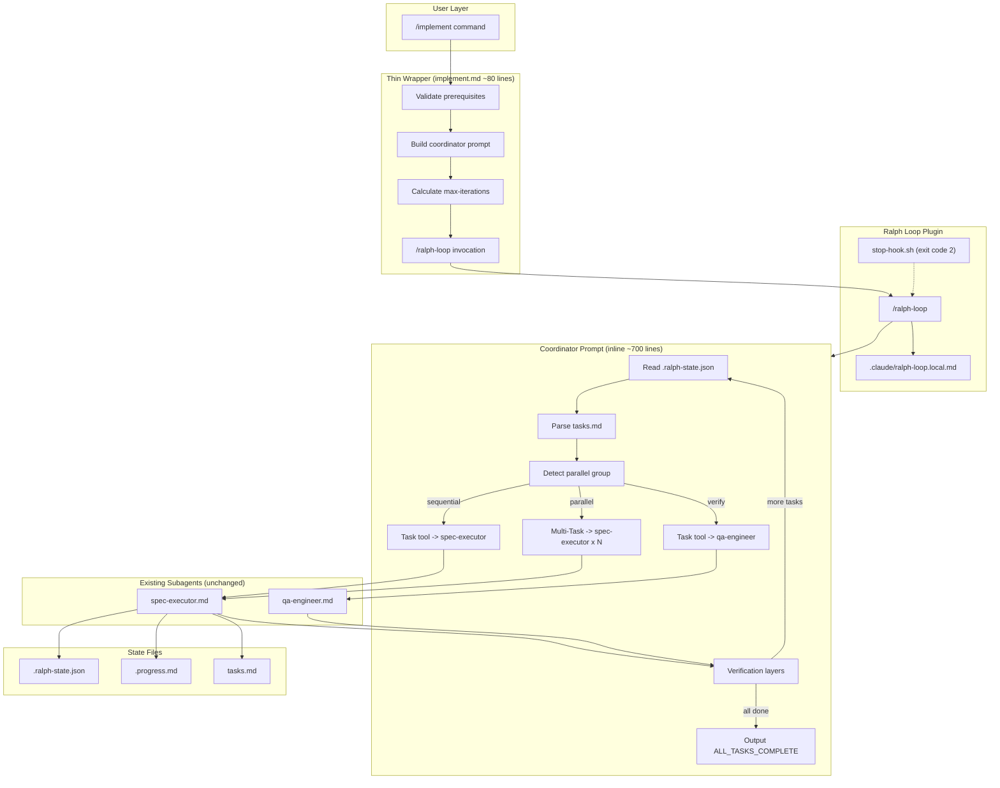
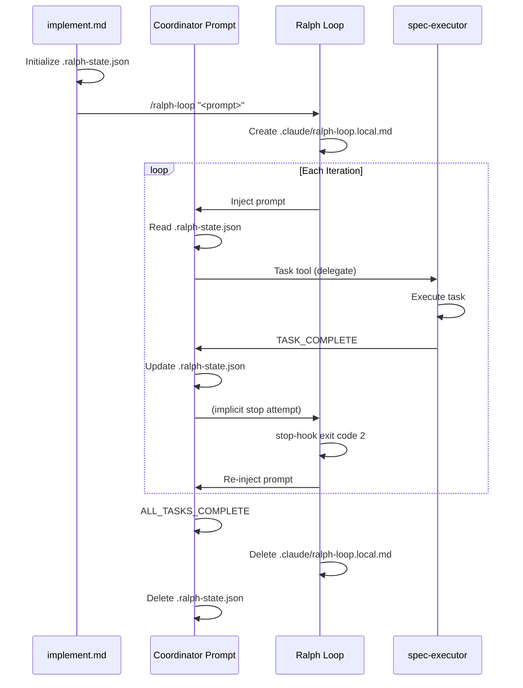
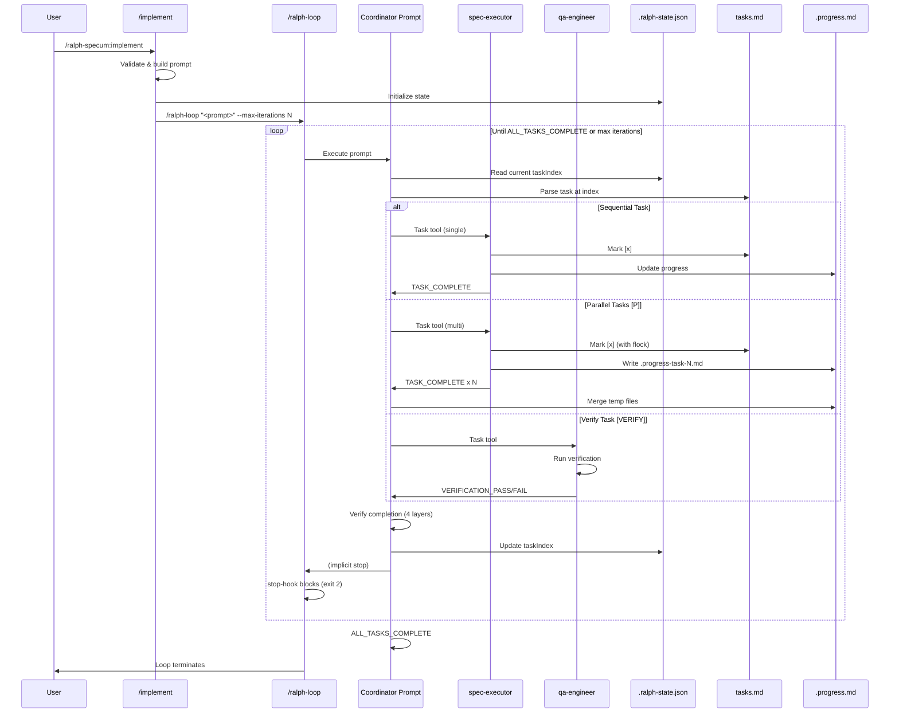

# Design: Ralph Loop Loop Integration

## Overview

Replace the custom stop-handler.sh loop mechanism with the official Ralph Loop plugin's `/ralph-loop` command. The `/implement` command becomes a thin wrapper (~80 lines) that constructs a coordinator prompt and invokes `/ralph-loop`. The coordinator prompt contains all task orchestration logic (task parsing, state management, parallel execution, verification, delegation to spec-executor). This eliminates 274 lines of shell scripting while preserving existing subagent patterns.

## Architecture



## Components

### Component 1: Thin Wrapper (implement.md)

**Purpose**: Validate prerequisites, construct coordinator prompt, invoke Ralph Loop loop

**Responsibilities**:
- Read and validate spec from `.current-spec`
- Check Ralph Loop plugin availability
- Read initial state from `.ralph-state.json`
- Calculate `--max-iterations` from totalTasks * maxTaskIterations
- Construct coordinator prompt with full orchestration logic
- Invoke `/ralph-loop` with prompt, max-iterations, completion-promise

**Interface**:
```
Input: $ARGUMENTS (--max-task-iterations N)
Output: /ralph-loop invocation
Side effects: None (pure invocation)
```

**Structure**:
```markdown
---
description: Start task execution loop
argument-hint: [--max-task-iterations 5]
allowed-tools: [Read, Bash, Skill]
---

# Start Execution (Thin Wrapper)

## Validate Prerequisites
1. Read ./specs/.current-spec
2. Check spec directory exists
3. Check tasks.md exists
4. Check Ralph Loop available (see Component 2)

## Initialize State
1. Read .ralph-state.json or create default
2. Set phase = "execution"
3. Calculate totalTasks from tasks.md
4. Set taskIndex to first incomplete

## Calculate Parameters
- maxIterations = totalTasks * maxTaskIterations * 2 (buffer for retries)
- completionPromise = "ALL_TASKS_COMPLETE"

## Invoke Ralph Loop
Call: /ralph-loop "<coordinator-prompt>" --max-iterations $maxIterations --completion-promise "ALL_TASKS_COMPLETE"

<coordinator-prompt>
[~700 lines of orchestration logic - see Component 3]
</coordinator-prompt>
```

### Component 2: Dependency Check

**Purpose**: Detect if Ralph Loop plugin is installed before attempting invocation

**Responsibilities**:
- Check for `/ralph-loop` command availability
- Provide clear error message with install instructions
- Fail fast before any state changes

**Interface**:
```
Input: None
Output: Boolean (available) or Error message
```

**Detection Strategy**:
```markdown
## Check Ralph Loop Dependency

Before invoking /ralph-loop, verify the Ralph Loop plugin is installed.

### Detection Method

Use Skill tool invocation attempt with error handling:

1. Check if the command `/ralph-loop` exists by attempting a help query:
   - If skill invocation fails with "skill not found" error: plugin not installed
   - If skill invocation succeeds or returns usage info: plugin installed

### Alternative Detection: File-based

Check for plugin files (less reliable but simpler):
```bash
# Check if ralph-wiggum plugin manifest exists in standard locations
ls ~/.claude/plugins/ralph-wiggum/.claude-plugin/plugin.json 2>/dev/null
```

### Error Output on Missing Dependency

If Ralph Loop is not detected:

```
ERROR: Ralph Loop plugin required but not installed.

The /implement command now uses Ralph Loop for its execution loop.
This is a breaking change in version 2.0.0.

Install the dependency:
  /plugin install ralph-wiggum@claude-plugins-official

Then retry:
  /ralph-specum:implement
```

Do NOT proceed with state changes if dependency check fails.
```

### Component 3: Coordinator Prompt (Inline)

**Purpose**: Contains all task orchestration logic executed each Ralph Loop iteration

**Responsibilities**:
- Read current state from `.ralph-state.json`
- Parse `tasks.md` to find current task(s)
- Detect parallel groups ([P] markers)
- Delegate tasks to spec-executor via Task tool
- Delegate [VERIFY] tasks to qa-engineer via Task tool
- Handle parallel execution via multi-Task tool calls
- Update state after task completion
- Verify completion integrity (4 layers)
- Output `ALL_TASKS_COMPLETE` when done

**Interface**:
```
Input: Injected by Ralph Loop each iteration
Output: ALL_TASKS_COMPLETE (terminates loop) or implicit continuation
State: Reads/writes .ralph-state.json
```

**Structure** (inline in implement.md):
```markdown
## Coordinator Prompt Structure

The coordinator prompt is a single large block embedded in implement.md.
It contains these sections in order:

### 1. Role Definition (~20 lines)
- You are a COORDINATOR, not an implementer
- Delegation requirement (MUST use Task tool)
- Fully autonomous definition

### 2. Read State (~30 lines)
- Read ./specs/$spec/.ralph-state.json
- Extract: taskIndex, totalTasks, taskIteration, phase
- Handle missing/corrupt state

### 3. Check Completion (~20 lines)
- If taskIndex >= totalTasks: output ALL_TASKS_COMPLETE
- Validate checkmark count matches totalTasks
- Delete state file and output signal

### 4. Parse Current Task (~50 lines)
- Read tasks.md
- Count total and completed tasks
- Find task at taskIndex
- Detect markers: [P], [VERIFY], [SEQUENTIAL]

### 5. Parallel Group Detection (~40 lines)
- Build parallelGroup structure
- Detect consecutive [P] tasks
- Set isParallel flag

### 6. Task Delegation (~150 lines)
- Sequential: Single Task tool call to spec-executor
- Parallel: Multi-Task tool calls in ONE message
- Verify: Task tool call to qa-engineer
- Include full context in each delegation

### 7. Verification Layers (~100 lines)
- Layer 1: Contradiction detection
- Layer 2: Uncommitted spec files check
- Layer 3: Checkmark verification
- Layer 4: TASK_COMPLETE signal verification

### 8. State Update (~40 lines)
- On success: increment taskIndex
- On parallel batch: set taskIndex = endIndex + 1
- On failure: increment taskIteration
- Clear parallelGroup after batch

### 9. Progress Merge (~60 lines)
- Collect .progress-task-N.md files
- Merge into main .progress.md
- Delete temp files

### 10. Completion Signal (~20 lines)
- Output TASK_COMPLETE for single task
- Output TASK_COMPLETE + BATCH_COMPLETE for parallel batch
- Output ALL_TASKS_COMPLETE when all tasks done
```

### Component 4: State Management

**Purpose**: Track task progress across Ralph Loop iterations

**Responsibilities**:
- Maintain task index and iteration counts
- Track parallel group boundaries
- Store task results for partial failure handling
- Coexist with Ralph Loop's own state file

**Interface**:
```typescript
// .ralph-state.json (our state)
interface RalphSpecumState {
  phase: "execution";
  taskIndex: number;
  totalTasks: number;
  taskIteration: number;
  maxTaskIterations: number;
  basePath: string;
  awaitingApproval: boolean;
  parallelGroup?: {
    startIndex: number;
    endIndex: number;
    taskIndices: number[];
    isParallel: boolean;
  };
  taskResults?: {
    [taskIndex: string]: {
      status: "pending" | "success" | "failed";
      error?: string;
    };
  };
}

// .claude/ralph-loop.local.md (Ralph Loop state - read only)
// YAML frontmatter with: active, iteration, max_iterations, completion_promise, started_at
```

**State File Interactions**:


### Component 5: Cancel Command

**Purpose**: Clean cancellation with dual state cleanup

**Responsibilities**:
- Invoke `/cancel-ralph` to stop Ralph Loop loop
- Delete `.ralph-state.json`
- Preserve `.progress.md` for context
- Report final state before cleanup

**Interface**:
```markdown
---
description: Cancel active execution loop and cleanup state
argument-hint: [spec-name]
allowed-tools: [Read, Bash, Skill]
---

## Updated Cancel Flow

1. Determine target spec (from $ARGUMENTS or .current-spec)
2. Read current state from .ralph-state.json (for reporting)
3. Call /cancel-ralph to stop Ralph Loop loop
4. Delete .ralph-state.json
5. Keep .progress.md
6. Report cancellation status
```

## Data Flow



## Technical Decisions

| Decision | Options Considered | Choice | Rationale |
|----------|-------------------|--------|-----------|
| Prompt location | Separate file vs inline | Inline in implement.md | Simpler deployment, single file to maintain, no template loading complexity |
| Dependency detection | File check vs command check | Command check via Skill tool | More reliable than path guessing, works with any install location |
| State file approach | Replace vs coexist | Coexist | Ralph Loop needs its state, we need task-specific state. Separate concerns. |
| Verification location | Keep in stop-hook vs move to prompt | Move to prompt | No custom stop-hook with Ralph Loop. Coordinator verifies before signaling. |
| Max iterations calc | Fixed vs dynamic | Dynamic (totalTasks * maxTaskIterations * 2) | Accounts for retries without excessive headroom |
| Completion signal | TASK_COMPLETE vs new | ALL_TASKS_COMPLETE | Distinct from per-task signal, clear semantic meaning |

## File Structure

| File | Action | Purpose |
|------|--------|---------|
| plugins/ralph-specum/commands/implement.md | Rewrite | Thin wrapper (~80 lines) + inline coordinator prompt (~700 lines) |
| plugins/ralph-specum/commands/cancel.md | Modify | Add /cancel-ralph invocation, dual cleanup |
| plugins/ralph-specum/hooks/scripts/stop-handler.sh | Delete | No longer needed (Ralph Loop provides loop) |
| plugins/ralph-specum/hooks/hooks.json | Delete | No custom hooks registered |
| plugins/ralph-specum/.claude-plugin/plugin.json | Modify | Version 1.6.1 -> 2.0.0 |
| README.md | Modify | Document breaking change, Ralph Loop dependency |

## Error Handling

| Error Scenario | Handling Strategy | User Impact |
|----------------|-------------------|-------------|
| Ralph Loop not installed | Fail fast with clear install instructions | User sees: "ERROR: Ralph Loop plugin required. Install via /plugin install ralph-wiggum@claude-plugins-official" |
| Task verification fails | Increment taskIteration, retry same task | User sees retry message in progress |
| Contradiction detected | Reject TASK_COMPLETE, retry with specific error | User sees: "CONTRADICTION: claimed complete but requires manual action" |
| Max iterations reached | Block with error, preserve state | User sees: "Max iterations reached. Run /cancel to cleanup." |
| Partial parallel batch failure | Merge successful tasks, retry failed from first failure | User sees partial progress, retry continues from failed task |
| State file corruption | Reset to defaults, log warning | User sees: "State reset to defaults, resuming from task 0" |

## Edge Cases

- **Single [P] task**: Treated as sequential (no parallel overhead). detectParallelGroup returns isParallel=false for groups of 1.
- **[P] followed by [VERIFY]**: [VERIFY] breaks the parallel group. Execute [P] task(s) first, then [VERIFY] sequentially.
- **All tasks already complete**: taskIndex >= totalTasks on first iteration. Output ALL_TASKS_COMPLETE immediately.
- **Empty tasks.md**: totalTasks = 0, taskIndex >= totalTasks, complete immediately with warning.
- **Missing .progress.md**: Create default structure before execution.
- **Ralph Loop state exists but our state does not**: Fresh start, initialize our state.
- **Our state exists but Ralph Loop not running**: Resume from our state, start new Ralph Loop loop.

## Test Strategy

### Manual Testing (No automated tests for markdown plugin)

1. **Basic sequential execution**: Create spec with 3 sequential tasks. Run /implement. Verify all complete.
2. **Parallel execution**: Create spec with [P] marked tasks. Verify concurrent execution via timestamp checks.
3. **Verification task**: Create spec with [VERIFY] task. Verify qa-engineer invoked.
4. **Dependency missing**: Uninstall Ralph Loop. Run /implement. Verify error message.
5. **Cancel mid-execution**: Start /implement, run /cancel. Verify both state files cleaned.
6. **Partial failure**: Create task that fails verification. Verify retry behavior.
7. **Max iterations**: Set low maxTaskIterations. Verify loop stops after limit.

### Verification Checklist

- [ ] implement.md reduced to <100 lines wrapper + inline prompt
- [ ] No hooks/scripts/stop-handler.sh
- [ ] No hooks/hooks.json
- [ ] /cancel calls /cancel-ralph
- [ ] plugin.json version = 2.0.0
- [ ] README documents Ralph Loop dependency

## Performance Considerations

- **Prompt size**: ~800 lines total (wrapper + coordinator). Within Claude's context limits.
- **State reads**: Each iteration reads .ralph-state.json and tasks.md. File I/O overhead acceptable.
- **Parallel merge**: After parallel batch, merge step reads N temp files. Linear in batch size.
- **No shell spawning**: Verification logic in prompt, not shell script. Faster than stop-handler.sh.

## Security Considerations

- **No credential handling**: Plugin is markdown-only, no secrets involved.
- **State manipulation**: Coordinator validates checkmark count against taskIndex. Manipulation detected.
- **File deletion**: Only deletes known state files (.ralph-state.json, .progress-task-N.md). No arbitrary deletion.

## Existing Patterns to Follow

Based on codebase analysis:
- **Coordinator-worker pattern**: Commands delegate to subagents via Task tool (preserve this)
- **Fresh context per task**: Task tool provides isolation (preserve this)
- **State-driven execution**: .ralph-state.json is source of truth (preserve this)
- **TASK_COMPLETE signal**: spec-executor outputs this (preserve, add ALL_TASKS_COMPLETE for loop)
- **Checkmark verification**: tasks.md [x] count validates state (move to coordinator prompt)
- **Progress file updates**: spec-executor updates .progress.md (preserve this)
- **Parallel temp files**: .progress-task-N.md for parallel isolation (preserve this)
- **flock for concurrency**: File locking in parallel mode (preserve this)

## Migration Notes

### For Users

1. Install Ralph Loop before upgrading:
   ```
   /plugin install ralph-wiggum@claude-plugins-official
   ```

2. Existing in-progress specs will continue working (state file compatible)

3. `/cancel` now also calls `/cancel-ralph`

### For Developers

1. Custom stop-handler.sh logic is now in coordinator prompt
2. Verification happens in Claude context, not shell script
3. State file schema unchanged
4. Subagent interfaces unchanged (spec-executor, qa-engineer)
