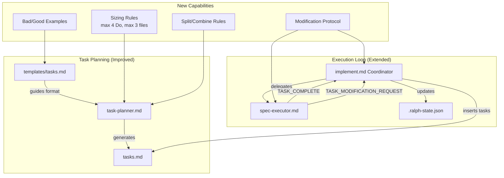
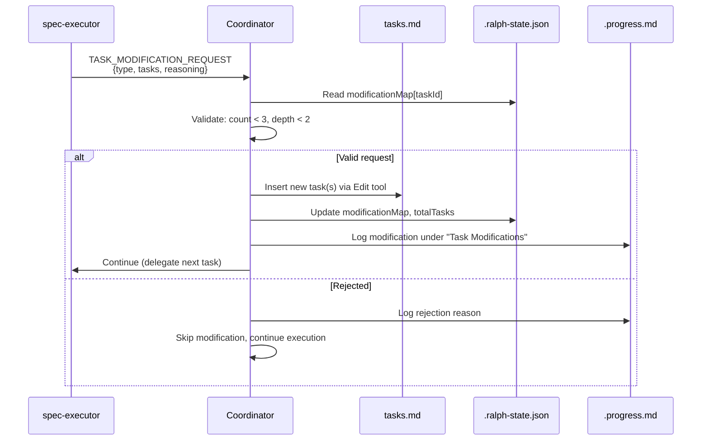

# Design: Improve Task Generation

## Overview

Extend the existing task planner, executor, coordinator, and template to produce atomic tasks (max 4 Do steps, max 3 files), enforce splitting rules targeting 40-60+ tasks per spec, add bad/good examples to the template, and introduce a `TASK_MODIFICATION_REQUEST` protocol enabling the executor to request task plan changes during execution. Incorporates Karpathy coding principles: think-first (surface unknowns), simplicity (minimum code), surgical (touch only what's needed), goal-driven (success criteria over imperative steps). All changes are in-place modifications to existing markdown prompt files.

## Architecture



## Data Flow: Modification Request



## Components

### Component A: Task Sizing Rules (task-planner.md)

**Purpose**: Enforce atomic task generation with measurable constraints.

**Insert location**: New `## Task Sizing Rules` section after existing `## [VERIFY] Task Format` section (after line 281).

**Content to add** (~40 lines):

```markdown
## Task Sizing Rules

<mandatory>
Every task MUST satisfy these constraints:

**Size limits:**
- Max 4 numbered steps in Do section
- Max 3 files in Files section (exception: tightly-coupled test+impl pair = 1 logical file)
- 1 logical concern per task

**Split if:**
- Do section > 4 steps
- Files section > 3 files
- Task mixes creation + testing (split into separate tasks)
- Task mixes > 1 logical concern (e.g., "add endpoint AND update UI")
- Verification requires > 1 unrelated command

**Combine if:**
- Task 1 creates a file, Task 2 adds a single import to that file
- Both tasks touch the exact same file with trivially related changes
- Neither task is meaningful alone (e.g., "create empty file" + "add content")

**Target task count:**
- Standard spec: 40-60+ tasks
- Phase distribution: Phase 1 = 50-60%, Phase 2 = 15-20%, Phase 3 = 15-20%, Phase 4-5 = 10-15%

**Simplicity principle**: Each task should describe the MINIMUM code to achieve its goal. No speculative features, no abstractions for single-use code, no error handling for impossible scenarios. If 50 lines solve it, don't write 200.

**Surgical principle**: Each task touches ONLY what it must. No "while you're in there" improvements. No reformatting adjacent code. No refactoring unbroken functionality. Every changed file must trace directly to the task's goal.

**Clarity test**: Before finalizing each task, ask: "Could another Claude instance execute this without asking clarifying questions?" If no, add more detail or split further.
</mandatory>
```

### Component B: Bad/Good Examples (templates/tasks.md)

**Purpose**: Provide concrete vague-vs-precise task comparisons to guide the planner.

**Insert location**: New section after "Completion Criteria" block (after line 27), before Phase 1.

**Content to add** (~50 lines):

```markdown
## Task Writing Guide

**Sizing rules**: Max 4 Do steps, max 3 files per task. Split if exceeded.

### Task Writing Principles

1. **Think First**: Tasks should surface what's unclear, not assume. If a task depends on an uncertain assumption (e.g., "config file exists at X"), state it explicitly in the Do section or add a verification step. Don't hide confusion in vague steps.
2. **Simplicity**: Minimum steps to achieve the goal. No speculative features, no abstractions for single-use code. If the task can be done in 2 steps, don't write 4.
3. **Surgical**: Each task touches only what it must. No drive-by refactors, no "while you're in there" improvements. Every file in the Files section traces directly to the task's goal.
4. **Goal-Driven**: Emphasize **Done when** and **Verify** over **Do** steps. The Do is guidance; the Done when is the contract. Transform imperative commands into declarative success criteria. Instead of "Add validation" write "Done when: invalid inputs return 400 with error message."

### Bad vs. Good Examples

**Example 1: File Creation (too vague vs. precise)**

BAD:
- [ ] 1.1 Set up the API module
  - **Do**: Create the API module with routes and handlers
  - **Files**: src/api/
  - **Verify**: Code compiles

GOOD:
- [ ] 1.1 Create user registration endpoint
  - **Do**:
    1. Create `src/api/routes/auth.ts` with POST /register route
    2. Add request body validation: email (valid format), password (min 8 chars)
    3. Return 201 with `{ id, email }` on success, 400 with `{ error }` on validation fail
  - **Files**: src/api/routes/auth.ts
  - **Done when**: POST /register returns 201 for valid input, 400 for invalid
  - **Verify**: `curl -X POST localhost:3000/register -d '{"email":"a@b.com","password":"12345678"}' -w '%{http_code}' | grep 201`

**Example 2: Integration (bundled vs. atomic)**

BAD:
- [ ] 2.1 Add analytics tracking
  - **Do**: Install PostHog, create wrapper, add to all pages, write tests
  - **Files**: src/analytics.ts, src/pages/*.tsx, tests/analytics.test.ts
  - **Verify**: Tests pass

GOOD:
- [ ] 2.1 Install PostHog SDK and create wrapper
  - **Do**:
    1. Add posthog-js: `pnpm add posthog-js`
    2. Create `src/lib/analytics.ts` exporting `track(event, props)` and `identify(userId)`
    3. Initialize with env var `POSTHOG_KEY` in wrapper
  - **Files**: src/lib/analytics.ts, package.json
  - **Done when**: `import { track } from '@/lib/analytics'` resolves without error
  - **Verify**: `pnpm check-types`

**Example 3: Refactoring (overloaded vs. focused)**

BAD:
- [ ] 3.1 Refactor and test the auth module
  - **Do**: Extract auth logic, add error handling, write unit tests, run linter, fix types
  - **Files**: src/auth.ts, src/utils/token.ts, tests/auth.test.ts, src/types.ts

GOOD:
- [ ] 3.1 Extract token validation into utility
  - **Do**:
    1. Create `src/utils/token.ts` with `validateToken(token: string): TokenPayload | null`
    2. Move JWT verify logic from `src/auth.ts` lines 45-62 into new file
    3. Update `src/auth.ts` to import and call `validateToken`
  - **Files**: src/utils/token.ts, src/auth.ts
  - **Done when**: Existing auth flow works identically after extraction
  - **Verify**: `pnpm check-types && pnpm test -- --grep auth`

**Example 4: Goal-Driven (imperative command vs. success criteria)**

BAD:
- [ ] 4.1 Add input validation
  - **Do**: Add validation to the form fields. Check email format, required fields, password strength.
  - **Files**: src/components/SignupForm.tsx
  - **Done when**: Validation is added
  - **Verify**: Manually check the form

GOOD:
- [ ] 4.1 Add signup form validation with error states
  - **Do**:
    1. Add validation rules to `src/components/SignupForm.tsx`: email (regex), password (min 8, 1 uppercase, 1 number), name (required)
    2. Display inline error messages below each field on blur -> verify: error messages render
    3. Disable submit button until all fields valid -> verify: button disabled state toggles
  - **Files**: src/components/SignupForm.tsx
  - **Done when**: Form rejects invalid inputs with visible error messages; submit disabled until valid
  - **Verify**: `pnpm test -- --grep SignupForm` (write test first if missing: invalid email shows "Invalid email", short password shows "Min 8 characters")
```

Also fix the "Manual test" contradiction on line 70 of templates/tasks.md:

**Change** (line 67-70):
```
- [ ] 1.5 POC Checkpoint
  - **Do**: Verify feature works end-to-end
  - **Done when**: Feature can be demonstrated working
  - **Verify**: Manual test of core flow
```
**To**:
```
- [ ] 1.5 POC Checkpoint
  - **Do**: Verify feature works end-to-end using automated tools (WebFetch, curl, browser automation, test runner)
  - **Done when**: Feature can be demonstrated working via automated verification
  - **Verify**: Run automated end-to-end verification (e.g., `curl API | jq`, browser automation script, or test command)
```

### Component C: Task Quality Checklist (task-planner.md)

**Purpose**: Final validation gate before planner outputs tasks.md.

**Insert location**: Replace existing `## Quality Checklist` section (lines 506-515) with expanded version.

**Content**:

```markdown
## Quality Checklist

Before completing tasks:
- [ ] All tasks have <= 4 Do steps
- [ ] All tasks touch <= 3 files (except test+impl pairs)
- [ ] All tasks reference requirements/design
- [ ] No Verify field contains "manual", "visually", or "ask user"
- [ ] POC phase focuses on validation, not perfection
- [ ] Each task has a runnable Verify command
- [ ] Quality checkpoints inserted every 2-3 tasks throughout all phases
- [ ] Quality gates are last phase
- [ ] Tasks are ordered by dependency
- [ ] Total task count is 40+ (split further if under 40)
- [ ] Every task has a meaningful **Done when** (the contract, not just "it works")
- [ ] No task contains speculative features or premature abstractions (simplicity)
- [ ] No task touches files unrelated to its stated goal (surgical)
- [ ] Ambiguous tasks surface their assumptions explicitly, not silently (think-first)
- [ ] Set awaitingApproval in state (see below)
```

### Component D: TASK_MODIFICATION_REQUEST Protocol (spec-executor.md)

**Purpose**: Enable executor to signal task plan changes to coordinator.

**Insert location**: New section after `## Error Handling` (after line 358), before `## Communication Style`.

**Content to add** (~50 lines):

```markdown
## Task Modification Requests

<mandatory>
**Think before acting**: When a task is unclear, has hidden assumptions, or you're uncertain about the right approach, DO NOT silently pick an interpretation and run with it. Surface the uncertainty via TASK_MODIFICATION_REQUEST. Wrong assumptions waste more iterations than asking.

When you discover during execution that the task plan needs adjustment, output a structured modification request INSTEAD of improvising.

**When to request modification:**
- Task has ambiguous requirements or hidden assumptions you'd need to guess about
- Task requires an undocumented dependency (missing package, missing config)
- Task is significantly more complex than described (needs splitting)
- Task reveals a follow-up concern not in the plan
- You find yourself improvising beyond what the task describes (stop, request modification instead)

**Signal format** (output this BEFORE TASK_COMPLETE):

```text
TASK_MODIFICATION_REQUEST
```json
{
  "type": "SPLIT_TASK" | "ADD_PREREQUISITE" | "ADD_FOLLOWUP",
  "originalTaskId": "X.Y",
  "reasoning": "Why this modification is needed",
  "proposedTasks": [
    "- [ ] X.Y.1 New task name\n  - **Do**:\n    1. Step one\n  - **Files**: path/to/file\n  - **Done when**: Criteria\n  - **Verify**: command\n  - **Commit**: `type(scope): message`"
  ]
}
```
```

**Modification types:**

| Type | When | Effect |
|------|------|--------|
| `SPLIT_TASK` | Current task too complex, needs 2+ sub-tasks | Original marked [x], sub-tasks inserted after |
| `ADD_PREREQUISITE` | Missing dependency/setup discovered | New task inserted before current, current retried after |
| `ADD_FOLLOWUP` | Task reveals needed cleanup/extension | New task inserted after current |

**Rules:**
- Max 3 modification requests per original task (coordinator enforces)
- Proposed tasks must follow standard task format (Do/Files/Done when/Verify/Commit)
- Each proposed task must satisfy sizing rules (max 4 Do steps, max 3 files)
- After outputting TASK_MODIFICATION_REQUEST, also output TASK_COMPLETE (for SPLIT_TASK and ADD_FOLLOWUP where current task is done)
- For ADD_PREREQUISITE, do NOT output TASK_COMPLETE (task blocked, needs prereq first)

**Example: ADD_PREREQUISITE**

You're executing task 2.3 "Add Redis caching" but Redis client isn't installed:

```text
TASK_MODIFICATION_REQUEST
```json
{
  "type": "ADD_PREREQUISITE",
  "originalTaskId": "2.3",
  "reasoning": "Redis client package (ioredis) not installed. Need to add dependency before implementing caching.",
  "proposedTasks": [
    "- [ ] 2.3.P1 Install Redis client dependency\n  - **Do**:\n    1. Run `pnpm add ioredis`\n    2. Add Redis connection config to `src/config.ts`\n  - **Files**: package.json, src/config.ts\n  - **Done when**: `import Redis from 'ioredis'` resolves\n  - **Verify**: `pnpm check-types`\n  - **Commit**: `feat(deps): add ioredis for caching`"
  ]
}
```
```

Do NOT output TASK_COMPLETE — task 2.3 is blocked until prerequisite completes.
</mandatory>
```

### Component E: Coordinator Modification Handler (implement.md)

**Purpose**: Parse and process TASK_MODIFICATION_REQUEST from executor.

**Insert location**: New section `### 6e. Modification Request Handler` after existing `### 6d. Iterative Failure Recovery Orchestrator`.

**Content** (~80 lines):

```markdown
### 6e. Modification Request Handler

When spec-executor outputs `TASK_MODIFICATION_REQUEST`, parse and process the modification before continuing.

**Detection**:

Check executor output for the literal string `TASK_MODIFICATION_REQUEST` followed by a JSON code block.

**Parse Modification Request**:

Extract the JSON payload:
```json
{
  "type": "SPLIT_TASK" | "ADD_PREREQUISITE" | "ADD_FOLLOWUP",
  "originalTaskId": "X.Y",
  "reasoning": "...",
  "proposedTasks": ["markdown task block", ...]
}
```

**Validate Request**:

1. Read `modificationMap` from .ralph-state.json
2. Count: `modificationMap[originalTaskId].count` (default 0)
3. If count >= 3: REJECT, log "Max modifications (3) reached for task $taskId" in .progress.md, skip modification
4. Depth check: count dots in proposed task IDs. If dots > 3 (depth > 2 levels): REJECT
5. Verify proposed tasks have required fields: Do, Files, Done when, Verify, Commit

**Process by Type**:

**SPLIT_TASK**:
1. Mark original task [x] in tasks.md (executor completed what it could)
2. Insert all proposedTasks after original task block using Edit tool
3. Update totalTasks += proposedTasks.length in state
4. Update modificationMap
5. Set taskIndex to first inserted sub-task
6. Log in .progress.md: "Split task $taskId into N sub-tasks: [ids]. Reason: $reasoning"

**ADD_PREREQUISITE**:
1. Do NOT mark original task complete
2. Insert proposedTask BEFORE current task block using Edit tool
3. Update totalTasks += 1 in state
4. Update modificationMap
5. Delegate prerequisite task to spec-executor
6. After prereq completes: retry original task
7. Log in .progress.md: "Added prerequisite $prereqId before $taskId. Reason: $reasoning"

**ADD_FOLLOWUP**:
1. Original task should already be marked [x] (executor outputs TASK_COMPLETE too)
2. Insert proposedTask after current task block using Edit tool
3. Update totalTasks += 1 in state
4. Update modificationMap
5. Normal advancement — followup will be picked up as next task
6. Log in .progress.md: "Added followup $followupId after $taskId. Reason: $reasoning"

**Parallel Batch Interaction**:
- If current task is in a [P] batch and executor requests modification: break out of parallel batch
- Re-evaluate remaining [P] tasks as sequential after modification
- This prevents inserting tasks mid-batch which would corrupt parallel execution

**Update State (modificationMap)**:

```bash
jq --arg taskId "$TASK_ID" \
   --arg modId "$MOD_TASK_ID" \
   --arg reason "$REASONING" \
   --arg type "$MOD_TYPE" \
   '
   .modificationMap //= {} |
   .modificationMap[$taskId] //= {count: 0, modifications: []} |
   .modificationMap[$taskId].count += 1 |
   .modificationMap[$taskId].modifications += [{id: $modId, type: $type, reason: $reason}] |
   .totalTasks += 1
   ' "$SPEC_PATH/.ralph-state.json" > "$SPEC_PATH/.ralph-state.json.tmp" && \
   mv "$SPEC_PATH/.ralph-state.json.tmp" "$SPEC_PATH/.ralph-state.json"
```

**Insertion Algorithm** (same pattern as Section 6c fix task insertion):

1. Read tasks.md
2. Locate target task by ID pattern: `- [ ] $taskId` or `- [x] $taskId`
3. Find task block end (next `- [ ]`, `- [x]`, `## Phase`, or EOF)
4. For ADD_PREREQUISITE: insert before task block start
5. For SPLIT_TASK/ADD_FOLLOWUP: insert after task block end
6. Use Edit tool with old_string/new_string
```

### Component F: State Schema Extension (spec.schema.json + implement.md init)

**Purpose**: Track modification requests per task.

**New field in state**:

```json
{
  "modificationMap": {
    "type": "object",
    "description": "Tracks modification requests per original task",
    "default": {},
    "additionalProperties": {
      "type": "object",
      "properties": {
        "count": { "type": "integer", "minimum": 0 },
        "modifications": {
          "type": "array",
          "items": {
            "type": "object",
            "properties": {
              "id": { "type": "string" },
              "type": { "type": "string", "enum": ["SPLIT_TASK", "ADD_PREREQUISITE", "ADD_FOLLOWUP"] },
              "reason": { "type": "string" }
            }
          }
        }
      },
      "required": ["count", "modifications"]
    }
  },
  "maxModificationsPerTask": {
    "type": "integer",
    "minimum": 1,
    "default": 3,
    "description": "Max modification requests allowed per original task"
  },
  "maxModificationDepth": {
    "type": "integer",
    "minimum": 1,
    "default": 2,
    "description": "Max nesting depth for modification task IDs"
  }
}
```

**Initialization** (implement.md state init section): Add to jq merge:
```json
{
  "modificationMap": {},
  "maxModificationsPerTask": 3,
  "maxModificationDepth": 2
}
```

### Component G: Stop-Watcher Extension (stop-watcher.sh)

**Purpose**: Include modification context in continuation prompt.

**Change**: Add `TASK_MODIFICATION_REQUEST` awareness to the continuation prompt. The stop-watcher reads state and includes modification handling guidance in the resume prompt.

**Insert** in the REASON heredoc (after line 167, the "On failure" line):

```bash
- On TASK_MODIFICATION_REQUEST: validate, insert tasks, update state (see implement.md Section 6e)
```

No other changes needed to stop-watcher.sh. The modification handling logic lives in the coordinator prompt (implement.md), not the hook script.

## Technical Decisions

| Decision | Options Considered | Choice | Rationale |
|----------|-------------------|--------|-----------|
| Modification payload format | Pure JSON, pure markdown, JSON with embedded markdown | JSON with embedded markdown | JSON for parsing, markdown for task content consistency with tasks.md |
| Where to add sizing rules | Inline in template, separate section in planner, both | Separate section in planner + sizing summary in template | Planner has enforcement logic; template has brief reminder. Avoids duplication |
| Signal naming | TASK_NEEDS_SPLITTING, MODIFY_TASK, TASK_MODIFICATION_REQUEST | TASK_MODIFICATION_REQUEST | Consistent with existing TASK_COMPLETE naming convention; descriptive |
| Modification tracking | New file, existing fixTaskMap, new modificationMap | New modificationMap field | Separate concern from fix tasks; different semantics (proactive vs reactive) |
| Max modifications per task | 1, 3, 5, unlimited | 3 | Matches maxFixTasksPerOriginal precedent; prevents runaway while allowing reasonable adaptation |
| Depth limit | 1, 2, 3 levels | 2 levels | X.Y.Z.W is deepest (2 levels from original). Deeper nesting = design issue |
| Where modification handler lives | stop-watcher.sh, implement.md, new file | implement.md Section 6e | Follows fix task generator pattern (6c); coordinator already processes executor output |
| SPLIT_TASK completion signal | No TASK_COMPLETE, both signals | Both: TASK_MODIFICATION_REQUEST + TASK_COMPLETE | Executor finished its part; split tasks handle the rest |
| ADD_PREREQUISITE completion | TASK_COMPLETE, no signal | No TASK_COMPLETE | Task is genuinely blocked; needs prereq first |
| Task count target | Hard 40-60, soft guidance, configurable | Soft guidance with "split further if under 40" | Hard limits could produce artificial splits; guidance with floor is pragmatic |
| Karpathy principles integration | Separate rules file, inline in each component, principles section in template | Inline in each component + principles section in template | Principles are most effective at point-of-use. Planner gets simplicity/surgical, executor gets think-first, template gets all 4 as writing guide |
| Goal-driven task format | Do-heavy (detailed steps), Done-when-heavy (success criteria), balanced | Done-when-heavy with Do as guidance | LLMs loop well on success criteria. "Done when" is the contract; "Do" is optional guidance. Matches Karpathy insight about declarative goals |

## File Structure

| File | Action | What Changes |
|------|--------|-------------|
| `plugins/ralph-specum/agents/task-planner.md` | Modify | Add `## Task Sizing Rules` section with simplicity/surgical principles (~45 lines after line 281). Expand `## Quality Checklist` with Karpathy principle checks (~16 lines replacing lines 506-515). |
| `plugins/ralph-specum/templates/tasks.md` | Modify | Add `## Task Writing Guide` with 4 principles subsection + 4 bad/good examples including goal-driven pattern (~80 lines after line 27). Fix POC checkpoint Verify on line 70 (remove "Manual test"). |
| `plugins/ralph-specum/agents/spec-executor.md` | Modify | Add `## Task Modification Requests` section with think-first principle (~55 lines after line 358). |
| `plugins/ralph-specum/commands/implement.md` | Modify | Add `### 6e. Modification Request Handler` section (~80 lines after Section 6d). Add `modificationMap` to state init (~3 lines in jq merge). Add modification detection to Section 6 delegation flow (~5 lines). |
| `plugins/ralph-specum/hooks/scripts/stop-watcher.sh` | Modify | Add 1 line to continuation prompt REASON heredoc for modification handling. |
| `plugins/ralph-specum/schemas/spec.schema.json` | Modify | Add `modificationMap`, `maxModificationsPerTask`, `maxModificationDepth` to state definition (~25 lines). |
| `plugins/ralph-specum/.claude-plugin/plugin.json` | Modify | Version bump (minor: new feature). |

## Error Handling

| Error Scenario | Handling Strategy | User Impact |
|----------------|-------------------|-------------|
| Executor requests modification but JSON is malformed | Coordinator logs parse error, skips modification, continues execution normally | None - task proceeds without modification |
| Modification count exceeds max (3) | Coordinator rejects, logs reason in .progress.md, continues with current task plan | None - execution continues with original plan |
| Depth limit exceeded (> 2 levels) | Coordinator rejects, logs warning | None - prevents over-nesting |
| SPLIT_TASK proposed tasks missing required fields | Coordinator rejects entire request, logs which fields missing | None - original task marked complete, plan continues |
| ADD_PREREQUISITE during parallel batch | Coordinator breaks parallel batch, re-evaluates as sequential | Slight slowdown (parallel batch becomes sequential) |
| Modification request for already-completed task | Coordinator ignores (task [x] already), logs warning | None |
| State file missing modificationMap (backwards compat) | Default to empty object `{}` via jq `//=` pattern | None - graceful degradation |

## Edge Cases

- **Multiple modifications in one execution**: Executor can only output one TASK_MODIFICATION_REQUEST per delegation. Each delegation = one request max.
- **Modification during parallel batch**: Break parallel batch, handle modification, remaining batch tasks become sequential. Prevents task insertion mid-batch.
- **Fix task + modification on same task**: Both fixTaskMap and modificationMap can have entries for the same task. Independent tracking, both limits apply independently.
- **Modification of a fix task**: Allowed if within depth limits. Fix task ID like 1.3.1 + modification = 1.3.1.M1. Depth counted from original.
- **Template backwards compatibility**: Old tasks.md files (without Task Writing Guide) work fine. Guide is for planner reference only, not parsed by coordinator.
- **Planner already in mid-generation**: Sizing rules apply during generation. Existing tasks.md files are not retroactively validated.

## Test Strategy

### Manual Validation (Phase 1 POC)

Since this project is a markdown prompt plugin with no test framework:

1. **Sizing rules**: Generate a tasks.md for a test spec. Verify all tasks have <= 4 Do steps and <= 3 files.
2. **Bad/good examples**: Verify template renders correctly. Check planner produces tasks closer to "good" examples.
3. **Manual test removal**: `grep -r "Manual test\|manually test\|manual review\|visually" plugins/ralph-specum/templates/`  -- should return 0 matches.
4. **Modification protocol**: Run a spec execution, verify executor can output TASK_MODIFICATION_REQUEST format.
5. **Coordinator handling**: Verify implement.md coordinator detects and processes modification requests.

### Automated Verification

1. **No manual verification in templates**: `grep -ri "manual" plugins/ralph-specum/templates/tasks.md` returns no Verify-field matches
2. **Schema validation**: `jq empty plugins/ralph-specum/schemas/spec.schema.json` succeeds
3. **Plugin version bumped**: CI check `plugin-version-check.yml` passes
4. **Spec file check**: CI check `spec-file-check.yml` passes

### Integration Tests

1. **End-to-end**: Run `/ralph-specum:tasks` on a real spec and verify output follows sizing rules
2. **Execution loop**: Run `/ralph-specum:implement` and verify modification requests are detected and processed
3. **Backwards compatibility**: Run existing specs without error. Old state files work with new code.

## Performance Considerations

- **Planner prompt size**: Current ~4500 tokens. Adding sizing rules + Karpathy principles (~350 tokens) + quality checklist expansion (~150 tokens) = ~5000 tokens. Well under 8000 token budget (NFR-1).
- **Template size**: Adding principles subsection + 4 examples (~650 tokens) to template. Template is read once during planning. Negligible impact.
- **Modification parsing**: JSON parse of executor output. Negligible latency (NFR-3 < 2 seconds).
- **State file writes**: One additional jq write per modification. Same pattern as fix task map updates.

## Security Considerations

- No secrets or credentials involved. All files are markdown prompts.
- Modification requests are validated by coordinator before insertion (no direct executor write access to tasks.md structure).
- State file protection rule in spec-executor.md preserved (executor READ ONLY on state).

## Existing Patterns to Follow

Based on codebase analysis:

1. **Fix task generation pattern (Section 6c)**: Modification handler should mirror this exactly - same Edit tool insertion algorithm, same state tracking via jq merge, same depth/count limits.
2. **fixTaskMap structure**: modificationMap follows same shape (`{taskId: {count, items[]}}`) for consistency.
3. **TASK_COMPLETE protocol**: TASK_MODIFICATION_REQUEST follows same convention - uppercase, underscore-separated, literal string detection.
4. **Mandatory sections**: All new rules use `<mandatory>` tags consistent with existing planner/executor formatting.
5. **State initialization merge pattern**: New fields added to jq merge in implement.md init, with `//=` default for backwards compatibility.
6. **Stop-watcher continuation prompt**: Abbreviated resume prompt references implement.md as source of truth. One-line addition sufficient.
7. **Karpathy coding principles**: Think-first, simplicity, surgical, goal-driven. Distributed across components at point-of-use: planner gets simplicity+surgical (task generation), executor gets think-first (execution decisions), template gets all 4 (writing guide reference). Multi-step verify pattern `1. [Step] -> verify: [check]` aligns with existing Verify field convention.

## Implementation Steps

1. **Update templates/tasks.md**: Add Task Writing Guide section with 4 principles subsection + 4 bad/good examples (including goal-driven pattern) after line 27. Fix POC checkpoint Verify on line 70.
2. **Add sizing rules to task-planner.md**: Insert `## Task Sizing Rules` section after line 281 with split-if/combine-if/target count rules + simplicity/surgical principles.
3. **Expand quality checklist in task-planner.md**: Replace lines 506-515 with expanded checklist including sizing validation and Karpathy principle checks.
4. **Add modification protocol to spec-executor.md**: Insert `## Task Modification Requests` section after line 358 with think-first principle (surface uncertainties via modification request, don't improvise).
5. **Add modification handler to implement.md**: Insert `### 6e. Modification Request Handler` after Section 6d. Add modificationMap to state init. Add modification detection in delegation flow.
6. **Update state schema**: Add modificationMap, maxModificationsPerTask, maxModificationDepth to spec.schema.json.
7. **Update stop-watcher.sh**: Add modification handling line to continuation prompt.
8. **Bump plugin version**: Update plugin.json and marketplace.json.
