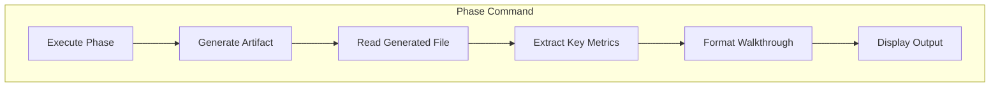

# Design: improve-walkthrough-feature

## Overview

Extend the `## Output` section of each phase command (research, requirements, design, tasks) to include a structured walkthrough that extracts and displays key information from the generated artifact.

## Architecture



## Components

### Component: Walkthrough Output Section

**Purpose**: Standard section added to each command's Output area
**Pattern**: All walkthroughs follow same structure:

```markdown
## Walkthrough

### Key Points
- [Extracted from generated file]

### Metrics
| Metric | Value |
|--------|-------|
| ... | ... |

### Review Focus
- [Items user should pay attention to]
```

### Component: Metric Extraction

Each phase extracts different metrics:

| Phase | Metrics to Extract | Source |
|-------|-------------------|--------|
| Research | Feasibility, Risk, Related specs | Feasibility Assessment table, Related Specs section |
| Requirements | User story count, FR count, Priority distribution | User Stories section, FR table |
| Design | Component count, Decision count, Files to change | Components section, Technical Decisions table, File Structure |
| Tasks | Total tasks, Phase breakdown, POC checkpoint task | Phase headers, task counts |

## Data Flow

1. Phase command delegates to subagent (existing)
2. Subagent generates artifact file (existing)
3. Command reads generated file (NEW)
4. Command extracts key metrics using text parsing (NEW)
5. Command formats walkthrough output (NEW)
6. Command displays walkthrough + next step (MODIFIED)

## Technical Decisions

| Decision | Options | Choice | Rationale |
|----------|---------|--------|-----------|
| Where to add walkthrough | In agent vs in command | Command | Keeps agent focused on generation, command handles presentation |
| How to extract metrics | Regex vs manual parsing | Inline text instructions | Commands are markdown prompts, no code available |
| Walkthrough format | Prose vs structured | Structured (tables + bullets) | Matches existing concise style |

## File Structure

| File | Action | Purpose |
|------|--------|---------|
| commands/research.md | Modify | Add walkthrough to Output section |
| commands/requirements.md | Modify | Add walkthrough to Output section |
| commands/design.md | Modify | Add walkthrough to Output section |
| commands/tasks.md | Modify | Add walkthrough to Output section |

## Walkthrough Templates

### Research Walkthrough Template

```markdown
## Walkthrough

**Feasibility**: [High/Medium/Low] - [brief reason]
**Risk Level**: [High/Medium/Low]
**Effort**: [S/M/L/XL]

### Key Findings
1. [First key finding from research]
2. [Second key finding]
3. [Third key finding]

### Related Specs
- [Spec name if any] ([Relevance])

### Review Focus
- Verify feasibility assessment matches your expectations
- Check if recommendations align with project constraints
```

### Requirements Walkthrough Template

```markdown
## Walkthrough

**Goal**: [Goal summary from requirements]

### User Stories ([count] total)
| ID | Title | ACs |
|----|-------|-----|
| US-1 | [title] | [count] |
| US-2 | [title] | [count] |

### Requirements
- Functional: [count] (High: [n], Medium: [n], Low: [n])
- Non-Functional: [count]

### Review Focus
- Verify all user needs captured in user stories
- Check acceptance criteria are testable
```

### Design Walkthrough Template

```markdown
## Walkthrough

**Approach**: [Overview summary]

### Architecture
| Component | Purpose |
|-----------|---------|
| [name] | [brief purpose] |

### Key Decisions
1. [Decision]: [Choice] - [brief rationale]
2. [Decision]: [Choice] - [brief rationale]

### File Changes
- Create: [count] files
- Modify: [count] files

### Review Focus
- Verify architecture fits existing patterns
- Check technical decisions make sense for project
```

### Tasks Walkthrough Template

```markdown
## Walkthrough

**Total Tasks**: [count]

### Phase Breakdown
| Phase | Tasks | Focus |
|-------|-------|-------|
| 1. POC | [n] | Validate idea works |
| 2. Refactor | [n] | Clean up code |
| 3. Testing | [n] | Add test coverage |
| 4. Quality | [n] | CI and PR |

### POC Completion
Task [X.Y] marks end of POC phase - feature demonstrable at that point.

### Review Focus
- Verify POC tasks prove the core idea
- Check quality checkpoints are reasonable
```

## Error Handling

| Error | Handling | User Impact |
|-------|----------|-------------|
| Generated file missing | Skip walkthrough, show warning | "Warning: Could not read generated file for walkthrough" |
| Metric extraction fails | Show partial walkthrough | Some fields show "N/A" |

## Existing Patterns to Follow

- **Concise output**: Match existing terse style (fragments over sentences)
- **Tables**: Use markdown tables for metrics (matches existing format)
- **Next step**: Always end with "Next: [command]" (existing pattern)
