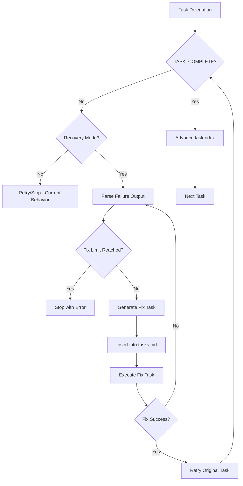

# Design: Iterative Failure Recovery

## Overview

Extend coordinator (implement.md) to create fix tasks on failure and continue execution. Reuse Phase 5 CI failure pattern. Add state tracking for recovery mode and fix task limits.

## Architecture



## Components

### Component 1: Failure Parser
**Purpose**: Extract actionable error details from spec-executor output
**Responsibilities**:
- Regex match failure output pattern: `Task X.Y: [name] FAILED`
- Extract error description from `- Error:` line
- Extract attempted fix from `- Attempted fix:` line
- Return structured failure object

**Pattern (from spec-executor.md)**:
```text
Task X.Y: [task name] FAILED
- Error: [description]
- Attempted fix: [what was tried]
- Status: Blocked, needs manual intervention
```

### Component 2: Fix Task Generator
**Purpose**: Create well-structured fix task from failure details
**Responsibilities**:
- Build fix task description from error + context
- Generate Files list from original task's Files
- Create targeted Verify command
- Add [FIX X.Y] marker for traceability

**Output Format**:
```markdown
- [ ] X.Y.1 [FIX X.Y] Fix: <error summary>
  - **Do**: <steps derived from error>
  - **Files**: <same as original task>
  - **Done when**: Original error no longer occurs
  - **Verify**: <original task's verify or adapted>
  - **Commit**: `fix(<scope>): address <error type>`
```

### Component 3: Task Inserter
**Purpose**: Insert fix task into tasks.md at correct position
**Responsibilities**:
- Read tasks.md
- Find position after current task
- Insert fix task with proper indentation
- Increment totalTasks in state
- Write updated tasks.md

**Algorithm**:
```text
1. Read tasks.md content
2. Find line matching current task: `- [ ] X.Y` or `- [x] X.Y`
3. Find end of current task block (next `- [ ]` or `- [x]` or phase header)
4. Insert fix task at that position
5. Update totalTasks in .ralph-state.json
```

### Component 4: Recovery Orchestrator
**Purpose**: Coordinate failure -> fix -> retry loop
**Responsibilities**:
- Check recoveryMode in state
- Track fix attempt count per original task
- Enforce maxFixTasksPerOriginal limit
- Manage retry of original task after fix completes

**State Extension**:
```json
{
  "recoveryMode": true,
  "maxFixTasksPerOriginal": 3,
  "fixTaskMap": {
    "1.2": {
      "attempts": 1,
      "fixTaskIds": ["1.2.1"]
    }
  }
}
```

## Data Flow

1. Coordinator delegates task X.Y to spec-executor
2. Spec-executor attempts task, outputs FAILED (no TASK_COMPLETE)
3. Coordinator checks recoveryMode = true
4. Failure Parser extracts error from output
5. Check fixTaskMap["X.Y"].attempts < maxFixTasksPerOriginal
6. Fix Task Generator creates fix task X.Y.N
7. Task Inserter adds to tasks.md, updates totalTasks
8. Coordinator executes fix task X.Y.N
9. On fix success, coordinator retries original task X.Y
10. If X.Y passes, advance; if fails, repeat from step 4

## Technical Decisions

| Decision | Options | Choice | Rationale |
|----------|---------|--------|-----------|
| Fix task ID format | Sequential (next int), Nested (X.Y.N) | Nested X.Y.N | Shows relationship to original task |
| Fix task position | End of tasks, After original | After original | Executes immediately when needed |
| Recovery default | Enabled, Disabled | Disabled | Backwards compatibility |
| Max fix limit | Hard-coded, Configurable | Configurable | Different specs may need different limits |

## File Structure

| File | Action | Purpose |
|------|--------|---------|
| plugins/ralph-specum/commands/implement.md | Modify | Add recovery orchestrator logic after task delegation |
| plugins/ralph-specum/schemas/spec.schema.json | Modify | Add recoveryMode, maxFixTasksPerOriginal, fixTaskMap fields |
| plugins/ralph-specum/agents/spec-executor.md | No change | Already outputs structured failure format |

## Error Handling

| Error | Handling | User Impact |
|-------|----------|-------------|
| Max fix tasks reached | Stop with error, show fix history | Clear message: "Max fix attempts (3) reached for task X.Y. Fix history: [...]" |
| Global iterations exceeded | Stop with error | Current behavior preserved |
| Fix task itself fails | Increment fix attempt, try new fix | Automatic retry up to limit |
| Cannot parse failure output | Fall back to generic fix task | "Fix: address task X.Y failure" |

## State Schema Extension

Add to spec.schema.json:

```json
{
  "recoveryMode": {
    "type": "boolean",
    "default": false,
    "description": "Enable iterative failure recovery"
  },
  "maxFixTasksPerOriginal": {
    "type": "integer",
    "minimum": 1,
    "default": 3,
    "description": "Max fix tasks allowed per original task"
  },
  "fixTaskMap": {
    "type": "object",
    "description": "Tracks fix attempts per original task",
    "additionalProperties": {
      "type": "object",
      "properties": {
        "attempts": { "type": "integer", "minimum": 0 },
        "fixTaskIds": { "type": "array", "items": { "type": "string" } },
        "lastError": { "type": "string" }
      },
      "required": ["attempts", "fixTaskIds"]
    }
  }
}
```

## Coordinator Prompt Update

Insert after Section 6 (Task Delegation) "If no completion signal":

```markdown
### 6b. Iterative Failure Recovery

If recoveryMode is true and no TASK_COMPLETE received:

1. **Parse Failure**:
   - Extract error from spec-executor output using pattern:
     `Task X.Y: .* FAILED\n- Error: (.*)\n- Attempted fix: (.*)`
   - If no match, use generic: "Task X.Y did not complete"

2. **Check Fix Limits**:
   - Read fixTaskMap[taskId].attempts (default 0)
   - If attempts >= maxFixTasksPerOriginal:
     - Output error: "Max fix attempts reached for task $taskId"
     - Include fix history from fixTaskMap[taskId].fixTaskIds
     - Do NOT output ALL_TASKS_COMPLETE
     - STOP

3. **Generate Fix Task**:
   - Create fix task with format:
     ```
     - [ ] $taskId.$attempt [FIX $taskId] Fix: $errorSummary
       - **Do**: Address the error: $errorDetails
       - **Files**: $originalTaskFiles
       - **Done when**: Error resolved, original task can pass
       - **Verify**: $originalTaskVerify
       - **Commit**: `fix($scope): address $errorType`
     ```

4. **Insert Fix Task**:
   - Read tasks.md
   - Insert fix task after current task block
   - Increment totalTasks in state
   - Write updated tasks.md

5. **Update State**:
   - Increment fixTaskMap[taskId].attempts
   - Add fix task ID to fixTaskMap[taskId].fixTaskIds
   - Store lastError in fixTaskMap[taskId]
   - Write updated .ralph-state.json

6. **Execute Fix Task**:
   - Delegate fix task to spec-executor
   - On TASK_COMPLETE: proceed to step 7
   - On failure: repeat from step 1 (with fix task as current)

7. **Retry Original Task**:
   - Reset to original task (taskIndex unchanged)
   - Delegate original task to spec-executor
   - If TASK_COMPLETE: continue normal flow (advance taskIndex)
   - If failure: repeat from step 1
```

## Existing Patterns to Follow

- **Phase 5 CI Failure Pattern** (implement.md lines 499-511): Create new task from failure logs, delegate, retry
- **Task Insertion** (implement.md Phase 5): Use same sed/edit approach for tasks.md modification
- **State Updates** (implement.md Section 8): Same jq pattern for .ralph-state.json updates
- **Failure Parsing** (spec-executor.md output format): Already standardized
