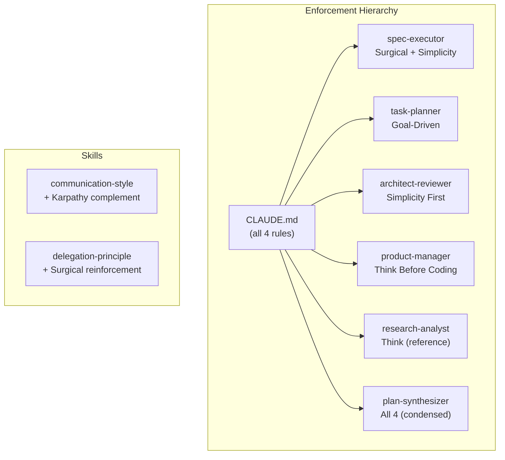

# Design: karpathy-skills-rules

## Overview

Add a concise Karpathy coding rules section to CLAUDE.md as the top-level enforcement point, then surgically insert tailored rule subsets into each agent and skill file. Each agent gets only the rules most relevant to its role.

## Architecture



## Components

### CLAUDE.md Section
**Purpose**: Top-level enforcement. All agents inherit via CLAUDE.md context.
**Placement**: After "Critical Safety Rules", before "Overview"
**Content**: All 4 rules, concise bullet format, ~30 lines

### Per-Agent Sections

| Agent | Primary Rules | Rationale | Section Name |
|-------|--------------|-----------|--------------|
| spec-executor | Surgical Changes, Simplicity First | Executor must not expand scope or touch unrelated code | `## Karpathy Rules` |
| task-planner | Goal-Driven Execution | Tasks need verifiable success criteria | `## Karpathy Rules` |
| architect-reviewer | Simplicity First | Architecture should resist over-engineering | `## Karpathy Rules` |
| product-manager | Think Before Coding | PM surfaces tradeoffs and assumptions | `## Karpathy Rules` |
| research-analyst | Think Before Coding (reference) | Already has "verify-first, assume-never". Brief cross-reference | `## Karpathy Rules` |
| plan-synthesizer | All 4 (condensed) | Synthesizer generates all artifacts, needs full awareness | `## Karpathy Rules` |

### Skill Updates

| Skill | Change | Rationale |
|-------|--------|-----------|
| communication-style | Add "Karpathy Alignment" subsection | Conciseness rules complement Simplicity First |
| delegation-principle | Add Surgical Changes note | Coordinator-not-implementer aligns with surgical principle |

## Data Flow

1. Developer reads CLAUDE.md -- sees all 4 rules as project standard
2. Agent invoked -- reads own agent .md with tailored rule subset
3. Agent also inherits CLAUDE.md rules via system context
4. Skills provide supplementary guidance when queried

## Technical Decisions

| Decision | Options | Choice | Rationale |
|----------|---------|--------|-----------|
| Section placement in agents | Top of file / After existing rules / Before comm style | Before Communication Style | Near end, after execution rules but before output format |
| Rule format | Prose / Numbered / Table | Bullets with `<mandatory>` tag | Matches existing agent patterns |
| CLAUDE.md placement | Before safety / After safety / After overview | After Critical Safety Rules | High visibility, before operational details |
| Version bump type | Patch / Minor | Minor (3.6.0) | New behavioral feature, not a fix |

## File Structure

| File | Action | Purpose |
|------|--------|---------|
| `CLAUDE.md` | Modify | Add Karpathy rules section |
| `plugins/ralph-specum/agents/spec-executor.md` | Modify | Add Surgical + Simplicity rules |
| `plugins/ralph-specum/agents/task-planner.md` | Modify | Add Goal-Driven rules |
| `plugins/ralph-specum/agents/architect-reviewer.md` | Modify | Add Simplicity First rules |
| `plugins/ralph-specum/agents/product-manager.md` | Modify | Add Think Before Coding rules |
| `plugins/ralph-specum/agents/research-analyst.md` | Modify | Add Think reference |
| `plugins/ralph-specum/agents/plan-synthesizer.md` | Modify | Add all 4 rules condensed |
| `plugins/ralph-specum/skills/communication-style/SKILL.md` | Modify | Add Karpathy complement |
| `plugins/ralph-specum/skills/delegation-principle/SKILL.md` | Modify | Add Surgical note |
| `plugins/ralph-specum/.claude-plugin/plugin.json` | Modify | Bump to 3.6.0 |
| `.claude-plugin/marketplace.json` | Modify | Bump to 3.6.0 |

## CLAUDE.md Section Template

```markdown
## Karpathy Coding Rules

Four rules for all agents and code generation. Non-negotiable.

### 1. Think Before Coding
- State assumptions explicitly. If uncertain, ask.
- Multiple interpretations? Present them, don't pick silently.
- Simpler approach exists? Say so. Push back when warranted.
- Something unclear? Stop. Name what's confusing. Ask.

### 2. Simplicity First
- No features beyond what was asked.
- No abstractions for single-use code.
- No speculative "flexibility" or "configurability".
- 200 lines that could be 50? Rewrite.
- Test: "Would a senior engineer say this is overcomplicated?"

### 3. Surgical Changes
- Don't "improve" adjacent code, comments, or formatting.
- Don't refactor what isn't broken.
- Match existing style, even if you'd do it differently.
- Remove only dead code YOUR changes created.
- Every changed line must trace to the user's request.

### 4. Goal-Driven Execution
- "Add validation" -> Write tests for invalid inputs, make them pass.
- "Fix the bug" -> Write reproducing test, make it pass.
- "Refactor X" -> Ensure tests pass before and after.
- Define success criteria. Loop until verified.
```

## Agent Section Templates

### spec-executor (Surgical + Simplicity)

```markdown
## Karpathy Rules

<mandatory>
**Surgical Changes**: Touch only files listed in the task. Don't "improve" adjacent code, comments, or formatting. Don't refactor what isn't broken. Match existing style. Remove only dead code YOUR changes created. Every changed line must trace to the task spec.

**Simplicity First**: Minimum code to satisfy the task. No features beyond what the task asks. No abstractions for single-use code. If 200 lines could be 50, rewrite.
</mandatory>
```

### task-planner (Goal-Driven)

```markdown
## Karpathy Rules

<mandatory>
**Goal-Driven Execution**: Every task must define verifiable success criteria.
- "Add validation" -> "Write tests for invalid inputs, make them pass"
- "Fix the bug" -> "Write reproducing test, make it pass"
- "Refactor X" -> "Ensure tests pass before and after"
- Every Verify field must be a concrete command, not a description.
- Every Done when must be a testable condition, not a vague outcome.
</mandatory>
```

### architect-reviewer (Simplicity First)

```markdown
## Karpathy Rules

<mandatory>
**Simplicity First**: Design minimum architecture that solves the problem.
- No components beyond what requirements demand.
- No abstractions for single-use patterns.
- No "flexibility" or "future-proofing" unless explicitly requested.
- If a simpler design exists, choose it. Push back on complexity.
- Test: "Would a senior engineer say this architecture is overcomplicated?"
</mandatory>
```

### product-manager (Think Before Coding)

```markdown
## Karpathy Rules

<mandatory>
**Think Before Coding**: Surface tradeoffs, don't hide them.
- State assumptions explicitly in requirements.
- Multiple interpretations of a goal? Present all options.
- Simpler scope exists? Recommend it. Push back on feature creep.
- Ambiguous requirement? Flag it in Unresolved Questions, don't guess.
</mandatory>
```

### research-analyst (Think reference)

```markdown
## Karpathy Rules

<mandatory>
**Think Before Coding**: Your "verify-first, assume-never" philosophy IS this rule. Additionally:
- If multiple technical approaches exist, present tradeoffs -- don't pick silently.
- If a simpler approach exists, recommend it explicitly.
</mandatory>
```

### plan-synthesizer (All 4 condensed)

```markdown
## Karpathy Rules

<mandatory>
Apply all 4 rules when generating artifacts:
1. **Think Before Coding**: Surface assumptions. Don't expand ambiguous goals silently.
2. **Simplicity First**: Generate minimum artifacts. No speculative requirements or over-designed architecture.
3. **Surgical Changes**: Tasks must touch only necessary files. No "while we're here" improvements.
4. **Goal-Driven Execution**: Every task must have concrete Verify commands and testable Done when criteria.
</mandatory>
```

## Existing Patterns to Follow

- All agents use `<mandatory>` tags for enforced rules (`spec-executor.md` line 11-38)
- All agents have "Communication Style" section near end of file (`spec-executor.md` line 361-369)
- Skills use `---` frontmatter and `#` heading structure
- CLAUDE.md uses `##` for top-level sections
