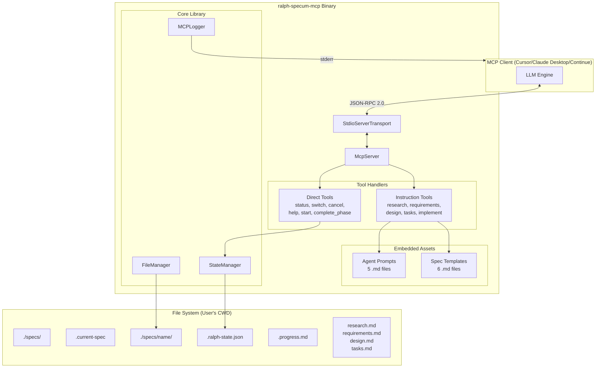
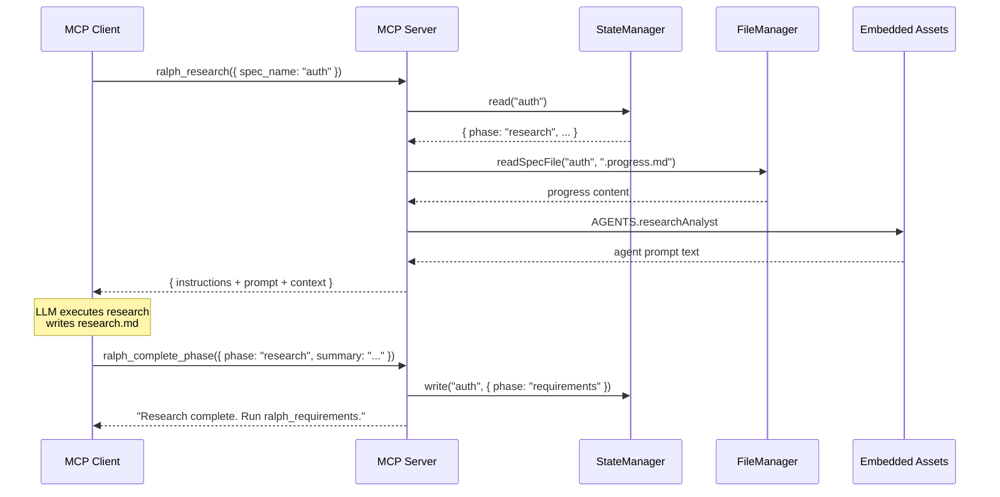
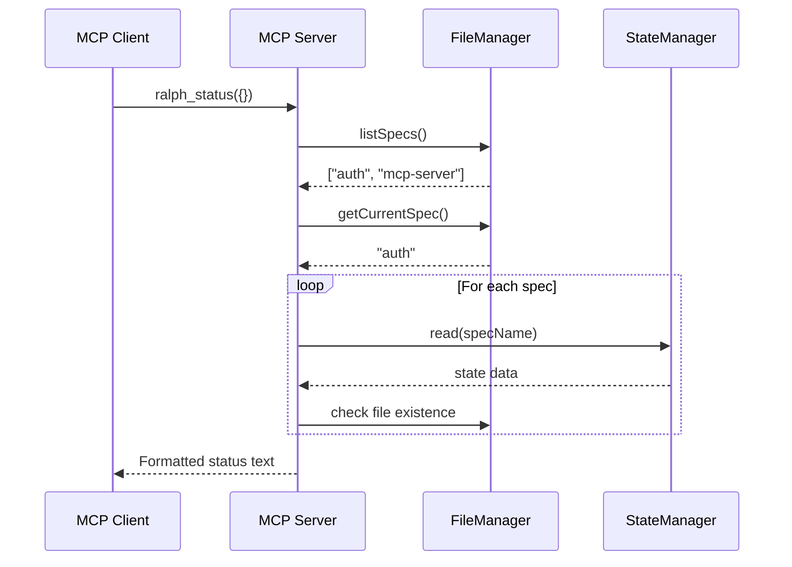

# Design: Ralph Specum MCP Server

## Overview

Standalone MCP server exposing ralph-specum workflows via 11 tools. Built with Bun + TypeScript, compiles to single binary with embedded agent prompts and templates. Uses instruction-return pattern for complex tools (LLM client executes), direct execution for simple tools.

## Design Inputs (from Interview)

| Topic | Decision |
|-------|----------|
| Architecture style | Extend existing architecture - follow patterns from ralph-specum plugin, adapt for MCP protocol |
| Technology constraints | Use common best-practice options, no custom stuff |
| Integration approach | Use existing APIs and interfaces - leverage existing file formats (.ralph-state.json, spec files) |

## Architecture



## Components

### McpServer (Entry Point)

**Purpose**: Initialize server, register tools, handle transport

**File**: `src/index.ts`

```typescript
interface ServerConfig {
  name: "ralph-specum";
  version: string; // from package.json
}
```

**Responsibilities**:
- Create McpServer instance
- Register all 11 tools with schemas
- Connect StdioServerTransport
- Handle --help and --version CLI flags

### Tool Handlers

#### Direct Tools

Execute immediately, return results.

| Tool | Handler | Input | Output |
|------|---------|-------|--------|
| `ralph_start` | `handleStart` | name?, goal?, quick? | Creates spec, returns status |
| `ralph_status` | `handleStatus` | - | Formatted status of all specs |
| `ralph_switch` | `handleSwitch` | name | Updates .current-spec |
| `ralph_cancel` | `handleCancel` | spec_name?, delete_files? | Cleanup confirmation |
| `ralph_complete_phase` | `handleCompletePhase` | spec_name, phase, summary | State update + next step |
| `ralph_help` | `handleHelp` | - | Usage information |

#### Instruction Tools

Return embedded prompts + context for LLM to execute.

| Tool | Handler | Returns |
|------|---------|---------|
| `ralph_research` | `handleResearch` | research-analyst prompt + goal context |
| `ralph_requirements` | `handleRequirements` | product-manager prompt + research context |
| `ralph_design` | `handleDesign` | architect-reviewer prompt + requirements context |
| `ralph_tasks` | `handleTasks` | task-planner prompt + design context |
| `ralph_implement` | `handleImplement` | spec-executor prompt + current task |

### StateManager

**Purpose**: CRUD operations for .ralph-state.json

**File**: `src/lib/state.ts`

```typescript
interface RalphState {
  source: "spec" | "plan";
  name: string;
  basePath: string;
  phase: "research" | "requirements" | "design" | "tasks" | "execution";
  taskIndex: number;
  totalTasks: number;
  taskIteration: number;
  maxTaskIterations: number;
  globalIteration: number;
  maxGlobalIterations: number;
  commitSpec?: boolean;
  awaitingApproval?: boolean;
  relatedSpecs?: RelatedSpec[];
}

interface RelatedSpec {
  name: string;
  goal: string;
  score: number;
}

interface StateManager {
  read(specName: string): Promise<RalphState | null>;
  write(specName: string, state: RalphState): Promise<void>;
  delete(specName: string): Promise<void>;
  exists(specName: string): Promise<boolean>;
}
```

**Validation**: JSON schema validation on read, atomic write with temp file + rename.

### FileManager

**Purpose**: Spec file operations (read/write/list)

**File**: `src/lib/files.ts`

```typescript
interface FileManager {
  readSpecFile(specName: string, filename: string): Promise<string | null>;
  writeSpecFile(specName: string, filename: string, content: string): Promise<void>;
  listSpecs(): Promise<string[]>;
  specExists(specName: string): Promise<boolean>;
  createSpecDir(specName: string): Promise<void>;
  deleteSpec(specName: string): Promise<void>;
  getCurrentSpec(): Promise<string | null>;
  setCurrentSpec(name: string): Promise<void>;
}
```

### MCPLogger

**Purpose**: MCP-compliant logging via notifications

**File**: `src/lib/logger.ts`

```typescript
type LogLevel = "debug" | "info" | "warning" | "error";

interface LogMessage {
  level: LogLevel;
  logger: string;
  data: unknown;
  timestamp: string;
}

interface MCPLogger {
  debug(logger: string, data: unknown): void;
  info(logger: string, data: unknown): void;
  warning(logger: string, data: unknown): void;
  error(logger: string, data: unknown): void;
}
```

**Implementation**: Writes to stderr via `console.error()`. Never uses `console.log()`.

### Embedded Assets

**Purpose**: Agent prompts and templates bundled at compile time

**File**: `src/assets/index.ts`

```typescript
// Bun import with type: "text" embeds file contents
import researchAnalyst from "./agents/research-analyst.md" with { type: "text" };
import productManager from "./agents/product-manager.md" with { type: "text" };
import architectReviewer from "./agents/architect-reviewer.md" with { type: "text" };
import taskPlanner from "./agents/task-planner.md" with { type: "text" };
import specExecutor from "./agents/spec-executor.md" with { type: "text" };

import progressTemplate from "./templates/progress.md" with { type: "text" };
import researchTemplate from "./templates/research.md" with { type: "text" };
import requirementsTemplate from "./templates/requirements.md" with { type: "text" };
import designTemplate from "./templates/design.md" with { type: "text" };
import tasksTemplate from "./templates/tasks.md" with { type: "text" };

export const AGENTS = {
  researchAnalyst,
  productManager,
  architectReviewer,
  taskPlanner,
  specExecutor
};

export const TEMPLATES = {
  progress: progressTemplate,
  research: researchTemplate,
  requirements: requirementsTemplate,
  design: designTemplate,
  tasks: tasksTemplate
};
```

## Data Flow

### Instruction Tool Flow (e.g., ralph_research)



### Direct Tool Flow (e.g., ralph_status)



## Technical Decisions

| Decision | Options Considered | Choice | Rationale |
|----------|-------------------|--------|-----------|
| Runtime | Node.js, Deno, Bun | Bun | Fastest startup, compile to binary, native TypeScript |
| MCP SDK | Custom, Official SDK | Official SDK | Maintained by Anthropic, well-tested |
| Transport | stdio, HTTP | stdio | Standard for local MCP, required by major clients |
| Schema validation | Ajv, Zod, Custom | Zod | SDK peer dependency, type inference |
| Asset embedding | File system, Bundler | Bun import with type:text | Zero-cost at runtime, compile-time embedding |
| Distribution primary | npm, Homebrew, Binary | Binary (install script) | Zero runtime dependency, simple install |
| Distribution secondary | npm only, GitHub releases | Both npm + releases | npm for Node devs, releases for manual download |
| Logging | stdout, stderr, MCP notifications | stderr + MCP notifications | MCP compliant, stdout reserved for JSON-RPC |

## File Structure

| File | Action | Purpose |
|------|--------|---------|
| `mcp-server/package.json` | Create | Package config, dependencies, scripts |
| `mcp-server/tsconfig.json` | Create | TypeScript config |
| `mcp-server/src/index.ts` | Create | Entry point, server initialization |
| `mcp-server/src/tools/start.ts` | Create | ralph_start handler |
| `mcp-server/src/tools/research.ts` | Create | ralph_research handler |
| `mcp-server/src/tools/requirements.ts` | Create | ralph_requirements handler |
| `mcp-server/src/tools/design.ts` | Create | ralph_design handler |
| `mcp-server/src/tools/tasks.ts` | Create | ralph_tasks handler |
| `mcp-server/src/tools/implement.ts` | Create | ralph_implement handler |
| `mcp-server/src/tools/status.ts` | Create | ralph_status handler |
| `mcp-server/src/tools/switch.ts` | Create | ralph_switch handler |
| `mcp-server/src/tools/cancel.ts` | Create | ralph_cancel handler |
| `mcp-server/src/tools/complete-phase.ts` | Create | ralph_complete_phase handler |
| `mcp-server/src/tools/help.ts` | Create | ralph_help handler |
| `mcp-server/src/tools/index.ts` | Create | Tool registration barrel |
| `mcp-server/src/lib/state.ts` | Create | StateManager implementation |
| `mcp-server/src/lib/files.ts` | Create | FileManager implementation |
| `mcp-server/src/lib/logger.ts` | Create | MCPLogger implementation |
| `mcp-server/src/assets/index.ts` | Create | Asset imports barrel |
| `mcp-server/src/assets/agents/*.md` | Copy | Agent prompts from plugin |
| `mcp-server/src/assets/templates/*.md` | Copy | Templates from plugin |
| `mcp-server/scripts/install.sh` | Create | Install script |
| `mcp-server/scripts/build.sh` | Create | Cross-platform build script |
| `mcp-server/README.md` | Create | Usage documentation |
| `.github/workflows/mcp-release.yml` | Create | CI/CD for releases |

## Tool Schemas

### ralph_start

```typescript
const startSchema = z.object({
  name: z.string().regex(/^[a-z0-9-]+$/).optional()
    .describe("Spec name in kebab-case"),
  goal: z.string().optional()
    .describe("Goal description for the spec"),
  quick: z.boolean().optional().default(false)
    .describe("Skip interactive phases, generate artifacts directly")
});
```

### ralph_research / ralph_requirements / ralph_design / ralph_tasks

```typescript
const phaseSchema = z.object({
  spec_name: z.string().optional()
    .describe("Spec name (defaults to current spec)")
});
```

### ralph_implement

```typescript
const implementSchema = z.object({
  max_iterations: z.number().int().min(1).max(100).optional().default(5)
    .describe("Maximum task retries before blocking")
});
```

### ralph_status / ralph_help

```typescript
const emptySchema = z.object({});
```

### ralph_switch

```typescript
const switchSchema = z.object({
  name: z.string().describe("Spec name to switch to")
});
```

### ralph_cancel

```typescript
const cancelSchema = z.object({
  spec_name: z.string().optional()
    .describe("Spec name (defaults to current spec)"),
  delete_files: z.boolean().optional().default(false)
    .describe("Delete spec directory entirely")
});
```

### ralph_complete_phase

```typescript
const completePhaseSchema = z.object({
  spec_name: z.string().optional()
    .describe("Spec name (defaults to current spec)"),
  phase: z.enum(["research", "requirements", "design", "tasks"])
    .describe("Phase being completed"),
  summary: z.string()
    .describe("Brief summary of phase completion")
});
```

## Error Handling

| Error Scenario | Handling Strategy | User Impact |
|----------------|-------------------|-------------|
| Spec not found | Return MCP error with suggestion | "Spec 'xyz' not found. Run ralph_status to see available specs." |
| Invalid state file | Backup corrupt file, return recovery instructions | "State corrupt. Backup at .ralph-state.json.bak. Re-run ralph_start." |
| Missing prerequisites | Return clear error with next action | "Tasks not generated. Run ralph_tasks first." |
| Phase mismatch | Return current phase and expected sequence | "Currently in research phase. Complete research before requirements." |
| File write failure | Catch, log, return descriptive error | "Failed to write research.md. Check file permissions." |
| Invalid JSON-RPC | SDK handles, returns -32600 | Standard MCP error response |
| Tool not found | SDK handles, returns -32601 | Standard MCP error response |

## Edge Cases

- **No specs exist**: ralph_status returns "No specs found. Run ralph_start to begin."
- **Spec with no state file**: Treated as completed or needs restart; check for existing files
- **Concurrent access**: File operations are not atomic. Document single-client assumption
- **Empty goal**: ralph_start prompts user in instruction response
- **Duplicate spec name**: Append -2, -3 suffix automatically
- **Quick mode without goal**: Error "Quick mode requires a goal"

## Test Strategy

### Unit Tests

| Component | Test Focus | Mock Requirements |
|-----------|------------|-------------------|
| StateManager | CRUD operations, validation | File system (memfs) |
| FileManager | Spec operations, listing | File system (memfs) |
| MCPLogger | Level filtering, format | stderr capture |
| Tool handlers | Input validation, output format | StateManager, FileManager |

### Integration Tests

| Test | Description |
|------|-------------|
| Full workflow | start -> research -> requirements -> design -> tasks -> implement |
| State persistence | Verify state survives server restart |
| Error recovery | Corrupt state, missing files |
| Cross-platform paths | Windows vs Unix path handling |

### E2E Tests

| Test | Description |
|------|-------------|
| Claude Desktop | Install binary, configure, run workflow |
| Cursor | Install, configure, run workflow |
| Continue | Install, configure, run workflow |
| Install script | Test on macOS arm64, x64, Linux |

### Test Commands

```bash
# Unit tests
bun test

# Type check
bun run typecheck

# Integration tests
bun test:integration

# Build and verify
bun run build && ./dist/ralph-specum-mcp --help
```

## Performance Considerations

| Metric | Target | Approach |
|--------|--------|----------|
| Startup time | < 200ms | Bun compile, no lazy loading |
| Binary size | < 100MB | Tree shaking, no dev deps in bundle |
| Memory | < 50MB | Stream large files, no caching |
| Tool latency | < 100ms (direct) | Sync file I/O, minimal processing |

## Security Considerations

- **No network access**: Server is local-only (stdio)
- **File access**: Limited to working directory
- **No secrets handling**: State files contain no credentials
- **Input validation**: All inputs validated via Zod before processing

## Existing Patterns to Follow

Based on plugin codebase analysis:

| Pattern | Source | Application in MCP |
|---------|--------|-------------------|
| State schema | `skills/smart-ralph/references/state-file-schema.md` | Identical RalphState interface |
| Agent prompt structure | `agents/*.md` | Copy directly, adapt MCP-specific sections |
| Progress file format | `templates/progress.md` | Same template with USER_GOAL placeholder |
| Phase transitions | `skills/spec-workflow/references/phase-transitions.md` | Same order: research -> requirements -> design -> tasks -> execution |
| Kebab-case spec names | `commands/start.md` | Same validation regex |
| Gitignore entries | `commands/start.md` | Add .current-spec and .progress.md patterns |

## npm Package Configuration

```json
{
  "name": "@smart-ralph/ralph-specum-mcp",
  "version": "1.0.0",
  "description": "MCP server for spec-driven development with Ralph Specum",
  "type": "module",
  "bin": {
    "ralph-specum-mcp": "./src/index.ts"
  },
  "files": ["src", "README.md"],
  "scripts": {
    "start": "bun src/index.ts",
    "build": "bun build --compile ./src/index.ts --outfile dist/ralph-specum-mcp",
    "build:all": "./scripts/build.sh",
    "test": "bun test",
    "typecheck": "tsc --noEmit"
  },
  "dependencies": {
    "@modelcontextprotocol/sdk": "^1.0.0",
    "zod": "^3.25.0"
  },
  "devDependencies": {
    "@types/bun": "latest",
    "typescript": "^5.0.0"
  },
  "engines": {
    "bun": ">=1.0"
  }
}
```

## Build Script (scripts/build.sh)

```bash
#!/bin/bash
set -e

VERSION=$(jq -r '.version' package.json)
OUTDIR="dist"

mkdir -p "$OUTDIR"

# Build for all platforms
platforms=(
  "bun-darwin-arm64"
  "bun-darwin-x64"
  "bun-linux-x64"
  "bun-windows-x64"
)

for platform in "${platforms[@]}"; do
  echo "Building for $platform..."
  outfile="$OUTDIR/ralph-specum-mcp-${platform#bun-}"
  [[ "$platform" == *windows* ]] && outfile="${outfile}.exe"
  bun build --compile --target="$platform" ./src/index.ts --outfile "$outfile"
done

echo "Build complete. Binaries in $OUTDIR/"
```

## Install Script (scripts/install.sh)

```bash
#!/bin/bash
set -e

REPO="tzachbon/smart-ralph-mcp-server"
BINARY_NAME="ralph-specum-mcp"

# Detect OS and architecture
OS=$(uname -s | tr '[:upper:]' '[:lower:]')
ARCH=$(uname -m)

case "$ARCH" in
  x86_64) ARCH="x64" ;;
  aarch64|arm64) ARCH="arm64" ;;
  *) echo "Unsupported architecture: $ARCH"; exit 1 ;;
esac

case "$OS" in
  darwin|linux) ;;
  mingw*|msys*|cygwin*) OS="windows" ;;
  *) echo "Unsupported OS: $OS"; exit 1 ;;
esac

# Get latest release
LATEST=$(curl -fsSL "https://api.github.com/repos/$REPO/releases/latest" | grep tag_name | cut -d'"' -f4)
ASSET="${BINARY_NAME}-${OS}-${ARCH}"
[[ "$OS" == "windows" ]] && ASSET="${ASSET}.exe"

# Download and install
INSTALL_DIR="${INSTALL_DIR:-/usr/local/bin}"
echo "Installing $BINARY_NAME $LATEST to $INSTALL_DIR..."

curl -fsSL "https://github.com/$REPO/releases/download/$LATEST/$ASSET" -o "/tmp/$BINARY_NAME"
chmod +x "/tmp/$BINARY_NAME"
sudo mv "/tmp/$BINARY_NAME" "$INSTALL_DIR/$BINARY_NAME"

echo "Installed! Add to your MCP client config:"
echo ""
echo '  "ralph-specum": {'
echo "    \"command\": \"$INSTALL_DIR/$BINARY_NAME\""
echo '  }'
```

## Instruction-Return Template

For instruction tools, return this structured format:

```typescript
function buildInstructionResponse(params: {
  specName: string;
  phase: string;
  agentPrompt: string;
  context: string;
  expectedActions: string[];
  completionInstruction: string;
}): ToolResult {
  return {
    content: [{
      type: "text",
      text: `## ${params.phase} Phase for "${params.specName}"

### Your Task
Execute the ${params.phase} phase for this spec using the guidance below.

### Context
${params.context}

### Agent Instructions
${params.agentPrompt}

### Expected Actions
${params.expectedActions.map((a, i) => `${i + 1}. ${a}`).join('\n')}

### When Complete
${params.completionInstruction}

Call \`ralph_complete_phase\` with:
- spec_name: "${params.specName}"
- phase: "${params.phase}"
- summary: <brief summary of what was done>`
    }]
  };
}
```

## Implementation Steps

1. Initialize mcp-server directory with package.json, tsconfig.json
2. Copy agent prompts from `plugins/ralph-specum/agents/` to `mcp-server/src/assets/agents/`
3. Copy templates from `plugins/ralph-specum/templates/` to `mcp-server/src/assets/templates/`
4. Implement StateManager with JSON validation
5. Implement FileManager with spec operations
6. Implement MCPLogger with stderr output
7. Implement direct tools (status, switch, cancel, help, complete_phase)
8. Implement ralph_start tool
9. Implement instruction tools (research, requirements, design, tasks, implement)
10. Create entry point with tool registration
11. Add CLI flags (--help, --version)
12. Create build script for cross-platform binaries
13. Create install script with OS detection
14. Write unit tests
15. Write integration tests
16. Test with Claude Desktop
17. Test with Cursor
18. Create GitHub Actions workflow for releases
19. Publish to npm
