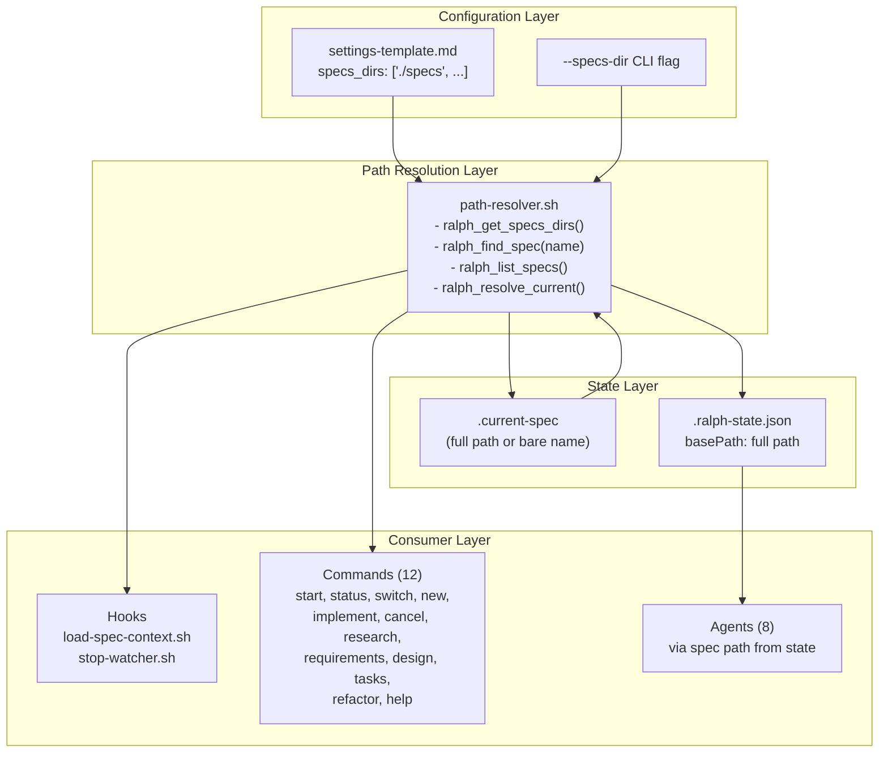
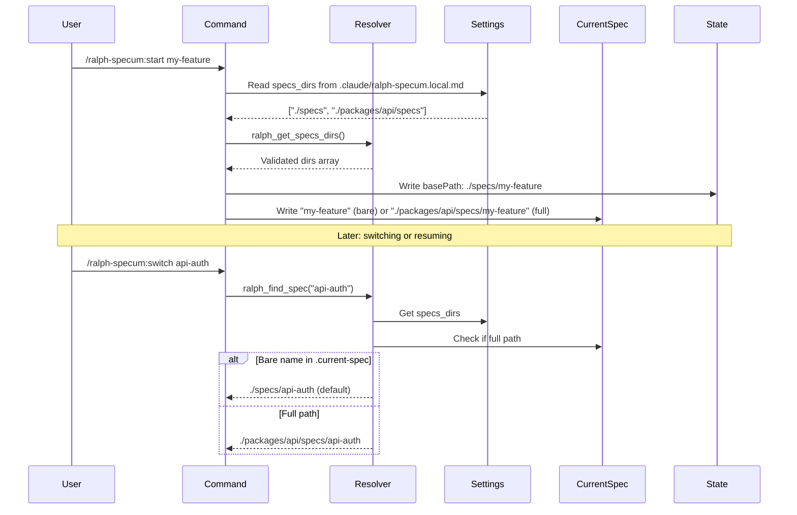
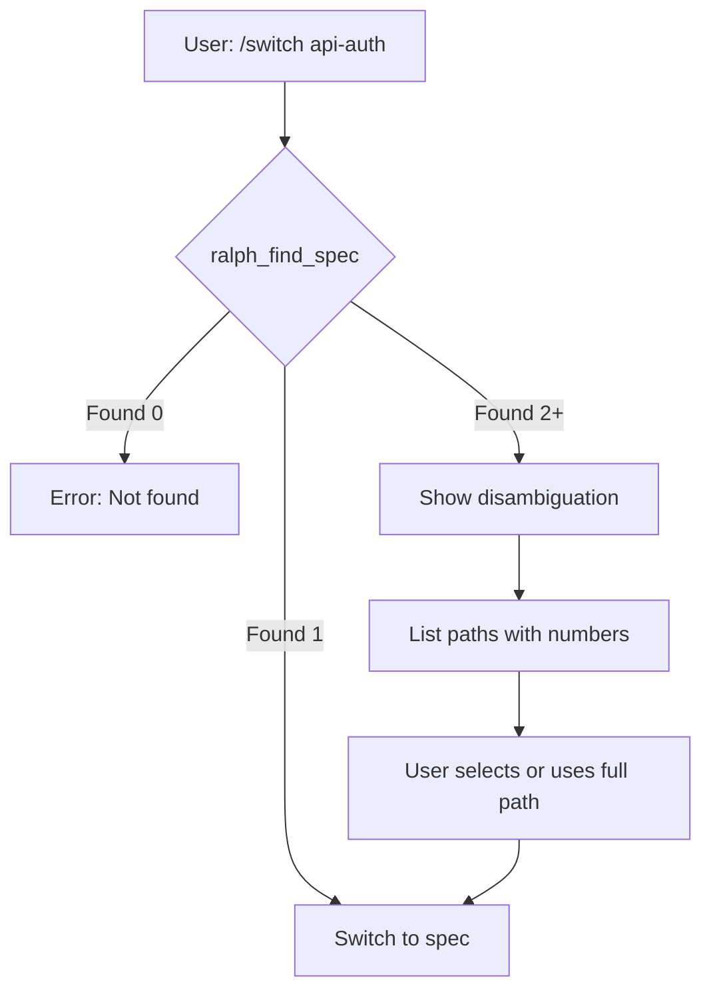

# Design: Multi-Spec Directories

## Overview

Centralizes path resolution via a shell helper script (`path-resolver.sh`) sourced by all hooks/commands. Updates `.current-spec` to store full paths (bare name = backward compat with `./specs/`). Settings file gains `specs_dirs` array; CLI gains `--specs-dir` flag.

## Architecture



## Path Resolution Flow



## Components

### path-resolver.sh (NEW)

**Purpose**: Centralized path resolution for all hooks and commands.

**Location**: `plugins/ralph-specum/hooks/scripts/path-resolver.sh`

**Interface**:

```bash
# Source in hooks/commands
source "$(dirname "$0")/path-resolver.sh"

# Functions provided:
ralph_get_specs_dirs()      # Returns newline-separated list of configured dirs
ralph_find_spec(name)       # Returns full path to spec, handles disambiguation
ralph_list_specs()          # Returns all specs as "name|path" pairs
ralph_resolve_current()     # Returns full path from .current-spec
ralph_get_default_dir()     # Returns first specs_dir (for new spec creation)
```

**Implementation Details**:

| Function | Input | Output | Error Handling |
|----------|-------|--------|----------------|
| `ralph_get_specs_dirs` | - | Newline-separated paths | Returns `./specs` if no config |
| `ralph_find_spec` | spec name | Full path | Exits 1 if not found; prompts if ambiguous |
| `ralph_list_specs` | - | `name\|path` per line | Empty if no specs found |
| `ralph_resolve_current` | - | Full path | Uses `./specs/` for bare names |
| `ralph_get_default_dir` | - | First specs_dir path | Returns `./specs` if no config |

### Settings Extension

**File**: `.claude/ralph-specum.local.md`

**New Field**:

```yaml
---
enabled: true
default_max_iterations: 5
auto_commit_spec: true
quick_mode_default: false
specs_dirs: ["./specs"]  # NEW: Array of spec root directories
---
```

**Parsing Logic** (in path-resolver.sh):

```bash
# Extract specs_dirs from YAML frontmatter
# Default: ["./specs"] if not present or empty
# Validate each path exists (warn if not, continue with valid paths)
```

### .current-spec Format Update

**Current Format**: Bare spec name (e.g., `my-feature`)

**New Format**: Full relative path OR bare name for backward compat

| Content | Interpretation |
|---------|----------------|
| `my-feature` | `./specs/my-feature` (backward compat) |
| `./specs/my-feature` | Explicit full path |
| `./packages/api/specs/auth` | Explicit full path |

**Resolution Logic**:

```text
content = read(.current-spec)
if content starts with "./" or "/" then
    return content  # Full path
else
    return "./specs/" + content  # Bare name = default location
```

## Technical Decisions

| Decision | Options Considered | Choice | Rationale |
|----------|-------------------|--------|-----------|
| Path storage in .current-spec | 1. JSON format 2. Full path string 3. Bare name only | Full path string | Simplest, backward compat with bare names |
| Config location | 1. Separate file 2. Existing settings | Existing settings file | Consistent with current patterns |
| Disambiguation UX | 1. Error on duplicates 2. Auto-select first 3. Prompt | Prompt with paths | User control without breaking existing behavior |
| Default spec dir | 1. Require explicit 2. First in array | First in array | Ergonomic, backward compat |
| Path resolver impl | 1. Node.js script 2. Shell script 3. Inline in each file | Shell script | Hooks already use bash; can source directly |

## File Structure

### Files to Create

| File | Purpose |
|------|---------|
| `hooks/scripts/path-resolver.sh` | Central path resolution functions |

### Files to Modify

| File | Action | Key Changes |
|------|--------|-------------|
| **Commands** | | |
| `commands/start.md` | Modify | Add `--specs-dir` flag; use resolver for path; update worktree copying |
| `commands/status.md` | Modify | List specs from all roots; show directory context |
| `commands/switch.md` | Modify | Search all roots; handle disambiguation |
| `commands/new.md` | Modify | Add `--specs-dir` flag; use resolver |
| `commands/implement.md` | Modify | Use `basePath` from state (already works) |
| `commands/cancel.md` | Modify | Find spec across roots |
| `commands/research.md` | Modify | Related specs from all roots |
| `commands/requirements.md` | Modify | Use resolver for path |
| `commands/design.md` | Modify | Use resolver for path |
| `commands/tasks.md` | Modify | Use resolver for path |
| `commands/refactor.md` | Modify | Use resolver for path |
| `commands/help.md` | Modify | Document multi-dir functionality |
| **Hooks** | | |
| `hooks/scripts/load-spec-context.sh` | Modify | Source resolver; search all roots |
| `hooks/scripts/stop-watcher.sh` | Modify | Source resolver; handle dynamic paths |
| **Templates** | | |
| `templates/settings-template.md` | Modify | Add `specs_dirs` setting documentation |
| **Agents** | | |
| `agents/research-analyst.md` | Modify | Scan all roots for related specs |
| `agents/product-manager.md` | Modify | Use spec path from delegation |
| `agents/architect-reviewer.md` | Modify | Use spec path from delegation |
| `agents/task-planner.md` | Modify | Use spec path from delegation |
| `agents/spec-executor.md` | Modify | Use basePath from state |
| `agents/plan-synthesizer.md` | Modify | Use spec path from delegation |
| `agents/qa-engineer.md` | Modify | Use spec path from delegation |
| `agents/refactor-specialist.md` | Modify | Use spec path from delegation |

## path-resolver.sh Implementation

```bash
#!/bin/bash
# Path Resolution Helper for Ralph Specum
# Source this file in hooks and commands

RALPH_CWD="${RALPH_CWD:-$(pwd)}"
RALPH_SETTINGS_FILE="$RALPH_CWD/.claude/ralph-specum.local.md"
RALPH_DEFAULT_SPECS_DIR="./specs"

# Get configured specs directories (newline-separated)
ralph_get_specs_dirs() {
    local dirs=""

    if [ -f "$RALPH_SETTINGS_FILE" ]; then
        # Parse specs_dirs from YAML frontmatter
        # Format: specs_dirs: ["./specs", "./packages/api/specs"]
        dirs=$(sed -n '/^---$/,/^---$/p' "$RALPH_SETTINGS_FILE" 2>/dev/null \
            | grep -E '^specs_dirs:' \
            | sed 's/specs_dirs:[[:space:]]*//' \
            | tr -d '[]"' \
            | tr ',' '\n' \
            | sed 's/^[[:space:]]*//' \
            | sed 's/[[:space:]]*$//' \
            | grep -v '^$')
    fi

    # Default if empty or not found
    if [ -z "$dirs" ]; then
        echo "$RALPH_DEFAULT_SPECS_DIR"
    else
        echo "$dirs"
    fi
}

# Get default directory for new specs (first in list)
ralph_get_default_dir() {
    ralph_get_specs_dirs | head -1
}

# Resolve .current-spec to full path
# Handles: bare name -> ./specs/$name, full path -> as-is
ralph_resolve_current() {
    local current_spec_file="$RALPH_CWD/specs/.current-spec"

    # Check each specs_dir for .current-spec
    local dirs
    dirs=$(ralph_get_specs_dirs)

    # First check default location
    if [ -f "$current_spec_file" ]; then
        local content
        content=$(cat "$current_spec_file" 2>/dev/null | tr -d '[:space:]')

        if [ -z "$content" ]; then
            return 1
        fi

        # If starts with ./ or /, it's a full path
        if [[ "$content" == ./* ]] || [[ "$content" == /* ]]; then
            echo "$content"
        else
            # Bare name - assume ./specs/ prefix
            echo "./specs/$content"
        fi
        return 0
    fi

    return 1
}

# Find spec by name across all roots
# Returns full path, or prompts if ambiguous
# Exit 1 if not found
ralph_find_spec() {
    local name="$1"
    local found=""
    local count=0
    local dirs
    dirs=$(ralph_get_specs_dirs)

    while IFS= read -r dir; do
        if [ -d "$RALPH_CWD/$dir/$name" ]; then
            found="$found$dir/$name\n"
            count=$((count + 1))
        fi
    done <<< "$dirs"

    if [ $count -eq 0 ]; then
        echo "ERROR: Spec '$name' not found in any configured directory" >&2
        return 1
    elif [ $count -eq 1 ]; then
        echo -e "$found" | head -1 | tr -d '\n'
        return 0
    else
        # Disambiguation needed
        echo "Multiple specs named '$name' found:" >&2
        echo -e "$found" | cat -n >&2
        echo "Specify full path: /ralph-specum:switch <path>" >&2
        return 2
    fi
}

# List all specs across all roots
# Output format: name|path per line
ralph_list_specs() {
    local dirs
    dirs=$(ralph_get_specs_dirs)

    while IFS= read -r dir; do
        if [ -d "$RALPH_CWD/$dir" ]; then
            for spec_dir in "$RALPH_CWD/$dir"/*/; do
                if [ -d "$spec_dir" ]; then
                    local name
                    name=$(basename "$spec_dir")
                    # Skip hidden directories
                    if [[ "$name" != .* ]]; then
                        echo "$name|$dir/$name"
                    fi
                fi
            done
        fi
    done <<< "$dirs"
}
```

## Command Updates Pattern

### Pattern for All Commands

Replace hardcoded `./specs/` references with resolver calls:

**Before**:
```text
SPEC_PATH="$CWD/specs/$SPEC_NAME"
CURRENT_SPEC_FILE="$CWD/specs/.current-spec"
```

**After**:
```text
source "$(dirname "$0")/../scripts/path-resolver.sh"
SPEC_PATH=$(ralph_resolve_current)
# Or for finding by name:
SPEC_PATH=$(ralph_find_spec "$SPEC_NAME")
```

### start.md Specific Changes

| Section | Change |
|---------|--------|
| Argument parsing | Add `--specs-dir <path>` extraction |
| Spec creation | Use `--specs-dir` or `ralph_get_default_dir()` |
| Worktree copying | Copy from active spec's root only |
| .current-spec update | Write full path if non-default root |

### status.md Specific Changes

| Section | Change |
|---------|--------|
| Gather Information | Call `ralph_list_specs()` |
| Output Format | Group by root directory |
| Display | Show `[dir-name]` suffix for non-default roots |

**Example Output**:
```text
## Specs

### my-feature [ACTIVE]
Phase: execution
Progress: 3/8 tasks

### api-auth [packages/api/specs]
Phase: design
Progress: 0/0 tasks

### web-login [packages/web/specs]
Phase: research
Progress: 0/0 tasks
```

### switch.md Specific Changes

| Section | Change |
|---------|--------|
| Validate | Use `ralph_find_spec()` for resolution |
| List Available | Use `ralph_list_specs()`, group by root |
| Execute Switch | Write full path to `.current-spec` |
| Disambiguation | If `ralph_find_spec` returns exit 2, prompt user |

## Disambiguation Flow



**Disambiguation Prompt**:
```text
Multiple specs named 'api-auth' found:
1. ./specs/api-auth
2. ./packages/api/specs/api-auth

Specify: /ralph-specum:switch ./packages/api/specs/api-auth
```

## Error Handling

| Error Scenario | Handling Strategy | User Impact |
|----------------|-------------------|-------------|
| Invalid path in specs_dirs | Log warning, skip path, continue | Degraded (fewer roots searched) |
| Duplicate spec name | Prompt disambiguation | Must specify full path |
| .current-spec missing | Return error from resolver | "No active spec" message |
| Spec not found in any root | Error with list of searched roots | Clear error with guidance |
| Settings file missing | Use default `./specs/` | Transparent fallback |
| Empty specs_dirs array | Use default `./specs/` | Transparent fallback |

## Edge Cases

- **Empty specs_dirs**: Defaults to `["./specs"]`
- **Trailing slashes in paths**: Normalize in resolver
- **Spaces in paths**: Quote paths in shell scripts
- **Relative vs absolute**: Convert all to relative from project root
- **Nested specs_dirs**: Not supported (explicit in requirements)
- **Spec name same as directory name**: Works - uses full path resolution
- **Moving specs between roots**: Manual operation, not supported

## Test Strategy

### Unit Tests (path-resolver.sh)

| Test Case | Input | Expected Output |
|-----------|-------|-----------------|
| No settings file | - | `./specs` |
| Empty specs_dirs | `specs_dirs: []` | `./specs` |
| Single custom dir | `specs_dirs: ["./custom"]` | `./custom` |
| Multiple dirs | `specs_dirs: ["./a", "./b"]` | Both listed |
| Bare name resolution | `.current-spec: my-feat` | `./specs/my-feat` |
| Full path resolution | `.current-spec: ./a/my-feat` | `./a/my-feat` |
| Find unique spec | spec in one root | Full path |
| Find ambiguous spec | spec in two roots | Exit code 2 |

### Integration Tests

| Test Case | Steps | Expected |
|-----------|-------|----------|
| Create in default | `/start my-feat` | Created in `./specs/` |
| Create in custom | `/start my-feat --specs-dir ./custom` | Created in `./custom/` |
| Status multi-root | Configure 2 roots, create specs in each | All listed, grouped |
| Switch unique | `/switch spec-a` | Switches successfully |
| Switch ambiguous | Same name in 2 roots | Disambiguation prompt |
| Backward compat | No settings, bare `.current-spec` | Works as before |

### E2E Tests

| Scenario | Test |
|----------|------|
| Full workflow in custom root | start -> research -> requirements -> design -> tasks -> implement |
| Cross-root related specs | Research finds specs in other roots |
| Worktree with custom root | Worktree copies from correct root |

## Performance Considerations

- **Spec discovery**: O(n) where n = number of specs_dirs * specs per dir
- **Target**: <500ms for 10 dirs, 100 specs total
- **Optimization**: No recursive glob, direct child enumeration only
- **Caching**: Not needed for typical use (few dirs, few specs)

## Security Considerations

- **Path traversal**: Validate paths don't escape project root
- **Shell injection**: Quote all variables in shell scripts
- **Settings trust**: Settings file is user-controlled, trusted

## Existing Patterns to Follow

Based on codebase analysis:
- **Settings parsing**: Use `sed`/`awk` pattern from existing hooks
- **State file**: JSON with `jq` for read/write (already in hooks)
- **Error messages**: Format as `ERROR: <message>` for consistency
- **Path format**: Relative from project root with `./` prefix
- **POSIX compliance**: Use bash features available in macOS/Linux

## Migration Path

1. **No migration needed**: Existing users continue working
2. **Bare name in .current-spec**: Interpreted as `./specs/$name`
3. **No config file**: Defaults to `["./specs"]`
4. **Gradual adoption**: Users can add `specs_dirs` when ready

## Implementation Steps

1. Create `hooks/scripts/path-resolver.sh` with all functions
2. Update `hooks/scripts/load-spec-context.sh` to source resolver
3. Update `hooks/scripts/stop-watcher.sh` to source resolver
4. Update `templates/settings-template.md` with specs_dirs documentation
5. Update `commands/start.md` with --specs-dir flag and resolver usage
6. Update `commands/new.md` with --specs-dir flag and resolver usage
7. Update `commands/status.md` for multi-root listing
8. Update `commands/switch.md` for disambiguation
9. Update `commands/cancel.md` for multi-root search
10. Update remaining commands (implement, research, requirements, design, tasks, refactor, help)
11. Update all 8 agents to use dynamic paths from delegation prompts
12. Bump plugin version in plugin.json and marketplace.json
