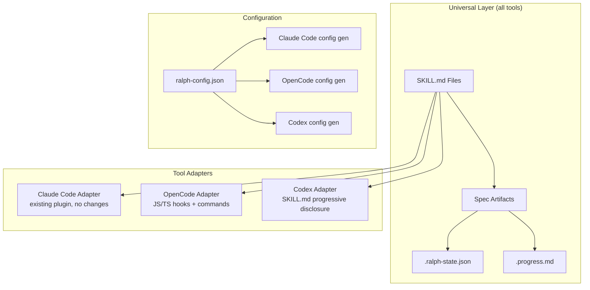

# Design: opencode-codex-support

## Overview

Layered architecture: universal SKILL.md files as the portable entry point (works in all three tools), with tool-specific adapter modules for execution loop, delegation, and team research. The existing Claude Code plugin remains untouched -- new files are purely additive.

## Architecture



## Components

### Component A: Universal SKILL.md Files
**Purpose**: Portable entry point for the Ralph spec workflow across all tools
**Location**: `plugins/ralph-specum/skills/workflow/` (8 SKILL.md files in subdirectories)
**Responsibilities**:
- Provide progressive disclosure for each command (start, research, requirements, design, tasks, implement, status, cancel)
- Reference tool-agnostic state management patterns
- Include inline guidance for manual execution (no hook dependency)
- Describe delegation as "invoke subagent" generically, not Claude Code Task tool specifically

**SKILL.md Structure (per command)**:
```
skills/workflow/
  start/SKILL.md
  research/SKILL.md
  requirements/SKILL.md
  design/SKILL.md
  tasks/SKILL.md
  implement/SKILL.md
  status/SKILL.md
  cancel/SKILL.md
```

**Progressive Disclosure Levels**:
- Level 1 (overview): What the command does, when to use it
- Level 2 (steps): Step-by-step execution instructions with state file management
- Level 3 (advanced): Tool-specific adapter notes, configuration options

### Component B: Template & Schema Audit
**Purpose**: Ensure spec artifacts contain zero Claude Code-specific references
**Location**: `plugins/ralph-specum/templates/` and `plugins/ralph-specum/schemas/`
**Responsibilities**:
- Audit all templates for Claude Code-specific tool references
- Audit schema for Claude Code-specific field assumptions
- Replace any tool-specific references with generic alternatives
- Verify .ralph-state.json schema is tool-agnostic

### Component C: AGENTS.md Generator
**Purpose**: Generate project-level AGENTS.md from spec design decisions
**Location**: `plugins/ralph-specum/scripts/generate-agents-md.sh` (or integrated into plan-synthesizer)
**Responsibilities**:
- Extract key decisions from design.md (architecture, patterns, conventions)
- Format as AGENTS.md compatible with OpenCode and Codex CLI
- Include spec-specific coding guidelines and file structure
- Optional generation (flag-controlled)

**AGENTS.md Output Format**:
```markdown
# Project Agents Configuration

## Architecture
[From design.md Architecture section]

## Coding Conventions
[From design.md Existing Patterns section]

## File Structure
[From design.md File Structure section]

## Key Decisions
[From design.md Technical Decisions table]
```

### Component D: OpenCode Adapter
**Purpose**: Enable full Ralph workflow in OpenCode via its JS/TS plugin system
**Location**: `adapters/opencode/`
**Responsibilities**:
- Implement execution loop via OpenCode hooks (`tool.execute.after`, `session.idle`)
- Provide command wrappers for OpenCode's `.opencode/commands/` format
- Map spec-executor delegation to OpenCode's subagent system
- Handle state file management identically to Claude Code adapter

**OpenCode Adapter Structure**:
```
adapters/opencode/
  hooks/
    execution-loop.ts      # Replaces stop-watcher.sh
  commands/
    ralph-start.md         # OpenCode command format
    ralph-implement.md
    ...
  agents/
    spec-executor.md       # OpenCode agent format
    ...
  README.md               # Setup instructions
```

### Component E: Codex CLI Adapter
**Purpose**: Enable Ralph workflow in Codex CLI using SKILL.md progressive disclosure
**Location**: `adapters/codex/`
**Responsibilities**:
- Provide enhanced implement SKILL.md that reads state and guides through tasks
- Generate AGENTS.md for project-level context
- Provide setup instructions for Codex CLI configuration
- No hooks, no custom commands -- purely SKILL.md + AGENTS.md based

**Codex Adapter Structure**:
```
adapters/codex/
  skills/
    ralph-implement/SKILL.md  # Enhanced with task-by-task guidance
  AGENTS.md                   # Template for project setup
  README.md                   # Setup instructions
```

### Component F: Configuration Bridge
**Purpose**: Unified config that generates tool-specific configurations
**Location**: `plugins/ralph-specum/scripts/` or `adapters/config/`
**Responsibilities**:
- Define `ralph-config.json` schema for tool-agnostic settings
- Generate Claude Code config (already exists, noop)
- Generate OpenCode config (opencode.json plugin entry, .opencode/ files)
- Generate Codex config (skills, AGENTS.md)

## Data Flow

### Spec Workflow (Universal)
1. User invokes skill (SKILL.md discovery or tool-specific command)
2. Skill reads `.ralph-state.json` for current state
3. Skill guides user through current phase
4. Phase output writes to spec artifacts (research.md, etc.)
5. State file updated to next phase
6. Repeat until all phases complete

### Execution Loop (Tool-Specific)
1. **Claude Code**: Stop hook reads state -> outputs continuation prompt -> coordinator delegates via Task tool
2. **OpenCode**: JS/TS hook reads state -> triggers next task -> delegates via subagent system
3. **Codex CLI**: User invokes implement skill -> skill reads state, shows current task -> user executes -> re-invokes skill for next

### Team Research (Tool-Specific)
1. **Claude Code**: TeamCreate + SendMessage for parallel teammates
2. **OpenCode**: Multiple Task tool calls for parallel subagents
3. **Codex CLI**: Sequential research via SKILL.md guidance (no parallelism)

## Technical Decisions

| Decision | Options | Choice | Rationale |
|----------|---------|--------|-----------|
| SKILL.md location | plugin skills/ vs top-level skills/ | Plugin `skills/workflow/` | Co-located with plugin, discoverable via plugin registration |
| Adapter isolation | Single adapter dir vs per-tool dirs | Per-tool dirs under `adapters/` | Clear separation, independent development |
| AGENTS.md generation | Standalone script vs integrated | Integrated into plan-synthesizer | Reuse existing spec generation flow |
| Codex execution | MCP server vs SKILL.md guidance | SKILL.md guidance (Phase 1) | MCP is complex, SKILL.md works now; MCP can be Phase 2 |
| Config bridge | Build tool vs script | Shell script generator | Consistent with existing bash-based tooling |
| OpenCode hooks | Bash vs JS/TS | JS/TS | OpenCode native plugin system uses JS/TS, not shell |

## File Structure

| File | Action | Purpose |
|------|--------|---------|
| `plugins/ralph-specum/skills/workflow/start/SKILL.md` | Create | Universal start command skill |
| `plugins/ralph-specum/skills/workflow/research/SKILL.md` | Create | Universal research phase skill |
| `plugins/ralph-specum/skills/workflow/requirements/SKILL.md` | Create | Universal requirements phase skill |
| `plugins/ralph-specum/skills/workflow/design/SKILL.md` | Create | Universal design phase skill |
| `plugins/ralph-specum/skills/workflow/tasks/SKILL.md` | Create | Universal tasks phase skill |
| `plugins/ralph-specum/skills/workflow/implement/SKILL.md` | Create | Universal implement command skill |
| `plugins/ralph-specum/skills/workflow/status/SKILL.md` | Create | Universal status command skill |
| `plugins/ralph-specum/skills/workflow/cancel/SKILL.md` | Create | Universal cancel command skill |
| `plugins/ralph-specum/templates/*.md` | Modify (if needed) | Remove any Claude Code-specific references |
| `plugins/ralph-specum/schemas/spec.schema.json` | Modify (if needed) | Ensure tool-agnostic schema |
| `adapters/opencode/hooks/execution-loop.ts` | Create | OpenCode execution loop hook |
| `adapters/opencode/README.md` | Create | OpenCode setup instructions |
| `adapters/codex/skills/ralph-implement/SKILL.md` | Create | Codex task-by-task execution guidance |
| `adapters/codex/AGENTS.md.template` | Create | AGENTS.md template for Codex projects |
| `adapters/codex/README.md` | Create | Codex setup instructions |
| `adapters/config/ralph-config.schema.json` | Create | Unified config schema |
| `adapters/config/generate-config.sh` | Create | Config generator script |

## Error Handling

| Error | Handling | User Impact |
|-------|----------|-------------|
| Missing .ralph-state.json | SKILL.md checks and reports "No active spec" | User sees clear error message, guided to start |
| Invalid state JSON | SKILL.md validates, suggests re-running implement | User guided to recovery |
| OpenCode hook failure | Hook logs error, allows manual continuation | User can fall back to SKILL.md |
| Codex can't find SKILL.md | README documents skill placement | User follows setup guide |
| Config generation fails | Script shows error, suggests manual setup | User has README fallback |

## Existing Patterns to Follow

- **SKILL.md format**: Follow existing `plugins/ralph-specum/skills/*/SKILL.md` pattern with `name` and `description` frontmatter
- **Command structure**: Each command has description, argument parsing, multi-directory resolution, output format
- **State management**: Always use `jq` merge pattern to preserve existing state fields
- **Path resolution**: Use `ralph_resolve_current()` and `ralph_find_spec()` patterns
- **Progressive disclosure**: Skills use Level 1/2/3 pattern (overview -> steps -> advanced)
- **Conventional commits**: `feat(scope)`, `refactor(scope)`, `test(scope)`, `docs(scope)`
