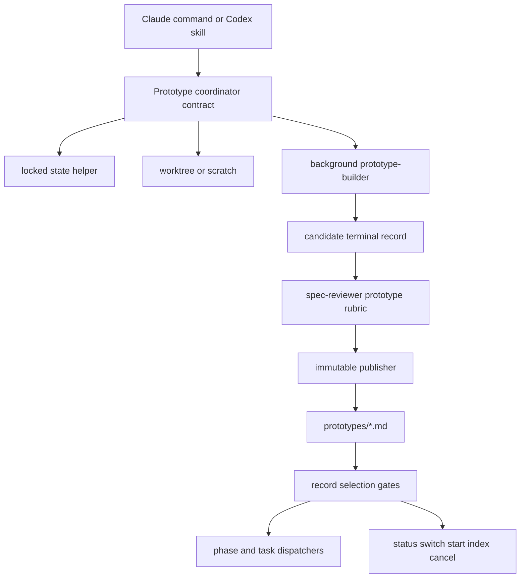

# Design: Optional prototype capability

## Overview

Ralph keeps its normal `phase` value and runs prototypes as overlay work on the active spec. Claude and Codex add matching prototype entrypoints, builder agents, immutable terminal records under `specs/<name>/prototypes/`, and gate checks before phase generation, task dispatch, and stop-hook continuation.

The implementation stays in Ralph's Markdown-command and skill architecture. One small locked state helper handles all `.ralph-state.json` writes, and one prototype publication helper handles candidate review, immutable publish, crash recovery, and downstream record selection.

## Runtime Assumptions

This design depends on current Claude Code background-agent controls. The cited docs were checked on 2026-08-27 and can drift:

- [Claude sub-agents docs](https://code.claude.com/docs/en/sub-agents) document custom subagents, background subagent behavior, and `TaskStop` availability for background subagents.
- [Claude tools reference](https://code.claude.com/docs/en/tools-reference) documents `TaskStop` as a tool that stops a running background task by ID or named background agent.

If a Claude session cannot run a named background builder or stop it, normal mode asks the user to wait or cancel before launch. Quick mode writes `verdict: failed` with `sourceDisposition: not_created` and continues to design.

## Architecture



### Modules

| Module | Interface | Implementation |
|---|---|---|
| Prototype coordinator contract | Markdown procedure read by `/ralph-specum:prototype`, `$ralph-specum-prototype`, normal phase walkthroughs, quick mode, resume, and cancel | Resolves trigger, return phase, blocker scope, duplicates, capture mode, isolation, builder control, review, publish, handoff, and active-entry cleanup |
| State transaction helper | `locked-state.py merge/upsert-prototype/remove-prototype/list/delete-state` | Uses `.ralph-state.lock`, `fcntl.flock`, read-update-fsync-replace-fsync-dir while holding the lock |
| Prototype publisher | `prototype-records.py render-candidate/publish/reconcile/select-downstream` | Writes ignored candidate bytes, reviews candidate plus source, publishes with no overwrite, recovers crash states, and selects downstream records |
| Builder adapter | Claude background subagent or Codex child agent | Runs throwaway source work in one isolated mutable path and returns source pointers plus evidence |
| Surface adapters | Claude commands and Codex skills | Translate tool syntax only; they do not fork behavior |

Coordinator contract files:
- `plugins/ralph-specum/references/prototype-coordinator.md`
- `plugins/ralph-specum-codex/references/prototype-coordinator.md`

The contracts must match after normalizing surface names and tool names. Tests compare normalized text.

## Locked State Transactions

Atomic replace alone prevents torn reads but does not prevent two writers from losing each other's updates. Every Ralph writer of `.ralph-state.json` moves to one lock protocol.

Lock protocol:
1. Open `<spec-path>/.ralph-state.lock` with create-if-missing.
2. Acquire `fcntl.flock(LOCK_EX)` with a bounded wait. Default: 10 seconds normal, 3 seconds quick.
3. While holding the lock, read `.ralph-state.json`.
4. Validate JSON object shape and required preserved fields when present.
5. Apply one update function.
6. Write `.ralph-state.json.tmp`, flush, `fsync` the temp file, then `os.replace`.
7. `fsync` the containing spec directory.
8. Release the lock.

Reads remain lock-free because replacement is atomic. A read that sees no `activePrototypes` treats it as an empty map.

Helper paths:
- Claude: `plugins/ralph-specum/hooks/scripts/locked-state.py`
- Codex: `plugins/ralph-specum-codex/scripts/locked_state.py`

Codex keeps `plugins/ralph-specum-codex/scripts/merge_state.py` as the public CLI. It becomes a compatibility wrapper around `locked_state.py merge` so existing skill text and tests keep working. Claude gets the same helper and migrates shell `jq > tmp && mv` snippets to the helper.

The state helper owns only `merge`, `upsert-prototype`, `remove-prototype`, `list`, and `delete-state`. `prototype-records.py select-downstream` is the only downstream selector. It reads an atomic state snapshot and terminal records, then returns selected evidence, stale artifacts, stale task indexes, and active blockers without writing state.

State writers migrated:
- `plugins/ralph-specum/commands/start.md`
- `plugins/ralph-specum/commands/new.md`
- `plugins/ralph-specum/commands/research.md`
- `plugins/ralph-specum/commands/requirements.md`
- `plugins/ralph-specum/commands/design.md`
- `plugins/ralph-specum/commands/tasks.md`
- `plugins/ralph-specum/commands/implement.md`
- `plugins/ralph-specum/commands/refactor.md`
- `plugins/ralph-specum/commands/cancel.md`
- `plugins/ralph-specum/commands/prototype.md`
- `plugins/ralph-specum/hooks/scripts/stop-watcher.sh` only if a future edit writes state; its gate reads stay lock-free.
- `plugins/ralph-specum-codex/skills/ralph-specum-start/SKILL.md`
- `plugins/ralph-specum-codex/skills/ralph-specum-research/SKILL.md`
- `plugins/ralph-specum-codex/skills/ralph-specum-requirements/SKILL.md`
- `plugins/ralph-specum-codex/skills/ralph-specum-design/SKILL.md`
- `plugins/ralph-specum-codex/skills/ralph-specum-tasks/SKILL.md`
- `plugins/ralph-specum-codex/skills/ralph-specum-implement/SKILL.md`
- `plugins/ralph-specum-codex/skills/ralph-specum-refactor/SKILL.md`
- `plugins/ralph-specum-codex/skills/ralph-specum-cancel/SKILL.md`
- `plugins/ralph-specum-codex/skills/ralph-specum-prototype/SKILL.md`

All state deletion also uses the lock through `delete-state`. Completion must not delete `.ralph-state.json` while `activePrototypes` is nonempty. It keeps completed task counters, phase state, and recovery pointers until terminal reconciliation empties the map. Only then may `delete-state` remove the file. `removed` is a transition result from `remove-prototype`; it is never stored as a status.

## Overlay State

Ralph never writes `phase: prototype`. Existing state files without `activePrototypes` keep working. The helper creates `activePrototypes` only when needed and removes the field when the map becomes empty.

Active entry schema:

```json
{
  "activePrototypes": {
    "<prototype-id>": {
      "id": "<prototype-id>",
      "question": "<one falsifiable question>",
      "questionHash": "<sha256-12>",
      "kind": "logic|ui",
      "captureMode": "retained|ephemeral",
      "triggerMode": "suggested|explicit|quick",
      "triggerPhase": "research|requirements|design|tasks|execution",
      "returnPhase": "research|requirements|design|tasks|execution",
      "returnTaskIndex": null,
      "status": "pending|isolating|building|reviewing|awaiting_verdict|handoff|blocked|timed_out",
      "decisionOwner": "user|agent",
      "resolutionMode": "normal|quick|quick_takeover|duplicate_reuse|supersession|timeout_resolution|lock_timeout",
      "created": "2026-08-27T18:45:00Z",
      "updated": "2026-08-27T18:45:00Z",
      "builderDeadline": null,
      "builderHardDeadline": null,
      "decisionDeadline": null,
      "heartbeatAt": null,
      "attempt": 1,
      "maxAttempts": 2,
      "harnessRun": {
        "kind": "claude_background|codex_agent",
        "id": null,
        "name": null
      },
      "recordPath": "specs/<name>/prototypes/<prototype-id>.md",
      "candidatePath": "specs/<name>/prototypes/.<prototype-id>.candidate.md",
      "candidateHash": null,
      "blocking": {
        "blocks": ["transition:requirements->design"],
        "reason": "<why the prototype matters>",
        "oldestBlockerCreated": "2026-08-27T18:45:00Z"
      },
      "isolation": {
        "mode": "worktree|scratch",
        "path": null,
        "branch": null,
        "baseCommit": "<committed HEAD>",
        "approvedTransfers": []
      },
      "sourcePointers": null,
      "supersedes": [],
      "conflictsWith": [],
      "resolves": [],
      "resolvedAt": null,
      "sourceDisposition": "pending|retained|deleted|not_created"
    }
  }
}
```

Nullable fields are allowed before source exists, for skip records, and for failure before source creation: `returnTaskIndex`, `builderDeadline`, `builderHardDeadline`, `decisionDeadline`, `heartbeatAt`, `harnessRun.id`, `harnessRun.name`, `candidateHash`, `isolation.path`, `isolation.branch`, `sourcePointers`, and `resolvedAt`.

Live statuses:
- `pending`: ID reserved, no mutable source yet.
- `isolating`: creating worktree or scratch.
- `building`: builder agent owns source.
- `reviewing`: candidate record and source are under review.
- `awaiting_verdict`: normal mode waits for user verdict with no timeout.
- `handoff`: normal mode waits for user handoff with no timeout.
- `blocked`: active entry blocks a dependent transition or task.
- `timed_out`: builder exceeded hard deadline or conflict timer expired.

## Immutable Terminal Records

### ID and Candidate Reservation

Records live at `specs/<name>/prototypes/<prototype-id>.md`.

ID normalization:
1. Lowercase ASCII.
2. Replace non-alphanumeric runs with `-`.
3. Trim leading and trailing `-`.
4. Limit the base slug to 48 characters.
5. Use `prototype-<YYYYMMDDHHMMSS>` when empty.
6. Append `-2`, `-3`, and later suffixes when an active entry, candidate, or terminal record already uses the ID.

Normal mode displays the proposed ID and lets the user edit it. Quick mode uses `quick-<YYYYMMDDHHMMSS>-<slug>`.

The coordinator reserves IDs under the state lock by writing the active entry. It then renders exact terminal-record candidate bytes to an ignored candidate file in the same `prototypes/` directory:

```text
specs/<name>/prototypes/.<prototype-id>.candidate.md
```

Add these ignore patterns:

```text
**/.ralph-state.lock
**/.ralph-state.json.tmp
specs/**/prototypes/.*.candidate.md
```

Reviewer input is the candidate file plus the referenced source. The reviewer never reviews a mutable final record.

### Frontmatter and Body

```yaml
---
spec: optional-prototype-phase
phase: prototype
id: <prototype-id>
status: terminal
verdict: validated|rejected|inconclusive|cancelled|failed|skipped
kind: logic|ui
captureMode: retained|ephemeral
triggerMode: suggested|explicit|quick
triggerPhase: requirements
returnPhase: design
returnTaskIndex: null
decisionOwner: user|agent
resolutionMode: normal|quick|quick_takeover|duplicate_reuse|supersession|timeout_resolution|lock_timeout
gateApproved: true|false
created: 2026-08-27T18:45:00Z
completed: 2026-08-27T19:10:00Z
sourceDisposition: retained|deleted|not_created
supersedes: []
conflictsWith: []
resolves: []
resolvedAt: null
---
```

Required body sections:
1. `## Question`
2. `## Blocking Declaration`
3. `## Isolation`
4. `## Run Instructions`
5. `## Cases Or Variants`
6. `## Evidence And Observations`
7. `## Verdict`
8. `## Downstream Handoff`
9. `## Conflict Resolution`
10. `## Staleness`
11. `## Source Disposition`

`sourceDisposition: not_created` is required for `skipped` and for failures before source creation. Those records set isolation path, branch, source pointers, and run instructions to `null` or `none`.

Resolution records require either `conflictsWith` or `resolves` IDs, `resolvedAt`, and a `## Conflict Resolution` section. The section lists evidence pointers and the rationale for the winner and losers. `supersedes` remains the downstream exclusion mechanism for replaced evidence.

### Publish Protocol

Publication must never overwrite a final record:
1. Write candidate bytes in the same `prototypes/` directory.
2. Flush and `fsync` the candidate file.
3. Publish with `os.link(candidate, final)` when supported. If hard links are unavailable, use `open(final, O_CREAT|O_EXCL)` and copy exact bytes.
4. `fsync` the final file and directory.
5. Re-read final bytes and parse frontmatter.
6. Treat an existing final path as an ID collision. Never overwrite.
7. Delete the candidate only after final bytes and candidate bytes match by hash.
8. Remove the active entry in a second locked state transaction after final verification.

Terminal records are immutable. Corrections, conflict resolutions, cancellations, changed conclusions, and timeout decisions write a new record with `supersedes: [old-id]`. Ralph never deletes immutable final evidence automatically.

### Resume Reconciliation

At prototype, start, status, phase, and stop-hook boundaries, run reconciliation:

| State | Action |
|---|---|
| Candidate exists, final missing | Resume review and publish flow from candidate |
| Candidate exists, valid final exists, hashes match | Delete candidate and remove active entry idempotently |
| Candidate exists, valid final exists, hashes differ | Quarantine candidate and require review or a new superseding ID |
| Valid final exists with active entry | Remove active entry idempotently |
| Malformed final exists | Quarantine from downstream, write a new superseding ID if correction is needed |
| Final exists, no active entry | Treat complete |
| Active entry exists, no candidate, no final | Resume from active status and source pointers |

Malformed final records stay on disk and never feed downstream.

## Gate Approval and Downstream Selection

Normal `gateApproved` is true only when the user explicitly includes a `validated` or `rejected` record for downstream use. Excluded, inconclusive, cancelled, failed, skipped, malformed, and superseded records never feed downstream. Quick `validated` and `rejected` records are agent-approved; quick skipped, failed, and inconclusive records are not.

Handoff mapping:

| Handoff outcome | gateApproved | Phase and task update | Persisted evidence |
|---|---|---|---|
| Resume origin unchanged and include evidence | True only for user-included `validated` or `rejected` | Restore `phase` to `returnPhase` for planning, or keep `phase: execution` with `taskIndex = returnTaskIndex` | Terminal record says included |
| Resume origin unchanged and exclude evidence | False | Same return update | Terminal record says excluded |
| Revise earliest affected artifact and cascade | True only for user-included `validated` or `rejected` | Set `phase` to the selected earliest affected phase, set `awaitingApproval: false`, preserve `returnTaskIndex`, and after overlay completion merge the main phase back to that selected phase | Terminal record lists stale artifacts and task indexes |
| Abandon or replace interrupted work | False unless user includes a validated or rejected replacement record | Set `phase` to the selected replacement phase, preserve partial source and task history, preserve `returnTaskIndex`, and after overlay completion merge the main phase back to that selected phase | Terminal record lists abandoned or replaced task indexes and source paths |

`.progress.md` mirrors stale notes for humans only. Every phase and task dispatcher calls record selection and stale checks before work, so stale files or tasks cannot run just because `.progress.md` was missed.

Dispatcher gates:
- Before phase generation in `research.md`, `requirements.md`, `design.md`, `tasks.md`, and Codex matching skills.
- Before task dispatch in `implement.md`, `agents/spec-executor.md`, and Codex implement guidance.
- Before stop-hook continuation in `plugins/ralph-specum/hooks/scripts/stop-watcher.sh` and `plugins/ralph-specum-codex/hooks/stop-watcher.sh`.

Unrelated parallel tasks may run only when dependency and path checks prove they do not touch blocked artifacts, blocked task indexes, or approved transfer paths.

## Normal Flow

Research and requirements walkthroughs add `continue to prototype` beside the existing next-phase choice. Selecting it approves the current artifact, records `triggerMode: suggested`, and sets `returnPhase` to the next normal phase.

Direct invocation uses `/ralph-specum:prototype` or `$ralph-specum-prototype` from any main phase, including tasks and active execution. It preserves the current `phase`, records the current phase as `triggerPhase`, and records the resume target in `returnPhase` plus `returnTaskIndex` when execution is active.

Capture mode choice:
- Coordinator recommends `retained` for app-integrated, multi-file, authenticated, real-data, or expensive-to-reconstruct work.
- Coordinator recommends `ephemeral` for self-contained one-off logic work.
- Normal mode shows both choices, explains source cleanup impact, and persists the user's selected `captureMode` before isolation.
- If the user selected retained and no worktree is available, Ralph does not downgrade. It asks the user to wait, cancel, or explicitly switch to ephemeral scratch.
- Scratch remains eligible only for self-contained logic. The selected mode is preserved unless the user changes it.

Safe interruption:
- Do not stop a running tool call.
- If a builder or task is live, mark the prototype request as `blocked` until the next safe tool boundary.
- If the active prototype blocks the current task or transition, stop that dependent work.
- If it does not block the current work, continue unrelated work after dependency and path checks.

Duplicate handling:
- Same `questionHash` and same blocker target: offer resume, supersede, or create a distinct record.
- Same blocker target with different evidence: create a conflict set and start the conflict-decision deadline.
- Explicit ID resumes that active entry.
- One active entry resumes automatically.
- Several active entries without ID are listed for selection.

Normal verdict and handoff never time out. Ralph waits for the user unless a separate conflict between records exists.

Normal cleanup sequence for ephemeral source:
1. Get a user-approved verdict.
2. Complete and persist the selected handoff outcome.
3. Ask for exact deletion confirmation naming the scratch path.
4. Delete only after confirmation. Interrupt and cancel preserve source.

Normal cancellation:
1. Stop only at a safe tool boundary, then write an immutable terminal record with `verdict: cancelled`, `gateApproved: false`, and `sourceDisposition: retained` when source exists or `not_created` when it does not.
2. Preserve the worktree, partial implementation, task progress, origin phase, `returnPhase`, `returnTaskIndex`, and downstream artifacts unchanged.
3. Publish and verify the cancelled record through the normal candidate and immutable publish path.
4. Remove the active entry only after final-record verification succeeds.
5. Return to `returnPhase` or the recorded origin phase. If execution was active, restore `taskIndex` from `returnTaskIndex`.
6. Require separate exact approval before deleting a worktree, scratch path, branch, candidate quarantine, or terminal record.

## Quick Flow

Quick mode runs exactly one unattended prototype attempt after requirements and before design.

Before any quick run, Ralph classifies capture mode:
- `retained` when partial source could matter after `failed` or `inconclusive`, including app-integrated UI, multi-file source, authenticated data, real route context, or expensive reconstruction.
- `ephemeral` only when partial source has no reuse value, such as a standalone logic scratch demo with simple generated state.

Ralph never reclassifies failed ephemeral work to retained after the run. If an ephemeral quick run fails before source creation, the terminal record uses `sourceDisposition: not_created` and null source pointers.

Quick takeover of the oldest active blocker:

| Live status | Quick action |
|---|---|
| `pending` | Preserve trigger data, set `decisionOwner: agent`, set `resolutionMode: quick_takeover`, continue from reservation |
| `isolating` | Join or stop setup safely, then retry isolation once if needed |
| `building` | Join the builder with remaining timeout; interrupt at hard deadline |
| `reviewing` | Finish current review if bounded, otherwise rerun review against candidate and source |
| `awaiting_verdict` | Skip normal prompt, choose agent verdict from candidate, source, and evidence |
| `handoff` | Skip normal handoff, choose quick include or exclude rules |
| `blocked` | Resolve blocker under quick rules |
| `timed_out` | Publish failed or inconclusive record from available evidence |

The takeover preserves original trigger data, source pointers, `returnPhase`, and `returnTaskIndex`. It stores the harness task or agent ID, heartbeat timestamps, `decisionOwner: agent`, and `resolutionMode: quick_takeover`. It counts as the one quick attempt.

If no active design blocker exists, Ralph selects the highest-risk grounded falsifiable question from requirements and research. If none exists, it writes `verdict: skipped`, `sourceDisposition: not_created`, null source pointers, and continues.

Quick duplicate and conflict handling:
- Exact duplicate with gate-approved evidence: write a `duplicate_reuse` record pointing at the reused record, count it as the one quick attempt, and do not start a builder.
- Duplicate without gate-approved evidence: write a supersession record, count it as the one quick attempt, and do not start a builder.
- Conflicting records: choose using the evidence-backed conflict rules below, record the resolution, count it as the one quick attempt, exclude losers, and continue without starting a builder.
- Extra active prototypes stay in `activePrototypes`, excluded from design input, and cannot stop quick continuation.

Quick always continues to design. Quick `validated` and `rejected` records become design evidence. Quick `skipped`, `failed`, and `inconclusive` records do not.

Quick lock failure:
1. Try to acquire the state lock once.
2. If it times out, make one bounded mechanical retry.
3. If it still fails, leave state and blockers untouched.
4. Use the publisher-only collision-safe ID path to schema-validate and exclusively publish a terminal record with `verdict: failed`, `sourceDisposition: not_created`, null isolation and source pointers, `gateApproved: false`, and `resolutionMode: lock_timeout`.
5. Continue to design with no downstream evidence.

## Conflict Decisions

Conflict-decision deadlines start only when two or more live or terminal records affect the same downstream target with incompatible evidence or handoff rules. Ordinary normal verdict and handoff waits have no deadline.

Normal default: half the builder timeout, clamped between 10 and 30 minutes. User messages, verdict selection, handoff selection, or reviewer feedback reset the timer once. Quick timeout is 0 minutes.

No scheduler is guaranteed. Ralph evaluates expiry at the first later boundary: prototype command, start, status, phase command, implement loop, or stop-hook continuation. If the user's reply arrives after expiry, Ralph first writes the automatic resolution record, then lets the user supersede it with a new record.

Automatic selection must use all of:
- Reviewer-passed runnable evidence.
- Direct relevance to the blocked question or transition.
- Recorded observations.
- Source disposition and run instructions.

Ralph does not rank `validated` above `rejected` by verdict alone. A rejected prototype can be the supported winner when it proves an option must not feed design.

If no supported winner exists, normal mode writes a failed conflict-resolution record and dependent work stays blocked. Quick mode excludes all conflicting evidence and continues.

Conflict-resolution records set `resolvedAt` and either `conflictsWith` or `resolves`. Their `## Conflict Resolution` section names the conflicting record IDs, evidence pointers, selected winner when one exists, excluded losers, and the recorded rationale. The resolution record may supersede losers; `supersedes` is the selector mechanism that keeps losers out of downstream input.

## Builder Timers and Control

Builder timeout defaults:
- Normal logic: 20 minutes.
- Normal UI: 45 minutes.
- Quick logic: 10 minutes.
- Quick UI: 20 minutes.

Add 2 minutes per approved transferred path, capped at 10 added minutes. Activity extends the rolling deadline to `now + 10 minutes`, capped by `builderHardDeadline = started + 2 * initialTimeout`.

Activity signals:
- Builder output chunk.
- File modification under isolation path.
- Active state heartbeat update.
- Reviewer start or reviewer result.

Claude execution:
- Start `prototype-builder` as a named background subagent.
- Store background task or agent ID and name in `harnessRun`.
- Use bounded background-output waits no longer than the remaining rolling deadline.
- Call `TaskStop` at the hard deadline.
- If `TaskStop` is unavailable, normal asks wait or cancel before launch; quick writes failed record and continues.

Codex execution:
- Start a child agent with a fixed name derived from prototype ID.
- Store only the child-agent `agentId` in `harnessRun`.
- Use `wait_agent` with the remaining timeout.
- Call `interrupt_agent` at hard deadline.
- Do not use `create_thread`, task `threadId`, or user-visible Codex tasks for internal prototype builders.
- If these controls are unavailable, normal asks wait or cancel before launch; quick writes failed record and continues.

Normal mode allows two builder attempts before asking the user whether to retry, record failure, or cancel. Quick allows exactly two attempts total: initial attempt plus one retry.

## Isolation Mechanics

Default isolation uses a sibling worktree from committed `HEAD`:

```text
../<repo-name>-prototype-<spec-name>-<prototype-id>
prototype/<spec-name>/<prototype-id>
```

The current conversation checkout never switches branch. All builder commands run with `git -C <worktree>`.

Normal dirty transfer:
1. Read `git status --porcelain=v1`.
2. Display every proposed tracked dirty path, staged path, and untracked path.
3. Ask the user to approve exact paths.
4. For tracked changes, create per-path binary patches from staged and unstaged diffs, run `git -C <worktree> apply --check`, then apply.
5. For untracked paths, copy only approved regular files after `realpath` proves each source and destination stays inside expected roots. Reject symlinks by default.
6. Verify the isolated diff path list equals the approved transfer list.

Scratch fallback:
- Normal logic prototypes may use scratch under the system temp directory only when the source is one standalone HTML file and no app route is needed.
- Scratch fallback supports only `captureMode: ephemeral`.
- Normal retained, UI, or app-integrated prototypes stop and ask the user to wait, cancel, or explicitly switch to ephemeral scratch when eligible.
- Quick may use scratch for eligible logic work. If worktree and scratch both fail, quick retries once and records `failed`.

Retained source always gets a local commit on the isolated prototype branch, independent of `commitSpec`. Ralph never pushes that branch or mutates an issue without separate authority.

## Logic and UI Contracts

Logic:
- One self-contained HTML file.
- Visible question at the top.
- Pure reducer, state machine, or function set with no DOM dependency.
- Labeled state after each action.
- Free-play actions.
- Guided normal, edge, and illegal-action cases that reset to a known state.

UI:
- Prefer an existing route and keep existing data, parameters, and auth.
- Swap only the relevant rendered subtree.
- Provide exactly three variants.
- Variants differ by layout, information hierarchy, and primary action.
- Each variant is reachable with `?variant=`.
- One shared fixed-bottom switcher shows current variant, stores selection in `?variant=`, reconstructs the same variant on reload, supports arrow keys, ignores inputs and editable fields, and is gated out of production.

## Reviewer Rubric

`spec-reviewer` accepts `artifactType: prototype` and stays read-only.

`REVIEW_PASS` requires:
- Candidate has required frontmatter and body sections.
- Record ID, candidate path, final path, and active state agree.
- Source exists only in the isolated path or has `sourceDisposition: not_created`.
- Logic or UI source meets its contract.
- Source disposition, blocker, handoff, stale artifacts, and downstream evidence are explicit.
- Terminal verdict is valid and gate approval matches mode rules.

`REVIEW_FAIL` reports exact missing fields, source mismatch, unsafe isolation, invalid verdict, missing run instructions, production-source leakage, missing blocker, unclear downstream effect, or malformed candidate bytes.

## Commit and Remote Behavior

`commitSpec` continues to control spec artifacts. Prototype terminal records are spec artifacts, so the coordinator may create a local commit for `specs/<name>/prototypes/<id>.md` when `commitSpec` is true.

Prototype commands do not push any branch. Retained prototype source commits remain local in isolated branches. Existing `commitSpec` authorizes local spec commits only. Neither retained source nor prototype terminal records may be included in any later push without separate explicit authorization. Issue pointers are recorded as `pending authorization` unless the user separately authorizes an issue write.

## Error Handling

| Error Scenario | Handling Strategy | User Impact |
|---|---|---|
| State lacks `activePrototypes` | Treat as empty map | Existing specs continue |
| Lock acquisition timeout | Normal stops before mutation; quick retries once, then publishes a `lock_timeout` failed record through the publisher-only path without touching state | No lost update |
| Crash before replace | Temp file ignored and next run retries locked update | State remains valid |
| Crash after replace | Directory fsync makes replacement durable; next run reconciles | Active entry resumes |
| Candidate exists, final missing | Resume candidate review and publish | No duplicate record |
| Candidate and valid final exist with same hash | Delete candidate and remove active entry | Publish cleanup completes |
| Candidate and valid final exist with different hash | Quarantine candidate | Conflicting bytes do not replace final evidence |
| Final exists before publish | Treat as collision and allocate next ID | No overwrite |
| Malformed final | Quarantine from downstream and require superseding ID | Bad evidence stays out of design |
| Completion with active prototypes | Keep `.ralph-state.json` under lock until active map is empty | Recovery evidence remains |
| Worktree creation fails | Normal retained mode asks wait or cancel, or lets the user explicitly switch to eligible ephemeral scratch; normal UI or app-integrated work does not downgrade; quick retries once | Current checkout stays unchanged |
| Dirty transfer fails | Drop failed path and ask again in normal; quick never transfers | No silent copy |
| Builder timeout | Stop or interrupt builder, then retry or publish terminal record | No indefinite wait |
| Reviewer fails record | Ask for fix in normal; quick records `inconclusive` or `failed` and continues | Invalid evidence stays out of design |
| Cancel during prototype | At a safe boundary, write and verify an immutable `cancelled` record, preserve worktree, partial implementation, task progress, origin phase, downstream artifacts, and remove active entry only after record verification | Recovery evidence remains and deletion stays separately approved |
| Deletion requested | Ask exact confirmation for path or branch | Destructive action is explicit |

## Exact File Map

Claude package changes:
- `plugins/ralph-specum/commands/prototype.md`: create direct coordinator command.
- `plugins/ralph-specum/commands/new.md`: migrate any state creation or reset to the locked state helper and show prototype blockers.
- `plugins/ralph-specum/agents/prototype-builder.md`: create builder agent.
- `plugins/ralph-specum/templates/prototype.md`: create terminal record template.
- `plugins/ralph-specum/references/prototype-coordinator.md`: create shared coordinator contract.
- `plugins/ralph-specum/hooks/scripts/locked-state.py`: create lock-backed state helper.
- `plugins/ralph-specum/hooks/scripts/prototype-records.py`: create candidate, publish, reconcile, select helper.
- `plugins/ralph-specum/commands/research.md`: add normal prototype choice and pre-generation gate.
- `plugins/ralph-specum/commands/requirements.md`: add normal choice, quick call site, and pre-generation gate.
- `plugins/ralph-specum/commands/design.md`: select prototype evidence and enforce stale gates.
- `plugins/ralph-specum/commands/tasks.md`: select records before generation and reject stale design.
- `plugins/ralph-specum/commands/implement.md`: block stale tasks and active prototype blockers before dispatch.
- `plugins/ralph-specum/commands/refactor.md`: migrate state writes to locked helper and enforce prototype gates before refactor work.
- `plugins/ralph-specum/commands/start.md`: show active prototypes, reconcile candidates, and route resume.
- `plugins/ralph-specum/commands/status.md`: show active entries, candidates, terminal records, and quarantines.
- `plugins/ralph-specum/commands/switch.md`: show blockers for selected spec.
- `plugins/ralph-specum/commands/cancel.md`: cancel active prototypes and gate deletion.
- `plugins/ralph-specum/commands/help.md`: document direct helper, normal choice, quick takeover, and no remote actions.
- `plugins/ralph-specum/hooks/scripts/load-spec-context.sh`: show active prototypes and prototype resume guidance.
- `plugins/ralph-specum/hooks/scripts/update-spec-index.sh`: include derived prototype counts and blocker status.
- `plugins/ralph-specum/hooks/scripts/stop-watcher.sh`: check active blockers and stale task gates before continuation.
- `plugins/ralph-specum/references/spec-scanner.md`: add prototype record and candidate scan rules.
- `plugins/ralph-specum/agents/spec-executor.md`: honor stale task and active blocker gates.
- `plugins/ralph-specum/agents/spec-reviewer.md`: add prototype candidate rubric.
- `plugins/ralph-specum/schemas/spec.schema.json`: add prototype frontmatter schema without adding `prototype` to top-level phase enum.
- `plugins/ralph-specum/references/quick-mode.md`: insert one quick attempt after requirements.
- `plugins/ralph-specum/skills/spec-workflow/SKILL.md`: document overlay behavior.
- `plugins/ralph-specum/skills/spec-workflow/references/phase-transitions.md`: document optional overlay, not a new phase.
- `plugins/ralph-specum/skills/smart-ralph/SKILL.md`: add state, commit, and no-remote behavior.
- `plugins/ralph-specum/skills/smart-ralph/references/state-file-schema.md`: add optional `activePrototypes`.
- `plugins/ralph-specum/references/branch-management.md`: add prototype worktree and scratch rules.
- `.gitignore`: ignore `**/.ralph-state.lock`, `**/.ralph-state.json.tmp`, and `specs/**/prototypes/.*.candidate.md`.
- `README.md`: document user behavior.
- `plugins/ralph-specum/.claude-plugin/plugin.json`: bump to same new minor version.
- `.claude-plugin/marketplace.json`: bump same entry version.

Codex package changes:
- `plugins/ralph-specum-codex/skills/ralph-specum-prototype/SKILL.md`: create helper skill.
- `plugins/ralph-specum-codex/skills/ralph-specum-prototype/agents/openai.yaml`: create routing metadata.
- `plugins/ralph-specum-codex/agent-configs/prototype-builder.toml.template`: create builder template.
- `plugins/ralph-specum-codex/templates/prototype.md`: create terminal record template.
- `plugins/ralph-specum-codex/references/prototype-coordinator.md`: create Codex contract.
- `plugins/ralph-specum-codex/scripts/locked_state.py`: create locked state library and CLI.
- `plugins/ralph-specum-codex/scripts/prototype_records.py`: create candidate, publish, reconcile, select helper.
- `plugins/ralph-specum-codex/scripts/merge_state.py`: keep CLI, wrap locked merge.
- `plugins/ralph-specum-codex/skills/ralph-specum/SKILL.md`: add routing and coordinator rules.
- `plugins/ralph-specum-codex/skills/ralph-specum/agents/openai.yaml`: add prototype routing metadata.
- `plugins/ralph-specum-codex/skills/ralph-specum-start/SKILL.md`: resume active prototypes and reconcile candidates.
- `plugins/ralph-specum-codex/skills/ralph-specum-start/agents/openai.yaml`: add helper metadata.
- `plugins/ralph-specum-codex/skills/ralph-specum-research/SKILL.md`: add normal choice and gate.
- `plugins/ralph-specum-codex/skills/ralph-specum-research/agents/openai.yaml`: add routing metadata.
- `plugins/ralph-specum-codex/skills/ralph-specum-requirements/SKILL.md`: add normal choice, quick call, and gate.
- `plugins/ralph-specum-codex/skills/ralph-specum-requirements/agents/openai.yaml`: add routing metadata.
- `plugins/ralph-specum-codex/skills/ralph-specum-design/SKILL.md`: select records and enforce stale gates.
- `plugins/ralph-specum-codex/skills/ralph-specum-design/agents/openai.yaml`: add routing metadata.
- `plugins/ralph-specum-codex/skills/ralph-specum-tasks/SKILL.md`: reject stale design and select records.
- `plugins/ralph-specum-codex/skills/ralph-specum-tasks/agents/openai.yaml`: add routing metadata.
- `plugins/ralph-specum-codex/skills/ralph-specum-implement/SKILL.md`: block stale tasks and active blockers.
- `plugins/ralph-specum-codex/skills/ralph-specum-implement/agents/openai.yaml`: add routing metadata.
- `plugins/ralph-specum-codex/skills/ralph-specum-refactor/SKILL.md`: migrate state writes to locked helper and enforce prototype gates before refactor work.
- `plugins/ralph-specum-codex/skills/ralph-specum-refactor/agents/openai.yaml`: add routing metadata for the migrated refactor skill.
- `plugins/ralph-specum-codex/skills/ralph-specum-status/SKILL.md`: show active, candidate, terminal, and quarantined records.
- `plugins/ralph-specum-codex/skills/ralph-specum-switch/SKILL.md`: show blockers.
- `plugins/ralph-specum-codex/skills/ralph-specum-cancel/SKILL.md`: cancel active prototypes and gate deletion.
- `plugins/ralph-specum-codex/skills/ralph-specum-help/SKILL.md`: document helper and no-remote behavior.
- `plugins/ralph-specum-codex/hooks/stop-watcher.sh`: check blockers and stale task gates before continuation.
- `plugins/ralph-specum-codex/agent-configs/spec-reviewer.toml.template`: add prototype rubric.
- `plugins/ralph-specum-codex/schemas/spec.schema.json`: mirror frontmatter schema.
- `plugins/ralph-specum-codex/references/workflow.md`: add overlay, quick takeover, and gates.
- `plugins/ralph-specum-codex/references/state-contract.md`: add locked state and optional overlay.
- `plugins/ralph-specum-codex/references/parity-matrix.md`: add command and behavior mapping.
- `plugins/ralph-specum-codex/assets/bootstrap/AGENTS.md`: add consumer guidance.
- `plugins/ralph-specum-codex/README.md`: document user behavior.
- `plugins/ralph-specum-codex/.codex-plugin/plugin.json`: bump to same new minor version.

Codex metadata files do not write state directly. They must route only to skills and helpers that use the locked transaction helper.

## Technical Decisions

| Decision | Options Considered | Choice | Rationale |
|---|---|---|---|
| Main phase | New phase, overlay, progress-only | Overlay | Preserves current phase enum and meets requirements |
| State writes | Atomic replace only, per-writer locks, common helper | Common `.ralph-state.lock` helper | Prevents lost updates across phase and prototype writers |
| Record publication | Write final directly, mutable file, candidate then no-overwrite publish | Candidate then no-overwrite publish | Allows review before immutable evidence exists |
| Timer control | Check after return, scheduler, bounded background waits | Bounded waits plus stop or interrupt | Gives executable timeouts per harness |
| Normal handoff | Deadline, no deadline, quick takeover | No deadline except record conflicts | Preserves user-owned verdicts |
| Quick source mode | Retain after failure, classify before run, always retained | Classify before run | Prevents post-failure reclassification |
| Conflict choice | Verdict rank, newest, evidence-backed | Evidence-backed | A rejected record can carry the decisive evidence |
| Remote actions | Auto-push, issue write, local-only | Local-only | Scope authorizes local capture only |

## Security and Performance

Security:
- No remote push, issue mutation, path deletion, branch deletion, or final-record deletion without separate authority.
- Dirty transfer copies only approved paths and rejects symlinks by default.
- Builder prompts require token and credential redaction.
- Quarantined malformed records never feed downstream.

Performance:
- Record scanning is bounded to one spec directory.
- `activePrototypes` is absent when unused.
- Lock waits are bounded.
- Builder deadlines are enforced during bounded background waits with `TaskStop` or `interrupt_agent`.
- Conflict-decision deadlines are evaluated at later command or hook boundaries because no user-wait scheduler is guaranteed.

## Test Strategy

State and publish tests:
- Concurrent upsert, concurrent upsert/remove, overlay plus phase merge, state deletion under lock, completion blocked by nonempty `activePrototypes`, lock timeout, quick lock retry plus publisher-only failed record, crash before replace, crash after replace, empty-map removal, and Codex `merge_state.py` wrapper compatibility.
- Candidate review failure, publish collision, crash before publish, crash after publish before active removal, valid final plus active entry, candidate plus valid final with matching hash cleanup, candidate plus valid final with mismatched hash quarantine, malformed final quarantine, candidate/no final resume, final/no active completion, and candidate ignore patterns.
- No-source skip and failure records with `sourceDisposition: not_created` and null pointers.

Workflow tests:
- Suggested trigger after research and requirements, normal capture recommendation and persisted choice, retained mode with no-worktree wait/cancel/switch choices, direct invocation from every main phase, implicit artifact approval, current-phase preservation, safe execution interruption, blocker-only pausing, duplicate handling, conflict resolution, conflict record required fields and body, normal handoff choices, immutable cancellation record verification before active-entry removal, cancellation preservation of worktree, partial implementation, task progress, origin phase, and downstream artifacts, user-approved verdict before ephemeral cleanup, settled handoff before deletion confirmation, deletion gate, revision cascade, replace flow, and partial implementation preservation.
- Gate selection before every phase generation, task dispatch, and Stop-hook continuation.
- Stale task recovery and unrelated parallel task dependency or path checks.
- Context and index visibility through `load-spec-context.sh`, `update-spec-index.sh`, status, switch, and start.
- Remote safety tests prove retained source and terminal records are not pushed without separate explicit authorization.

Quick tests:
- Exactly one attempt after requirements, committed `HEAD` only, capture-mode classification before run, oldest blocker takeover for each live status, no user questions, duplicate reuse consumes the attempt, supersession consumes the attempt, conflict resolution consumes the attempt, one retry, no-source records, preserved extra active records, and unconditional continuation to design.

Builder and reviewer tests:
- Logic HTML visible question, pure module, labeled state, free play, normal, edge, and illegal cases.
- UI existing-route preference, three variants, `?variant=`, one shared fixed switcher, reload reconstruction, arrow keys, input guard, production gate.
- Codex builder uses child-agent `agentId` only and rejects `create_thread` or task `threadId` for internal prototype builders.
- `REVIEW_PASS` and `REVIEW_FAIL` for valid, malformed, unsafe, missing evidence, bad gate approval, and production-source leakage cases.

Regression commands:

```bash
bats tests/prototype-state.bats tests/prototype-records.bats tests/prototype-phase.bats
bats tests/codex-plugin.bats tests/codex-platform.bats tests/codex-platform-scripts.bats
bats tests/state-management.bats tests/stop-hook.bats tests/integration.bats
bats tests/*.bats
bash tests/helpers/version-sync.sh
bash -n plugins/ralph-specum/hooks/scripts/*.sh plugins/ralph-specum-codex/hooks/*.sh
jq empty plugins/ralph-specum/schemas/spec.schema.json plugins/ralph-specum-codex/schemas/spec.schema.json
git diff --check
```

## Requirement Traceability

| Requirement | Design Coverage |
|---|---|
| FR-1 | Data Flow, Normal Flow, gate checks, surface adapters |
| FR-2 | Isolation Mechanics, Commit and Remote Behavior, immutable cancellation record, cancel preservation, and deletion gates |
| FR-3 | Overlay State, Immutable Terminal Records, Locked State Transactions |
| FR-4 | Gate Approval and Downstream Selection, Normal Flow, staleness cascade |
| FR-5 | Overlay schema, duplicate handling, Conflict Decisions, Builder Timers |
| FR-6 | Quick Flow, quick takeover, capture-mode classification, one retry |
| FR-7 | Logic and UI Contracts, Builder Timers, Reviewer Rubric |
| FR-8 | Exact File Map, Test Strategy, version parity |
| NFR-1 | Worktree isolation, dirty transfer, no checkout switching |
| NFR-2 | Isolation Mechanics, overlay schema, Error Handling |
| NFR-3 | Immutable Terminal Records, Resume Reconciliation, source disposition |
| NFR-4 | Builder Timers, Conflict Decisions, quick continuation |
| NFR-5 | Exact File Map, Test Strategy, same new minor version |

## Blocking Ambiguity

None. Requirements authorize the overlay schema, immutable records, isolation mechanics, timeout formulas, quick ownership, locked state helper, candidate publication, and `commitSpec` behavior within the approved bounds.
