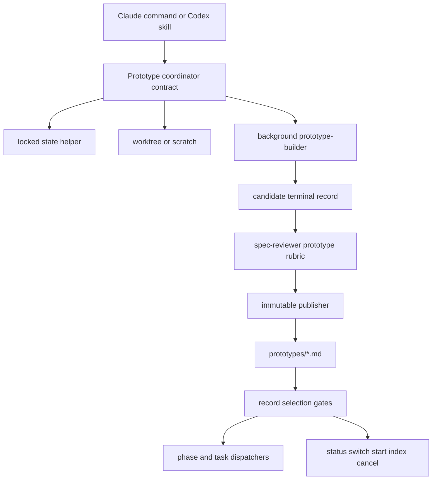

# Design: Optional prototype capability

## Overview

Ralph keeps its normal `phase` value and runs prototypes as overlay work on the active spec. Claude and Codex add matching prototype entrypoints, builder agents, immutable terminal records under `<basePath>/prototypes/`, and gate checks before phase generation, task dispatch, and stop-hook continuation.

The implementation stays in Ralph's Markdown-command and skill architecture. One small locked state helper handles all `.ralph-state.json` writes, and one prototype publication helper handles candidate review, immutable publish, crash recovery, and downstream record selection.

## Runtime Assumptions

This design depends on current Claude Code background-agent controls. The cited docs were checked on 2026-08-27 and can drift:

- [Claude sub-agents docs](https://code.claude.com/docs/en/sub-agents) document custom subagents, background subagent behavior, and `TaskStop` availability for background subagents.
- [Claude tools reference](https://code.claude.com/docs/en/tools-reference) documents `TaskStop` as a tool that stops a running background task by ID or named background agent.

If a Claude session cannot run a named background builder or stop it, normal mode asks the user to wait or cancel before launch. Quick mode writes `verdict: failed` with `sourceDisposition: not_created` and continues to design.

## Path And Configuration

Ralph resolves the active spec before any prototype operation. Claude uses `plugins/ralph-specum/hooks/scripts/path-resolver.sh`. Codex uses `plugins/ralph-specum-codex/scripts/resolve_spec_paths.py`. Both read `.claude/ralph-specum.local.md` for `specs_dirs` and default to `./specs` when the file or key is absent.

The coordinator stores resolved `specRoot` and `basePath` in active state. Record paths, candidate paths, lock paths, context loading, index updates, stop-hook checks, and Codex hook checks use that `basePath`. Design text and implementation prompts must not construct default specs-directory paths after resolution.

Prototype configuration keys live in `.claude/ralph-specum.local.md`:

| Key | Default | Validation |
|---|---:|---|
| `prototype_lock_timeout_seconds` | 10 | Integer 1 to 60 |
| `prototype_quick_lock_timeout_seconds` | 3 | Integer 1 to 30 |
| `prototype_logic_timeout_minutes` | 20 | Integer 1 to 180 |
| `prototype_ui_timeout_minutes` | 45 | Integer 1 to 240 |
| `prototype_quick_logic_timeout_minutes` | 10 | Integer 1 to 60 |
| `prototype_quick_ui_timeout_minutes` | 20 | Integer 1 to 90 |
| `prototype_activity_extension_minutes` | 10 | Integer 1 to 30 |
| `prototype_transfer_path_extra_minutes` | 2 | Integer 0 to 10 |
| `prototype_transfer_path_extra_cap_minutes` | 10 | Integer 0 to 60 |
| `prototype_hard_deadline_multiplier` | 2 | Integer 1 to 4 |
| `prototype_conflict_timeout_min_minutes` | 10 | Integer 1 to 120 |
| `prototype_conflict_timeout_max_minutes` | 30 | Integer 1 to 240 |
| `prototype_conflict_resolution_retries` | 0 | Integer 0 to 3 |
| `prototype_normal_builder_executions` | 2 | Integer 1 to 5 |
| `prototype_quick_builder_executions` | 2 | Integer 1 to 2 |

Precedence is command argument, active-state snapshot, `.claude/ralph-specum.local.md`, then default. The coordinator validates each value before writing state. Invalid values fall back to the default and the active entry records `configWarnings`. Each active entry stores `configEvidence` with the source path, resolved values, and warnings so resume uses the same limits.

## Architecture



### Modules

| Module | Interface | Implementation |
|---|---|---|
| Prototype coordinator contract | Markdown procedure read by `/ralph-specum:prototype`, `$ralph-specum-prototype`, normal phase walkthroughs, quick mode, resume, and cancel | Resolves trigger, return phase, blocker scope, duplicates, capture mode, isolation, builder control, review, publish, handoff, and active-entry cleanup |
| State transaction helper | `locked-state.py merge/upsert-prototype/remove-prototype/list/delete-state/claim-builder/heartbeat/renew-lease/release-lease/transition` | Uses `.ralph-state.lock`, compare-and-set transitions, read-update-fsync-replace while holding the lock |
| Prototype publisher | `prototype-records.py render-candidate/publish/reconcile/select-downstream` | Writes ignored candidate bytes, reviews candidate plus source, publishes with no overwrite, recovers crash states, and selects downstream records |
| Harness control adapter | `prototype-harness launch/wait/heartbeat/interrupt/status` | Gives tests one contract for Claude background agents and Codex child agents |
| Builder adapter | Claude background subagent or Codex child agent | Runs throwaway source work in one isolated mutable path and returns source pointers plus evidence |
| Surface adapters | Claude commands and Codex skills | Translate tool syntax only; they do not fork behavior |

Coordinator contract files:
- `plugins/ralph-specum/references/prototype-coordinator.md`
- `plugins/ralph-specum-codex/references/prototype-coordinator.md`

The contracts must match after normalizing surface names and tool names. Tests compare normalized text.

## Locked State Transactions

Atomic replace alone prevents torn reads but does not prevent two writers from losing each other's updates. Every Ralph writer of `.ralph-state.json` moves to one lock protocol.

Lock protocol:
1. Resolve `basePath`.
2. On POSIX, open `<basePath>/.ralph-state.lock` and acquire `fcntl.flock(LOCK_EX)` with the configured bounded wait.
3. On Windows or a Python build without `fcntl`, create `<basePath>/.ralph-state.lock` as a lock directory with `os.mkdir`. Atomic directory creation is the lock.
4. Write lock owner metadata containing host, pid, command, timestamp, and heartbeat timestamp.
5. While holding the lock, read `<basePath>/.ralph-state.json`.
6. Validate JSON object shape and required preserved fields when present.
7. Apply one update function.
8. Write `<basePath>/.ralph-state.json.tmp`, flush, `fsync` the temp file, then `os.replace`.
9. On POSIX and platforms that support opening a directory handle, make a best-effort `fsync` of the containing spec directory.
10. Release the lock. POSIX unlocks with `flock(LOCK_UN)`. The Windows path removes the lock directory only after deleting the owner metadata.

Unsupported directory `fsync` does not turn a successful replace into a failure. Crash durability claims are strongest on platforms with directory `fsync`; on Windows the helper guarantees flushed temp-file bytes and atomic `os.replace`, then reports directory durability as best effort.

Stale lock behavior:
- If acquisition times out, the helper reads owner metadata.
- It may break a stale Windows lock only when the heartbeat age exceeds 10 minutes and the recorded pid is absent on the same host.
- It never breaks a POSIX `flock`; the OS releases that lock when the owner process exits.
- Normal commands stop before mutation on timeout. Quick mode follows the publisher-only `lock_timeout` path.

Reads remain lock-free because replacement is atomic. A read that sees no `activePrototypes` treats it as an empty map.

Helper paths:
- Claude: `plugins/ralph-specum/hooks/scripts/locked-state.py`
- Codex: `plugins/ralph-specum-codex/scripts/locked_state.py`

Codex keeps `plugins/ralph-specum-codex/scripts/merge_state.py` as the public CLI. It becomes a compatibility wrapper around `locked_state.py merge` so existing skill text and tests keep working. Claude gets the same helper and migrates shell `jq > tmp && mv` snippets to the helper.

The state helper owns only `merge`, `upsert-prototype`, `remove-prototype`, `list`, `delete-state`, `claim-builder`, `heartbeat`, `renew-lease`, `release-lease`, and `transition`. `claim-builder` is an atomic compare-and-set operation. `heartbeat` updates `heartbeatAt`; `renew-lease` extends `leaseExpires` within the hard deadline; `release-lease` clears owner fields after completion, timeout, or cancellation; `transition` moves an entry between non-builder statuses with an expected `stateRevision`. `prototype-records.py select-downstream` is the only downstream selector. It reads an atomic state snapshot and terminal records, then returns selected evidence, stale artifacts, stale task indexes, and active blockers without writing state.

State writers migrated:
- `plugins/ralph-specum/commands/start.md`
- `plugins/ralph-specum/commands/new.md`
- `plugins/ralph-specum/commands/research.md`
- `plugins/ralph-specum/commands/requirements.md`
- `plugins/ralph-specum/commands/design.md`
- `plugins/ralph-specum/commands/tasks.md`
- `plugins/ralph-specum/commands/implement.md`
- `plugins/ralph-specum/commands/refactor.md`
- `plugins/ralph-specum/commands/cancel.md`
- `plugins/ralph-specum/commands/prototype.md`
- `plugins/ralph-specum/agents/research-analyst.md`
- `plugins/ralph-specum/agents/product-manager.md`
- `plugins/ralph-specum/agents/architect-reviewer.md`
- `plugins/ralph-specum/agents/task-planner.md`
- `plugins/ralph-specum/references/coordinator-pattern.md`
- `plugins/ralph-specum/references/failure-recovery.md`
- `plugins/ralph-specum/references/spec-scanner.md`
- `plugins/ralph-specum/references/quick-mode.md`
- `plugins/ralph-specum/references/branch-management.md`
- `plugins/ralph-specum/hooks/scripts/stop-watcher.sh` for any prompted or direct state update; its gate reads stay lock-free.
- `plugins/ralph-specum-codex/skills/ralph-specum-start/SKILL.md`
- `plugins/ralph-specum-codex/skills/ralph-specum/SKILL.md`
- `plugins/ralph-specum-codex/skills/ralph-specum-implement/SKILL.md`
- `plugins/ralph-specum-codex/skills/ralph-specum-refactor/SKILL.md`
- `plugins/ralph-specum-codex/skills/ralph-specum-cancel/SKILL.md`
- `plugins/ralph-specum-codex/skills/ralph-specum-prototype/SKILL.md`
- `plugins/ralph-specum-codex/references/workflow.md`
- `plugins/ralph-specum-codex/references/state-contract.md`
- `plugins/ralph-specum-codex/scripts/merge_state.py`
- `plugins/ralph-specum-codex/scripts/locked_state.py`

The repo inspection found these direct write or delete forms: `jq ... > .ralph-state.json.tmp && mv`, task-agent approval writes, command initialization writes, command completion deletes, cancel deletes, quick-mode discovered-skill updates, coordinator native task map writes, failure-recovery updates, spec-scanner related-spec updates, branch-management worktree state copies, Codex `merge_state.py`, Codex implement deletion, and Codex cancel deletion. Each operation uses `merge`, `upsert-prototype`, `remove-prototype`, or `delete-state` through the shared helper after this feature.

All state deletion also uses the lock through `delete-state`. Completion must not delete `.ralph-state.json` while `activePrototypes` is nonempty. It keeps completed task counters, phase state, and recovery pointers until terminal reconciliation empties the map. Only then may `delete-state` remove the file. `removed` is a transition result from `remove-prototype`; it is never stored as a status.

## Overlay State

Ralph never writes `phase: prototype`. Existing state files without `activePrototypes` keep working. The helper creates `activePrototypes` only when needed and removes the field when the map becomes empty.

Active entry schema:

```json
{
  "activePrototypes": {
    "<prototype-id>": {
      "id": "<prototype-id>",
      "stateRevision": 1,
      "question": "<one falsifiable question>",
      "questionHash": "<sha256-12>",
      "kind": "logic|ui",
      "captureMode": "retained|ephemeral",
      "triggerMode": "suggested|explicit|quick",
      "triggerPhase": "research|requirements|design|tasks|execution",
      "returnPhase": "research|requirements|design|tasks|execution",
      "returnTaskIndex": null,
      "status": "pending|isolating|building|reviewing|awaiting_verdict|handoff|blocked|timed_out",
      "owner": null,
      "leaseToken": null,
      "leaseExpires": null,
      "decisionOwner": "user|agent",
      "resolutionMode": "normal|quick|quick_takeover|duplicate_reuse|supersession|timeout_resolution|lock_timeout",
      "created": "2026-08-27T18:45:00Z",
      "updated": "2026-08-27T18:45:00Z",
      "builderDeadline": null,
      "builderHardDeadline": null,
      "decisionDeadline": null,
      "heartbeatAt": null,
      "requestAttempt": 1,
      "builderExecutionAttempt": 0,
      "maxBuilderExecutions": 2,
      "conflictResolutionAttempt": 0,
      "maxConflictResolutionRetries": 0,
      "harnessRun": {
        "kind": "claude_background|codex_agent",
        "id": null,
        "name": null
      },
      "specRoot": "<resolved-spec-root>",
      "basePath": "<resolved-spec-basePath>",
      "recordPath": "<basePath>/prototypes/<prototype-id>.md",
      "candidatePath": "<basePath>/prototypes/.<prototype-id>.candidate.md",
      "candidateHash": null,
      "cleanupReceiptPath": null,
      "configEvidence": {
        "source": ".claude/ralph-specum.local.md|default|command",
        "resolved": {},
        "warnings": []
      },
      "blocking": {
        "blocks": ["transition:requirements->design"],
        "reason": "<why the prototype matters>",
        "oldestBlockerCreated": "2026-08-27T18:45:00Z"
      },
      "isolation": {
        "mode": "worktree|scratch",
        "path": null,
        "branch": null,
        "baseCommit": "<committed HEAD>",
        "provenance": "head-worktree|approved-transfer|scratch",
        "approvedTransfers": []
      },
      "sourcePointers": null,
      "supersedes": [],
      "conflictsWith": [],
      "resolves": [],
      "resolvedAt": null,
      "decisionCheckpoint": {
        "selectedVerdict": null,
        "selectedVerdictAt": null,
        "handoffInclude": null,
        "handoffOutcome": null,
        "selectedReturnPhase": null,
        "staleArtifacts": [],
        "staleTaskIndexes": []
      },
      "sourceDisposition": "pending|retained|deleted|not_created"
    }
  }
}
```

Nullable fields are allowed before source exists, for skip records, and for failure before source creation: `returnTaskIndex`, `owner`, `leaseToken`, `leaseExpires`, `builderDeadline`, `builderHardDeadline`, `decisionDeadline`, `heartbeatAt`, `harnessRun.id`, `harnessRun.name`, `candidateHash`, `cleanupReceiptPath`, `isolation.path`, `isolation.branch`, `sourcePointers`, `resolvedAt`, and `decisionCheckpoint` values.

Claim-safe lifecycle:
1. The coordinator reserves or updates an entry under the state lock and increments `stateRevision`.
2. Before isolation or builder launch, the coordinator calls `claim-builder` with expected `id`, `stateRevision`, and status.
3. `claim-builder` succeeds only when the entry still has that revision, the status allows launch, and no live lease exists for another owner.
4. On success it increments `stateRevision`, sets `owner`, `leaseToken`, `leaseExpires`, `status: building`, and increments `builderExecutionAttempt`.
5. The coordinator launches the harness only after `claim-builder` succeeds.
6. On compare-and-set failure, the caller reloads state and joins, resumes, or reports the existing owner. It does not launch another builder.
7. Heartbeat updates use `heartbeat` or `renew-lease` and extend `leaseExpires` within `builderHardDeadline`.
8. Terminal, timeout, cancel, and failed-launch paths use `release-lease` or `transition` before publication or handoff.

Crash-safe decision checkpoint:
- Before changing from `awaiting_verdict` to `handoff`, the coordinator writes `selectedVerdict` and `selectedVerdictAt` under lock.
- Before publishing, it writes `handoffInclude`, `handoffOutcome`, `selectedReturnPhase`, `staleArtifacts`, and `staleTaskIndexes` under lock.
- Resume reads the checkpoint and continues from the missing next step instead of asking again.
- Publication never starts from user-visible conversation memory alone.

Live statuses:
- `pending`: ID reserved, no mutable source yet.
- `isolating`: creating worktree or scratch.
- `building`: builder agent owns source.
- `reviewing`: candidate record and source are under review.
- `awaiting_verdict`: normal mode waits for user verdict with no timeout.
- `handoff`: normal mode waits for user handoff with no timeout.
- `blocked`: active entry blocks a dependent transition or task.
- `timed_out`: builder exceeded hard deadline or conflict timer expired.

## Immutable Terminal Records

### ID and Candidate Reservation

Records live at `<basePath>/prototypes/<prototype-id>.md`.

ID normalization:
1. Lowercase ASCII.
2. Replace non-alphanumeric runs with `-`.
3. Trim leading and trailing `-`.
4. Limit the base slug to 48 characters.
5. Use `prototype-<YYYYMMDDHHMMSS>` when empty.
6. Append `-2`, `-3`, and later suffixes when an active entry, candidate, or terminal record already uses the ID.

Normal mode displays the proposed ID and lets the user edit it. Quick mode uses `quick-<YYYYMMDDHHMMSS>-<slug>`.

The coordinator reserves IDs under the state lock by writing the active entry with resolved `basePath`. It then renders exact terminal-record candidate bytes to an ignored candidate file in the same `prototypes/` directory:

```text
<basePath>/prototypes/.<prototype-id>.candidate.md
```

Add these ignore patterns:

```text
**/.ralph-state.lock
**/.ralph-state.json.tmp
**/prototypes/.*.candidate.md
```

Reviewer input is the candidate file plus the referenced source. The reviewer never reviews a mutable final record.

### Frontmatter and Body

```yaml
---
spec: optional-prototype-phase
phase: prototype
id: <prototype-id>
status: terminal
verdict: validated|rejected|inconclusive|cancelled|failed|skipped
kind: logic|ui
captureMode: retained|ephemeral
triggerMode: suggested|explicit|quick
triggerPhase: requirements
returnPhase: design
returnTaskIndex: null
decisionOwner: user|agent
resolutionMode: normal|quick|quick_takeover|duplicate_reuse|supersession|timeout_resolution|lock_timeout
gateApproved: true|false
created: 2026-08-27T18:45:00Z
completed: 2026-08-27T19:10:00Z
sourceDisposition: retained|deleted|not_created
supersedes: []
conflictsWith: []
resolves: []
resolvedAt: null
---
```

Required body sections:
1. `## Question`
2. `## Blocking Declaration`
3. `## Isolation`
4. `## Run Instructions`
5. `## Cases Or Variants`
6. `## Evidence And Observations`
7. `## Verdict`
8. `## Downstream Handoff`
9. `## Conflict Resolution`
10. `## Staleness`
11. `## Source Disposition`

`sourceDisposition: not_created` is required for `skipped` and for failures before source creation. Those records set isolation path, branch, source pointers, and run instructions to `null` or `none`.

Resolution records require either `conflictsWith` or `resolves` IDs, `resolvedAt`, and a `## Conflict Resolution` section. The section lists evidence pointers and the rationale for the winner and losers. `supersedes` remains the downstream exclusion mechanism for replaced evidence.

### Publish Protocol

Publication must never overwrite a final record:
1. Write candidate bytes in the same `prototypes/` directory.
2. Flush and `fsync` the candidate file.
3. Publish with `os.link(candidate, final)` when supported. If hard links are unavailable, use `open(final, O_CREAT|O_EXCL)` and copy exact bytes.
4. Flush and `fsync` the final file before closing it.
5. On platforms that support opening and syncing directories, make a best-effort `fsync` of the containing directory. Unsupported directory `fsync` does not turn a successful no-overwrite publication into failure.
6. Re-read final bytes and parse frontmatter.
7. Treat an existing final path as an ID collision. Never overwrite.
8. Delete the candidate only after final bytes and candidate bytes match by hash.
9. Remove the active entry in a second locked state transaction after final verification.

Terminal records are immutable. Corrections, conflict resolutions, cancellations, changed conclusions, and timeout decisions write a new record with `supersedes: [old-id]`. Ralph never deletes immutable final evidence automatically.

Candidate creation uses `open(candidate, O_CREAT|O_EXCL)`. If the candidate already exists, the coordinator compares its hash with the active entry. A matching hash resumes review. A mismatched hash is a collision, so the coordinator quarantines the candidate and allocates a new ID. Quick `lock_timeout` publication skips active-state reservation but still uses exclusive candidate and final creation.

### Resume Reconciliation

At prototype, start, status, phase, and stop-hook boundaries, run reconciliation:

| State | Action |
|---|---|
| Candidate exists, final missing | Resume review and publish flow from candidate |
| Candidate exists, valid final exists, hashes match | Delete candidate and remove active entry idempotently |
| Candidate exists, valid final exists, hashes differ | Quarantine candidate and require review or a new superseding ID |
| Valid final exists with active entry | Remove active entry idempotently |
| Malformed final exists | Quarantine from downstream, write a new superseding ID if correction is needed |
| Final exists, no active entry | Treat complete |
| Active entry exists, no candidate, no final | Resume from active status and source pointers |

Malformed final records stay on disk and never feed downstream.

## Gate Approval and Downstream Selection

Normal `gateApproved` is true only when the user explicitly includes a `validated` or `rejected` record for downstream use. Excluded, inconclusive, cancelled, failed, skipped, malformed, and superseded records never feed downstream. Quick `validated` and `rejected` records are agent-approved; quick skipped, failed, and inconclusive records are not.

Handoff mapping:

| Handoff outcome | gateApproved | Phase and task update | Persisted evidence |
|---|---|---|---|
| Resume origin unchanged and include evidence | True only for user-included `validated` or `rejected` | Restore `phase` to `returnPhase` for planning, or keep `phase: execution` with `taskIndex = returnTaskIndex` | Terminal record says included |
| Resume origin unchanged and exclude evidence | False | Same return update | Terminal record says excluded |
| Revise earliest affected artifact and cascade | True only for user-included `validated` or `rejected` | Set `phase` to the selected earliest affected phase, set `awaitingApproval: false`, preserve `returnTaskIndex`, and after overlay completion merge the main phase back to that selected phase | Terminal record lists stale artifacts and task indexes |
| Abandon or replace interrupted work | False unless user includes a validated or rejected replacement record | Set `phase` to the selected replacement phase, preserve partial source and task history, preserve `returnTaskIndex`, and after overlay completion merge the main phase back to that selected phase | Terminal record lists abandoned or replaced task indexes and source paths |

`.progress.md` mirrors stale notes for humans only. Every phase and task dispatcher calls record selection and stale checks before work, so stale files or tasks cannot run just because `.progress.md` was missed.

Dispatcher gates:
- Before phase generation in `research.md`, `requirements.md`, `design.md`, `tasks.md`, and Codex matching skills.
- Before task dispatch in `implement.md`, `agents/spec-executor.md`, and Codex implement guidance.
- Before stop-hook continuation in `plugins/ralph-specum/hooks/scripts/stop-watcher.sh` and `plugins/ralph-specum-codex/hooks/stop-watcher.sh`.

Unrelated parallel tasks may run only when dependency and path checks prove they do not touch blocked artifacts, blocked task indexes, or approved transfer paths.

## Normal Flow

Research and requirements walkthroughs add `continue to prototype` beside the existing next-phase choice. Selecting it approves the current artifact, records `triggerMode: suggested`, and sets `returnPhase` to the next normal phase.

Direct invocation uses `/ralph-specum:prototype` or `$ralph-specum-prototype` from any main phase, including tasks and active execution. It preserves the current `phase`, records the current phase as `triggerPhase`, and records the resume target in `returnPhase` plus `returnTaskIndex` when execution is active.

Capture mode choice:
- Coordinator recommends `retained` for app-integrated, multi-file, authenticated, real-data, or expensive-to-reconstruct work.
- Coordinator recommends `ephemeral` for self-contained one-off logic work.
- Normal mode shows both choices, explains source cleanup impact, and persists the user's selected `captureMode` before isolation.
- If the user selected retained and no worktree is available, Ralph does not downgrade. It asks the user to wait, cancel, or explicitly switch to ephemeral scratch.
- Scratch remains eligible only for self-contained logic. The selected mode is preserved unless the user changes it.

Safe interruption:
- Do not stop a running tool call.
- If a builder or task is live, mark the prototype request as `blocked` until the next safe tool boundary.
- If the active prototype blocks the current task or transition, stop that dependent work.
- If it does not block the current work, continue unrelated work after dependency and path checks.

Duplicate handling:
- Same `questionHash` and same blocker target: offer resume, supersede, or create a distinct record.
- Same blocker target with different evidence: create a conflict set and start the conflict-decision deadline.
- Explicit ID resumes that active entry.
- One active entry resumes automatically.
- Several active entries without ID are listed for selection.

Normal verdict and handoff never time out. Ralph waits for the user unless a separate conflict between records exists.

Normal cleanup sequence for ephemeral source:
1. Get a user-approved verdict.
2. Complete and persist the selected handoff outcome.
3. Ask for exact deletion confirmation naming the scratch path.
4. Delete only after confirmation. Interrupt and cancel preserve source.

Normal cancellation:
1. Stop only at a safe tool boundary, then write an immutable terminal record with `verdict: cancelled`, `gateApproved: false`, and `sourceDisposition: retained` when source exists or `not_created` when it does not.
2. Preserve the worktree, partial implementation, task progress, origin phase, `returnPhase`, `returnTaskIndex`, and downstream artifacts unchanged.
3. Publish and verify the cancelled record through the normal candidate and immutable publish path.
4. Remove the active entry only after final-record verification succeeds.
5. Return to `returnPhase` or the recorded origin phase. If execution was active, restore `taskIndex` from `returnTaskIndex`.
6. Require separate exact approval before deleting a worktree, scratch path, branch, candidate quarantine, or terminal record.

## Quick Flow

Quick mode runs exactly one unattended prototype attempt after requirements and before design.

Quick stores `requestAttempt: 1` for the whole prototype request. Builder execution retries are separate. `builderExecutionAttempt: 1` is the first builder launch and `builderExecutionAttempt: 2` is the one allowed mechanical retry. A duplicate reuse, supersession, conflict resolution, no-suitable-question skip, or lock-timeout record consumes the request without launching a builder.

Before any quick run, Ralph classifies capture mode:
- `retained` when partial source could matter after `failed` or `inconclusive`, including app-integrated UI, multi-file source, authenticated data, real route context, or expensive reconstruction.
- `ephemeral` only when partial source has no reuse value, such as a standalone logic scratch demo with simple generated state.

Ralph never reclassifies failed ephemeral work to retained after the run. If an ephemeral quick run fails before source creation, the terminal record uses `sourceDisposition: not_created` and null source pointers.

Quick ephemeral cleanup:
1. The quick request pre-authorizes deletion of ephemeral isolation only. This covers both ephemeral sibling worktrees and ephemeral scratch paths.
2. The reviewer verifies that the candidate evidence is self-contained and no later resume needs the source tree. The reviewer writes a durable cleanup receipt at `<basePath>/prototypes/.<prototype-id>.cleanup.json` with candidate hash, evidence hash, exact isolation path, branch name when present, base commit, provenance, and reviewed timestamp.
3. The coordinator re-reads the receipt, verifies the exact source path still matches active-state `isolation.path`, verifies the path contains the expected provenance marker, and refuses cleanup on mismatch.
4. For scratch, the coordinator removes only the exact scratch directory. For worktree, it runs bounded removal for the exact worktree path, then removes only the exact local ephemeral branch recorded in the receipt. It never touches a remote branch.
5. After deletion, the coordinator verifies the source path is absent, renders final candidate bytes with `sourceDisposition: deleted` and the cleanup receipt hash, and keeps the reviewed evidence hash unchanged.
6. The reviewer receives those exact candidate bytes plus the verified cleanup receipt. `REVIEW_PASS` requires the receipt hash, exact path and provenance, unchanged evidence hash, and source absence to verify. The publisher accepts only the candidate hash that passed review.
7. The publisher publishes collision-safely from the reviewed candidate and removes the active entry only after final verification.
8. If deletion fails or provenance does not match, Ralph publishes `sourceDisposition: retained`, records the cleanup failure, and leaves deletion for separate approval.
9. This is the only automatic deletion exception. Retained worktrees, retained branches, terminal records, quarantines, and normal-mode scratch paths still require separate exact approval.

Quick cleanup resume:
- Receipt exists, source exists, final missing: verify receipt and resume exact deletion.
- Receipt exists, source missing, final missing: verify the receipt, render the deleted-disposition candidate, review those exact bytes with the verified receipt, and publish only the reviewed bytes after `REVIEW_PASS`.
- Receipt exists, deletion interrupted: verify the exact path and complete only the remaining bounded removal step.
- Final exists with active entry: verify final bytes and remove the active entry under lock.
- Cleanup receipt missing after review: rerun review while source exists; if source is already missing, publish `failed` with no downstream evidence.

Quick takeover of the oldest active blocker:

| Live status | Quick action |
|---|---|
| `pending` | Preserve trigger data, set `decisionOwner: agent`, set `resolutionMode: quick_takeover`, continue from reservation |
| `isolating` | Join or stop setup safely, then retry isolation once if needed |
| `building` | Join the builder with remaining timeout; interrupt at hard deadline |
| `reviewing` | Finish current review if bounded, otherwise rerun review against candidate and source |
| `awaiting_verdict` | Skip normal prompt, choose agent verdict from candidate, source, and evidence |
| `handoff` | Skip normal handoff, choose quick include or exclude rules |
| `blocked` | Resolve blocker under quick rules |
| `timed_out` | Publish failed or inconclusive record from available evidence |

The takeover preserves original trigger data, source pointers, `returnPhase`, and `returnTaskIndex`. It stores the harness task or agent ID, heartbeat timestamps, `decisionOwner: agent`, and `resolutionMode: quick_takeover`. It counts as the one quick attempt.

If no active design blocker exists, Ralph selects the highest-risk grounded falsifiable question from requirements and research. If none exists, it writes `verdict: skipped`, `sourceDisposition: not_created`, null source pointers, and continues.

Quick duplicate and conflict handling:
- Exact duplicate with gate-approved evidence: write a `duplicate_reuse` record pointing at the reused record, count it as the one quick attempt, and do not start a builder.
- Duplicate without gate-approved evidence: write a supersession record, count it as the one quick attempt, and do not start a builder.
- Conflicting records: choose using the evidence-backed conflict rules below, record the resolution, count it as the one quick attempt, exclude losers, and continue without starting a builder.
- Extra active prototypes stay in `activePrototypes`, excluded from design input, and cannot stop quick continuation.

Quick always continues to design. Quick `validated` and `rejected` records become design evidence. Quick `skipped`, `failed`, and `inconclusive` records do not.

Quick lock failure:
1. Try to acquire the state lock once.
2. If it times out, make one bounded mechanical retry.
3. If it still fails, leave state and blockers untouched.
4. Use the publisher-only collision-safe ID path to schema-validate and exclusively publish a terminal record with `verdict: failed`, `sourceDisposition: not_created`, null isolation and source pointers, `gateApproved: false`, and `resolutionMode: lock_timeout`.
5. Continue to design with no downstream evidence.

## Conflict Decisions

Conflict-decision deadlines start only when two or more live or terminal records affect the same downstream target with incompatible evidence or handoff rules. Ordinary normal verdict and handoff waits have no deadline.

Normal default: half the resolved builder timeout, clamped by `prototype_conflict_timeout_min_minutes` and `prototype_conflict_timeout_max_minutes`. User messages, verdict selection, handoff selection, or reviewer feedback reset the timer once. Quick timeout is 0 minutes.

Conflict retry behavior:
- `prototype_conflict_resolution_retries` defaults to 0. That means Ralph makes one automatic conflict-resolution attempt and no retry.
- The default is requirements-compatible because dependent normal work stays blocked when the first attempt cannot choose supported evidence, while quick excludes unsupported evidence and continues.
- State stores `conflictResolutionAttempt`, starting at 0 before the first automatic attempt.
- On each attempt, Ralph increments `conflictResolutionAttempt` under lock, re-runs record selection, applies the evidence-backed algorithm below, and writes a resolution record when it has a supported winner or supported exclusion.
- If the attempt fails because records changed during selection, candidate parsing failed transiently, or reviewer evidence is unavailable, Ralph retries only while `conflictResolutionAttempt <= prototype_conflict_resolution_retries`.
- When attempts are exhausted, normal mode writes a failed conflict-resolution record and keeps dependent work blocked. Quick mode writes an exclusion record and continues with no downstream evidence.

No scheduler is guaranteed. Ralph evaluates expiry at the first later boundary: prototype command, start, status, phase command, implement loop, or stop-hook continuation. If the user's reply arrives after expiry, Ralph first writes the automatic resolution record, then lets the user supersede it with a new record.

Automatic selection must use all of:
- Reviewer-passed runnable evidence.
- Direct relevance to the blocked question or transition.
- Recorded observations.
- Source disposition and run instructions.

Ralph does not rank `validated` above `rejected` by verdict alone. A rejected prototype can be the supported winner when it proves an option must not feed design.

If no supported winner exists, normal mode writes a failed conflict-resolution record and dependent work stays blocked. Quick mode excludes all conflicting evidence and continues.

Conflict-resolution records set `resolvedAt` and either `conflictsWith` or `resolves`. Their `## Conflict Resolution` section names the conflicting record IDs, evidence pointers, selected winner when one exists, excluded losers, and the recorded rationale. The resolution record may supersede losers; `supersedes` is the selector mechanism that keeps losers out of downstream input.

## Builder Timers and Control

Builder timeout defaults come from the resolved configuration snapshot:
- Normal logic: `prototype_logic_timeout_minutes`.
- Normal UI: `prototype_ui_timeout_minutes`.
- Quick logic: `prototype_quick_logic_timeout_minutes`.
- Quick UI: `prototype_quick_ui_timeout_minutes`.

Add `prototype_transfer_path_extra_minutes` per approved transferred path, capped by `prototype_transfer_path_extra_cap_minutes`. Activity extends the rolling deadline to `now + prototype_activity_extension_minutes`, capped by `builderHardDeadline = started + prototype_hard_deadline_multiplier * initialTimeout`.

Activity signals:
- Builder output chunk.
- File modification under isolation path.
- Active state heartbeat update.
- Reviewer start or reviewer result.

Harness control contract:
- `launch(entry, isolation, prompt)` returns `{kind, id, name, startedAt}` or `unavailable-control`.
- `wait(id, until)` returns `output`, `heartbeat`, `completed`, `timeout`, or `unavailable-control`.
- `heartbeat(id)` updates `heartbeatAt` under lock.
- `interrupt(id)` returns `stopped`, `already-complete`, `not-found`, or `unavailable-control`.
- `status(id)` returns the current harness state for resume.
- Tests stub this contract without invoking Claude or Codex.

Claude execution:
- Start `prototype-builder` as a named background subagent.
- Store background task or agent ID and name in `harnessRun`.
- Use bounded background-output waits no longer than the remaining rolling deadline.
- Call `TaskStop` at the hard deadline.
- If `TaskStop` is unavailable, normal asks wait or cancel before launch; quick writes failed record and continues.

Codex execution:
- Start a generic child agent with a fixed name derived from prototype ID. Use `plugins/ralph-specum-codex/agent-configs/prototype-builder.toml.template` only when the user installed that optional agent config.
- Store only the child-agent `agentId` in `harnessRun`.
- Use `wait_agent` with the remaining timeout.
- Call `interrupt_agent` at hard deadline.
- Do not use `create_thread`, task `threadId`, or user-visible Codex tasks for internal prototype builders.
- If these controls are unavailable, normal asks wait or cancel before launch; quick writes failed record and continues.

Normal mode uses `prototype_normal_builder_executions` before asking the user whether to retry, record failure, or cancel. Quick uses one request with `prototype_quick_builder_executions`: the initial builder execution plus one mechanical retry by default.

## Isolation Mechanics

Default isolation uses a sibling worktree from committed `HEAD`:

```text
../<repo-name>-prototype-<spec-name>-<prototype-id>
prototype/<spec-name>/<prototype-id>
```

The current conversation checkout never switches branch. The coordinator stores the resolved source path in `isolation.path`; it does not derive it from a hardcoded specs root. All builder commands run with `git -C <worktree>`.

Normal dirty transfer:
1. Read `git status --porcelain=v1`.
2. Display every proposed tracked dirty path, staged path, and untracked path.
3. Ask the user to approve exact paths.
4. For tracked changes, create per-path binary patches from staged and unstaged diffs, run `git -C <worktree> apply --check`, then apply.
5. For untracked paths, copy only approved regular files after `realpath` proves each source and destination stays inside expected roots. Reject symlinks by default.
6. Verify the isolated diff path list equals the approved transfer list.

Scratch fallback:
- Normal logic prototypes may use scratch under the system temp directory only when the source is one standalone HTML file and no app route is needed.
- Scratch fallback supports only `captureMode: ephemeral`.
- Normal retained, UI, or app-integrated prototypes stop and ask the user to wait, cancel, or explicitly switch to ephemeral scratch when eligible.
- Quick may use scratch for eligible logic work. If worktree and scratch both fail, quick retries once and records `failed`.

Retained source always gets a local commit on the isolated prototype branch, independent of `commitSpec`. Ralph never pushes that branch or mutates an issue without separate authority.

## Logic and UI Contracts

Logic:
- One self-contained HTML file.
- Visible question at the top.
- Pure reducer, state machine, or function set with no DOM dependency.
- Labeled state after each action.
- Free-play actions.
- Guided normal, edge, and illegal-action cases that reset to a known state.

UI:
- Prefer an existing route and keep existing data, parameters, and auth.
- Swap only the relevant rendered subtree.
- Provide exactly three variants.
- Variants differ by layout, information hierarchy, and primary action.
- Each variant is reachable with `?variant=`.
- One shared fixed-bottom switcher shows current variant, stores selection in `?variant=`, reconstructs the same variant on reload, supports arrow keys, ignores inputs and editable fields, and is gated out of production.

## Reviewer Rubric

`spec-reviewer` accepts `artifactType: prototype` and stays read-only.

`REVIEW_PASS` requires:
- Candidate has required frontmatter and body sections.
- Record ID, candidate path, final path, and active state agree.
- Source exists only in the isolated path or has `sourceDisposition: not_created`.
- For `sourceDisposition: deleted`, an absent source is accepted only when the receipt hash, exact path and provenance, evidence hash, and source absence all verify, and the reviewer is evaluating the exact candidate bytes to publish.
- Logic or UI source meets its contract.
- Source disposition, blocker, handoff, stale artifacts, and downstream evidence are explicit.
- Terminal verdict is valid and gate approval matches mode rules.

`REVIEW_FAIL` reports exact missing fields, source mismatch, unsafe isolation, invalid verdict, missing run instructions, production-source leakage, missing blocker, unclear downstream effect, or malformed candidate bytes.

## Commit and Remote Behavior

`commitSpec` continues to control local spec artifact commits. Prototype terminal records are spec artifacts under `<basePath>/prototypes/<id>.md`, so the coordinator may create a local commit for them when `commitSpec` is true.

Prototype commands do not push any branch. Retained prototype source commits remain local in isolated branches. Existing `commitSpec`, task execution, and PR/share commands authorize local commits only unless the user grants separate remote authority for this prototype evidence. Neither retained source nor prototype terminal records may be included in a push, branch publication, PR body, PR diff, remote issue, or ticket comment without separate explicit authorization. Issue pointers are recorded as `pending authorization` unless the user separately authorizes an issue write.

## Error Handling

| Error Scenario | Handling Strategy | User Impact |
|---|---|---|
| State lacks `activePrototypes` | Treat as empty map | Existing specs continue |
| Lock acquisition timeout | Normal stops before mutation; quick retries once, then publishes a `lock_timeout` failed record through the publisher-only path without touching state | No lost update |
| Crash before replace | Temp file ignored and next run retries locked update | State remains valid |
| Crash after replace | File data was flushed before replace; supported directory `fsync` strengthens directory-entry durability. Unsupported directory `fsync` is not a failure, and the next run reconciles. | Active entry resumes |
| Candidate exists, final missing | Resume candidate review and publish | No duplicate record |
| Candidate and valid final exist with same hash | Delete candidate and remove active entry | Publish cleanup completes |
| Candidate and valid final exist with different hash | Quarantine candidate | Conflicting bytes do not replace final evidence |
| Quick cleanup receipt exists | Resume exact deletion or publish from the receipt based on source-path state | Resume does not need deleted source |
| Final exists before publish | Treat as collision and allocate next ID | No overwrite |
| Malformed final | Quarantine from downstream and require superseding ID | Bad evidence stays out of design |
| Completion with active prototypes | Keep `.ralph-state.json` under lock until active map is empty | Recovery evidence remains |
| Worktree creation fails | Normal retained mode asks wait or cancel, or lets the user explicitly switch to eligible ephemeral scratch; normal UI or app-integrated work does not downgrade; quick retries once | Current checkout stays unchanged |
| Quick ephemeral deletion interrupted | Verify cleanup receipt and exact path, then resume bounded scratch or worktree removal, or publish retained if verification fails | No broad deletion |
| Dirty transfer fails | Drop failed path and ask again in normal; quick never transfers | No silent copy |
| Builder timeout | Stop or interrupt builder, then retry or publish terminal record | No indefinite wait |
| Reviewer fails record | Ask for fix in normal; quick records `inconclusive` or `failed` and continues | Invalid evidence stays out of design |
| Cancel during prototype | At a safe boundary, write and verify an immutable `cancelled` record, preserve worktree, partial implementation, task progress, origin phase, downstream artifacts, and remove active entry only after record verification | Recovery evidence remains and deletion stays separately approved |
| Deletion requested | Ask exact confirmation for path or branch | Destructive action is explicit |

## Exact File Map

Claude package changes:
- `plugins/ralph-specum/commands/prototype.md`: create direct coordinator command.
- `plugins/ralph-specum/commands/new.md`: migrate any state creation or reset to the locked state helper and show prototype blockers.
- `plugins/ralph-specum/agents/prototype-builder.md`: create builder agent.
- `plugins/ralph-specum/templates/prototype.md`: create terminal record template.
- `plugins/ralph-specum/references/prototype-coordinator.md`: create shared coordinator contract.
- `plugins/ralph-specum/hooks/scripts/locked-state.py`: create lock-backed state helper.
- `plugins/ralph-specum/hooks/scripts/prototype-records.py`: create candidate, publish, reconcile, select helper.
- `plugins/ralph-specum/hooks/scripts/prototype-harness.py`: create testable launch, wait, heartbeat, interrupt, and status contract for builder control.
- `plugins/ralph-specum/commands/research.md`: add normal prototype choice and pre-generation gate.
- `plugins/ralph-specum/commands/requirements.md`: add normal choice, quick call site, and pre-generation gate.
- `plugins/ralph-specum/commands/design.md`: select prototype evidence and enforce stale gates.
- `plugins/ralph-specum/commands/tasks.md`: select records before generation and reject stale design.
- `plugins/ralph-specum/commands/implement.md`: block stale tasks and active prototype blockers before dispatch.
- `plugins/ralph-specum/commands/refactor.md`: migrate state writes to locked helper and enforce prototype gates before refactor work.
- `plugins/ralph-specum/commands/start.md`: show active prototypes, reconcile candidates, and route resume.
- `plugins/ralph-specum/commands/status.md`: show active entries, candidates, terminal records, and quarantines.
- `plugins/ralph-specum/commands/switch.md`: show blockers for selected spec.
- `plugins/ralph-specum/commands/cancel.md`: cancel active prototypes and gate deletion.
- `plugins/ralph-specum/commands/help.md`: document direct helper, normal choice, quick takeover, and no remote actions.
- `plugins/ralph-specum/agents/research-analyst.md`: replace approval-state write with locked helper.
- `plugins/ralph-specum/agents/product-manager.md`: replace approval-state write with locked helper.
- `plugins/ralph-specum/agents/architect-reviewer.md`: replace approval-state write with locked helper.
- `plugins/ralph-specum/agents/task-planner.md`: replace approval-state write with locked helper.
- `plugins/ralph-specum/hooks/scripts/load-spec-context.sh`: show active prototypes and prototype resume guidance.
- `plugins/ralph-specum/hooks/scripts/update-spec-index.sh`: include derived prototype counts and blocker status.
- `plugins/ralph-specum/hooks/scripts/stop-watcher.sh`: check active blockers and stale task gates before continuation.
- `plugins/ralph-specum/hooks/scripts/path-resolver.sh`: expose resolved `basePath` and configured roots to prototype helpers.
- `plugins/ralph-specum/hooks/scripts/quick-mode-guard.sh`: use resolved `basePath` for state reads.
- `plugins/ralph-specum/references/coordinator-pattern.md`: replace native task map writes, modification map writes, and state deletion with locked helper.
- `plugins/ralph-specum/references/failure-recovery.md`: replace recovery state updates with locked helper.
- `plugins/ralph-specum/references/spec-scanner.md`: add prototype record and candidate scan rules.
- `plugins/ralph-specum/references/quick-mode.md`: use quick prototype request counting, quick cleanup, and locked helper state writes.
- `plugins/ralph-specum/references/branch-management.md`: use resolved `basePath` and lock helper for any worktree state copy.
- `plugins/ralph-specum/agents/spec-executor.md`: honor stale task and active blocker gates.
- `plugins/ralph-specum/agents/spec-reviewer.md`: add prototype candidate rubric.
- `plugins/ralph-specum/schemas/spec.schema.json`: add prototype frontmatter schema without adding `prototype` to top-level phase enum.
- `plugins/ralph-specum/references/quick-mode.md`: insert one quick attempt after requirements.
- `plugins/ralph-specum/skills/spec-workflow/SKILL.md`: document overlay behavior.
- `plugins/ralph-specum/skills/spec-workflow/references/phase-transitions.md`: document optional overlay, not a new phase.
- `plugins/ralph-specum/skills/smart-ralph/SKILL.md`: add state, commit, and no-remote behavior.
- `plugins/ralph-specum/skills/smart-ralph/references/state-file-schema.md`: add optional `activePrototypes`.
- `.gitignore`: ignore `**/.ralph-state.lock`, `**/.ralph-state.json.tmp`, and `**/prototypes/.*.candidate.md`.
- `README.md`: document user behavior.
- `tests/prototype-state.bats`: cover lock, compare-and-set, decision checkpoints, configured roots, Windows lock path, attempt counts, and races.
- `tests/prototype-records.bats`: cover exclusive candidate creation, collision, immutable publish, quick cleanup, and remote gate records.
- `tests/prototype-phase.bats`: cover normal decline, highest-risk quick question, exact skip, resume decisions, and phase gates.
- `tests/test_prototype_windows.py`: add stdlib `unittest` coverage for the Windows lock directory, stale handling, flush-and-replace behavior, unsupported directory `fsync`, exclusive publication, and cleanup-receipt final review.
- `.github/workflows/bats-tests.yml`: add a `prototype-windows` job on `windows-latest` that runs `python -m unittest tests/test_prototype_windows.py`.
- `plugins/ralph-specum/.claude-plugin/plugin.json`: bump to same new minor version.
- `.claude-plugin/marketplace.json`: bump same entry version.

Codex package changes:
- `plugins/ralph-specum-codex/skills/ralph-specum-prototype/SKILL.md`: create helper skill.
- `plugins/ralph-specum-codex/skills/ralph-specum-prototype/agents/openai.yaml`: create routing metadata.
- `plugins/ralph-specum-codex/agent-configs/prototype-builder.toml.template`: create builder template.
- `plugins/ralph-specum-codex/templates/prototype.md`: create terminal record template.
- `plugins/ralph-specum-codex/references/prototype-coordinator.md`: create Codex contract.
- `plugins/ralph-specum-codex/scripts/locked_state.py`: create locked state library and CLI.
- `plugins/ralph-specum-codex/scripts/prototype_records.py`: create candidate, publish, reconcile, select helper.
- `plugins/ralph-specum-codex/scripts/prototype_harness.py`: create testable launch, wait, heartbeat, interrupt, and status contract for Codex child agents.
- `plugins/ralph-specum-codex/scripts/merge_state.py`: keep CLI, wrap locked merge.
- `plugins/ralph-specum-codex/scripts/resolve_spec_paths.py`: expose resolved `basePath` and configured roots to prototype helpers.
- `plugins/ralph-specum-codex/skills/ralph-specum/SKILL.md`: add routing and coordinator rules.
- `plugins/ralph-specum-codex/skills/ralph-specum/agents/openai.yaml`: add prototype routing metadata.
- `plugins/ralph-specum-codex/skills/ralph-specum-start/SKILL.md`: resume active prototypes and reconcile candidates.
- `plugins/ralph-specum-codex/skills/ralph-specum-start/agents/openai.yaml`: add helper metadata.
- `plugins/ralph-specum-codex/skills/ralph-specum-research/SKILL.md`: add normal choice and gate.
- `plugins/ralph-specum-codex/skills/ralph-specum-research/agents/openai.yaml`: add routing metadata.
- `plugins/ralph-specum-codex/skills/ralph-specum-requirements/SKILL.md`: add normal choice, quick call, and gate.
- `plugins/ralph-specum-codex/skills/ralph-specum-requirements/agents/openai.yaml`: add routing metadata.
- `plugins/ralph-specum-codex/skills/ralph-specum-design/SKILL.md`: select records and enforce stale gates.
- `plugins/ralph-specum-codex/skills/ralph-specum-design/agents/openai.yaml`: add routing metadata.
- `plugins/ralph-specum-codex/skills/ralph-specum-tasks/SKILL.md`: reject stale design and select records.
- `plugins/ralph-specum-codex/skills/ralph-specum-tasks/agents/openai.yaml`: add routing metadata.
- `plugins/ralph-specum-codex/skills/ralph-specum-implement/SKILL.md`: block stale tasks and active blockers.
- `plugins/ralph-specum-codex/skills/ralph-specum-implement/agents/openai.yaml`: add routing metadata.
- `plugins/ralph-specum-codex/skills/ralph-specum-refactor/SKILL.md`: migrate state writes to locked helper and enforce prototype gates before refactor work.
- `plugins/ralph-specum-codex/skills/ralph-specum-refactor/agents/openai.yaml`: add routing metadata for the migrated refactor skill.
- `plugins/ralph-specum-codex/skills/ralph-specum-status/SKILL.md`: show active, candidate, terminal, and quarantined records.
- `plugins/ralph-specum-codex/skills/ralph-specum-switch/SKILL.md`: show blockers.
- `plugins/ralph-specum-codex/skills/ralph-specum-cancel/SKILL.md`: cancel active prototypes and gate deletion.
- `plugins/ralph-specum-codex/skills/ralph-specum-help/SKILL.md`: document helper and no-remote behavior.
- `plugins/ralph-specum-codex/hooks/stop-watcher.sh`: check blockers and stale task gates before continuation.
- `plugins/ralph-specum-codex/agent-configs/spec-reviewer.toml.template`: add prototype rubric.
- `plugins/ralph-specum-codex/schemas/spec.schema.json`: mirror frontmatter schema.
- `plugins/ralph-specum-codex/references/workflow.md`: add overlay, quick takeover, and gates.
- `plugins/ralph-specum-codex/references/state-contract.md`: add locked state and optional overlay.
- `plugins/ralph-specum-codex/references/path-resolution.md`: require `basePath` for records, locks, hooks, context, and index paths.
- `plugins/ralph-specum-codex/references/parity-matrix.md`: add command and behavior mapping.
- `plugins/ralph-specum-codex/assets/bootstrap/AGENTS.md`: add consumer guidance.
- `plugins/ralph-specum-codex/README.md`: document user behavior.
- `tests/codex-plugin.bats`: update plugin inventory and fixed count assertions for the new skill, template, agent config, reference, and Python helpers.
- `tests/codex-platform.bats`: update platform inventory and behavior assertions for prototype helpers and configured roots.
- `tests/codex-platform-scripts.bats`: add locked state, prototype records, prototype harness, and merge wrapper script assertions.
- `plugins/ralph-specum-codex/.codex-plugin/plugin.json`: bump to same new minor version.

Codex metadata files do not write state directly. They must route only to skills and helpers that use the locked transaction helper.

## Technical Decisions

| Decision | Options Considered | Choice | Rationale |
|---|---|---|---|
| Main phase | New phase, overlay, progress-only | Overlay | Preserves current phase enum and meets requirements |
| State writes | Atomic replace only, per-writer locks, common helper | Common `.ralph-state.lock` helper | Prevents lost updates across phase and prototype writers |
| Record publication | Write final directly, mutable file, candidate then no-overwrite publish | Candidate then no-overwrite publish | Allows review before immutable evidence exists |
| Timer control | Check after return, scheduler, bounded background waits | Bounded waits plus stop or interrupt | Gives executable timeouts per harness |
| Normal handoff | Deadline, no deadline, quick takeover | No deadline except record conflicts | Preserves user-owned verdicts |
| Quick source mode | Retain after failure, classify before run, always retained | Classify before run | Prevents post-failure reclassification |
| Conflict choice | Verdict rank, newest, evidence-backed | Evidence-backed | A rejected record can carry the decisive evidence |
| Remote actions | Auto-push, issue write, local-only | Local-only | Scope authorizes local capture only |

## Security and Performance

Security:
- No remote push, issue mutation, or final-record deletion without separate authority. Quick-mode selection authorizes deletion only for quick ephemeral cleanup, including its recorded local ephemeral branch. This is the sole automatic deletion exception; every other path or branch deletion requires separate authority.
- Dirty transfer copies only approved paths and rejects symlinks by default.
- Builder prompts require token and credential redaction.
- Quarantined malformed records never feed downstream.

Performance:
- Record scanning is bounded to one spec directory.
- `activePrototypes` is absent when unused.
- Lock waits are bounded.
- Builder deadlines are enforced during bounded background waits with `TaskStop` or `interrupt_agent`.
- Conflict-decision deadlines are evaluated at later command or hook boundaries because no user-wait scheduler is guaranteed.

## Test Strategy

State and publish tests:
- Concurrent upsert, concurrent upsert/remove, phase-agent approval write racing prototype upsert, ownership compare-and-set racing builder launch, overlay plus phase merge, state deletion under lock, completion blocked by nonempty `activePrototypes`, lock timeout, Windows lock-directory path, quick lock retry plus publisher-only failed record, crash before replace, crash after replace, empty-map removal, configured-root `basePath`, attempt-vs-execution counting, and Codex `merge_state.py` wrapper compatibility.
- Candidate review failure, exclusive candidate creation, publish collision, crash before publish, crash after publish before active removal, valid final plus active entry, candidate plus valid final with matching hash cleanup, candidate plus valid final with mismatched hash quarantine, malformed final quarantine, candidate/no final resume, every resumed decision checkpoint, final/no active completion, and candidate ignore patterns.
- No-source skip and failure records with `sourceDisposition: not_created` and null pointers.

Workflow tests:
- Suggested trigger after research and requirements, normal decline, normal capture recommendation and persisted choice, exact dirty and untracked path approval, retained mode with no-worktree wait/cancel/switch choices, direct invocation from every main phase, implicit artifact approval, current-phase preservation, safe execution interruption, blocker-only pausing, duplicate handling, conflict resolution, conflict record required fields and body, normal handoff choices, immutable cancellation record verification before active-entry removal, cancellation preservation of worktree, partial implementation, task progress, origin phase, and downstream artifacts, user-approved verdict before ephemeral cleanup, settled handoff before deletion confirmation, deletion gate, revision cascade, replace flow, and partial implementation preservation.
- Gate selection before every phase generation, task dispatch, and Stop-hook continuation.
- Stale task recovery and unrelated parallel task dependency or path checks.
- Context and index visibility through `load-spec-context.sh`, `update-spec-index.sh`, status, switch, and start.
- Remote safety tests prove retained source and terminal records are not pushed without separate explicit authorization.

Quick tests:
- Exactly one request after requirements, committed `HEAD` only, highest-risk quick question selection, exact no-suitable-question skip, capture-mode classification before run, quick ephemeral cleanup with `sourceDisposition: deleted`, oldest blocker takeover for each live status, no user questions, duplicate reuse consumes the request, supersession consumes the request, conflict resolution consumes the request, one mechanical builder retry, no-source records, preserved extra active records, and unconditional continuation to design.
- Quick cleanup reviews the final deleted-disposition candidate bytes with the verified receipt before publication, including resume with a missing source.

Builder and reviewer tests:
- Logic HTML visible question, pure module, labeled state, free play, normal, edge, and illegal cases.
- UI existing-route preference, three variants, `?variant=`, one shared fixed switcher, reload reconstruction, arrow keys, input guard, production gate.
- Codex builder uses child-agent `agentId` only and rejects `create_thread` or task `threadId` for internal prototype builders.
- Harness-control adapter tests cover launch, wait, heartbeat, interrupt, status, timeout, and unavailable-control outcomes for Claude and Codex stubs.
- `REVIEW_PASS` and `REVIEW_FAIL` for valid, malformed, unsafe, missing evidence, bad gate approval, production-source leakage, and cleanup-receipt review of the final deleted-source candidate.

Native Windows tests:
- The `prototype-windows` job runs on `windows-latest` and covers the Windows lock directory, stale handling, flush-and-replace behavior, unsupported directory `fsync`, exclusive publication, and cleanup-receipt final review.

Regression commands:

```bash
bats tests/prototype-state.bats tests/prototype-records.bats tests/prototype-phase.bats
bats tests/codex-plugin.bats tests/codex-platform.bats tests/codex-platform-scripts.bats
bats tests/state-management.bats tests/stop-hook.bats tests/integration.bats
bats tests/*.bats
python -m unittest tests/test_prototype_windows.py
bash tests/helpers/version-sync.sh
bash -n plugins/ralph-specum/hooks/scripts/*.sh plugins/ralph-specum-codex/hooks/*.sh
jq empty plugins/ralph-specum/schemas/spec.schema.json plugins/ralph-specum-codex/schemas/spec.schema.json
git diff --check
```

## Requirement Traceability

| Requirement | Design Coverage |
|---|---|
| FR-1 | `Normal Flow`, `Gate Approval and Downstream Selection`; tests: `tests/prototype-phase.bats`, `tests/stop-hook.bats` |
| FR-2 | `Isolation Mechanics`, `Commit and Remote Behavior`, `Normal Flow`; tests: `tests/prototype-phase.bats`, `tests/prototype-records.bats` |
| FR-3 | `Overlay State`, `Immutable Terminal Records`, `Locked State Transactions`; tests: `tests/prototype-state.bats`, `tests/prototype-records.bats` |
| FR-4 | `Gate Approval and Downstream Selection`, `Normal Flow`; tests: `tests/prototype-phase.bats`, `tests/integration.bats` |
| FR-5 | `Overlay State`, `Conflict Decisions`, `Builder Timers and Control`; tests: `tests/prototype-state.bats`, `tests/prototype-phase.bats` |
| FR-6 | `Quick Flow`, `Path And Configuration`, `Builder Timers and Control`; tests: `tests/prototype-phase.bats`, `tests/prototype-state.bats` |
| FR-7 | `Logic and UI Contracts`, `Builder Timers and Control`, `Reviewer Rubric`; tests: `tests/prototype-records.bats`, `tests/codex-platform-scripts.bats` |
| FR-8 | `Exact File Map`, `Test Strategy`; tests: `tests/codex-plugin.bats`, `tests/codex-platform.bats`, `tests/codex-platform-scripts.bats`, `tests/helpers/version-sync.sh` |
| NFR-1 | `Isolation Mechanics`; tests: `tests/prototype-phase.bats` |
| NFR-2 | `Overlay State`, `Error Handling`; tests: `tests/prototype-state.bats`, `tests/test_prototype_windows.py` |
| NFR-3 | `Immutable Terminal Records`, `Resume Reconciliation`; tests: `tests/prototype-records.bats` |
| NFR-4 | `Builder Timers and Control`, `Conflict Decisions`, `Quick Flow`; tests: `tests/prototype-state.bats`, `tests/prototype-phase.bats` |
| NFR-5 | `Exact File Map`, `Test Strategy`; tests: `tests/codex-plugin.bats`, `tests/codex-platform.bats`, `tests/codex-platform-scripts.bats` |

## Blocking Ambiguity

None. Requirements authorize the overlay schema, immutable records, isolation mechanics, timeout formulas, quick ownership, locked state helper, candidate publication, and `commitSpec` behavior within the approved bounds.
