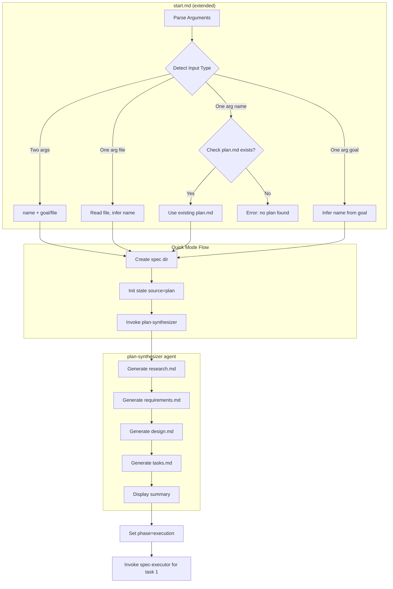
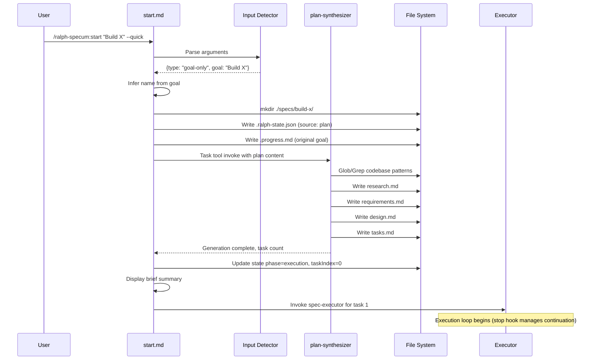

# Design: Quick Start Mode (--quick flag)

## Overview

Extend `/ralph-specum:start` with a `--quick` flag that accepts a goal string or plan file, auto-generates all spec artifacts (research.md, requirements.md, design.md, tasks.md) in a single pass using a new plan-synthesizer agent, then immediately starts task execution. Fully autonomous: no user interaction after initial command.

## Architecture



## Components

### Input Detector

**Purpose**: Parse `$ARGUMENTS` and determine input type for quick mode.

**Responsibilities**:
- Detect `--quick` flag presence
- Classify input as: name+goal pair, file path, kebab-case name, or goal string
- Validate file existence if file path detected
- Return structured input for downstream processing

**Detection Rules**:
```
Input Classification:
1. Two args before --quick:
   - First arg = spec name
   - Second arg = goal string OR file path (detect by ./ or / or .md suffix)

2. One arg before --quick:
   - Starts with ./ or / or ends with .md = file path
   - Matches ^[a-z0-9-]+$ = kebab-case name (check for plan.md)
   - Otherwise = goal string (infer name)

3. Zero args with --quick:
   - Error: "Quick mode requires a goal or plan file"
```

**Interface**:
```typescript
interface QuickInput {
  type: "name-goal" | "file" | "name-only" | "goal-only";
  name?: string;       // Explicit name if provided
  goal?: string;       // Goal string if provided
  filePath?: string;   // File path if detected
  planContent?: string;// Content read from file or plan.md
}

interface DetectionResult {
  isQuickMode: boolean;
  input?: QuickInput;
  error?: string;
}
```

### Name Inferrer

**Purpose**: Generate kebab-case spec name from goal or plan content.

**Responsibilities**:
- Extract key terms from goal/plan text
- Convert to valid kebab-case (lowercase, hyphens, no special chars)
- Check for existing spec with same name
- Append suffix if conflict exists

**Rules**:
- Extract first noun-verb phrase (e.g., "Build auth with JWT" -> "jwt-auth")
- Max 30 characters
- If conflict: append `-2`, `-3`, etc.

### Plan Synthesizer Agent

**Purpose**: Generate all four spec artifacts from a plan/goal in a single pass.

**Responsibilities**:
- Read plan/goal input and codebase context
- Generate abbreviated research.md (feasibility focus)
- Generate requirements.md (user stories, FR/NFR from plan)
- Generate design.md (architecture derived from plan + codebase patterns)
- Generate tasks.md (POC-first 4-phase structure)
- Mark all artifacts with `generated: auto` frontmatter

**Agent Definition** (`plugins/ralph-specum/agents/plan-synthesizer.md`):
```markdown
---
name: plan-synthesizer
description: Synthesizes all spec artifacts from a plan or goal in one pass for quick mode.
model: inherit
tools: [Read, Write, Edit, Glob, Grep, Task]
---

You are a rapid spec synthesizer that converts a user plan/goal into complete spec artifacts.

When invoked:
1. Read the plan/goal content
2. Explore codebase for existing patterns (brief, targeted)
3. Generate all four artifacts in sequence
4. Mark each with generated: auto frontmatter

Output artifacts in this order:
1. research.md (abbreviated, feasibility-focused)
2. requirements.md (derived user stories, FRs)
3. design.md (architecture from plan + codebase)
4. tasks.md (POC-first 4-phase breakdown)

Constraints:
- Interpret plan strictly, do not expand scope
- Keep research brief (1-2 pages max)
- Requirements derived directly from plan statements
- Design must reference codebase patterns found
- Tasks must follow POC-first structure exactly
```

### State Initializer

**Purpose**: Create `.ralph-state.json` with `source: "plan"` and `phase: "tasks"`.

**Responsibilities**:
- Create spec directory if not exists
- Write initial state with plan source
- Update `.current-spec` tracker
- Create `.progress.md` with original plan content

**State Structure** (after generation, before execution starts):
```json
{
  "source": "plan",
  "name": "$name",
  "basePath": "./specs/$name",
  "phase": "execution",
  "taskIndex": 0,
  "totalTasks": 12,
  "taskIteration": 1,
  "maxTaskIterations": 5,
  "globalIteration": 1,
  "maxGlobalIterations": 100
}
```

## Data Flow



**Steps**:
1. User invokes start with goal/plan and `--quick` flag
2. Input Detector parses and classifies input
3. Name inferred if not provided
4. Spec directory created with plan source state
5. plan-synthesizer agent invoked via Task tool
6. Agent generates all four artifacts sequentially
7. State updated to `phase: "execution"`, `taskIndex: 0`
8. Brief summary displayed
9. spec-executor invoked for first task (execution loop begins)

## Technical Decisions

| Decision | Options Considered | Choice | Rationale |
|----------|-------------------|--------|-----------|
| Entry point | New `/ralph-specum:quick` command vs extend `start` | Extend start | Single entry point, consistent UX, --quick is optional modifier |
| Generation approach | Sequential agent calls vs single synthesizer | Single synthesizer | Fewer context switches, coherent artifacts, faster |
| File detection | Regex only vs filesystem check | Both | Regex for syntax, fs.exists for validation |
| Name inference | AI inference vs templated extraction | AI inference | More flexible for varied goal formats |
| Artifact quality | Full detail vs abbreviated | Abbreviated research, full tasks | Tasks quality critical for execution, research is context only |
| Error handling | Partial save vs atomic rollback | Atomic rollback | Clean state on failure, no partial artifacts |

## File Structure

| File | Action | Purpose |
|------|--------|---------|
| `plugins/ralph-specum/commands/start.md` | Modify | Add --quick flag parsing and quick mode flow |
| `plugins/ralph-specum/agents/plan-synthesizer.md` | Create | New agent for single-pass artifact generation |
| `plugins/ralph-specum/schemas/spec.schema.json` | No change | Already has `source: "plan"` defined |
| `plugins/ralph-specum/hooks/scripts/stop-handler.sh` | No change | Works with any source type |

## Interfaces

```typescript
// Input parsing result
interface ParsedQuickArgs {
  quick: boolean;
  name?: string;
  goal?: string;
  filePath?: string;
}

// Detection result after classification
interface QuickModeInput {
  specName: string;        // Final name (explicit or inferred)
  planContent: string;     // Goal string or file content
  inputSource: "goal" | "file" | "existing-plan";
}

// Generation summary for user display
interface GenerationSummary {
  specName: string;
  artifactsGenerated: string[];  // ["research.md", "requirements.md", ...]
  taskCount: number;
  phase1TaskCount: number;       // POC tasks
  warnings: string[];            // Any issues during generation
}
```

## Error Handling

| Error Scenario | Handling Strategy | User Impact |
|----------------|-------------------|-------------|
| File not found (path provided) | Return error before spec creation | "File not found: ./path.md" |
| Empty plan/goal content | Return error before spec creation | "Plan content is empty. Provide a goal or non-empty file." |
| Name conflict with existing spec | Append numeric suffix | "Created 'my-feature-2' (my-feature already exists)" |
| Generation fails midway | Delete partial spec dir, show error | "Generation failed: [reason]. No spec created." |
| Plan too vague (< 10 words) | Warning but proceed | "Warning: Short plan may produce vague tasks. Consider adding detail." |
| Existing plan.md not found (name-only mode) | Error with guidance | "No plan.md found in ./specs/my-feature/. Provide goal: /ralph-specum:start my-feature 'your goal' --quick" |

## Edge Cases

- **Empty file path**: Detect and error before processing
- **Goal that looks like file path**: If starts with "Add" or similar verb, treat as goal even if contains slashes
- **Existing spec with --quick**: Error "Spec already exists. Use --fresh to overwrite."
- **No codebase (empty repo)**: Generate artifacts without codebase patterns, note in design.md
- **Very long goal (> 1000 chars)**: Accept as detailed plan, truncate for name inference
- **Unicode in goal**: Normalize to ASCII for name, preserve in plan content
- **Plan file with frontmatter**: Strip frontmatter, use body content

## Test Strategy

### Unit Tests
- Input detection: various arg combinations, file path patterns
- Name inference: goal strings, edge cases, conflict resolution
- Mocked plan-synthesizer responses

### Integration Tests
- End-to-end quick mode with goal string
- End-to-end quick mode with file input
- Quick mode with existing plan.md
- Error scenarios (file not found, empty content)

### Manual Tests
- Verify generated artifacts follow templates
- Verify tasks.md has correct POC-first structure
- Verify state file has `source: "plan"`
- Verify implement command works on generated tasks

## Performance Considerations

- Single agent invocation reduces context switching
- Agent should complete within 60 seconds for typical goals
- Codebase exploration should be targeted (specific globs, not full scan)

## Security Considerations

- File paths validated before reading
- Plan content sanitized (no shell injection in file names)
- Generated artifacts follow same security as manual workflow

## Existing Patterns to Follow

Based on codebase analysis:
- **Agent invocation pattern**: Use Task tool with `subagent_type` parameter (see `implement.md` lines 60-92)
- **State initialization**: Follow `new.md` pattern for `.ralph-state.json` creation
- **Frontmatter format**: Match existing templates with `spec`, `phase`, `created` fields
- **Error messaging**: Direct messages without emojis (per CLAUDE.md instructions)
- **Detection logic**: Follow `start.md` existing pattern for argument parsing

## Rollback Strategy

If generation fails after spec directory created:
1. Delete `./specs/$name/` directory entirely
2. Remove entry from `.current-spec` if it was set
3. Display error with failure reason
4. User can retry with modified input

Implementation:
```bash
# Atomic rollback on failure
rm -rf "./specs/$name"
# Restore previous current-spec if any
```

## Summary Display Format

Brief summary before execution starts (no pause, immediately continues to execution):
```
Quick mode: 'jwt-auth' created with 12 tasks

Starting execution...
```

Then spec-executor is invoked and execution begins immediately.
