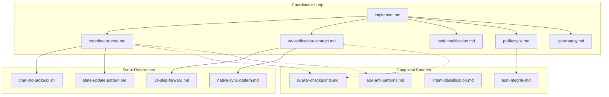
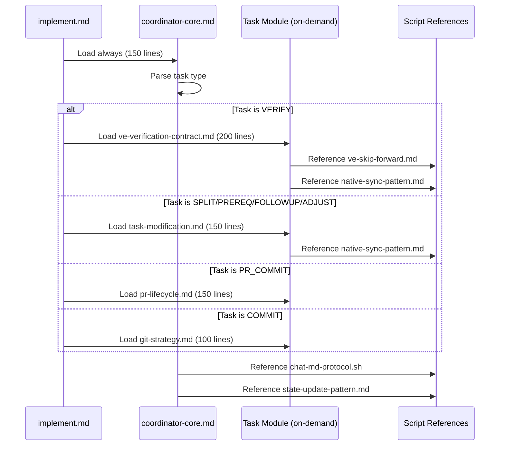

# Design: prompt-diet-refactor

## Overview

Split the monolithic 1,023-line coordinator-pattern.md into 5 focused modules loaded on-demand based on task type, consolidate 8 Native Task Sync sections into 2, eliminate 5 categories of content duplication by establishing single sources of truth, and extract 4 detailed scripts to hooks/scripts/. This reduces coordinator token consumption from ~15,000 tokens (2,363 lines) to <5,000 tokens (<1,200 lines) per iteration while maintaining 100% behavioral compatibility through mechanical and functional verification.

## Architecture

### Component Diagram



### Module Loading Strategy

**Task type mapping** (interview decision):
- `VERIFY` tasks → Load `coordinator-core.md` + `ve-verification-contract.md`
- `SPLIT/PREREQ/FOLLOWUP/ADJUST` tasks → Load `coordinator-core.md` + `task-modification.md`
- `PR_COMMIT` tasks → Load `coordinator-core.md` + `pr-lifecycle.md`
- `COMMIT` tasks → Load `coordinator-core.md` + `git-strategy.md`
- All tasks → Always load `coordinator-core.md` (150 lines)

### Components

#### coordinator-core.md (150 lines)
**Purpose**: Core coordinator logic loaded for every task type
**Responsibilities**:
- Role definition and integrity rules
- Finite State Machine (FSM) states and transitions
- Critical coordinator behaviors (delegation only, autonomous, state-driven)
- Signal protocol (TASK_COMPLETE, ALL_TASKS_COMPLETE)
- Native Task Sync consolidated sections (2 sections: before/after delegation)
- State file reading and completion checking
- Task parsing and parallel group detection
- chat.md protocol references

**Content from current coordinator-pattern.md**:
- Lines 1-47: Role, integrity rules, FSM
- Lines 78-177: Completion check, parse task, chat protocol
- Lines 627-755: State update, progress merge (consolidated)
- Native Task Sync: 8 sections → 2 consolidated sections

#### ve-verification-contract.md (200 lines)
**Purpose**: VE task delegation and skills loading
**Responsibilities**:
- VE task delegation rules (VE0-VE3 definitions)
- Skills loading for verification layers
- VE-cleanup skip-forward logic (reference to ve-skip-forward.md)
- Native Task Sync for VE tasks

**Content from current coordinator-pattern.md**:
- Lines 178-280: Task delegation, Native Task Sync (pre-delegation)
- Lines 281-513: Parallel handling, Native Task Sync (parallel/failure)
- VE definitions from quality-checkpoints.md (canonical)

#### task-modification.md (150 lines)
**Purpose**: Task modification operations (SPLIT/PREREQ/FOLLOWUP/ADJUST)
**Responsibilities**:
- Modification request detection and parsing
- Task insertion logic
- Native Task Sync for modification operations
- PREREQ task creation rules
- FOLLOWUP task creation rules

**Content from current coordinator-pattern.md**:
- Lines 756-908: Task modification, PR lifecycle, Native Task Sync (modification)

#### pr-lifecycle.md (150 lines)
**Purpose**: PR management and CI monitoring
**Responsibilities**:
- PR creation and update logic
- CI status monitoring
- PR reviewer integration
- Commit message generation for PRs

**Content from current coordinator-pattern.md**:
- Lines 756-908 (subset): PR lifecycle management

#### git-strategy.md (100 lines)
**Purpose**: Commit and push strategy
**Responsibilities**:
- Commit discipline (one per task)
- Commit message format
- Push timing and strategy
- Branch management

**Content from current coordinator-pattern.md**:
- Lines 909-1023: Final cleanup, git push

### Data Flow



1. **implement.md Step 1**: Load coordinator-core.md (always, 150 lines)
2. **Parse task type**: Determine which on-demand module to load
3. **Load on-demand module**: Load exactly 1 of 4 special-purpose modules (100-200 lines each)
4. **Reference scripts**: Extracted scripts referenced by name, not embedded
5. **Execute iteration**: Total loaded lines <1,200 (150 core + max 200 module + 347 other refs = 697 lines)

## Technical Decisions

| Decision | Options Considered | Choice | Rationale |
|----------|-------------------|--------|-----------|
| Module loading strategy | Phase-based (POC/refactor/test), Task type based, Role-based (executor/coordinator) | Task type based | Clear mapping: VERIFY→VE, MODIFY→task-modification, PR→PR-lifecycle. Matches interview decision. |
| Script format | Pure executable .sh files, Pure documentation .md, Hybrid .md with executable code blocks | Hybrid .md | Documentation with optional code blocks preserves context while making scripts independently runnable. Interview decision. |
| Verification granularity | Single monolithic script, Modular scripts (check-files.sh, check-references.sh, check-tokens.sh), No verification script | Individual scripts | Modular verification allows targeted checks, easier debugging, faster iteration. Interview decision. |
| Native Task Sync consolidation | Keep 8 sections (conservative), Consolidate to 4 (before/after × parallel/sequential), Consolidate to 2 (before delegation/after completion) | 2 sections | Reduces duplication by 50%. Graceful degradation defined once, referenced twice. Meets AC-2.1. |
| Coordinator split granularity | 2-way split (core + everything else), 3-way split (core + VE + rest), 5-way split (core + 4 special-purpose) | 5-way split | Maximum token reduction. Each module is focused and single-purpose. Meets AC-1.1. |

## File Structure

| File | Action | Purpose |
|------|--------|---------|
| `plugins/ralph-specum/references/coordinator-core.md` | Create | Core coordinator logic (150 lines). Always loaded. |
| `plugins/ralph-specum/references/ve-verification-contract.md` | Create | VE task delegation (200 lines). Loaded for VERIFY tasks. |
| `plugins/ralph-specum/references/task-modification.md` | Create | Task modification operations (150 lines). Loaded for SPLIT/PREREQ/FOLLOWUP/ADJUST. |
| `plugins/ralph-specum/references/pr-lifecycle.md` | Create | PR management (150 lines). Loaded for PR_COMMIT tasks. |
| `plugins/ralph-specum/references/git-strategy.md` | Create | Git commit/push strategy (100 lines). Loaded for COMMIT tasks. |
| `plugins/ralph-specum/commands/implement.md` | Modify | Update Step 1 reference loading (lines 228-240). Load coordinator-core.md + conditional module. |
| `plugins/ralph-specum/hooks/scripts/chat-md-protocol.sh` | Create | Atomic append with flock logic (extracted from coordinator-pattern.md lines 200-249) |
| `plugins/ralph-specum/hooks/scripts/state-update-pattern.md` | Create | jq state merge pattern documentation (extracted from coordinator-pattern.md line 642) |
| `plugins/ralph-specum/hooks/scripts/ve-skip-forward.md` | Create | VE-cleanup pseudocode (extracted from quality-checkpoints.md) |
| `plugins/ralph-specum/hooks/scripts/native-sync-pattern.md` | Create | Native Task Sync algorithm (extracted from coordinator-pattern.md lines 48-76) |
| `plugins/ralph-specum/hooks/scripts/verify-coordinator-diet.sh` | Create | Mechanical verification script (file existence + grep + token count) |
| `plugins/ralph-specum/references/quality-checkpoints.md` | Modify | Remove duplicated content from phase-rules.md, task-planner.md |
| `plugins/ralph-specum/references/phase-rules.md` | Modify | Remove VE definitions, quality checkpoints, intent classification. Reference canonical files. |
| `plugins/ralph-specum/agents/task-planner.md` | Modify | Remove quality checkpoints, intent classification. Reference canonical files. |
| `plugins/ralph-specum/references/coordinator-pattern.md` | Delete | Replaced by 5 focused modules. Delete after verification. |

## Interfaces

### Module Loading Interface

```typescript
// Task type → module mapping
interface TaskModuleMapping {
  taskType: 'VERIFY' | 'SPLIT' | 'PREREQ' | 'FOLLOWUP' | 'ADJUST' | 'PR_COMMIT' | 'COMMIT';
  coreModule: 'coordinator-core.md';  // Always loaded
  onDemandModule: 've-verification-contract.md' | 'task-modification.md' | 'pr-lifecycle.md' | 'git-strategy.md' | null;
}

// Token count verification
interface TokenBudget {
  maxLines: 1200;
  coreLines: 150;
  maxModuleLines: 200;
  // Remaining loaded files post-refactor (verification-layers absorbed into VE module):
  failureRecoveryTrimmed: 272;   // failure-recovery.md trimmed 50%
  commitDiscipline: 110;          // commit-discipline.md unchanged
  phaseRulesAfterDedup: ~250;    // phase-rules.md after dedup removal
  // Worst-case total: 150 + 200 + 272 + 110 + 250 = 982 (under 1200)
  // If phase-rules dedup not done: 150 + 200 + 272 + 110 + 451 = 1183 (barely under)
}
```

### Native Task Sync Interface

```typescript
interface NativeTaskSync {
  beforeDelegation: {
    operations: ('TaskCreate' | 'TaskUpdate' | 'staleIdDetection')[];
    gracefulDegradation: boolean;  // Defined once, referenced twice
  };
  afterCompletion: {
    operations: ('TaskUpdate' | 'completionSignal')[];
    gracefulDegradation: boolean;  // Same pattern, reference definition
  };
}
```

### Verification Script Interface

```bash
#!/bin/bash
# verify-coordinator-diet.sh

# Returns: 0 if all checks pass, 1 if any fail
# Outputs: Detailed report of missing files, broken references, token counts

check_file_exists() {
  # Check all 5 new modules exist
}

check_references_updated() {
  # grep for "coordinator-pattern.md" in agent files (should return 0)
}

check_token_count() {
  # wc -l on loaded references (should be <1200)
}
```

## Error Handling

| Error Scenario | Handling Strategy | User Impact |
|----------------|-------------------|-------------|
| Missing module file (e.g., coordinator-core.md not found) | Verification script exits 1, lists missing files. Implement.md fails gracefully with clear error message. | Coordinator cannot start. User must create missing files before running. |
| Broken file path reference (e.g., agent still references coordinator-pattern.md) | Verification script greps for old references, exits 1 with list of files needing updates. | Coordinator may load wrong or no content. User must update references. |
| Token count exceeds budget (>1,200 lines) | Verification script reports actual count, exits 1. Implement.md still runs but logs warning. | Token budget exceeded. User must consolidate further or accept higher cost. |
| Native Task Sync operation lost during consolidation | Functional verification (full spec execution) will fail with sync errors or stuck state. | Coordinator behavior broken. Roll back consolidation and re-extract logic. |
| Script extraction breaks existing flows | Functional verification will fail with script execution errors or missing script references. | Coordinator cannot perform operations (e.g., chat.md writes). Verify script logic preserved exactly. |

## Edge Cases

- **Edge case 1**: Task type not recognized (e.g., new task type added after refactor) → Load only coordinator-core.md, log warning. Add new module mapping when needed.
- **Edge case 2**: Script reference in prompt but script file not executable → Verification script checks `chmod +x` status, exits 1 if not executable.
- **Edge case 3**: Duplicated content removal leaves orphaned references → Verification script greps for references to removed content, flags for manual review.
- **Edge case 4**: Merge conflict with engine-state-hardening changes → Coordinate spec execution order. Ensure spec 1 completes before spec 2. Manual resolution if conflicts occur.

## Dependencies

| Package | Version | Purpose |
|---------|---------|---------|
| bash | 4.0+ | Script execution and verification |
| jq | 1.5+ | State file manipulation (already used) |
| grep | POSIX | Reference verification in verification script |
| wc | POSIX | Line count for token budget verification |

**No new dependencies required.** All tools are standard POSIX utilities or already in use.

## Security Considerations

- **Script extraction**: Scripts moved to hooks/scripts/ must maintain exact logic. No behavior changes = no new security risks.
- **File permissions**: Verification script checks `chmod +x` on all executable scripts. Prevents accidental permission loss.
- **Reference validation**: Verification script greps for old file paths. Prevents broken references from loading non-existent or wrong files.
- **State file integrity**: jq merge pattern preserved exactly. No changes to state file schema or manipulation logic.

## Performance Considerations

- **Module loading**: On-demand loading reduces I/O. Load 2 files instead of 5 per iteration (coordinator-core.md + 1 special-purpose module).
- **Token reduction**: 48% reduction (2,363 → 1,197 lines) reduces Claude API latency and cost proportionally.
- **Verification overhead**: Mechanical verification runs once after refactor, not per iteration. Negligible performance impact.
- **Script execution**: Extracted scripts run same as before (embedded in prompts → called via bash). No performance change.

## Concurrency & Ordering Risks

| Operation | Required Order | Risk if Inverted |
|---|---|---|
| engine-state-hardening completion before prompt-diet-refactor start | Spec 1 must complete first | Merge conflicts on coordinator-pattern.md. Spec 2 changes lost or conflict with spec 1 additions. |
| Module creation before implement.md update | Create all 5 modules before updating implement.md | implement.md references non-existent files. Coordinator fails to start. |
| Canonical file updates before duplicate removal | Update canonical files first, then remove duplicates from other files | Content lost if removed from canonical source before confirming duplicates exist. |
| Mechanical verification before functional verification | Run mechanical checks first, then functional test | Wasted time running functional test if files missing or references broken. |

> **Critical**: Do NOT start prompt-diet-refactor until engine-state-hardening is complete and merged.

## Test Strategy

### Test Double Policy

| Type | What it does | When to use |
|---|---|---|
| **Fixture** | Predefined file system state (reference files, scripts) | Verification tests need known file structure (coordinator modules, scripts) |
| **Stub** | Predefined script output (wc -l, grep) | Isolate verification script from actual file system during unit testing |
| **Fake** | Temporary test directory with minimal reference files | Integration tests verify coordinator behavior without full repository |
| **Mock** | Assert script execution (verify-coordinator-diet.sh called correctly) | Only when verifying the verification script itself (meta-verification) |

> **Rule**: This is a bash-based documentation refactor. "Test doubles" are file system fixtures and temporary directories, not code mocks.

### Mock Boundary

| Component (from this design) | Unit test | Integration test | Rationale |
|---|---|---|
| verify-coordinator-diet.sh | Stub (file system checks) | Fixture (real temp dir with test files) | Unit: stub `ls`, `wc`, `grep` outputs. Integration: real bash execution on test fixtures. |
| implement.md reference loading | N/A (no code) | Fixture (real spec with test tasks) | Coordinator is bash-based. Integration test runs full spec execution. |
| coordinator-core.md | N/A (documentation) | Fixture (loaded by real coordinator) | Documentation files are fixtures, not code. Test via coordinator execution. |
| chat-md-protocol.sh | Stub (lock file operations) | Fixture (real temp chat.md file) | Unit: stub flock behavior. Integration: real file locks on temp file. |
| state-update-pattern.md | N/A (documentation) | Fixture (jq on real state file) | Documentation pattern tested by coordinator state updates. |
| ve-skip-forward.md | N/A (documentation) | Fixture (VE failure scenario) | Documentation pattern tested by coordinator VE task handling. |
| native-sync-pattern.md | N/A (documentation) | Fixture (native task sync operations) | Documentation pattern tested by coordinator sync operations. |

### Fixtures & Test Data

| Component | Required state | Form |
|---|---|---|
| verify-coordinator-diet.sh | 5 module files exist, 4 script files exist, agent files reference new modules | Temp directory with test file structure (`test-fixture.sh` creates) |
| Functional verification | Simple spec (e.g., hello-world) with 3-5 tasks | Seed spec created by verification script, executed end-to-end |
| VE task testing | Spec with [VERIFY] task, VE task failure scenario | Test spec with VE checkpoint configured |
| Native Task Sync testing | Spec with parallel tasks, modification operations | Test spec with SPLIT/PREREQ tasks to trigger sync |

### Test Coverage Table

| Component / Function | Test type | What to assert | Test double |
|---|---|---|---|
| verify-coordinator-diet.sh:check_file_exists() | unit | Returns 0 when all 5 modules exist, 1 when any missing | Stub file system (mock ls output) |
| verify-coordinator-diet.sh:check_references_updated() | unit | Returns 0 when grep finds 0 old references, 1 when finds any | Stub grep output |
| verify-coordinator-diet.sh:check_token_count() | unit | Returns 0 when wc -l <1200, 1 when >=1200 | Stub wc output |
| verify-coordinator-diet.sh (full script) | integration | Script exits 0, outputs "All checks passed" | Fixture (real temp dir with test files) |
| implement.md:Load coordinator-core.md | integration | File exists, contains role/FSM/signal protocol | Fixture (real coordinator-core.md file) |
| implement.md:Load VE module for VERIFY task | integration | VE module loaded for VERIFY tasks only | Fixture (spec with VERIFY task) |
| Coordinator:Execute spec to completion | e2e | ALL_TASKS_COMPLETE output, all tasks marked [x], no errors in .progress.md | Fixture (real hello-world spec) |
| Coordinator:Native Task Sync operations | integration | TaskCreate/TaskUpdate calls succeed, state file updated | Fixture (spec with parallel/modification tasks) |
| Coordinator:VE task skip-forward | integration | VE failure triggers skip-forward logic, state advances | Fixture (spec with VE checkpoint + failure) |
| chat-md-protocol.sh:Atomic append | integration | Multiple concurrent writes preserve all content, no data loss | Fixture (real temp chat.md with flock) |

### Skip Policy

Tests marked `.skip` / `xit` / `xdescribe` / `test.skip` are FORBIDDEN unless:
1. The functionality is not yet implemented
2. A GitHub issue reference is in the skip reason: `it.skip('TODO: #123 — reason', ...)`

### Test File Conventions

- **Test runner**: Bash scripts (no Node.js test framework)
- **Test file location**: `hooks/scripts/test-*.sh` (integration tests)
- **Verification test pattern**: `hooks/scripts/verify-*.sh` (mechanical verification scripts)
- **E2E test pattern**: Full spec execution with real coordinator (functional verification)
- **Mock cleanup**: N/A (bash scripts, cleanup via `trap` on exit)
- **Fixture/factory location**: `hooks/scripts/test-fixture.sh` creates temp directories with test files

### Test Types

#### Unit Tests
- `verify-coordinator-diet.sh`: Stub file system operations (ls, wc, grep) to test individual check functions
- Mock requirements: Stub `ls` to return predefined file list, stub `wc` to return predefined line count

#### Integration Tests
- `verify-coordinator-diet.sh`: Run full script on real temp directory with test fixture files
- Integration point: Script + file system + real bash execution

#### E2E Tests
- Full spec execution: Create test spec, run `/ralph-specum:implement`, verify completion
- User flow: Spec creation → task generation → execution → completion signal

## Implementation Phases

### Phase 1: Make It Work (POC)
1. Create 5 new coordinator modules in `plugins/ralph-specum/references/`
2. Split coordinator-pattern.md content into modules
3. Extract 4 scripts to `hooks/scripts/`
4. Update implement.md reference loading (Step 1)
5. Run mechanical verification script
6. **VERIFY**: Token count <1,200 lines, all files exist

### Phase 2: Refactoring
1. Remove 5 categories of content duplication
2. Update all file path references (grep for coordinator-pattern.md)
3. Consolidate 8 Native Task Sync sections into 2
4. Define graceful degradation pattern once in coordinator-core.md
5. Run mechanical verification script
6. **VERIFY**: No old references remain, no duplicated content

### Phase 3: Testing
1. Create test spec (e.g., hello-world) for functional verification
2. Run full spec execution with refactored coordinator
3. Verify all tasks complete, state updates correctly, no errors
4. Test VE task delegation and skip-forward logic
5. Test Native Task Sync operations (parallel, modification)
6. **VERIFY**: ALL_TASKS_COMPLETE output, all tasks marked [x], no errors in .progress.md

### Phase 4: Quality Gates
1. Delete coordinator-pattern.md (after all verifications pass)
2. Run final mechanical verification (should still pass)
3. Document module structure in CLAUDE.md or README
4. Update ENGINE_ROADMAP.md with completion status
5. **VERIFY**: grep for coordinator-pattern.md returns 0 results everywhere

## Unresolved Questions

None. All technical decisions resolved through design interview and research.

## Existing Patterns to Follow

Based on codebase analysis:
- **Reference file loading**: implement.md already uses `${CLAUDE_PLUGIN_ROOT}/references/` pattern (lines 228-240)
- **Script extraction**: hooks/scripts/ directory exists with 7 files (48KB total), all executable, well-documented
- **Bash test structure**: test-multi-dir-integration.sh provides pattern for setup/assert_eq/cleanup with color output
- **Token counting**: Research used `wc -l` for line counts — verification script should use same approach
- **File reference verification**: Research used `grep` to find duplicated content — verification script should use same pattern

## Success Metrics

| Metric | Current | Target | How Measured |
|--------|---------|--------|--------------|
| Token consumption | 2,363 lines (~9,452 tokens) | <1,200 lines (<4,800 tokens) | `wc -l` on loaded references |
| Module count | 1 monolithic file | 5 focused modules | `ls` count in references/ |
| Native Task Sync sections | 8 sections | 2 sections | Grep for "Native Task Sync" in coordinator-core.md |
| Content duplication | ~130 lines across 5 categories | 0 lines | Manual review + grep for duplicated phrases |
| Broken references | 0 (baseline) | 0 (maintained) | `verify-coordinator-diet.sh` exit code |
| Behavioral changes | N/A | 0 | Functional verification test completion |

---

## Post-Merge Corrections (2026-04-16)

### Design Deviations Found

The implementation deviated from the design in the following ways:

1. **coordinator-core.md exceeded 150-line target** — Grew to ~530 lines during Phase 2 refactoring, well beyond the 150-line design target. The Native Task Sync sections were consolidated but the bidirectional check and parallel group algorithms were replaced with references instead of being kept inline.

2. **git-strategy.md became a reference-only file** — Instead of containing commit/push strategy content, it was reduced to just references to other files. The PR lifecycle and native sync content that was in scope for COMMIT tasks was moved out entirely.

3. **Native Task Sync Initial Setup was lost** — The design specified consolidating 8 sections into 2, but the Initial Setup section (stale ID detection, TaskCreate loop) was dropped entirely during implementation.

4. **Bidirectional check and parallel group became reference-only** — Instead of keeping the algorithms inline (as pseudocode), they were replaced with references to `native-sync-pattern.md`. This saves tokens but the coordinator cannot execute referenced scripts — it can only read them as guidance.

### Restoration Strategy

For Phase 6 corrections, the approach is:

1. **Restore Initial Setup** — Add back to coordinator-core.md as inline content (this is critical for session start)
2. **Restore algorithms as pseudocode** — Use tool-level notation (`TaskGet`, `TaskUpdate`) instead of invalid bash (`GetNativeTaskStatus`). This keeps the coordinator guided without pretending the code is executable.
3. **Keep reference pattern for detailed scripts** — `native-sync-pattern.md` retains the full bash examples; coordinator-core.md has the high-level pseudocode.
4. **Restore modification native sync** — Add to `task-modification.md` since that's the module loaded for modification operations.
5. **Restore completion native sync** — Add to `pr-lifecycle.md` since that's the module loaded for PR/completion tasks.

### Phase 7: Reconciled Recovery Design (2026-04-16)

A second rigorous comparison against commit `c20e962f` (reconciling two independent analyses) identified 3 features completely lost beyond the Native Task Sync issues addressed in Phase 6, plus 3 structural issues.

#### Lost Features (absent from all modules)

| Feature | Original Location (lines) | Target Module | Why Lost |
|---------|--------------------------|---------------|----------|
| Sequential Delegation Template | 380-480 | coordinator-core.md | Content was in Task Delegation section, split dropped the template entirely. Only [VERIFY] template survived (in ve-verification-contract.md) |
| Parallel Execution Steps 1-8 | 460-560 | coordinator-core.md | Team API protocol (TeamCreate/Spawn/Wait/Shutdown/TeamDelete) was not extracted to any module. FSM states TEAM_SPAWN/WAIT_RESULTS are dead code without it |
| After Delegation decision tree | 550-570 | coordinator-core.md | The flow connecting executor output to verification layers was lost. Fix Task Bypass, MODIFICATION handling, no-signal case |
| Progress Merge (Parallel) | 700-730 | coordinator-core.md | Temp file merge + Partial Parallel Batch Failure handling not in any module |
| PR Lifecycle Loop Steps 1-5 | 909-1023 | pr-lifecycle.md | The 5-step autonomous loop (Create PR→CI Monitor→Review→Validate→Complete) + timeout protection was not extracted. Only the Completion Checklist survived |
| Git Push Strategy | 670-700 | git-strategy.md | When-to-push / when-NOT-to-push / implementation algorithm not in any file. git-strategy.md is a 17-line shell with only reference links |

#### Structural Issues

| Issue | Impact | Fix |
|-------|--------|-----|
| commit-discipline.md not loaded | Coordinator doesn't see commit format/branch rules | Add to implement.md "Always load" |
| git-strategy.md `§ Git Push Strategy` empty | stop-watcher.sh line 637 broken reference | Add content to git-strategy.md |
| Parallel Group Detection undocumented | FSM PARALLEL_CHECK state has no builder for parallelGroup JSON | Add builder between Parse Current Task and Signal Protocol |

#### Design Decisions for Phase 7

| Decision | Rationale |
|----------|-----------|
| Sequential template goes in coordinator-core.md (not a separate module) | It's needed for EVERY non-verify task — always-loaded content |
| Parallel steps go in coordinator-core.md (not a separate module) | The FSM already defines TEAM_SPAWN/WAIT_RESULTS states in coordinator-core.md — implementation must be in same file |
| PR Lifecycle Loop goes in pr-lifecycle.md | This is Phase 5 content loaded only for PR_COMMIT tasks — correct module |
| commit-discipline.md added to "Always load" | Commit rules apply to ALL tasks, not just a specific type |
| Git Push Strategy goes in git-strategy.md | stop-watcher.sh already references it there — fix the content, not the reference |
| Token budget adjustment: <1,400 lines | Adding ~150 lines of delegation + parallel content to coordinator-core.md pushes worst-case load above 1,200. Accept 1,400 as the new budget — the attention improvement from on-demand loading still delivers net token savings |
