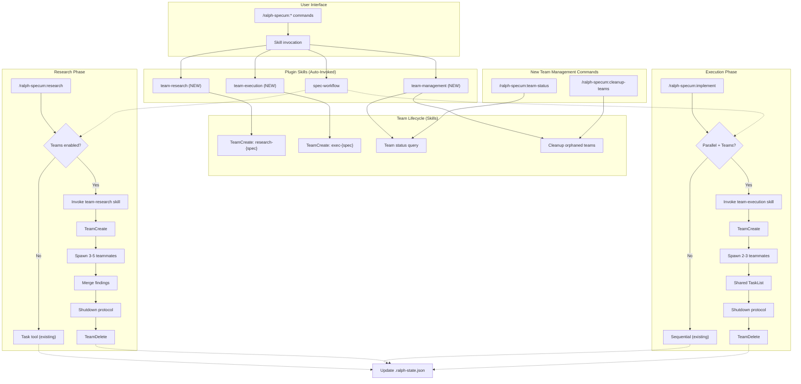
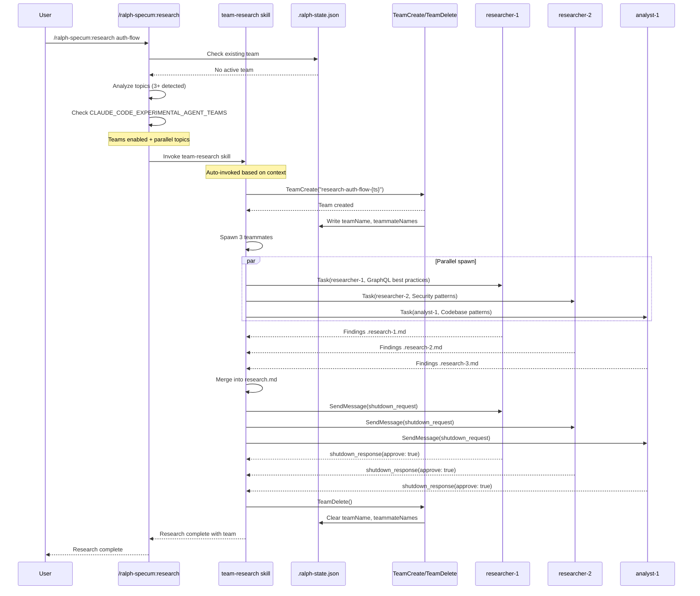
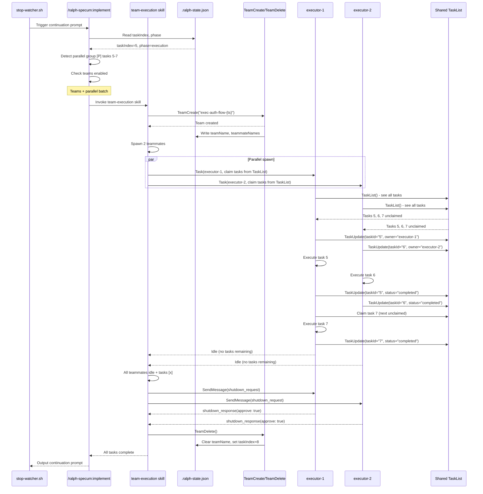

# Design: ralph-agent-teams

## Overview

Integrate Claude Code's agent teams API into ralph-specum using **Skills as the primary abstraction** for team-based workflows. Architecture introduces team-management skills (`team-research`, `team-execution`) that wrap TeamCreate/TeamDelete lifecycle, exposes team coordination commands (`/ralph-specum:team-status`, `/ralph-specum:cleanup-teams`), and extends existing commands to delegate to team-based skills when `CLAUDE_CODE_EXPERIMENTAL_AGENT_TEAMS=1`. Maintains strict lifecycle management (create → delegate → shutdown → cleanup) with graceful fallback to Task tool delegation for backward compatibility.

## Architecture



## Data Flow

### Research Phase with Skills



### Execution Phase with Skills



## Components

### New Team-Based Skills (skills/ directory)

#### 1. team-research Skill

**Purpose**: Auto-invoked skill that manages research-phase agent teams

**File**: `plugins/ralph-specum/skills/team-research/SKILL.md` (CREATE)

**When invoked**: Research phase with `CLAUDE_CODE_EXPERIMENTAL_AGENT_TEAMS=1` and parallel topics detected

**Responsibilities**:
1. Check environment for team support
2. Validate state file (no existing team)
3. Create research team via TeamCreate
4. Spawn 3-5 research teammates (research-analyst for web, Explore for codebase)
5. Merge findings from all teammates
6. Coordinate shutdown protocol
7. Execute TeamDelete
8. Update state file (clear team fields)

**Interfaces**:

```typescript
interface TeamResearchConfig {
  specName: string;
  basePath: string;
  topics: ResearchTopic[];
  teamName: string;              // "research-{specName}-{timestamp}"
}

interface ResearchTopic {
  agentType: 'research-analyst' | 'Explore';
  focus: string;
  outputFile: string;
}
```

**Skill frontmatter**:

```markdown
---
name: team-research
description: Use when running research phase with CLAUDE_CODE_EXPERIMENTAL_AGENT_TEAMS enabled and goal spans 3+ parallel research topics. Manages team creation, parallel analyst spawning, findings merging, and team cleanup.
---
```

#### 2. team-execution Skill

**Purpose**: Auto-invoked skill that manages execution-phase agent teams for parallel task batches

**File**: `plugins/ralph-specum/skills/team-execution/SKILL.md` (CREATE)

**When invoked**: Implementation phase with `[P]` task markers, teams enabled, and 2+ parallel tasks

**Responsibilities**:
1. Validate parallel task group
2. Create execution team via TeamCreate
3. Spawn 2-3 spec-executor teammates
4. Share TeamList for task claiming
5. Monitor teammate idle notifications
6. Verify all parallel tasks completed
7. Coordinate shutdown protocol
8. Execute TeamDelete
9. Update state file (advance taskIndex)

**Interfaces**:

```typescript
interface TeamExecutionConfig {
  specName: string;
  basePath: string;
  parallelGroup: ParallelGroup;
  teamName: string;              // "exec-{specName}-{timestamp}"
}

interface ParallelGroup {
  startIndex: number;
  endIndex: number;
  tasks: Task[];
}
```

**Skill frontmatter**:

```markdown
---
name: team-execution
description: Use when implementing specs with [P] parallel task markers and CLAUDE_CODE_EXPERIMENTAL_AGENT_TEAMS enabled. Spawns 2-3 teammates that claim and execute tasks from shared TaskList.
---
```

#### 3. team-management Skill

**Purpose**: Provides team status and cleanup utilities

**File**: `plugins/ralph-specum/skills/team-management/SKILL.md` (CREATE)

**When invoked**: User runs `/ralph-specum:team-status` or `/ralph-specum:cleanup-teams`

**Responsibilities**:
1. Query active teams from state files
2. Scan `~/.claude/teams/` for orphaned teams
3. Display team status (teammates, phase, tasks)
4. Coordinate orphaned team cleanup
5. Provide team diagnostics

**Skill frontmatter**:

```markdown
---
name: team-management
description: Use when checking agent team status, diagnosing team issues, or cleaning up orphaned teams. Queries state files and team directories to provide visibility into team lifecycle.
---
```

### Modified Existing Commands

#### research.md (Modify)

**Changes**: Delegate to `team-research` skill when conditions met

```markdown
## After analyzing research topics (line ~100)

<mandatory>
**Skill-based team integration**:

Before spawning Task tool delegates, check if team-research skill should be used:

```bash
if [ -n "$CLAUDE_CODE_EXPERIMENTAL_AGENT_TEAMS" ] && [ "$TOPIC_COUNT" -ge 3 ]; then
  echo "Invoking team-research skill for parallel research..."
  # Skill auto-invoked via context (no explicit call needed)
  # skill: "team-research" will handle team creation, delegation, shutdown
  USE_TEAM_SKILL=true
else
  USE_TEAM_SKILL=false
fi
```

If $USE_TEAM_SKILL = false:
  - Use existing Task tool delegation pattern (lines 217-432)

If $USE_TEAM_SKILL = true:
  - Set context for team-research skill invocation
  - Provide research topics, spec path, team name
  - Skill handles TeamCreate, teammate spawning, shutdown, TeamDelete
  - Verify team deleted before returning
</mandatory>
```

#### implement.md (Modify)

**Changes**: Delegate to `team-execution` skill for parallel batches

```markdown
## After parallel group detection (after line ~237)

<mandatory>
**Skill-based team integration**:

Check if team-execution skill should be used:

```bash
USE_TEAM_SKILL=false
if [ -n "$CLAUDE_CODE_EXPERIMENTAL_AGENT_TEAMS" ] && [ "$PARALLEL_GROUP_COUNT" -gt 1 ]; then
  echo "Invoking team-execution skill for parallel tasks..."
  USE_TEAM_SKILL=true
fi
```

If $USE_TEAM_SKILL = false:
  - Use existing parallel batch execution (lines 303-332)

If $USE_TEAM_SKILL = true:
  - Set context for team-execution skill invocation
  - Provide parallel group, spec path, team name
  - Skill handles TeamCreate, teammate spawning, TaskList coordination, shutdown
  - Verify all tasks marked [x] and team deleted before advancing
</mandatory>
```

### New Commands (commands/ directory)

#### team-status.md (CREATE)

**Purpose**: User-facing command to display active agent teams

**Usage**: `/ralph-specum:team-status [spec-name]`

**Output**:

```text
Active Teams for Spec: auth-flow
Team: research-auth-flow-1738991234
Phase: research
Teammates (3):
  - researcher-1: Exploring GraphQL best practices (IDLE)
  - researcher-2: Analyzing codebase patterns (IDLE)
  - analyst-1: Reviewing related specs (IDLE)

Orphaned Teams (detected in ~/.claude/teams/):
  - exec-test-spec-1738990000 (age: 2 hours, no matching state file)
    To cleanup: /ralph-specum:cleanup-teams
```

#### cleanup-teams.md (CREATE)

**Purpose**: Safely remove orphaned team directories

**Usage**: `/ralph-specum:cleanup-teams`

**Flow**:
1. Scan `~/.claude/teams/` for team directories
2. Cross-reference with all `.ralph-state.json` files
3. Prompt for each orphaned team: "Delete {teamName}? (y/n)"
4. For approved: Force TeamDelete (bypasses shutdown protocol since teammates inactive)
5. Log success/failure for each cleanup

### State File Extension

**Purpose**: Track active team across phase transitions

**Schema Extension** (add to `spec.schema.json` definitions.state):

```typescript
interface TeamState {
  teamName?: string;              // Active team name (if any)
  teammateNames?: string[];       // List of teammate names for shutdown
  teamPhase?: 'research' | 'execution'; // Which phase created team
}

interface StateFile {
  // ... existing fields
  teamName?: string;              // From TeamState
  teammateNames?: string[];       // From TeamState
  teamPhase?: 'research' | 'execution'; // From TeamState
}
```

**Responsibilities**:
- Track active team to prevent duplicate team creation
- Store teammate names for shutdown protocol
- Clear team state after TeamDelete succeeds
- Validate teamName against `~/.claude/teams/` on phase transitions

**Note**: Detailed implementation of research/execution/cancellation flows is handled by team-based skills (see above). Commands delegate to skills, which encapsulate TeamCreate/TeamDelete lifecycle.

## Technical Decisions

| Decision | Options Considered | Choice | Rationale |
|----------|-------------------|--------|-----------|
| **Abstraction layer** | Direct TeamCreate in commands / Skills wrap teams / Hybrid | Skills wrap teams | Skills are model-invoked (automatic), reusable, follow plugin best practices, separate concerns (coordination vs. lifecycle) |
| Team creation scope | Per spec / Per phase / Per session | Per phase | One-team-per-session constraint + different team sizes per phase (research=3-5, exec=2-3) |
| State management | Extend .ralph-state.json / Separate team state file | Extend .ralph-state.json | Single source of truth, atomic updates, no sync issues |
| Shutdown timeout | 5s / 10s / 30s / Wait forever | 10s | Balance between graceful shutdown and user patience; matches cancel UX expectations |
| Fallback strategy | Error if no teams / Silently use Task tool / Warning + fallback | Warning + fallback | Backward compatibility (NFR-7) + graceful degradation |
| Team naming | Deterministic / Random / Timestamp-based | Timestamp-based | Avoid conflicts from rapid spec creation; clear debugging info |
| Teammate spawning | All in one message / Sequential batches | All in one message | True parallelism (matches current research.md pattern) |
| Orphan detection timing | Every stop / On phase transition / Manual command | Every stop + manual command | Early detection (automated) + user control (manual cleanup command) |
| Task coordination | Centralized coordinator / Shared TaskList only | Shared TaskList + coordinator monitoring | Leverages Claude Code's built-in task ownership mechanism |
| Error handling | Log and continue / Stop immediately / Retry with new teammate | Retry with new teammate (NFR-9) | Meets reliability requirements (AC-6.2) |
| Team size defaults | Fixed / Configurable via settings | Fixed with future configurability | Simplicity for v1; schema supports future settings (FR-14) |
| **Command vs. Skill split** | All commands / All skills / Commands delegate to skills | Commands delegate to skills | Commands = user interface, Skills = automatic behavior (matches plugin architecture) |

## File Structure

| File | Action | Purpose |
|------|--------|---------|
| **Skills (NEW - skills/ directory)** |
| `plugins/ralph-specum/skills/team-research/SKILL.md` | CREATE | Auto-invoked skill managing research-phase teams (TeamCreate, spawn 3-5 analysts, merge, shutdown, TeamDelete) |
| `plugins/ralph-specum/skills/team-execution/SKILL.md` | CREATE | Auto-invoked skill managing execution-phase teams (TeamCreate, spawn 2-3 executors, TaskList coordination, shutdown, TeamDelete) |
| `plugins/ralph-specum/skills/team-management/SKILL.md` | CREATE | Skill for team status queries and orphaned team cleanup |
| **Commands (MODIFY - commands/ directory)** |
| `plugins/ralph-specum/commands/research.md` | Modify | Add skill invocation check (before Task tool delegation), delegate to team-research skill if teams enabled + 3+ topics |
| `plugins/ralph-specum/commands/implement.md` | Modify | Add skill invocation check (after parallel group detection), delegate to team-execution skill if teams enabled + 2+ parallel tasks |
| `plugins/ralph-specum/commands/cancel.md` | Modify | Add team shutdown protocol before spec deletion (check teamName, send shutdown_request, TeamDelete) |
| `plugins/ralph-specum/commands/status.md` | Modify | Add team display to status output (read teamName, teammateNames, teamPhase from state) |
| **Commands (NEW - commands/ directory)** |
| `plugins/ralph-specum/commands/team-status.md` | CREATE | User command to display active teams and orphaned teams (invokes team-management skill) |
| `plugins/ralph-specum/commands/cleanup-teams.md` | CREATE | User command to safely remove orphaned team directories (invokes team-management skill) |
| **Schema & State** |
| `plugins/ralph-specum/schemas/spec.schema.json` | Modify | Add teamName, teammateNames, teamPhase to state definition |
| **Hooks** |
| `plugins/ralph-specum/hooks/scripts/stop-watcher.sh` | Modify | Add orphaned team detection logic (scan ~/.claude/teams/, cross-reference state files, log warnings) |
| **Agents** |
| `plugins/ralph-specum/agents/spec-executor.md` | Modify | Add team-aware task claiming instructions (use TaskList, claim via owner field, monitor idle notifications) |
| `plugins/ralph-specum/agents/research-analyst.md` | Modify | Add teammate messaging instructions (use SendMessage for cross-team discoveries) |
| **Plugin Metadata** |
| `plugins/ralph-specum/.claude-plugin/plugin.json` | Modify | Bump version to 3.2.0 for agent teams integration |
| `.claude-plugin/marketplace.json` | Modify | Update ralph-specum version to 3.2.0 |

## Error Handling

| Error Scenario | Handling Strategy | User Impact |
|----------------|-------------------|-------------|
| TeamCreate fails (env var not set) | Fallback to Task tool delegation, log warning | Transparent: Research/execution proceeds with legacy parallelism |
| Teammate doesn't respond to shutdown | Wait 10s, force TeamDelete, log tmux session ID | Graceful: No orphaned processes, manual cleanup if needed |
| TeamDelete fails (teammate still active) | Log error with team directory path, suggest manual cleanup | Clear: User knows exactly what to clean up |
| Teammate fails mid-task | Spawn replacement teammate, reassign failed task via TaskUpdate(owner) | Resilient: Parallel batch completes despite individual failures |
| State file has teamName but team directory missing | Clear stale team state, log warning, continue phase | Self-healing: Stale state doesn't block execution |
| Orphaned team detected (>1 hour old) | Log warning on every stop with team directory path | Visible: User alerted to cleanup needed |
| Race condition: Two phases try to create team | Check existing teamName in state before TeamCreate, error if exists | Safe: Prevents duplicate teams, explicit error message |
| TaskList unavailable during team execution | Fallback to file-based coordination, log error | Degraded: Team still works but without shared ownership visibility |

**Error Message Examples**:

```text
ERROR: Active team exists (research-auth-1738991234). Phase must complete before starting new team.
Run: /ralph-specum:cancel to terminate current team and phase.

WARNING: Agent teams not enabled (CLAUDE_CODE_EXPERIMENTAL_AGENT_TEAMS not set).
Falling back to Task tool delegation for parallel execution.

WARNING: Orphaned team detected: exec-test-spec-1738991234
Team directory: ~/.claude/teams/exec-test-spec-1738991234
Age: 2 hours
To cleanup: Manually delete the team directory if teammates are no longer active.
```

## Edge Cases

- **Edge case 1: Claude Code session terminates abruptly during team work**
  - Detection: Orphaned team detected by stop-watcher.sh on next session start
  - Resolution: Log warning with team directory path; user manually deletes or runs cleanup command
  - Prevention: None (OS-level process kill)

- **Edge case 2: User runs `/ralph-specum:cancel` while teammate is mid-task**
  - Detection: Cancel command sends shutdown_request immediately
  - Resolution: Teammate receives request, finishes current operation (or stops if safe), responds with approve/reject
  - Fallback: If teammate doesn't respond within 10s, forced TeamDelete occurs

- **Edge case 3: Two specs try to create teams simultaneously (multi-session)**
  - Detection: TeamCreate API enforces one-team-per-session at Claude Code level
  - Resolution: Second session receives error, falls back to Task tool delegation
  - Impact: Both specs proceed, but one without team optimization

- **Edge case 4: Teammate crashes (e.g., OOM, segmentation fault)**
  - Detection: Teammate stops sending idle notifications or responding to messages
  - Resolution: Coordinator detects 5-minute idle + no task claim, spawns replacement teammate
  - Recovery: New teammate claims unclaimed tasks, batch completes

- **Edge case 5: State file desynchronized (teamName doesn't match actual teams dir)**
  - Detection: stop-watcher.sh scans ~/.claude/teams/, cross-references with state files
  - Resolution: Orphaned team warning logged; stale state cleared on next phase transition
  - Prevention: Atomic jq updates to state file, validation before TeamDelete

- **Edge case 6: User switches specs mid-team (runs `/ralph-specum:switch` during team work)**
  - Detection: State file shows different basePath than current spec
  - Resolution: Error message: "Cannot switch specs while team active. Cancel or complete current phase first."
  - Rationale: Team is bound to spec path; switching would break coordinator context

## Test Strategy

### Unit Tests

- **State file schema validation**
  - Mock: .ralph-state.json with teamName, teammateNames, teamPhase
  - Verify: jq reads and writes preserve all fields (merge pattern)
  - Test: Clear team state fields without affecting other fields

- **Team creation logic**
  - Mock: Check for existing teamName before TeamCreate
  - Verify: Error raised if team exists
  - Test: Fallback to Task tool when env var not set

- **Shutdown protocol**
  - Mock: SendMessage(shutdown_request) to 3 teammates
  - Verify: Timeout after 10s if no response
  - Test: TeamDelete called after all approvals or timeout

### Integration Tests

- **Research phase end-to-end**
  - Setup: Create spec with goal spanning 3 topics
  - Execute: `/ralph-specum:research` with teams enabled
  - Verify: Team created, 3 teammates spawned, research.md merged, team deleted
  - Assert: .ralph-state.json cleared of team fields

- **Execution phase parallel batch**
  - Setup: tasks.md with 3 consecutive [P] tasks
  - Execute: `/ralph-specum:implement` with teams enabled
  - Verify: Team created, 2-3 teammates claim tasks, all marked [x], team deleted
  - Assert: State taskIndex advanced past parallel batch

- **Cancellation with active team**
  - Setup: Start research phase, let team spawn
  - Execute: `/ralph-specum:cancel` during teammate work
  - Verify: Shutdown requests sent, TeamDelete executed, spec files removed
  - Assert: No team directory remains in ~/.claude/teams/

- **Orphaned team detection**
  - Setup: Manually create team directory without corresponding state file
  - Execute: Run stop-watcher.sh (simulate session stop)
  - Verify: Warning logged with team directory path
  - Assert: Warning only appears if team >1 hour old

### Manual Tests

- **Backward compatibility**
  - Setup: Environment without CLAUDE_CODE_EXPERIMENTAL_AGENT_TEAMS
  - Execute: `/ralph-specum:research` and `/ralph-specum:implement`
  - Verify: Commands complete successfully using Task tool delegation
  - Assert: No errors, no team creation attempts

- **Cross-phase team isolation**
  - Setup: Run research phase (creates team), wait for completion
  - Execute: `/ralph-specum:implement` (creates different team)
  - Verify: No conflict, both teams created/shutdown separately
  - Assert: State file teamPhase field changes correctly

- **High-stress parallel execution**
  - Setup: tasks.md with 10 consecutive [P] tasks
  - Execute: `/ralph-specum:implement` with 3 teammates
  - Verify: All tasks claimed and executed, no race conditions in tasks.md
  - Assert: Checkmark count matches taskIndex + 1 (verification layer passes)

## Performance Considerations

- **Team creation latency**: TeamCreate + teammate spawning adds ~2-5s overhead vs. immediate Task tool delegation. Justified by 30% faster research phase (3-5x parallelism vs. 2-3x sequential Task calls).
- **State file I/O**: Additional jq reads/writes for team state (teamName, teammateNames). Negligible: jq is fast, files are small (<1KB).
- **Shutdown protocol timeout**: 10s wait for teammate approval adds to cancellation latency. Acceptable: Cancels are rare vs. normal executions; graceful shutdown prevents resource leaks.
- **Orphaned team scanning**: stop-watcher.sh scans ~/.claude/teams/ on every session stop. Impact: Minimal for <10 teams; uses efficient shell globbing.
- **TaskList queries**: Teammates query shared TaskList to claim tasks. Impact: O(1) per claim; negligible compared to task execution time.

## Security Considerations

- **Team directory traversal**: Team names use timestamp format (e.g., `research-spec-1738991234`). No user input, safe from path traversal attacks.
- **State file injection**: All state updates use jq with proper quoting (`--arg`, `--argjson`). No shell injection risk.
- **Teammate message spoofing**: SendMessage API validates recipient names against actual teammates. No cross-team messaging possible.
- **Orphaned team detection**: Scans ~/.claude/teams/ only (trusted directory). No arbitrary path access.

## Why Skills-Based Architecture?

**Plugin Best Practices** (from Claude Code plugin docs):
- **Commands** = user-facing interface (slash commands like `/ralph-specum:research`)
- **Skills** = model-invoked automatic behaviors (triggered by context/description)
- **Agents** = reusable subagent definitions (like research-analyst, spec-executor)

**Benefits of Skills for Team Management**:

1. **Automatic invocation**: Skills auto-invoke based on context, no explicit `skill: "team-research"` calls needed
2. **Separation of concerns**: Commands handle UX/prompts, skills handle lifecycle/coordination
3. **Reusability**: Skills can be invoked by multiple commands (team-status and cleanup-teams both use team-management)
4. **Plugin consistency**: Matches existing ralph-specum architecture (spec-workflow, smart-ralph skills)
5. **Progressive disclosure**: Skills can have detailed instructions without cluttering commands
6. **Testability**: Skills can be tested independently of commands

**Alternative Rejected**: Direct TeamCreate in commands
- Pros: Simpler initial implementation
- Cons: Duplicates lifecycle logic across commands, harder to maintain, violates plugin architecture patterns

## Existing Patterns to Follow

Based on codebase analysis:

- **Parallel delegation pattern** (research.md lines 217-432): Spawn multiple Task tool calls in ONE message for true parallelism. Team integration must preserve this pattern (spawn all teammates in one message).

- **State merge pattern** (implement.md lines 72-96): Use jq `.` + `{new fields}` to preserve existing fields. Team state updates must follow this merge pattern, never overwrite entire object.

- **Graceful degradation pattern** (research.md lines 240-270): "Even trivial goals require parallel research" → fallback if teams unavailable. Team integration should log warning and continue, not hard error.

- **Error message pattern** (cancel.md lines 80-99): Clear, actionable errors with specific file paths and next steps. Team-related errors must include team directory path for manual cleanup.

- **Lifecycle management pattern** (stop-watcher.sh lines 52-67): Race condition safeguard (wait 2s if state file recently modified). Team shutdown should add similar safeguard before TeamDelete.

- **Verification layer pattern** (implement.md lines 1002-1070): Four independent checks before state update. Team-based execution must pass same verifications (checkmark count, commit status, TASK_COMPLETE signal).

## Design Inputs

**From Goal Interview**:
- Problem type: REFACTOR - Improve plugin architecture to use agent teams
- Constraints: Must integrate with existing ralph-specum codebase
- Success: Agent teams work for each ralph step with proper UX for creation/cleanup/startup

**From Requirements Interview**:
- Primary users: End users via UI (users running ralph-specum commands)
- Priority tradeoffs: Code quality and maintainability over development speed
- Reliability requirement: High - no resource leaks, graceful shutdown, proper cleanup on cancel/error

**From Research Phase** (this spec's own research.md):
- **Agent teams API**: TeamCreate, SendMessage, TeamDelete tools available
- **Best fit phases**: Research (3-5 parallel analysts), Execution (parallel workers)
- **Constraint**: One team per session (create/shutdown per phase, not persistent)
- **Shutdown requirement**: TeamDelete fails if active teammates exist → requires shutdown protocol

**From Codebase Analysis**:
- **Existing parallel pattern**: research.md spawns 3-4 Task tool calls in one message (lines 319-418)
- **State file schema**: spec.schema.json defines state structure; must extend with team fields
- **Coordinator pattern**: implement.md uses stop-watcher.sh for loop continuation; team status must integrate
- **Cancel flow**: cancel.md deletes spec directory; must add team shutdown before deletion
- **Status display**: status.md shows phase and progress; must add team visibility

## Unresolved Questions

- **Skill invocation timing**: How to ensure skills are invoked at the right moment? (Resolution: Use skill description to trigger on context - "running research phase with teams enabled + 3+ topics")
- **Team size configuration**: Should team size be user-configurable per phase or fixed? (Default: Fixed at 3 for research, 2 for execution in v1; schema supports future settings)
- **Teammate rejection of shutdown**: What if teammate rejects shutdown request? (Decision: Wait 10s then force delete - teammate may be working on critical operation)
- **Visual progress indicators**: Should we add progress bars for parallel teammates? (Deferred: Out of scope for v1; text-based status sufficient)
- **Session crash recovery**: What if Claude Code session terminates abruptly during team work? (Mitigation: Orphaned team detection in stop-watcher.sh)
- **Requirements/design phases**: Should they use single-person teams for consistency? (Decision: No, single-agent is sufficient; teams only where parallelism beneficial)
- **Skill-command boundary**: Where does command responsibility end and skill responsibility begin? (Resolution: Commands check preconditions, set context; skills handle all TeamCreate/TeamDelete lifecycle)

## Implementation Steps

**Phase 1: Foundation**

1. **Extend state schema** (spec.schema.json)
   - Add teamName, teammateNames, teamPhase to state definition
   - Set all as optional (undefined = no active team)

**Phase 2: Skills**

2. **Create team-research skill** (skills/team-research/SKILL.md)
   - Implement skill frontmatter (name, description for auto-invocation)
   - Add TeamCreate logic with team naming (research-{specName}-{ts})
   - Implement parallel teammate spawning (3-5 research-analyst/Explore agents)
   - Add findings merge logic (reuse existing merge pattern)
   - Implement shutdown protocol (SendMessage to all teammates, wait 10s)
   - Add TeamDelete with state cleanup
   - Include fallback to Task tool delegation if teams unavailable

3. **Create team-execution skill** (skills/team-execution/SKILL.md)
   - Implement skill frontmatter
   - Add TeamCreate logic with team naming (exec-{specName}-{ts})
   - Implement teammate spawning (2-3 spec-executor agents)
   - Add TaskList claiming instructions (TaskUpdate(owner))
   - Implement idle monitoring logic
   - Add shutdown protocol and TeamDelete
   - Include fallback to existing parallel batch execution

4. **Create team-management skill** (skills/team-management/SKILL.md)
   - Implement skill frontmatter
   - Add state file querying logic (scan all specs for teamName)
   - Implement orphaned team detection (cross-reference ~/.claude/teams/)
   - Add team status display (teammates, phase, tasks)
   - Include cleanup coordination (prompt user, force TeamDelete)

**Phase 3: Command Integration**

5. **Modify research.md command**
   - Add environment check (CLAUDE_CODE_EXPERIMENTAL_AGENT_TEAMS)
   - Add topic count check (3+ topics = invoke team-research skill)
   - Set context for skill auto-invocation
   - Preserve existing Task tool delegation as fallback

6. **Modify implement.md command**
   - Add parallel group detection enhancement
   - Add environment check + team count check (2+ tasks = invoke team-execution skill)
   - Set context for skill auto-invocation
   - Preserve existing parallel batch execution as fallback

7. **Modify cancel.md command**
   - Add team check (read teamName from state)
   - Implement shutdown protocol (SendMessage to all teammates)
   - Add 10-second timeout with forced TeamDelete fallback
   - Update cleanup confirmation output

8. **Extend status.md command**
   - Add team display (teamName, teammate count, phase)
   - Query TaskList for teammate status (optional)

**Phase 4: New Commands**

9. **Create team-status command** (commands/team-status.md)
   - Implement command frontmatter
   - Invoke team-management skill
   - Display active teams and orphaned teams

10. **Create cleanup-teams command** (commands/cleanup-teams.md)
    - Implement command frontmatter
    - Invoke team-management skill
    - Coordinate orphaned team cleanup (prompt + force delete)

**Phase 5: Hooks & Agents**

11. **Modify stop-watcher.sh**
    - Add orphaned team detection logic
    - Scan ~/.claude/teams/ and cross-reference state files
    - Log warnings for teams >1 hour old without state entry

12. **Update agent definitions**
    - Extend spec-executor.md with team-aware task claiming
    - Extend research-analyst.md with teammate messaging guidance

**Phase 6: Testing & Docs**

13. **Testing**
    - Unit tests: state schema extensions, team creation logic
    - Integration tests: research/execution team flows
    - Manual tests: backward compatibility, cross-phase isolation, cancellation

14. **Documentation**
    - Update README with agent teams feature
    - Document CLAUDE_CODE_EXPERIMENTAL_AGENT_TEAMS requirement
    - Add troubleshooting section for team-related issues
    - Document new commands (/ralph-specum:team-status, /ralph-specum:cleanup-teams)

15. **Bump plugin version**
    - Update plugin.json to v3.2.0
    - Update marketplace.json to v3.2.0
    - Changelog: "Add agent teams integration with skills-based architecture (team-research, team-execution, team-management)"