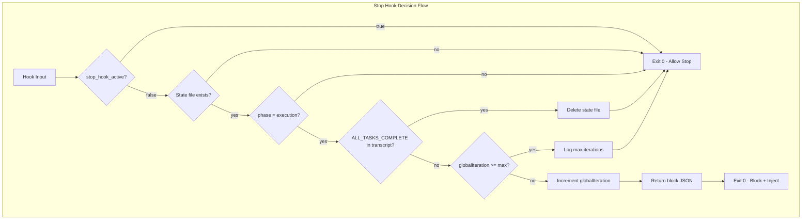
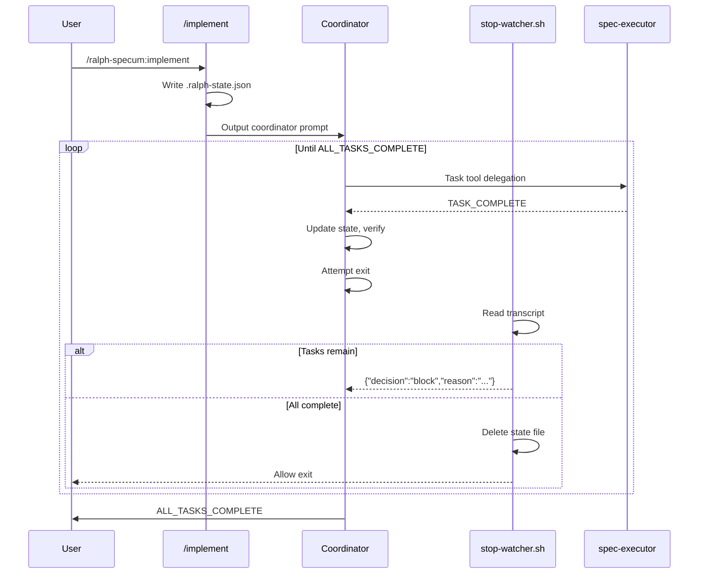

# Design: Ralph Loop Dependency Removal

## Overview

Inline ralph-wiggum stop-hook logic (~50 lines) into existing `stop-watcher.sh`, removing the external plugin dependency. Stop hook returns `{"decision": "block", "reason": "..."}` when execution active and `ALL_TASKS_COMPLETE` not detected in transcript.

## Design Inputs

| Decision | Response |
|----------|----------|
| Architecture style | Extend existing - add loop logic to stop-watcher.sh, modify implement.md/cancel.md |
| Technology constraints | None - use whatever works best |
| Problem being solved | Remove dependencies, maximize robustness |
| Primary users | Plugin maintainers and end users |

## Architecture



## Data Flow



## Components

### stop-watcher.sh (Modified)

**Purpose**: Block session exit when execution active, inject continuation prompt

**Current**: Cleanup-only (67 lines)
**After**: Cleanup + loop logic (~100 lines total)

**New Responsibilities**:
- Check `stop_hook_active` to prevent infinite loops (FR-3)
- Read phase from `.ralph-state.json` (FR-4)
- Check transcript for `ALL_TASKS_COMPLETE` (FR-2)
- Return block JSON when tasks incomplete (FR-1)
- Track/enforce `maxGlobalIterations` safety limit (FR-7, FR-8)

**Interface**:
```bash
# Input (stdin JSON)
{
  "stop_hook_active": boolean,
  "cwd": string,
  "transcript_path": string
}

# Output (stdout)
# Block: {"decision": "block", "reason": "Continue..."}
# Allow: (empty or no JSON)
```

### implement.md (Modified)

**Purpose**: Initialize execution state and output coordinator prompt

**Current**: Invokes `ralph-loop:ralph-loop` skill
**After**: Outputs coordinator prompt directly (FR-5)

**Changes**:
- Remove Ralph Loop dependency check section
- Remove skill invocation step
- Keep coordinator prompt (already written to file)
- Output coordinator prompt as final context
- Add `maxGlobalIterations` to state initialization

### cancel.md (Modified)

**Purpose**: Stop execution and cleanup state

**Current**: Invokes `ralph-loop:cancel-ralph` skill
**After**: Direct state file deletion only (FR-6)

**Changes**:
- Remove skill invocation step
- Keep state file deletion
- Keep progress file preservation

## Technical Decisions

| Decision | Options | Choice | Rationale |
|----------|---------|--------|-----------|
| Loop mechanism | External bash, internal stop-hook | Stop-hook | Matches existing architecture, proven pattern from ralph-wiggum |
| Exit code | Exit 2 + JSON, Exit 0 + JSON | Exit 0 + JSON | Exit 2 bug documented in #10412, exit 0 is industry standard |
| Completion detection | Exact match, regex | Exact `grep -q` | Simple, reliable, matches existing `ALL_TASKS_COMPLETE` protocol |
| State location | New file, extend existing | Extend `.ralph-state.json` | Already tracks execution state, minimal change |
| Iteration tracking | In transcript, in state file | State file `globalIteration` | Persistent across restarts, survives transcript issues |
| Infinite loop prevention | Timeout, flag check | `stop_hook_active` check | Claude Code provides flag, MUST be first check |
| jq dependency | Required, optional with fallback | Optional with graceful exit | jq unavailable = allow stop (safe default) |

## File Structure

| File | Action | Purpose |
|------|--------|---------|
| `plugins/ralph-specum/hooks/scripts/stop-watcher.sh` | Modify | Add ~50 lines loop logic |
| `plugins/ralph-specum/commands/implement.md` | Modify | Remove skill invocation, keep prompt |
| `plugins/ralph-specum/commands/cancel.md` | Modify | Remove skill invocation |
| `plugins/ralph-specum/README.md` | Modify | Remove ralph-wiggum dependency docs |
| `CLAUDE.md` | Modify | Update dependency reference |
| `plugins/ralph-specum/tests/stop-watcher.bats` | Create | bats-core unit tests for stop hook |
| `.github/workflows/test-hooks.yml` | Create | CI workflow for bats-core tests |

## Stop Hook Algorithm

```bash
#!/bin/bash
# Stop Hook for Ralph Specum - Loop Control + Cleanup

INPUT=$(cat)

# 1. CRITICAL: Prevent infinite loops (FR-3)
STOP_HOOK_ACTIVE=$(echo "$INPUT" | jq -r '.stop_hook_active // false' 2>/dev/null)
[ "$STOP_HOOK_ACTIVE" = "true" ] && exit 0

# 2. Graceful fallback if jq unavailable
command -v jq >/dev/null 2>&1 || exit 0

# 3. Parse input
CWD=$(echo "$INPUT" | jq -r '.cwd // empty')
TRANSCRIPT_PATH=$(echo "$INPUT" | jq -r '.transcript_path // empty')
[ -z "$CWD" ] && exit 0

# 4. Check for active spec
CURRENT_SPEC_FILE="$CWD/specs/.current-spec"
[ ! -f "$CURRENT_SPEC_FILE" ] && exit 0
SPEC_NAME=$(tr -d '[:space:]' < "$CURRENT_SPEC_FILE")
[ -z "$SPEC_NAME" ] && exit 0

# 5. Check state file exists (FR-4)
STATE_FILE="$CWD/specs/$SPEC_NAME/.ralph-state.json"
[ ! -f "$STATE_FILE" ] && exit 0

# 6. Validate and read state
if ! jq empty "$STATE_FILE" 2>/dev/null; then
    echo "[ralph-specum] WARNING: Corrupt state file" >&2
    exit 0  # Allow stop on corrupt state
fi

PHASE=$(jq -r '.phase // empty' "$STATE_FILE")
GLOBAL_ITER=$(jq -r '.globalIteration // 1' "$STATE_FILE")
MAX_ITER=$(jq -r '.maxGlobalIterations // 100' "$STATE_FILE")

# 7. Only block during execution phase (FR-4)
[ "$PHASE" != "execution" ] && exit 0

# 8. Check for completion signal in transcript (FR-2)
if [ -n "$TRANSCRIPT_PATH" ] && [ -f "$TRANSCRIPT_PATH" ]; then
    if grep -q "ALL_TASKS_COMPLETE" "$TRANSCRIPT_PATH" 2>/dev/null; then
        # Cleanup and allow stop
        rm -f "$STATE_FILE"
        echo "[ralph-specum] Execution complete, cleaned up state" >&2
        exit 0
    fi
fi

# 9. Safety limit check (FR-7, FR-8)
if [ "$GLOBAL_ITER" -ge "$MAX_ITER" ]; then
    echo "[ralph-specum] Max iterations ($MAX_ITER) reached" >&2
    rm -f "$STATE_FILE"
    exit 0
fi

# 10. Update iteration counter
jq ".globalIteration = $((GLOBAL_ITER + 1))" "$STATE_FILE" > "$STATE_FILE.tmp"
mv "$STATE_FILE.tmp" "$STATE_FILE"

# 11. Block and inject continuation prompt (FR-1)
TASK_INDEX=$(jq -r '.taskIndex // 0' "$STATE_FILE")
TOTAL_TASKS=$(jq -r '.totalTasks // 0' "$STATE_FILE")

cat << EOF
{"decision": "block", "reason": "Continue executing tasks for spec '$SPEC_NAME'. Read ./specs/$SPEC_NAME/.ralph-state.json for current state (task $((TASK_INDEX + 1))/$TOTAL_TASKS). Follow coordinator instructions from ./specs/$SPEC_NAME/.coordinator-prompt.md."}
EOF
exit 0
```

## State File Schema

```json
{
  "source": "spec",
  "name": "string",
  "basePath": "string",
  "phase": "execution",
  "taskIndex": 0,
  "totalTasks": 10,
  "taskIteration": 1,
  "maxTaskIterations": 5,
  "globalIteration": 1,
  "maxGlobalIterations": 100,
  "commitSpec": true,
  "awaitingApproval": false
}
```

New fields for this design:
- `globalIteration` - Current loop iteration (for safety limit)
- `maxGlobalIterations` - Maximum iterations before forced stop (default 100)

## Error Handling

| Error Scenario | Handling Strategy | User Impact |
|----------------|-------------------|-------------|
| jq not available | Exit 0 immediately (allow stop) | Session stops, user runs manually |
| State file missing | Exit 0 (allow stop) | No active execution, clean stop |
| State file corrupt | Log warning, exit 0 | Session stops, user reruns /implement |
| Transcript path missing | Skip transcript check, block | Loop continues, relies on state |
| Max iterations reached | Log warning, delete state, exit 0 | Session stops with message |
| Phase not execution | Exit 0 (allow stop) | Not in execution, clean stop |

## Edge Cases

- **Concurrent sessions**: State file per spec, no cross-contamination
- **Partial parallel batch**: Stop hook allows stop if transcript unavailable; coordinator handles on resume
- **Mid-task interrupt**: State preserved, /implement resumes from last task
- **Rapid stop/start**: `stop_hook_active` flag prevents re-entry during hook execution
- **Empty transcript**: Block exit (conservative), rely on state for progress tracking

## Test Strategy

### Unit Tests (Manual Verification)

| Test | Command | Expected |
|------|---------|----------|
| Hook blocks during execution | Run /implement, Ctrl+C before complete | Session continues |
| Hook allows on completion | Complete all tasks | Session stops, state deleted |
| stop_hook_active prevents loop | N/A (automatic) | No infinite loops |
| Max iterations enforced | Set maxGlobalIterations=2 | Stops after 2 iterations |
| jq fallback | Uninstall jq, run hook | Exits cleanly |

### Integration Tests

| Test | Steps | Verify |
|------|-------|--------|
| Full execution cycle | /new, /research, /requirements, /design, /tasks, /implement | All tasks complete, state deleted |
| Cancel mid-execution | /implement, wait 2 tasks, /cancel | State deleted, progress preserved |
| Resume interrupted | /implement, force quit, /implement | Resumes from last task |

### E2E Tests

| Test | Scenario | Success Criteria |
|------|----------|------------------|
| Fresh install | /plugin install, /ralph-specum:new test | Works without errors |
| Parallel tasks | Spec with [P] tasks | All parallel tasks complete |
| VERIFY tasks | Spec with [VERIFY] tasks | qa-engineer invoked correctly |

## Performance Considerations

- Stop hook must complete < 100ms (NFR-1)
- jq calls are fast (~5ms each), 6 calls maximum = ~30ms
- grep on transcript O(n) but transcripts typically < 1MB
- State file read/write adds ~10ms
- Total expected: 50-80ms per hook invocation

## Security Considerations

- No user input in executed commands (paths from state files only)
- State file permissions inherit from user's umask
- Transcript path provided by Claude Code, not user controllable
- JSON escaping via jq prevents injection in state file

## Existing Patterns to Follow

Based on codebase analysis:

1. **State file structure**: Follow existing `.ralph-state.json` schema with minimal additions
2. **Error logging**: Use `echo "..." >&2` pattern for stderr messages
3. **jq usage**: Use `// empty` or `// default` for safe field access
4. **Exit codes**: Always exit 0, let JSON control behavior
5. **Spec path resolution**: Read from `.current-spec`, validate exists
6. **Cleanup pattern**: `rm -f` with `|| true` for silent failure

## Implementation Steps

1. Create stop-watcher.sh with loop logic (~50 lines addition)
   - Add `stop_hook_active` check at top
   - Add transcript checking logic
   - Add iteration tracking
   - Add block JSON output
   - Keep existing cleanup logic

2. Modify implement.md
   - Remove Ralph Loop dependency check section
   - Remove skill invocation section
   - Add `globalIteration` and `maxGlobalIterations` to state init
   - Output coordinator prompt directly (already in file)

3. Modify cancel.md
   - Remove `ralph-loop:cancel-ralph` skill invocation
   - Keep state file deletion
   - Update output to remove skill reference

4. Update documentation
   - README.md: Remove ralph-wiggum install step
   - CLAUDE.md: Remove dependency reference

5. Create stop-watcher.bats tests
   - Setup mock fixtures (state files, transcripts)
   - Test all decision branches
   - Verify stdout/stderr output

## Test Strategy: Stop Hook (bats-core)

### Framework

[bats-core](https://github.com/bats-core/bats-core) - Bash Automated Testing System. Lightweight, TAP-compliant, CI-friendly.

### Test File Location

`plugins/ralph-specum/tests/stop-watcher.bats`

### Test Cases

| Test | Input | Expected Output | Exit Code |
|------|-------|-----------------|-----------|
| `stop_hook_active=true` exits immediately | `{"stop_hook_active": true, ...}` | Empty | 0 |
| Phase != execution allows exit | State with `phase: "design"` | Empty | 0 |
| Missing state file allows exit | No `.ralph-state.json` | Empty | 0 |
| `ALL_TASKS_COMPLETE` in transcript | Transcript with completion signal | State file deleted, empty output | 0 |
| Incomplete tasks returns block JSON | Execution phase, no completion | `{"decision": "block", ...}` | 0 |
| `maxGlobalIterations` exceeded | `globalIteration >= max` | State deleted, warning logged | 0 |
| Malformed state file handles gracefully | Invalid JSON in state file | Warning to stderr, empty output | 0 |
| Missing jq allows exit | jq not in PATH | Empty | 0 |

### Mock Strategy

```bash
# Test fixture directory structure
tests/
├── stop-watcher.bats
└── fixtures/
    ├── state-execution.json      # Valid state in execution phase
    ├── state-design.json         # State in design phase
    ├── state-malformed.json      # Invalid JSON
    ├── transcript-complete.txt   # Contains ALL_TASKS_COMPLETE
    └── transcript-incomplete.txt # No completion signal
```

### Example Test Structure

```bash
#!/usr/bin/env bats

setup() {
    # Create temp directory for test workspace
    TEST_TEMP=$(mktemp -d)
    mkdir -p "$TEST_TEMP/specs/test-spec"
    echo "test-spec" > "$TEST_TEMP/specs/.current-spec"

    # Path to script under test
    SCRIPT="$BATS_TEST_DIRNAME/../hooks/scripts/stop-watcher.sh"
}

teardown() {
    rm -rf "$TEST_TEMP"
}

@test "stop_hook_active=true exits immediately" {
    input='{"stop_hook_active": true, "cwd": "'"$TEST_TEMP"'"}'
    run bash -c "echo '$input' | $SCRIPT"

    [ "$status" -eq 0 ]
    [ -z "$output" ]
}

@test "phase != execution allows exit" {
    # Create state file with design phase
    cat > "$TEST_TEMP/specs/test-spec/.ralph-state.json" << 'EOF'
{"phase": "design", "taskIndex": 0}
EOF

    input='{"stop_hook_active": false, "cwd": "'"$TEST_TEMP"'"}'
    run bash -c "echo '$input' | $SCRIPT"

    [ "$status" -eq 0 ]
    [ -z "$output" ]
}

@test "ALL_TASKS_COMPLETE in transcript cleans up state" {
    # Create state file in execution phase
    cat > "$TEST_TEMP/specs/test-spec/.ralph-state.json" << 'EOF'
{"phase": "execution", "taskIndex": 5, "totalTasks": 5}
EOF

    # Create transcript with completion signal
    TRANSCRIPT="$TEST_TEMP/transcript.txt"
    echo "Some output... ALL_TASKS_COMPLETE ...more output" > "$TRANSCRIPT"

    input='{"stop_hook_active": false, "cwd": "'"$TEST_TEMP"'", "transcript_path": "'"$TRANSCRIPT"'"}'
    run bash -c "echo '$input' | $SCRIPT"

    [ "$status" -eq 0 ]
    [ ! -f "$TEST_TEMP/specs/test-spec/.ralph-state.json" ]  # State deleted
}

@test "incomplete tasks returns block JSON" {
    # Create state file in execution phase
    cat > "$TEST_TEMP/specs/test-spec/.ralph-state.json" << 'EOF'
{"phase": "execution", "taskIndex": 2, "totalTasks": 5, "globalIteration": 1, "maxGlobalIterations": 100}
EOF

    # Create transcript without completion signal
    TRANSCRIPT="$TEST_TEMP/transcript.txt"
    echo "Task 1 complete... Task 2 complete..." > "$TRANSCRIPT"

    input='{"stop_hook_active": false, "cwd": "'"$TEST_TEMP"'", "transcript_path": "'"$TRANSCRIPT"'"}'
    run bash -c "echo '$input' | $SCRIPT"

    [ "$status" -eq 0 ]
    [[ "$output" == *'"decision": "block"'* ]]
}

@test "maxGlobalIterations exceeded allows exit" {
    # Create state at max iterations
    cat > "$TEST_TEMP/specs/test-spec/.ralph-state.json" << 'EOF'
{"phase": "execution", "globalIteration": 100, "maxGlobalIterations": 100}
EOF

    input='{"stop_hook_active": false, "cwd": "'"$TEST_TEMP"'"}'
    run bash -c "echo '$input' | $SCRIPT"

    [ "$status" -eq 0 ]
    [ -z "$output" ]  # No block JSON
    [ ! -f "$TEST_TEMP/specs/test-spec/.ralph-state.json" ]  # State deleted
}

@test "malformed state file handles gracefully" {
    echo "not valid json {{{" > "$TEST_TEMP/specs/test-spec/.ralph-state.json"

    input='{"stop_hook_active": false, "cwd": "'"$TEST_TEMP"'"}'
    run bash -c "echo '$input' | $SCRIPT"

    [ "$status" -eq 0 ]
    [ -z "$output" ]
}
```

### Running Tests

```bash
# Install bats-core (macOS)
brew install bats-core

# Run tests
bats plugins/ralph-specum/tests/stop-watcher.bats

# Run with verbose output
bats --verbose-run plugins/ralph-specum/tests/stop-watcher.bats

# CI integration (TAP output)
bats --tap plugins/ralph-specum/tests/stop-watcher.bats
```

## Task Prioritization Algorithm

### Overview

Task-planner agent uses multi-factor scoring to order tasks optimally rather than purely sequential.

### Prioritization Formula

```
Priority Score = (Dep_Weight × Unblocks_Count)
               + (Risk_Weight × Uncertainty_Score)
               + (Value_Weight × Impact_Score)
```

Default weights: `Dep_Weight=3`, `Risk_Weight=2`, `Value_Weight=1`

### Factors

| Factor | Tag | Description | Score Range |
|--------|-----|-------------|-------------|
| Dependencies | `[BLOCKER]` | Tasks that unblock others | 1-5 (# of tasks unblocked) |
| Risk | `[RISKY]` | Uncertain/risky outcomes | 1-3 (1=low, 3=high uncertainty) |
| Value | `[HIGH-VALUE]` | Direct user impact | 1-3 (1=low, 3=high impact) |

### Scoring Algorithm

```
1. Build dependency graph from task descriptions
2. For each task:
   a. Count tasks it unblocks (Unblocks_Count)
   b. Assess uncertainty from keywords: "explore", "investigate", "might", "could" (Uncertainty_Score)
   c. Assess impact from keywords: "user-facing", "critical", "core" (Impact_Score)
3. Calculate Priority Score
4. Sort tasks descending by score within each phase
5. Preserve phase boundaries (POC → Refactor → Test → Quality)
```

### Task Tags

task-planner.md should annotate tasks with priority tags:

| Tag | Meaning | Priority Boost |
|-----|---------|----------------|
| `[BLOCKER]` | Unblocks 2+ other tasks | +6 (2 × Dep_Weight) |
| `[RISKY]` | Outcome uncertain, validate early | +4 (2 × Risk_Weight) |
| `[HIGH-VALUE]` | Major user-facing impact | +2 (2 × Value_Weight) |
| `[TRIVIAL]` | Low effort, low impact | -2 (move to end) |

### Example Task Ordering

Before prioritization:
```markdown
## Phase 1: Make It Work

- [ ] 1.1 Update implement.md to remove skill invocation
- [ ] 1.2 Add loop logic to stop-watcher.sh
- [ ] 1.3 Test stop_hook_active behavior
- [ ] 1.4 Update cancel.md to remove skill invocation
```

After prioritization:
```markdown
## Phase 1: Make It Work

- [ ] 1.1 [BLOCKER] Add loop logic to stop-watcher.sh
  > Unblocks: 1.3 (testing), 1.2, 1.4 (depend on loop working)
- [ ] 1.2 [RISKY] Test stop_hook_active behavior
  > Uncertain: platform-specific behavior, need early validation
- [ ] 1.3 Update implement.md to remove skill invocation
- [ ] 1.4 Update cancel.md to remove skill invocation
```

### Implementation in task-planner.md

Add to task-planner.md agent instructions:

```markdown
## Task Prioritization

After creating tasks, apply prioritization:

1. Identify blockers: Which tasks must complete before others can start?
   - Mark with `[BLOCKER]` tag
   - Add comment: `> Unblocks: <task-ids>`

2. Identify risks: Which tasks have uncertain outcomes?
   - Mark with `[RISKY]` tag
   - Add comment: `> Uncertain: <reason>`

3. Identify high-value: Which tasks have direct user impact?
   - Mark with `[HIGH-VALUE]` tag

4. Reorder tasks within each phase by priority score
   - BLOCKER tasks first
   - RISKY tasks second
   - HIGH-VALUE tasks third
   - Remaining tasks last

5. Preserve phase boundaries - never move tasks between phases
```

### Benefits

1. **Fail fast**: Risky tasks early expose blockers before investment
2. **Unblock parallelism**: Completing blockers enables parallel execution
3. **User value**: High-value tasks deliver impact sooner
4. **Clear reasoning**: Tags document why tasks are ordered

## CI/CD: GitHub Actions Workflow

### Overview

Automated bats-core test execution on push to main and PRs affecting hook scripts.

### Workflow File

`.github/workflows/test-hooks.yml`

### Trigger Events

| Event | Condition |
|-------|-----------|
| Push | `main` branch, paths `plugins/ralph-specum/hooks/**` or `plugins/ralph-specum/tests/**` |
| Pull Request | paths `plugins/ralph-specum/hooks/**` or `plugins/ralph-specum/tests/**` |

### Existing Workflows

Two workflows exist for consistency:
- `plugin-version-check.yml` - Verifies plugin version bumps on PR
- `spec-file-check.yml` - Prevents `.current-spec` from being committed

New workflow follows same conventions:
- `ubuntu-latest` runner
- `actions/checkout@v4`
- Clear emoji-prefixed status messages

### Workflow YAML

```yaml
name: Test Hooks

on:
  push:
    branches: [main]
    paths:
      - 'plugins/ralph-specum/hooks/**'
      - 'plugins/ralph-specum/tests/**'
  pull_request:
    paths:
      - 'plugins/ralph-specum/hooks/**'
      - 'plugins/ralph-specum/tests/**'

jobs:
  test-stop-watcher:
    name: Run bats-core tests
    runs-on: ubuntu-latest
    steps:
      - name: Checkout repository
        uses: actions/checkout@v4

      - name: Install bats-core
        run: |
          sudo apt-get update
          sudo apt-get install -y bats

      - name: Run stop-watcher tests
        run: |
          bats --tap plugins/ralph-specum/tests/stop-watcher.bats

      - name: Test summary
        if: always()
        run: |
          if [ $? -eq 0 ]; then
            echo "✅ All bats tests passed!"
          else
            echo "❌ Some bats tests failed"
          fi
```

### Key Design Decisions

| Decision | Choice | Rationale |
|----------|--------|-----------|
| bats installation | apt-get | Faster than brew, native to Ubuntu |
| Output format | `--tap` | TAP (Test Anything Protocol) for CI readability |
| Path filtering | hooks + tests dirs | Only run when relevant files change |
| Runner | ubuntu-latest | Consistent with existing workflows |

### Integration Notes

- Tests require `jq` - pre-installed on ubuntu-latest
- Stop-watcher.sh must be executable (`chmod +x`) - verified by test setup
- Fixtures created dynamically in temp directories during test runs
