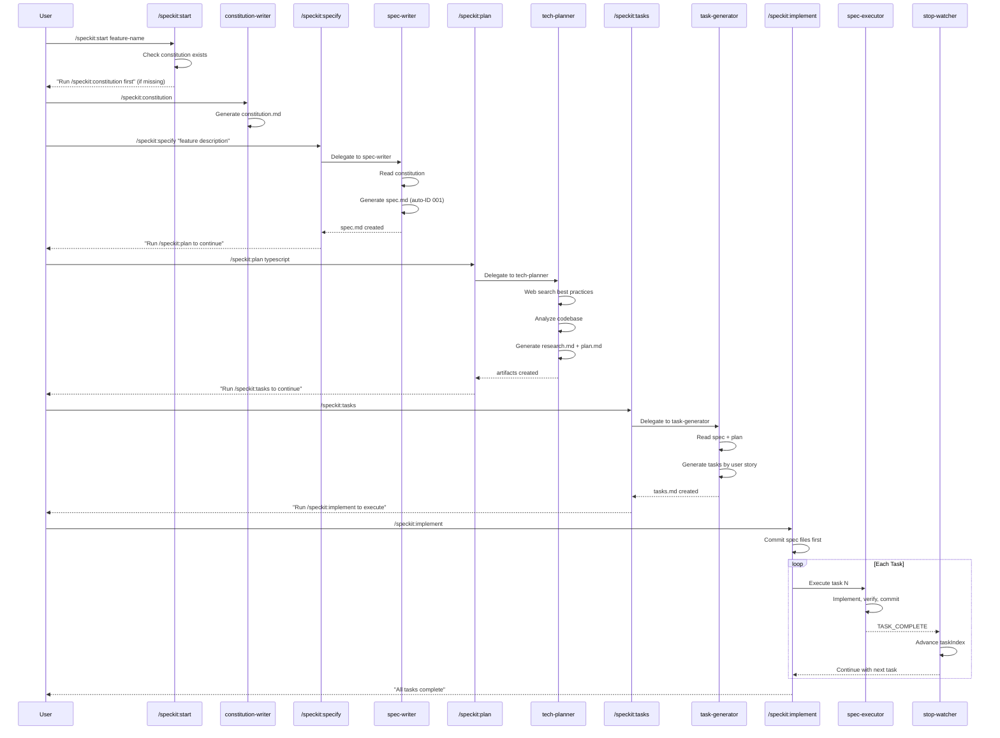
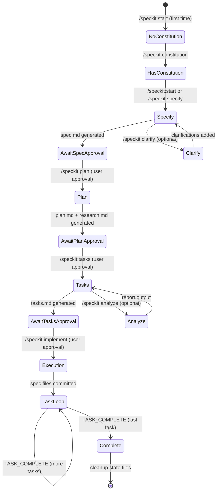

# Design: ralph-speckit Plugin

## Overview

ralph-speckit is a Claude Code plugin implementing GitHub's spec-kit methodology with constitution-first governance, clear separation of intent (WHAT/WHY) from implementation (HOW), and autonomous task-by-task execution. The plugin adapts proven ralph-specum patterns (stop-handler loop, agent delegation, state machine) while introducing spec-kit innovations (constitution, feature IDs, traceability annotations).

## Architecture

```mermaid
graph TB
    subgraph Plugin["ralph-speckit Plugin"]
        subgraph Commands["Slash Commands"]
            START["/speckit:start"]
            CONST["/speckit:constitution"]
            SPEC["/speckit:specify"]
            PLAN["/speckit:plan"]
            TASKS["/speckit:tasks"]
            IMPL["/speckit:implement"]
            STATUS["/speckit:status"]
            SWITCH["/speckit:switch"]
            CANCEL["/speckit:cancel"]
            CLARIFY["/speckit:clarify"]
            ANALYZE["/speckit:analyze"]
            HELP["/speckit:help"]
        end

        subgraph Agents["Subagents"]
            GOVERNER["constitution-writer"]
            SPECWRITER["spec-writer"]
            PLANNER["tech-planner"]
            TASKGEN["task-generator"]
            EXEC["spec-executor"]
            QA["qa-engineer"]
            CLARIFIER["clarifier"]
            ANALYZER["analyzer"]
        end

        subgraph Hooks["Hook System"]
            STOP["stop-watcher.sh"]
        end
    end

    subgraph Storage[".speckit/ Directory"]
        MEMORY["memory/constitution.md"]
        SPECS["specs/<id>-<name>/"]
        CURRENT[".current-feature"]
    end

    START --> GOVERNER
    CONST --> GOVERNER
    SPEC --> SPECWRITER
    PLAN --> PLANNER
    TASKS --> TASKGEN
    IMPL --> EXEC
    CLARIFY --> CLARIFIER
    ANALYZE --> ANALYZER

    EXEC --> QA
    STOP --> EXEC

    GOVERNER --> MEMORY
    SPECWRITER --> SPECS
    PLANNER --> SPECS
    TASKGEN --> SPECS
    EXEC --> SPECS
```



## Directory Structure

```
plugins/ralph-speckit/
  .claude-plugin/
    plugin.json              # Plugin manifest

  agents/
    constitution-writer.md   # Writes/updates constitution
    spec-writer.md           # Generates spec.md (WHAT/WHY)
    tech-planner.md          # Generates research.md + plan.md (HOW)
    task-generator.md        # Generates tasks.md organized by user story
    spec-executor.md         # Executes single task autonomously
    qa-engineer.md           # Handles [VERIFY] tasks
    clarifier.md             # Optional clarification phase
    analyzer.md              # Optional consistency analysis

  commands/
    start.md                 # Smart entry point with branch/feature management
    constitution.md          # Create/update project constitution
    specify.md               # Define feature specification
    plan.md                  # Create technical plan with research
    tasks.md                 # Generate task breakdown
    implement.md             # Execute tasks with stop-handler loop
    status.md                # Show current feature status
    switch.md                # Switch active feature
    cancel.md                # Cancel execution, cleanup state
    clarify.md               # Optional clarification phase
    analyze.md               # Optional consistency analysis
    help.md                  # Command documentation

  hooks/
    hooks.json               # Stop hook configuration
    scripts/
      stop-watcher.sh        # Task loop state machine

  templates/
    constitution.md          # Constitution template
    spec.md                  # Specification template
    plan.md                  # Plan template
    research.md              # Research template
    tasks.md                 # Tasks template
    progress.md              # Progress tracking template

  schemas/
    speckit.schema.json      # JSON schema for state and documents
```

## Feature Directory Structure

```
.speckit/
  memory/
    constitution.md          # Project-level principles (persistent)

  .current-feature           # Active feature pointer (gitignored)

  specs/
    001-feature-name/
      .speckit-state.json    # Execution state (gitignored)
      .progress.md           # Progress tracking (gitignored)
      spec.md                # Requirements (WHAT/WHY)
      research.md            # Technical research
      plan.md                # Technical design (HOW)
      tasks.md               # Implementation tasks

    002-another-feature/
      ...
```

## Components

### Component: Plugin Manifest

**Purpose**: Register plugin with Claude Code, define metadata

**File**: `.claude-plugin/plugin.json`

```json
{
  "name": "ralph-speckit",
  "version": "1.0.0",
  "description": "Spec-driven development with constitution-first governance. Specify (WHAT/WHY) then Plan (HOW) then Tasks then Implement with fresh context per task.",
  "author": {
    "name": "tzachbon"
  },
  "license": "MIT",
  "keywords": ["ralph", "spec-kit", "constitution", "specify", "plan", "tasks", "autonomous"]
}
```

### Component: State Machine

**Purpose**: Track execution state across sessions

**File**: `.speckit-state.json` (per feature)

```typescript
interface SpeckitState {
  source: "spec" | "plan" | "direct";
  featureId: string;        // "001", "002", etc.
  name: string;             // kebab-case feature name
  basePath: string;         // ".speckit/specs/001-feature-name"
  phase: "specify" | "plan" | "tasks" | "execution";
  taskIndex: number;        // 0-based current task
  totalTasks: number;       // Total tasks in tasks.md
  taskIteration: number;    // Retry count for current task
  maxTaskIterations: number; // Default 5
  globalIteration: number;  // Total loop iterations
  maxGlobalIterations: number; // Safety cap, default 100
  awaitingApproval?: boolean; // Blocks until user runs next phase
}
```

### Component: Constitution Writer Agent

**Purpose**: Create and update project-level constitution

**Responsibilities**:
- Check if constitution exists at `.speckit/memory/constitution.md`
- If new: generate constitution from user input
- If exists: offer update/append options
- Ensure sections: Core Principles, Code Quality, Technical Constraints, UX Guidelines, Performance, Decision Framework

**Interface**:
```
Input:
- User's project description or principles
- Existing constitution (if any)

Output:
- constitution.md at .speckit/memory/constitution.md
```

### Component: Spec Writer Agent

**Purpose**: Generate feature specification (WHAT/WHY only)

**Responsibilities**:
- Read constitution for governance compliance
- Generate spec.md with user stories, acceptance criteria
- Ensure NO implementation details leak into spec
- Auto-assign feature ID (001, 002, etc.)
- Create feature directory at `.speckit/specs/<id>-<name>/`

**Interface**:
```
Input:
- Feature description from user
- Constitution principles

Output:
- spec.md with Goal, User Stories, Functional Requirements, NFRs, Out of Scope
- Feature directory created
- State file initialized
```

### Component: Tech Planner Agent

**Purpose**: Generate technical implementation plan with research

**Responsibilities**:
- Validate spec.md exists before planning
- Perform web search for tech stack best practices
- Analyze codebase for existing patterns
- Generate research.md with findings
- Generate plan.md with architecture, components, file structure
- Reference constitution principles in plan

**Interface**:
```
Input:
- spec.md content
- Optional tech stack hint
- Constitution principles

Output:
- research.md with technical research
- plan.md with architecture, components, decisions
```

### Component: Task Generator Agent

**Purpose**: Generate actionable task breakdown by user story

**Responsibilities**:
- Read spec.md, plan.md, research.md
- Generate tasks organized by user story (US-1, US-2)
- Include traceability annotations (_Spec: FR-X, AC-X.X_, _Plan: Component_)
- Insert [VERIFY] quality checkpoints every 2-3 tasks
- Mark parallel tasks with [P]
- Include final verification tasks: full CI, PR creation, AC checklist

**Interface**:
```
Input:
- spec.md with requirements
- plan.md with architecture
- research.md with quality commands

Output:
- tasks.md with Do/Files/Done when/Verify/Commit per task
```

### Component: Spec Executor Agent

**Purpose**: Execute single task autonomously

**Responsibilities**:
- Read task from tasks.md by index
- Execute Do steps exactly
- Verify completion criteria
- Run Verify command
- Mark task [x] in tasks.md
- Update .progress.md
- Commit changes with specified message
- Output TASK_COMPLETE signal

**Interface**:
```
Input:
- Spec name and path
- Task index
- Context from .progress.md

Output:
- Task implemented and verified
- Commit created
- TASK_COMPLETE signal
```

### Component: Stop Watcher Hook

**Purpose**: Manage task loop state machine

**Responsibilities**:
- Read hook input from stdin
- Check for active feature via `.speckit/.current-feature`
- Read `.speckit-state.json` for execution state
- Log progress during execution phase
- Cleanup orphaned temp files

**Key Adaptation from ralph-specum**:
- Path: `.speckit/specs/$CURRENT_FEATURE/.speckit-state.json`
- Pointer: `.speckit/.current-feature`

```bash
# Path changes from ralph-specum:
# OLD: ./specs/$CURRENT_SPEC/.ralph-state.json
# NEW: .speckit/specs/$CURRENT_FEATURE/.speckit-state.json
```

### Component: Clarifier Agent (Optional)

**Purpose**: Structured requirement clarification

**Responsibilities**:
- Read spec.md and identify gaps marked `[NEEDS CLARIFICATION]`
- Ask sequential coverage-based questions
- Record answers in Clarifications section of spec.md
- Continue until no major ambiguities remain

### Component: Analyzer Agent (Optional)

**Purpose**: Cross-artifact consistency analysis

**Responsibilities**:
- Read constitution, spec, plan, tasks
- Check all requirements covered by tasks
- Identify inconsistencies between documents
- Output analysis report (not saved to file)

## Data Flow



## Technical Decisions

| Decision | Options Considered | Choice | Rationale |
|----------|-------------------|--------|-----------|
| Directory location | `./specs/`, `.speckit/`, `.specify/` | `.speckit/` | Follows spec-kit convention, distinguishes from ralph-specum |
| Feature ID format | UUID, timestamp, numeric | Numeric (001, 002) | Simple, sortable, human-readable |
| Constitution location | Per-feature, project root, .speckit/memory/ | `.speckit/memory/` | Follows spec-kit convention, clearly persistent |
| State file name | `.ralph-state.json`, `.state.json`, `.speckit-state.json` | `.speckit-state.json` | Namespaced to avoid confusion with ralph-specum |
| Research timing | Separate phase, embedded in plan | Embedded in plan | Follows spec-kit methodology |
| Hook type | Stop hook (watcher only) | Watcher | Ralph Wiggum handles loop via exit code 2 |
| Task organization | By phase, by user story | By user story | Follows spec-kit methodology, enables traceability |

## File Structure Changes

| File | Action | Purpose |
|------|--------|---------|
| `plugins/ralph-speckit/.claude-plugin/plugin.json` | Create | Plugin manifest |
| `plugins/ralph-speckit/agents/constitution-writer.md` | Create | Constitution generation agent |
| `plugins/ralph-speckit/agents/spec-writer.md` | Create | Specification generation agent |
| `plugins/ralph-speckit/agents/tech-planner.md` | Create | Plan + research generation agent |
| `plugins/ralph-speckit/agents/task-generator.md` | Create | Task breakdown agent |
| `plugins/ralph-speckit/agents/spec-executor.md` | Create | Task execution agent (adapted from ralph-specum) |
| `plugins/ralph-speckit/agents/qa-engineer.md` | Create | [VERIFY] task handler (adapted from ralph-specum) |
| `plugins/ralph-speckit/agents/clarifier.md` | Create | Optional clarification agent |
| `plugins/ralph-speckit/agents/analyzer.md` | Create | Optional analysis agent |
| `plugins/ralph-speckit/commands/start.md` | Create | Smart entry point with feature ID |
| `plugins/ralph-speckit/commands/constitution.md` | Create | Constitution management |
| `plugins/ralph-speckit/commands/specify.md` | Create | Specification phase |
| `plugins/ralph-speckit/commands/plan.md` | Create | Planning phase |
| `plugins/ralph-speckit/commands/tasks.md` | Create | Task generation phase |
| `plugins/ralph-speckit/commands/implement.md` | Create | Execution phase |
| `plugins/ralph-speckit/commands/status.md` | Create | Status display |
| `plugins/ralph-speckit/commands/switch.md` | Create | Feature switching |
| `plugins/ralph-speckit/commands/cancel.md` | Create | Execution cancellation |
| `plugins/ralph-speckit/commands/clarify.md` | Create | Optional clarification |
| `plugins/ralph-speckit/commands/analyze.md` | Create | Optional analysis |
| `plugins/ralph-speckit/commands/help.md` | Create | Help documentation |
| `plugins/ralph-speckit/hooks/hooks.json` | Create | Hook configuration |
| `plugins/ralph-speckit/hooks/scripts/stop-watcher.sh` | Create | Task loop watcher |
| `plugins/ralph-speckit/templates/constitution.md` | Create | Constitution template |
| `plugins/ralph-speckit/templates/spec.md` | Create | Specification template |
| `plugins/ralph-speckit/templates/plan.md` | Create | Plan template |
| `plugins/ralph-speckit/templates/research.md` | Create | Research template |
| `plugins/ralph-speckit/templates/tasks.md` | Create | Tasks template |
| `plugins/ralph-speckit/templates/progress.md` | Create | Progress template |
| `plugins/ralph-speckit/schemas/speckit.schema.json` | Create | JSON schema for validation |

## State Transitions



## Error Handling

| Error Scenario | Handling Strategy | User Impact |
|----------------|-------------------|-------------|
| Constitution missing on /speckit:start | Guide user to run /speckit:constitution first | Non-blocking guidance |
| spec.md missing on /speckit:plan | Error message with instruction | Blocks until spec created |
| plan.md missing on /speckit:tasks | Error message with instruction | Blocks until plan created |
| TASK_COMPLETE not detected | Retry up to maxTaskIterations (5) | Auto-retry, then block |
| State file corruption | Validate JSON before write, error on parse | Manual recovery needed |
| Feature ID collision | Append -2, -3 suffix | Automatic resolution |
| Branch already exists | Append -2, -3 suffix | Automatic resolution |

## Edge Cases

- **Empty constitution**: Generate minimal template, prompt user to fill
- **Feature ID gap**: Use next sequential (001, 003 if 002 deleted)
- **Parallel features**: Each feature has isolated state, switch via /speckit:switch
- **Resumed session**: Read .speckit-state.json, continue from last phase/task
- **Orphaned temp files**: Cleanup files older than 60 minutes via stop-watcher
- **No git repo**: Warn user but allow spec generation without branching

## Test Strategy

### Manual Testing

Since this is a Claude Code plugin with no build step, testing is manual:

```bash
# Load plugin
claude --plugin-dir ./plugins/ralph-speckit

# Test commands
/speckit:help
/speckit:constitution
/speckit:start test-feature "Test goal"
/speckit:specify "Add user authentication"
/speckit:plan typescript
/speckit:tasks
/speckit:implement
/speckit:status
/speckit:cancel
```

### Verification Points

| Test Case | Verification Command | Expected Result |
|-----------|---------------------|-----------------|
| Plugin loads | `/speckit:help` | Help output displayed |
| Constitution created | `cat .speckit/memory/constitution.md` | File exists with sections |
| Feature ID auto-increment | Create 2 features, check IDs | 001, 002 prefixes |
| Spec has no implementation | `grep -i "typescript\|react\|api" .speckit/specs/*/spec.md` | No matches |
| Tasks trace to spec | `grep "_Spec:" .speckit/specs/*/tasks.md` | All tasks have references |
| Stop-handler advances | Watch task progress | taskIndex increments |
| State cleanup | After completion, check state file | File deleted |

### Integration Tests (Future)

For automated testing, consider:
- Shell script that invokes Claude Code with test inputs
- Verify file structure after each phase
- Check state file transitions
- Validate JSON schema compliance

## Performance Considerations

- **Stop-handler response**: Target < 2 seconds per decision
- **Agent prompt size**: Keep under 5000 tokens per agent
- **State file writes**: Atomic (write to temp, then move)
- **Large repos**: Stop-watcher avoids -uall flag to prevent memory issues

## Security Considerations

- **No secrets in specs**: Warn if .env or credentials detected in commits
- **State file validation**: Check JSON structure before use
- **Branch protection**: Never push directly to main/master
- **Cleanup temp files**: Remove .progress-task-*.md after 60 minutes

## Existing Patterns to Follow

Based on ralph-specum codebase analysis:

1. **Agent frontmatter format**:
```markdown
---
name: agent-name
description: Description
model: inherit
---
```

2. **Command frontmatter format**:
```markdown
---
description: What it does
argument-hint: [arguments]
allowed-tools: [Read, Write, Bash, Task]
---
```

3. **Mandatory sections in agents**:
- System prompt with role
- "When Invoked" workflow
- "Append Learnings" section
- "Final Step: Set Awaiting Approval"

4. **State file updates**:
```bash
jq '.awaitingApproval = true' .speckit/specs/<id>-<name>/.speckit-state.json > /tmp/state.json && mv /tmp/state.json .speckit/specs/<id>-<name>/.speckit-state.json
```

5. **Delegation principle**: Commands coordinate, agents implement - NEVER violate this

6. **TASK_COMPLETE protocol**: spec-executor outputs this signal, stop-watcher verifies

7. **Gitignore entries**:
```
.speckit/.current-feature
**/.progress.md
**/.speckit-state.json
```

## Templates

### Constitution Template

```markdown
# Project Constitution

## Core Principles
- [Principle 1]
- [Principle 2]

## Code Quality Standards
- [Standard 1]
- [Standard 2]

## Technical Constraints
- [Constraint 1]
- [Constraint 2]

## UX Guidelines
- [Guideline 1]

## Performance Requirements
- [Requirement 1]

## Decision Framework
- [Framework for making technical decisions]
```

### Spec Template

```markdown
# Specification: <Feature Name>

## Goal
[One sentence describing what this feature achieves]

## User Stories

### US-1: <Story Title>
**As a** [user type]
**I want to** [action]
**So that** [benefit]

**Acceptance Criteria:**
- [ ] AC-1.1: [Criteria]
- [ ] AC-1.2: [Criteria]

## Functional Requirements

| ID | Requirement | Priority | Acceptance Criteria |
|----|-------------|----------|---------------------|
| FR-1 | [Requirement] | Must | AC-1.1, AC-1.2 |

## Non-Functional Requirements

| ID | Requirement | Metric | Target |
|----|-------------|--------|--------|
| NFR-1 | [Requirement] | [Metric] | [Target] |

## Out of Scope
- [What this feature does NOT include]

## Dependencies
- [External dependencies]
```

### Tasks Template

```markdown
# Tasks: <Feature Name>

## US-1: <User Story Title>

- [ ] 1.1 [Task name]
  - **Do**: [Steps]
  - **Files**: [Paths]
  - **Done when**: [Criteria]
  - **Verify**: [Command]
  - **Commit**: `feat(scope): description`
  - _Spec: FR-1, AC-1.1_
  - _Plan: Component A_

- [ ] 1.2 [VERIFY] Quality checkpoint
  - **Do**: Run quality commands
  - **Verify**: `lint && typecheck`
  - **Done when**: All pass
  - **Commit**: `chore: pass checkpoint` (if fixes)

## US-2: <User Story Title>
...

## Final Verification

- [ ] V1 [VERIFY] Full local CI
- [ ] V2 [VERIFY] CI pipeline passes
- [ ] V3 [VERIFY] AC checklist
```

## Traceability Matrix

| Requirement | Design Component | Agent | Command |
|-------------|-----------------|-------|---------|
| FR-1 Plugin loads | Plugin Manifest | - | /speckit:help |
| FR-2 Constitution persists | Constitution Writer | constitution-writer | /speckit:constitution |
| FR-3 Feature IDs auto-increment | Start Command | spec-writer | /speckit:start |
| FR-4 Spec has no implementation | Spec Writer | spec-writer | /speckit:specify |
| FR-5 Plan produces research + plan | Tech Planner | tech-planner | /speckit:plan |
| FR-6 Tasks trace to spec/plan | Task Generator | task-generator | /speckit:tasks |
| FR-7 Stop-handler advances task | Stop Watcher | spec-executor | /speckit:implement |
| FR-8 Spec files committed first | Implement Command | - | /speckit:implement |
| FR-9 Quality checkpoints | Task Generator | task-generator | /speckit:tasks |
| FR-10 Parallel tasks marked | Task Generator | task-generator | /speckit:tasks |
| FR-11 Clarify records answers | Clarifier | clarifier | /speckit:clarify |
| FR-12 Analyze outputs report | Analyzer | analyzer | /speckit:analyze |
| FR-14 Help provides docs | Help Command | - | /speckit:help |
