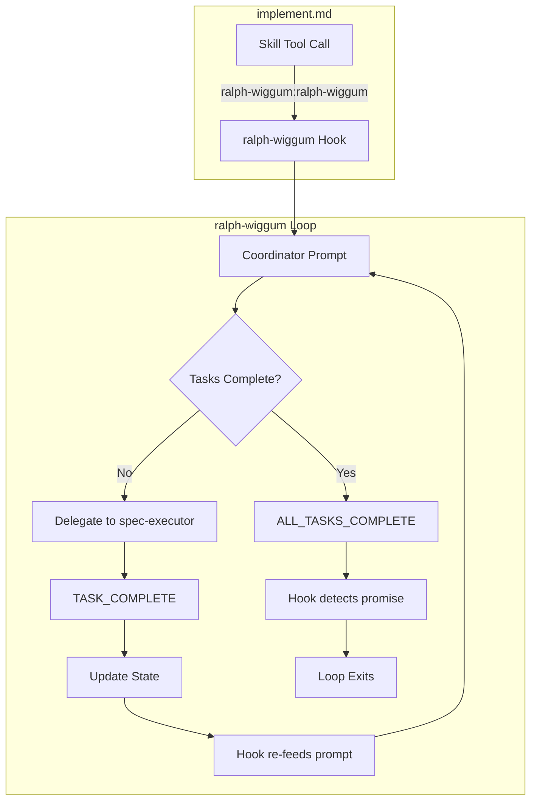

# Design: ralph-wiggum-integration

## Overview

Minimal-touch migration: update skill invocation path and wrap completion signal in `<promise>` tags. Coordinator logic unchanged since it's already state-driven (works with re-feeding).

## Architecture



## Components

### Component A: Skill Invocation (implement.md)

**Purpose**: Invoke ralph-wiggum loop with coordinator prompt
**Responsibilities**:
- Write coordinator prompt to file
- Call Skill tool with `ralph-wiggum:ralph-wiggum`
- Pass completion-promise and max-iterations args

**Change**: Update skill name from `ralph-loop:ralph-loop` to `ralph-wiggum:ralph-wiggum`

### Component B: Completion Signal (coordinator prompt)

**Purpose**: Signal loop completion in promise format
**Responsibilities**:
- Verify all tasks complete
- Output completion in `<promise>` tags

**Change**: Wrap `ALL_TASKS_COMPLETE` in `<promise>` tags at all output locations

## Data Flow

1. `/ralph-specum:implement` invoked
2. implement.md writes coordinator prompt to `.coordinator-prompt.md`
3. Skill tool calls `ralph-wiggum:ralph-wiggum` with prompt file path
4. ralph-wiggum reads prompt, executes coordinator
5. Coordinator reads `.ralph-state.json`, delegates tasks
6. On task complete: update state, hook re-feeds same prompt
7. On all complete: output `<promise>ALL_TASKS_COMPLETE</promise>`
8. Hook detects promise, exits loop

## Technical Decisions

| Decision | Options | Choice | Rationale |
|----------|---------|--------|-----------|
| Completion format | Raw text, JSON, promise tags | Promise tags | Required by ralph-wiggum API |
| State management | Keep current, migrate to ralph-wiggum state | Keep current | Works with re-feeding pattern |
| TASK_COMPLETE format | Raw or promise | Raw | Only coordinator needs promise; keeps spec-executor simple |

## File Structure

| File | Action | Purpose |
|------|--------|---------|
| `plugins/ralph-specum/commands/implement.md` | Modify | Update skill invocation, completion signal format |
| `CLAUDE.md` | Modify | Update dependency references |
| `plugins/ralph-specum/.claude-plugin/plugin.json` | Modify | Version bump |
| `.claude-plugin/marketplace.json` | Modify | Version bump |

## Changes Detail

### implement.md Changes

**Location 1**: Skill invocation (line ~74)
```diff
- Use the Skill tool to invoke `ralph-loop:ralph-loop` with args:
+ Use the Skill tool to invoke `ralph-wiggum:ralph-wiggum` with args:
```

**Location 2**: Completion signal in coordinator (multiple locations)
```diff
- 3. Output: ALL_TASKS_COMPLETE
+ 3. Output: <promise>ALL_TASKS_COMPLETE</promise>
```

**Location 3**: Error handling (ensure NO promise on error)
```diff
- 6. Do NOT output ALL_TASKS_COMPLETE
+ 6. Do NOT output <promise>ALL_TASKS_COMPLETE</promise>
```

### CLAUDE.md Changes

**Location 1**: Dependencies section
```diff
- Requires Ralph Loop plugin: `/plugin install ralph-loop@claude-plugins-official`
+ Requires ralph-wiggum plugin: `/plugin install ralph-wiggum@claude-plugins-official`
```

**Location 2**: Marketplace note
```diff
- /plugin install ralph-loop@claude-plugins-official
+ /plugin install ralph-wiggum@claude-plugins-official
```

**Location 3**: Execution Flow section
```diff
- invokes `/ralph-loop` from the Ralph Loop plugin
+ invokes `ralph-wiggum` plugin
```

**Location 4**: Task Completion Protocol
```diff
- to end the Ralph Loop
+ to end the ralph-wiggum loop
```

## Error Handling

| Error | Handling | User Impact |
|-------|----------|-------------|
| ralph-wiggum not installed | Error message with install command | Clear next step |
| Promise not detected | Loop continues (re-feeds prompt) | Expected behavior |
| Corrupted state | Error message, no promise output | Manual fix required |

## Existing Patterns to Follow

- Skill invocation pattern from `implement.md` line 74
- Promise tag format: `<promise>COMPLETION_TEXT</promise>`
- Version bump pattern: patch increment (2.11.3 -> 2.11.4)
