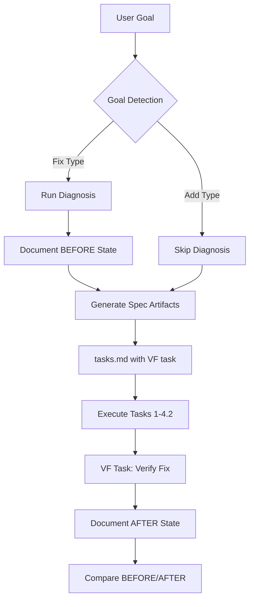

# Design: reality-verification-principle

## Overview

Add reality verification as a cross-cutting concern: plan-synthesizer detects fix goals and diagnoses, task-planner adds VF task, qa-engineer verifies.

## Architecture

## Components

### Reality Verification SKILL.md

**Purpose**: Canonical reference for detection rules and command mapping
**Responsibilities**:
- Define goal type detection heuristics
- Define command mapping table
- Define BEFORE/AFTER documentation format

### Plan Synthesizer Updates

**Purpose**: Entry point for diagnosis on fix goals
**Responsibilities**:
- Detect goal type using heuristics
- Run reproduction command
- Capture failure state
- Document in .progress.md

### Task Planner Updates

**Purpose**: Generate VF task for fix goals
**Responsibilities**:
- Detect fix goal from .progress.md BEFORE section
- Insert VF task after 4.2 in tasks.md
- Include command reference

### QA Engineer Updates

**Purpose**: Execute VF task verification
**Responsibilities**:
- Read BEFORE state from .progress.md
- Re-run reproduction command
- Compare BEFORE vs AFTER
- Document AFTER state

## Data Flow

1. Goal parsed by plan-synthesizer
2. Detection classifies as Fix or Add
3. Fix goals: run command, capture BEFORE state
4. BEFORE state written to .progress.md
5. Spec artifacts generated
6. task-planner detects fix goal, adds VF task
7. qa-engineer runs VF, reads BEFORE, compares AFTER

## Technical Decisions

| Decision | Options | Choice | Rationale |
|----------|---------|--------|-----------|
| Detection location | SKILL vs agent | Both | SKILL is reference, agent implements |
| Command discovery | User input vs heuristic | Heuristic | Autonomous operation |
| VF task position | New phase vs Phase 4 | Phase 4 (4.3) | Follows existing structure |

## File Structure

| File | Action | Purpose |
|------|--------|---------|
| `plugins/ralph-specum/skills/reality-verification/SKILL.md` | Create | Core principle definition |
| `plugins/ralph-specum/agents/plan-synthesizer.md` | Modify | Add detection + diagnosis |
| `plugins/ralph-specum/agents/task-planner.md` | Modify | Add VF task generation |
| `plugins/ralph-specum/agents/qa-engineer.md` | Modify | Add VF task handling |
| `plugins/ralph-specum/templates/tasks.md` | Modify | Add VF task template |

## Error Handling

| Error | Handling | User Impact |
|-------|----------|-------------|
| Command not found | Log warning, continue | Spec proceeds without BEFORE state |
| Command timeout (60s) | Kill process, log | Document timeout, continue |
| No failure observed | Log info in .progress.md | VF task still added |
| VF cannot reproduce | Mark as SKIP, not FAIL | Allow spec completion |

## Goal Detection Heuristics

| Pattern | Type | Regex Example |
|---------|------|---------------|
| fix, repair, resolve, debug, patch | Fix | `\b(fix&#124;repair&#124;resolve&#124;debug&#124;patch)\b` |
| broken, failing, error, bug, issue | Fix | `\b(broken&#124;failing&#124;error&#124;bug&#124;issue)\b` |
| "not working", "doesn't work" | Fix | `not\s+working&#124;doesn't\s+work` |
| add, create, build, implement, new | Add | `\b(add&#124;create&#124;build&#124;implement&#124;new)\b` |

## Command Mapping

| Goal Keywords | Reproduction Command |
|---------------|---------------------|
| CI, pipeline, actions | `gh run view --log-failed` |
| test, tests, spec | project test command from package.json |
| type, types, typescript | `pnpm check-types` or `tsc --noEmit` |
| lint, linting | `pnpm lint` or `eslint` |
| build, compile | `pnpm build` or `npm run build` |
| deploy, deployment | `gh api` or WebFetch check |

## Existing Patterns to Follow

- SKILL.md format from `skills/delegation-principle/SKILL.md`
- Mandatory sections from `agents/task-planner.md`
- [VERIFY] task format from `agents/qa-engineer.md`
- Phase 4 structure from `templates/tasks.md`
