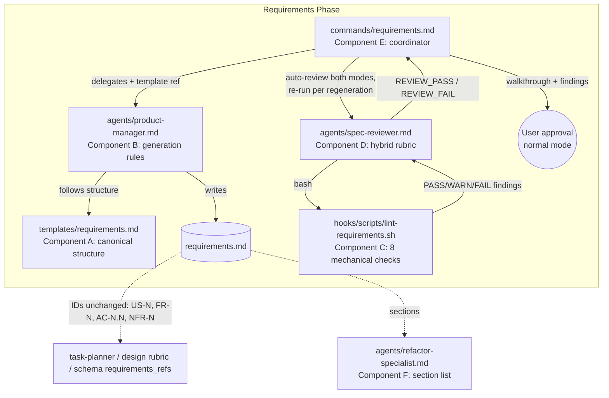
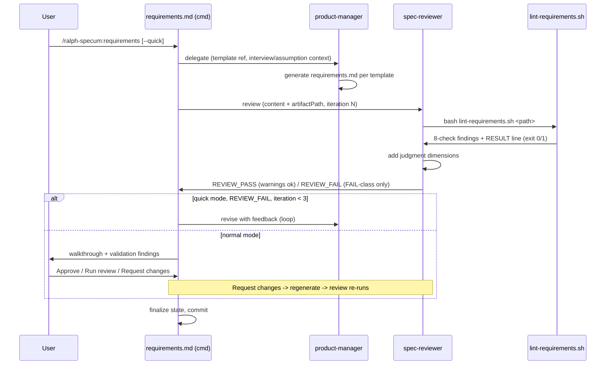

# Design: requirements-process-improvements

## Overview

Prompt/template edits across 5 markdown files plus one new bash lint script implementing a hybrid validation gate: `lint-requirements.sh` performs all 8 mechanical checks deterministically; the spec-reviewer requirements rubric consumes its output and layers judgment dimensions (observable behavior, coverage adequacy, scope, problem-statement quality) on top. `templates/requirements.md` becomes the single canonical structure; product-manager carries only generation rules. Auto-review runs in both modes after every generation/regeneration.

## Architecture

### Component Diagram



### Components

#### Component A: templates/requirements.md (canonical structure)
**Purpose**: Single source of truth for requirements.md structure.
**Responsibilities** (FR-1, FR-3, FR-4, FR-8, FR-9, FR-10, FR-12):
- Add `## Problem Statement` section before Goal: one paragraph slot with `{{problem}}`, `{{affected user}}`, `{{evidence pointer to research.md}}` (FR-9).
- AC skeleton becomes mandatory 3-clause form: `AC-1.1: Given {{context}}, When {{action}}, Then {{observable outcome}}` (FR-1).
- FR table: Priority column `Must/Should/Could` (FR-10); Acceptance Criteria column holds AC ID references (`AC-1.1, AC-2.3`), not free-text verification (FR-3).
- Risks table Impact stays High/Medium/Low (risk impact is not FR priority; only FR Priority column is MoSCoW).
- NFR table: comment/instruction line "every row: metric+target filled, or `N/A: <reason>`; delete unused boilerplate rows" (FR-12).
- `## Out of Scope` heading KEPT (refactor-specialist coupling); body opens with default-scope rule line: "Default-scope rule: anything not listed here that falls under the Goal is in scope." followed by non-goal bullets (FR-8).
- ID tokens `US-N`, `FR-N`, `AC-N.N`, `NFR-N` unchanged (FR-4).
- Section order: Problem Statement, Goal, User Stories, Functional Requirements, Non-Functional Requirements, Glossary, Out of Scope, Dependencies, Success Criteria, Risks. Additive only; no renames.

#### Component B: agents/product-manager.md (generation rules only)
**Purpose**: Generation rules; structure delegated to template.
**Responsibilities** (FR-1, FR-2, FR-3, FR-5, FR-10, FR-11, FR-14):
- Replace inline 46-line structure block (lines 74-124) with: "Follow `${CLAUDE_PLUGIN_ROOT}/templates/requirements.md` exactly" + minimal fallback section-ordering note (one line, derisks FR-11's Should status) (FR-11, FR-14).
- Requirement language rules: FR statements phrased "System MUST ..." / "System SHOULD ..."; ACs mandatory Given/When/Then, all 3 clauses, observable outcomes not implementation (FR-1).
- 2 before/after few-shot rewrites, e.g. "handle errors gracefully" -> "Given an invalid config path, When the command runs, Then it exits non-zero and prints the path in the error message"; "search should be fast" -> "Given 10k indexed specs, When a search runs, Then results return in <2s or target is `TBD (owner, date)`" (FR-1/AC-1.2).
- Six-scenario checklist per story: happy, empty/none, error, cancellation, permission, boundary; non-applicable scenarios get `N/A: <one-line reason>` under the story's ACs (FR-2).
- Append-only ID rules: never renumber/reuse; retire in place with `(retired)` mark (FR-3).
- TBD discipline: unknown specific -> `TBD (owner, expected date)`, never invent; quick mode -> state assumptions explicitly in an Assumptions note or TBD markers so generation never stalls (FR-5).
- MoSCoW everywhere in prompt text; delete High/Medium/Low mentions (FR-10).
- Cut superseded Quality Checklist items that the lint gate now covers mechanically (priority presence, testable ACs) — net size stays lean (FR-14, NFR-2).
- Unchanged: Explore usage, learnings append, awaitingApproval final step, communication style.

#### Component C: hooks/scripts/lint-requirements.sh (NEW — mechanical gate)
**Purpose**: Deterministic 8-check lint of a requirements.md file (FR-6, FR-1/AC-1.3, FR-4; mechanical halves of FR-2 via C6 and FR-5 via C7).
Plain bash + grep/awk, no new dependencies, `set -e`-free main loop (a lint must report, not die), style-matched to `update-spec-index.sh`. See "Lint Script Contract" below for check list, output, exit codes.

#### Component D: agents/spec-reviewer.md — requirements rubric (hybrid gate)
**Purpose**: Runs Component C, merges its findings with judgment dimensions, emits blocking signal (FR-2, FR-5, FR-6, FR-10).
**Responsibilities**:
- When `artifactType: requirements` and `artifactPath` provided: run `bash ${CLAUDE_PLUGIN_ROOT}/hooks/scripts/lint-requirements.sh <artifactPath>`, map each of the 8 checks into the findings table with its PASS/WARN/FAIL status verbatim (FR-6).
- If script missing/unrunnable (exit 2 or command error): note INFO finding, perform the 8 checks manually per the rubric's check definitions (rubric prose is the semantic source of truth; script is the fast path). Warn-and-continue, never abort the review.
- Judgment dimensions kept/updated in rubric (not counted in the 8): Testability (observable-behavior language, not grep-ability), Coverage adequacy (are six-scenario N/A reasons legitimate; WARN for happy-path-only stories per AC-2.2), Scope (matches goal), Problem Statement quality (states problem + user + evidence, not solution restatement), Traceability (FR<->US linkage).
- Priority expectation already MoSCoW — now matches template/agent (FR-10, W3 closed).
- Signal semantics (AC-5.3): `REVIEW_FAIL` only when >=1 FAIL-class finding (mechanical FAIL or judgment-dimension FAIL). WARN-only results -> `REVIEW_PASS` with warnings listed. WARN never blocks.
- Update rubric examples to GWT form; drop "automatable (e.g., grep -q)" testability example (superseded; FR-14).

#### Component E: commands/requirements.md (auto-review flow)
**Purpose**: Coordinator; wires the gate into both modes (FR-7, FR-5).
**Responsibilities**:
- Step 4 retitled "Artifact Review (both modes)": runs after generation in normal AND quick mode. Delegation to spec-reviewer now includes `artifactPath: ./specs/$spec/requirements.md` alongside content.
- Normal mode: single review pass; findings table displayed inside the Step 5 walkthrough (new "Validation" block: 8-check statuses + judgment findings); user approval flow unchanged (AC-5.2). On "Request changes" regeneration: re-run review after the product-manager revision, re-display walkthrough (resolves open Q3: re-run after every regeneration).
- "Run review" approval option remains (re-invokes reviewer on demand).
- Quick mode: existing loop preserved — max 3 iterations, only REVIEW_FAIL triggers re-generation, graceful degradation at iteration 3, no-signal = PASS (AC-5.3, NFR-3).
- Delegation prompt to product-manager updated: reference template structure, quick-mode assumption-stating instruction (FR-5/AC-4.2).

#### Component F: agents/refactor-specialist.md (lockstep section list)
**Purpose**: Keep section walkthrough in sync (FR-8/AC-6.2).
- Requirements review order gains "Problem Statement" as item 1 (before Goal); "Out of Scope" entry annotated with non-goal/default-scope semantics. No removals/renames.

#### Component G: version bump (FR-13)
- `plugins/ralph-specum/.claude-plugin/plugin.json`: 4.9.1 -> 4.10.0 (minor: new feature).
- `.claude-plugin/marketplace.json` ralph-specum entry: 4.9.1 -> 4.10.0.

**FR coverage check**: FR-1 (A,B,C), FR-2 (B,C,D — mechanical half via D→C6), FR-3 (A,B), FR-4 (A,C), FR-5 (B,C,D,E — mechanical half via D→C7), FR-6 (C,D), FR-7 (E), FR-8 (A,F), FR-9 (A), FR-10 (A,B,D), FR-11 (B), FR-12 (A,C), FR-13 (G), FR-14 (B,D). No orphans.

### Data Flow



1. Coordinator delegates generation; product-manager follows template + generation rules.
2. Review auto-runs in both modes; reviewer executes lint script, merges mechanical + judgment findings.
3. Quick mode: FAIL-class blocks (max 3 loops); normal mode: findings shown, user approves.
4. Every regeneration (quick-loop revision or "Request changes") triggers a fresh review pass.

## Lint Script Contract (Component C)

**Path**: `plugins/ralph-specum/hooks/scripts/lint-requirements.sh`
**Usage**: `lint-requirements.sh <path-to-requirements.md>`
**Dependencies**: bash, grep, awk, sed only (matches existing script conventions; no jq needed).

### The 8 Checks (resolves requirements Unresolved Q1)

| # | Check | What it verifies | Class | Trip conditions |
|---|-------|------------------|-------|-----------------|
| C1 | ID & cross-reference integrity | US-N/FR-N/AC-N.N/NFR-N token format; no duplicate IDs; every AC ID referenced in FR table exists; every FR references >=1 AC | **FAIL** | Dangling ref, duplicate, malformed ID = FAIL. AC referenced by no FR = WARN finding within check |
| C2 | GWT clause presence | Every `AC-N.N:` line contains all three of `Given`, `When`, `Then` | **FAIL** | Any missing clause = FAIL (AC-1.3) |
| C3 | MoSCoW priority values | FR table Priority column values in {Must, Should, Could} only | **FAIL** | Any High/Medium/Low or other value in FR Priority = FAIL (AC-5.4, AC-8.2) |
| C4 | Requirement-language lint | Every FR statement contains `MUST` or `SHOULD`; FR/AC text free of banned vague terms (gracefully, seamless, robust, user-friendly, appropriately, properly, works correctly) | **FAIL** | Missing MUST/SHOULD modal = FAIL. Banned-term hit = WARN finding within check (heuristic, false positives possible) |
| C5 | NFR fill-or-N/A | Every NFR row: Metric and Target both non-placeholder, or Target starts `N/A:` with reason text | **FAIL** | Empty cell, `{{...}}` placeholder, or bare `N/A` without reason = FAIL (AC-8.3) |
| C6 | Six-scenario coverage proxy | Each story has >=1 non-happy-path AC (keyword heuristic: error/invalid/missing/empty/cancel/denied/unauthorized/limit/boundary in When/Then) OR an explicit `N/A:` scenario line | **WARN** | Happy-path-only story with no N/A markings = WARN (AC-2.2; adequacy judgment stays with reviewer) |
| C7 | Unowned TBD / open questions | Every `TBD` carries `(owner, date)` parenthetical; every Unresolved Questions bullet names `Owner:` | **WARN** | Unowned TBD or ownerless question = WARN (AC-4.3) |
| C8 | MUST:SHOULD ratio advisory | Prioritization signal exists | **WARN** | > 85% of FRs are Must with >= 8 FRs = WARN "no cut-line signal" (AC-5.1 names it advisory) |

**FAIL-class (block quick-mode loop): C1-C5. WARN-class (advisory, never block): C6-C8.**
Rationale for the split: C1-C5 are structural contract violations with zero false-positive risk and mechanical remediation; C6-C8 rely on heuristics or advisory thresholds, so blocking on them would risk stalling the autonomous 3-iteration loop (NFR-3).

### Output Contract

One finding per line to stdout, pipe-delimited, then a summary line:

```
FAIL|C2|AC-3.1: missing "Then" clause
WARN|C7|Unresolved Questions item 2: no Owner
CHECK|C1|PASS
...
RESULT: FAIL (1 FAIL, 1 WARN, 6 PASS)
```

- `CHECK|Cn|PASS` emitted for clean checks so the reviewer can render all 8 rows.
- **Exit codes**: `0` = no FAIL-class findings (WARNs allowed); `1` = >=1 FAIL finding; `2` = usage error / file not found / unreadable.
- Consumption: spec-reviewer parses lines into its findings table; exit 1 forces >=1 FAIL dimension (-> REVIEW_FAIL); exit 0 means mechanical side passes (judgment dimensions may still FAIL); exit 2 -> INFO finding + manual fallback per rubric definitions.

## Technical Decisions

| Decision | Options Considered | Choice | Rationale |
|----------|-------------------|--------|-----------|
| Gate implementation | Pure-prompt rubric; pure script; hybrid | Hybrid (interview-binding) | Deterministic checks are cheap/reliable in bash; judgment (adequacy, scope) needs a model; rubric prose remains semantic source of truth so gate survives script absence |
| Who runs the script | Coordinator runs, passes output; reviewer runs | Reviewer runs via Bash | Single integration point works for all invokers (quick loop, normal pass, "Run review", regeneration re-runs); reviewer stays read-only (lint reads, never writes) |
| Script failure behavior | Block; warn-and-continue | Warn-and-continue with manual fallback | Gate must never stall autonomous quick mode (NFR-3); checks are fully defined in rubric prose, so reviewer degrades to manual evaluation with an INFO note |
| 8-check composition | AC-5.1 candidate list variants | C1-C8 above; ID uniqueness merged into C1 to make room for C6 coverage proxy | Matches AC-5.1's named minimum exactly; every check deterministic; heuristic checks demoted to WARN |
| Scope heading | Keep "Out of Scope"; rename "Non-Goals" | Keep heading, add default-scope rule + non-goal semantics inside | refactor-specialist name-coupling (AC-6.2); zero-consumer-break (resolves requirements Unresolved Q2) |
| Normal-mode review cadence | Once post-generation; re-run per regeneration | Re-run after every regeneration | Stale findings after "Request changes" would mislead approval (resolves Unresolved Q3, per interview) |
| Structure source of truth | Dual (agent + template) with sync note; template-only | Template-only; agent keeps 1-line fallback ordering note | Kills W4 drift class; fallback derisks template-unreadable edge (FR-11 is Should) |
| FR AC column | Keep free-text verification; AC ID refs | AC ID refs only | Removes two-competing-AC-homes (W10); makes C1 cross-ref mechanically checkable |
| Version bump | Patch; minor | Minor (4.9.1 -> 4.10.0) | New feature (validation gate + new sections), no breaking contract changes |

## File Structure

| File | Action | Purpose |
|------|--------|---------|
| `plugins/ralph-specum/hooks/scripts/lint-requirements.sh` | **Create** | 8-check mechanical lint (Component C) |
| `plugins/ralph-specum/hooks/scripts/test-lint-requirements.sh` | **Create** | Self-contained test harness with heredoc fixtures (matches `test-path-resolver.sh` convention) |
| `plugins/ralph-specum/templates/requirements.md` | Modify | Problem Statement, GWT AC skeleton, MoSCoW, AC-ref FR column, NFR fill-or-N/A, default-scope rule (Component A) |
| `plugins/ralph-specum/agents/product-manager.md` | Modify | Replace inline structure with template ref; add generation rules; cut superseded checklist text (Component B) |
| `plugins/ralph-specum/agents/spec-reviewer.md` | Modify | Requirements rubric -> hybrid 8-check gate + judgment dims; signal semantics (Component D) |
| `plugins/ralph-specum/commands/requirements.md` | Modify | Auto-review both modes; re-run per regeneration; artifactPath in delegation; walkthrough validation block (Component E) |
| `plugins/ralph-specum/agents/refactor-specialist.md` | Modify | Add Problem Statement to requirements section list; annotate Out of Scope semantics (Component F) |
| `plugins/ralph-specum/.claude-plugin/plugin.json` | Modify | 4.9.1 -> 4.10.0 (Component G) |
| `.claude-plugin/marketplace.json` | Modify | ralph-specum entry 4.9.1 -> 4.10.0 (Component G) |

2 create, 7 modify. No schema changes; `schemas/spec.schema.json` `requirements_refs` untouched (FR-4).

## Error Handling

| Error Scenario | Handling Strategy | User Impact |
|----------------|-------------------|-------------|
| Lint script missing / not executable / exit 2 | Reviewer logs INFO finding, performs 8 checks manually from rubric definitions; never blocks | Review still completes; walkthrough notes "mechanical lint unavailable, checks applied manually" |
| Lint false positive (C4 banned word in glossary, C6 keyword miss) | FAIL-class checks scoped to FR/AC lines only; heuristic checks are WARN-class and never block | At worst an advisory warning user can ignore at approval |
| Quick-mode loop hits 3 iterations with FAIL remaining | Existing graceful degradation preserved: log warning to .progress.md, proceed | Autonomous run completes; residual findings recorded |
| Reviewer emits no signal | Existing permissive rule: treat as REVIEW_PASS | Flow continues |
| Template unreadable by product-manager | Fallback ordering note in agent prompt | Artifact still generated in correct section order |
| requirements.md path mismatch in delegation | Script exit 2 -> manual fallback path above | Same as script-missing row |

Decision: **script failure = warn-and-continue** (never block). Justification: the gate's job is catching artifact defects, not enforcing its own infrastructure; a blocking gate would violate NFR-3 (quick-mode robustness) and add a new stall mode to autonomous runs. The rubric prose duplicates check semantics, so degradation loses speed/determinism but not coverage. That duplicated rubric prose must stay terse (compact check definitions, no expanded examples) to honor FR-14/NFR-2 leanness.

## Edge Cases

- **Retired requirement rows** (`FR-3 (retired)`): C1 treats retired IDs as valid reference targets; sequence gaps NOT flagged (append-only discipline makes gaps legitimate only via retirement-in-place, which leaves no gaps; malformed sequences still surface as WARN inside C1).
- **Multi-line AC text**: C2 evaluates the full `AC-N.N:` bullet (continuation lines joined) before clause matching.
- **N/A NFR rows**: `N/A: markdown-only change` passes C5; bare `N/A` fails.
- **Zero SHOULD FRs in tiny specs** (< 8 FRs): C8 suppressed — ratio advisory meaningless at small N.
- **Quick mode with no research.md**: Problem Statement derived from goal + stated assumptions (AC-7.2); evidence pointer becomes `TBD (user, next review)` — C7 WARN at most, never blocks.

## Test Strategy

### Unit Tests (script)
`test-lint-requirements.sh`: heredoc-generated fixture docs in `mktemp -d`, assert exit code + findings, PASS/FAIL counters (existing `test-path-resolver.sh` pattern):
- Clean fixture (this spec's own requirements.md structure) -> exit 0, 8 PASS.
- One fixture per check tripping it: duplicate FR ID, dangling AC ref (C1); AC missing Then (C2); `High` priority (C3); FR without MUST/SHOULD (C4); `{{metric}}` placeholder NFR row (C5); happy-path-only story (C6 WARN, exit 0); unowned TBD (C7 WARN, exit 0); 10 FRs all Must (C8 WARN, exit 0).
- Exit-code contract: missing file -> 2; WARN-only -> 0; any FAIL -> 1.

### Integration Tests
- Run `lint-requirements.sh` against `specs/requirements-process-improvements/requirements.md` (real artifact) — expect exit 0 after any needed touch-ups.
- Grep gates: zero `High/Medium/Low` in FR-priority contexts across template/agent/rubric; `Problem Statement` present in template + refactor-specialist list; product-manager no longer contains the inline FR-table skeleton.

### E2E (manual phase run)
- Normal mode: `/ralph-specum:requirements` on a scratch spec — verify review auto-runs, validation block appears in walkthrough, approval still required; "Request changes" -> review re-runs.
- Quick mode: `/ralph-specum:requirements --quick` — verify loop completes <= 3 iterations, WARN-only findings don't trigger revision.
- Downstream: run `/ralph-specum:design` against the generated artifact — zero ID-reference breakage (NFR-1).

## Performance Considerations

- Lint is grep/awk over one markdown file: sub-second; no impact on phase latency (NFR-4 N/A stands for runtime product code; the script itself is trivially fast).

## Security Considerations

- Script reads one file, writes nothing, takes path as positional arg; no eval, no network (NFR-5 N/A).

## Existing Patterns to Follow

- Script header/style: `#!/bin/bash`, usage comment block, no external deps (`update-spec-index.sh`).
- Test harness: mktemp fixtures, assert helpers, PASS/FAIL counters (`test-path-resolver.sh`).
- Reviewer output: findings table + last-line signal contract unchanged.
- Coordinator delegation/state protocol (`awaitingApproval`, review loop, graceful degradation) unchanged.
- Version bump in both plugin.json and marketplace.json per repo CLAUDE.md.

## Unresolved Questions

None. Q1 (8-check composition + FAIL/WARN split), Q2 (keep "Out of Scope" heading), Q3 (re-run review after regeneration) resolved above per interview decisions.

## Implementation Steps

1. Create `hooks/scripts/lint-requirements.sh` with C1-C8 and the exit-code/output contract.
2. Create `hooks/scripts/test-lint-requirements.sh` with fixtures; make both executable; run green.
3. Update `templates/requirements.md` (Component A changes).
4. Update `agents/product-manager.md` (Component B: template ref, generation rules, cuts).
5. Update `agents/spec-reviewer.md` requirements rubric (Component D: script invocation, 8-check table, judgment dims, signal semantics).
6. Update `commands/requirements.md` (Component E: Step 4 both-modes review, artifactPath, walkthrough validation block, regeneration re-run).
7. Update `agents/refactor-specialist.md` section list (Component F).
8. Lint this spec's own requirements.md; fix any findings.
9. Bump versions in plugin.json + marketplace.json (Component G).
10. Run grep gates + manual phase runs (normal + quick) per Test Strategy.
