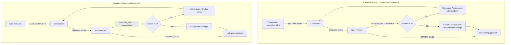

# Design: reviewer-subagent

## Overview

Add a `spec-reviewer` agent that reviews artifacts using type-specific rubrics. Coordinators (phase commands) invoke the reviewer via Task tool between phase agent completion and awaitingApproval. A bounded loop (max 3 iterations) ensures convergence or graceful degradation.

## Architecture



## Components

### Component A: spec-reviewer Agent (`agents/spec-reviewer.md`)

**Purpose**: Read-only reviewer that validates artifacts against type-specific rubrics.

**Responsibilities**:
- Receive artifact content via Task delegation
- Apply rubric checks based on artifact type (research, requirements, design, tasks, execution)
- Output structured findings with REVIEW_PASS or REVIEW_FAIL signal
- Never modify files directly

**Inputs**: Artifact content, artifact type, upstream artifacts (for cross-referencing), review iteration number

**Outputs**: Structured review with signal:
```text
## Review: $artifactType (Iteration $N)

### Findings
| # | Dimension | Status | Finding |
|---|-----------|--------|---------|
| 1 | Completeness | PASS | All sections present |
| 2 | Grounding | FAIL | Claim on line 45 has no source |
| 3 | Traceability | PASS | All FRs trace to user stories |

### Summary
- Passed: 7/9 dimensions
- Failed: 2/9 dimensions
- Critical issues: [list]

### Feedback for Revision
1. [Specific actionable feedback item 1]
2. [Specific actionable feedback item 2]

REVIEW_FAIL
```

### Component B: Review Loop in Phase Commands

**Purpose**: Coordinator logic inserted into each phase command to manage the review-revise cycle.

**Responsibilities**:
- Invoke spec-reviewer after phase agent completes
- Parse REVIEW_PASS/REVIEW_FAIL signal
- On REVIEW_FAIL: re-invoke phase agent with reviewer feedback
- Track iteration count (max 3)
- On max iterations: append warnings to .progress.md and proceed

**Integration points** (files to modify):
- `commands/research.md` - After merge step, before walkthrough
- `commands/requirements.md` - After product-manager, before walkthrough
- `commands/design.md` - After architect-reviewer, before walkthrough
- `commands/tasks.md` - After task-planner, before walkthrough

### Component C: Review Loop in Execution (implement.md)

**Purpose**: Post-task implementation review during execution phase.

**Responsibilities**:
- After spec-executor completes (TASK_COMPLETE), invoke spec-reviewer
- Reviewer checks implementation against design.md and requirements.md
- On REVIEW_FAIL: coordinator can add fix tasks to tasks.md or update spec files
- Bounded to 3 iterations per task review

### Component D: Quick Mode Review (plan-synthesizer.md)

**Purpose**: Review all four artifacts after quick-mode generation.

**Responsibilities**:
- After plan-synthesizer generates all artifacts, invoke spec-reviewer for each
- Sequential review: research -> requirements -> design -> tasks
- Each review bounded to max 3 iterations
- On REVIEW_FAIL: plan-synthesizer revises the artifact and re-reviews

## Data Flow

### Phase Review Flow

1. Phase command invokes phase agent (e.g., research-analyst) via Task tool
2. Phase agent writes artifact (e.g., research.md) and returns
3. Coordinator reads the artifact content
4. Coordinator invokes spec-reviewer via Task tool with artifact content + type + upstream artifacts
5. spec-reviewer applies rubric, outputs REVIEW_PASS or REVIEW_FAIL with findings
6. If REVIEW_PASS: coordinator proceeds to walkthrough and awaitingApproval
7. If REVIEW_FAIL (iteration < 3): coordinator re-invokes phase agent with feedback, goto step 2
8. If REVIEW_FAIL (iteration >= 3): coordinator logs warnings, proceeds to walkthrough

### Execution Review Flow

1. Coordinator delegates task to spec-executor
2. spec-executor completes task, outputs TASK_COMPLETE
3. Coordinator runs 4-layer verification (existing)
4. Coordinator invokes spec-reviewer with: changed files, task description, design.md, requirements.md
5. spec-reviewer checks alignment, outputs REVIEW_PASS or REVIEW_FAIL
6. If REVIEW_PASS: advance taskIndex
7. If REVIEW_FAIL: coordinator adds fix tasks or updates specs, iterates

## Technical Decisions

| Decision | Options | Choice | Rationale |
|----------|---------|--------|-----------|
| Review agent placement | Stop hook vs. command-level vs. separate command | Command-level (inline) | Stop hook is Haiku-based (too limited). Separate command breaks flow. Inline in commands gives coordinator control. |
| Max iterations | 2 / 3 / 5 | 3 | Research shows quality plateaus after 2-3. Hard cap of 3 balances quality vs. cost. |
| Reviewer file access | Read-only vs. read-write | Read-only | Reviewer should never modify artifacts. Coordinator applies changes via phase agent re-invocation. |
| Signal pattern | New signals vs. reuse VERIFICATION | New: REVIEW_PASS/REVIEW_FAIL | Distinct from qa-engineer's VERIFICATION signals. Clearer intent. Same structure. |
| Execution review trigger | Every task vs. every N tasks vs. [REVIEW] marker | Every task (optional, coordinator decides) | Simplest. Coordinator can skip review for trivial tasks. |
| Graceful degradation | Block and error vs. proceed with warnings | Proceed with warnings | User can still see and manually review. Better UX than blocking. |
| Quick mode review | Skip review vs. review all | Review all four artifacts | Quick mode most benefits from automated review since there's no human-in-the-loop. |

## File Structure

| File | Action | Purpose |
|------|--------|---------|
| `plugins/ralph-specum/agents/spec-reviewer.md` | Create | Reviewer agent definition with type-specific rubrics |
| `plugins/ralph-specum/commands/research.md` | Modify | Add review loop after merge, before walkthrough |
| `plugins/ralph-specum/commands/requirements.md` | Modify | Add review loop after product-manager, before walkthrough |
| `plugins/ralph-specum/commands/design.md` | Modify | Add review loop after architect-reviewer, before walkthrough |
| `plugins/ralph-specum/commands/tasks.md` | Modify | Add review loop after task-planner, before walkthrough |
| `plugins/ralph-specum/commands/implement.md` | Modify | Add review checkpoint after task completion verification |
| `plugins/ralph-specum/commands/start.md` | Modify | Add review step in quick mode flow |
| `plugins/ralph-specum/agents/plan-synthesizer.md` | Modify | Add review step after artifact generation |
| `plugins/ralph-specum/.claude-plugin/plugin.json` | Modify | Version bump (3.4.0 -> 3.5.0) |
| `.claude-plugin/marketplace.json` | Modify | Version bump (3.4.0 -> 3.5.0) |

## Review Delegation Prompt Template

Used by all phase commands when invoking spec-reviewer:

```text
You are reviewing the $artifactType artifact for spec: $spec
Spec path: $specPath

Review iteration: $iteration of 3

Artifact content:
[Full content of the artifact being reviewed]

Upstream artifacts (for cross-referencing):
[Content of prior artifacts - research for requirements, research+requirements for design, etc.]

Apply the $artifactType rubric. Output structured findings with REVIEW_PASS or REVIEW_FAIL.

If REVIEW_FAIL, provide specific, actionable feedback for revision. Reference line numbers or sections.
```

## Revision Delegation Prompt Template

Used by phase commands when re-invoking phase agent after REVIEW_FAIL:

```text
You are revising the $artifactType for spec: $spec
Spec path: $specPath

Current artifact: [path to artifact]

Reviewer feedback (iteration $iteration):
$reviewerFindings

Your task:
1. Read the current artifact
2. Address each finding from the reviewer
3. Update the artifact to resolve all issues
4. Maintain consistency with upstream artifacts

Focus on the specific issues flagged. Do not rewrite sections that passed review.
```

## Error Handling

| Error | Handling | User Impact |
|-------|----------|-------------|
| Reviewer fails to output signal | Treat as REVIEW_PASS (permissive) | Artifact proceeds as-is |
| Phase agent fails during revision | Retry once, then proceed with original | Original artifact used with warning |
| Iteration counter lost | Default to iteration 1, continue | May get extra reviews (safe) |
| Reviewer times out | Treat as REVIEW_PASS | Artifact proceeds without review |
| Conflicting feedback across iterations | Latest iteration's feedback takes precedence | Phase agent addresses most recent |

## Existing Patterns to Follow

- **Agent frontmatter**: Same format as `spec-executor.md` and `qa-engineer.md` (name, description, model: inherit)
- **Signal protocol**: REVIEW_PASS/REVIEW_FAIL mirrors VERIFICATION_PASS/VERIFICATION_FAIL from `qa-engineer.md`
- **Task delegation**: Same `Task tool with subagent_type: spec-reviewer` pattern used for all other agents
- **Coordinator pattern**: Phase commands are coordinators that delegate. Review loop follows same pattern as existing feedback loops.
- **Progress logging**: Append review findings to `.progress.md` Learnings section, same as other agents
- **`<mandatory>` blocks**: Use for critical review loop enforcement rules

## Rubric Definitions (Per Artifact Type)

### Research Rubric
- Completeness: Executive Summary, Codebase Analysis, Feasibility Assessment present
- Grounding: Claims cite file paths or URLs
- Scope: Focused on stated goal, not tangential topics

### Requirements Rubric
- Completeness: User stories have ACs, FRs have priorities
- Testability: ACs are specific and automatable
- Traceability: FRs trace to user stories
- Scope: Requirements match goal, nothing out-of-scope included

### Design Rubric
- Completeness: Architecture, components, data flow, decisions, file structure present
- Consistency: Design references match requirements FRs
- Feasibility: File paths exist or are valid creation targets
- Patterns: Design follows existing codebase patterns

### Tasks Rubric
- Completeness: All tasks have Do/Files/Done when/Verify/Commit
- Traceability: Tasks reference requirements (FR-*) and design sections
- Actionability: Steps are concrete, not vague
- Structure: POC-first 4-phase structure followed
- Quality gates: [VERIFY] tasks present at appropriate intervals

### Execution Rubric
- Alignment: Implementation matches design.md component responsibilities
- Correctness: Changed files match task's Files list
- Completeness: All "Done when" criteria verifiable in the code
- No hallucinations: Imports exist, APIs are real, file paths valid
