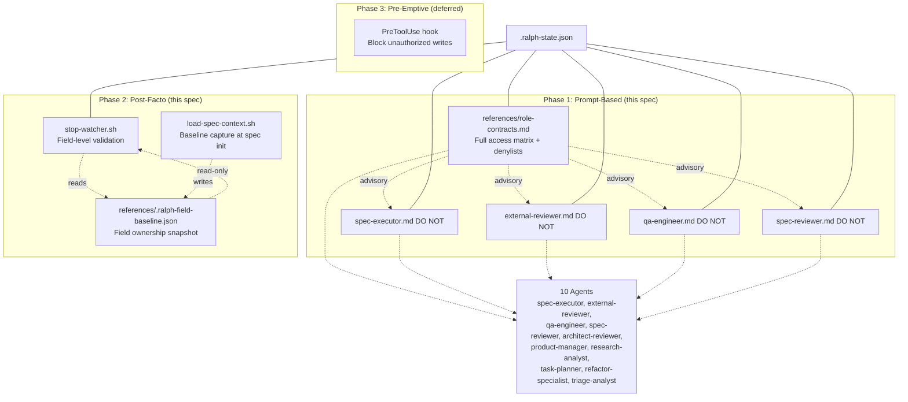
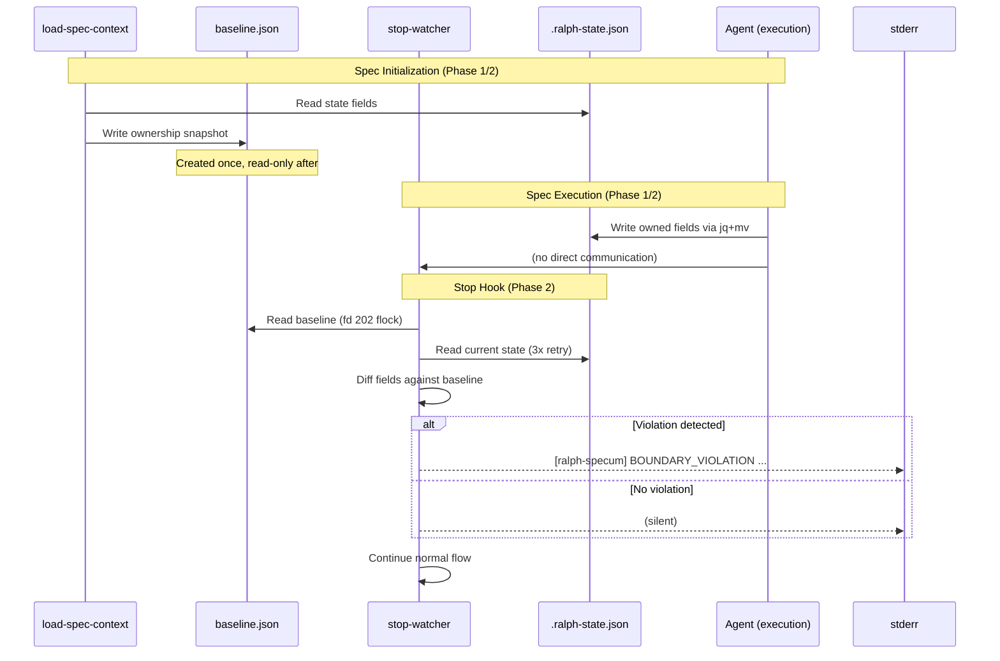

# Design: Role Boundaries

## Overview

Create a single declarative contract (`references/role-contracts.md`) defining read/write permissions for all 10 agents, append explicit DO NOT denylists to 4 execution agent files, and add field-level state integrity validation to `stop-watcher.sh` with an auto-captured baseline snapshot. Three enforcement layers: Phase 1 (prompt-only) and Phase 2 (post-facto validation) are in scope for this spec. Phase 3 (PreToolUse write-block) is deferred.

## Architecture



## Components

### Component A: role-contracts.md

**Purpose**: Single authoritative access matrix for all 10 agents, listing read/write permissions per file/field, denylists, severity ratings, and "Adding a New Agent" checklist.

**Path**: `plugins/ralph-specum/references/role-contracts.md`

**Ownership**: coordinator (human) writes; all agents read.

**Structure**:
- YAML frontmatter (`name: role-contracts`, `description`, `"> Used by:"` line)
- `## Access Matrix` — table: agent | reads | writes | denylist
- `## State Field Ownership` — table: field | owner(s) | type
- `## Non-Execution Agent Boundaries` — 6 agents not covered by Phase 1 DO NOT lists
- `## Adding a New Agent` — 4 numbered steps:
  1. Add access matrix row: `| <agent> | <read-paths> | <write-paths> | <denylist> |`
  2. Append DO NOT list section (see Component B template) to the agent file at structurally appropriate insertion point
  3. Update `channel-map.md` if the agent uses inter-agent channels (add to Channel Registry)
  4. If the agent writes new state fields: update the active spec's `<spec-path>/references/.ralph-field-baseline.json` with ownership mapping. NOTE: the baseline is per-spec (stored in each spec's references directory). The baseline must be updated by the spec that adds new field ownership.
- `## Relationship to Channel Map` — explains complementary scope with channel-map.md
- `## Cross-Spec Dependencies` — lists which specs modify which shared files

**Content scope**:
- All 10 agents: spec-executor, external-reviewer, qa-engineer, spec-reviewer, architect-reviewer, product-manager, research-analyst, task-planner, refactor-specialist, triage-analyst
- coordinator (human) is the 11th entity — full read/write access to all spec files
- stop-watcher.sh is a system component — reads boundaries, does NOT modify files
- All channels from channel-map.md: chat.md, task_review.md, tasks.md, .progress.md, .ralph-state.json
- Spec artifact files: requirements.md, design.md, tasks.md, research.md
- Lock files: .tasks.lock, .git-commit.lock, chat.md.lock (auto-generated)
- Per-task progress files: .progress-task-*.md

### Component B: DO NOT Lists (Agent Prompt Denylists)

**Purpose**: Append explicit denylists to 4 execution agent files, cross-referencing role-contracts.md.

**Target files and placement**:

| File | Placement | Insertion Point |
|------|-----------|-----------------|
| `plugins/ralph-specum/agents/spec-executor.md` | Before `<bookend>` section | After `</modifications>` or last `<section>` tag |
| `plugins/ralph-specum/agents/external-reviewer.md` | Before Section 8 "Never Do" | After Section 7, before `## Section 8` |
| `plugins/ralph-specum/agents/qa-engineer.md` | Before "Execution Flow" section | After `## Section 0 - Review Integration`, before `## Execution Flow` |
| `plugins/ralph-specum/agents/spec-reviewer.md` | After "Core Philosophy" block | After `</mandatory>` of Core Philosophy (line 17), before "## When Invoked" |

**Scope note**: DO NOT sections are appended to only 4 execution-phase agents (spec-executor, external-reviewer, qa-engineer, spec-reviewer) per FR-2. The 6 other entities (coordinator, architect-reviewer, product-manager, research-analyst, task-planner, refactor-specialist, triage-analyst, stop-watcher.sh) have boundary declarations ONLY in role-contracts.md (AC-5.1-AC-5.5), not in their agent files. The coordinator is human and manages its own boundaries. Planning agents are read-only except for `awaitingApproval`.

**Content per DO NOT section**:
- Files/fields the agent may NOT write to (ownership exceptions)
- Lock files declaration (auto-generated — no agent should manually create/modify/delete)
- Read boundary severity ratings: HIGH (cross-spec contamination), MEDIUM (uncommitted context), LOW (public references)
- Ending line: `See \`references/role-contracts.md\` for the full access matrix.`

**Template content** (inserted into each agent file):

```markdown
## DO NOT Edit — Role Boundaries

The following files and fields are outside this agent's scope. Modifying them
constitutes a role boundary violation. Full matrix: `references/role-contracts.md`.

### Write Restrictions

- `.ralph-state.json` — except: `<owned-fields>` (see role-contracts.md)
- `<other-denylisted-files>`

### Lock Files (Auto-Generated)

- `.tasks.lock`, `.git-commit.lock`, `chat.md.lock` — these are created by the
  flock mechanism. No agent should manually create, modify, or delete them.

### Read Boundaries (Advisory — Severity)

- **HIGH**: Cross-spec `.ralph-state.json` or `.progress.md` — may read another
  spec's uncommitted execution state, leading to taskIndex desync.
- **MEDIUM**: `task_review.md` from other agents' reviews — may act on unverified feedback.
- **LOW**: Reference files in `references/` — acceptable and encouraged.

See `references/role-contracts.md` for the full access matrix.
```

### Component C: Baseline File

**Purpose**: Machine-parseable field ownership snapshot for stop-watcher validation.

**Path**: `<spec-path>/references/.ralph-field-baseline.json` (created in each spec's references directory)

**Creation**: Automatically at spec initialization via `load-spec-context.sh`. If baseline already exists (re-run), NOT overwritten. **Important**: The baseline is a hand-maintained ownership map, NOT extracted from state values. The field values in `.ralph-state.json` are actual data values (e.g., `true`, `100`). The baseline maps field names to their OWNER(S), not their values. This distinction is critical: the baseline captures WHO may write each field, not WHAT the field's current value is.

**Schema** (JSON object with path-style keys):

```json
{
  "chat.executor.lastReadLine": "spec-executor",
  "chat.reviewer.lastReadLine": "external-reviewer",
  "external_unmarks": "external-reviewer",
  "awaitingApproval": [
    "coordinator",
    "architect-reviewer",
    "product-manager",
    "research-analyst",
    "task-planner"
  ]
}
```

**Rules**:
- Simple field owner → string (single owner)
- Multi-owner field → array of owner names
- `external_unmarks`: stored as parent key with single owner `external-reviewer`. During validation, if the current state value is an object, skip per-key validation (all keys in the object are task IDs being unmarked by the owner). If the value is NOT an object (e.g., null or scalar), skip validation for this field.
- Fields added by dependent specs (e.g., engine-state-hardening may add new owned fields) → NOT in baseline → skipped as "unknown ownership" per schema drift rules. Cross-spec coordination rule: a spec that adds a new owned field must update the baseline.
- Dynamic fields not in state file → NOT included (schema drift tolerance)
- Baseline is READ-ONLY after creation — stop-watcher only reads it

### Component D: Stop-Watcher Field-Level Validation

**Purpose**: Post-facto detection of unauthorized field writes to `.ralph-state.json`.

**Location**: New section appended to `plugins/ralph-specum/hooks/scripts/stop-watcher.sh` (~200-400 lines of new logic).

**Placement**: Before the "All tasks verified complete" exit (line ~524), inside the main `else` block before `exit 0`. This ensures validation runs even on the final task completion (the most important check). Placed after taskIndex validation but before the exit. Clearly marked section with heading.

**Flow**:

```
1. Read baseline file from <basePath>/references/.ralph-field-baseline.json
2. If baseline missing → log warning to stderr, skip validation (graceful degradation)
3. Acquire flock on fd 202 (dedicated fd for baseline validation)
4. Retry loop: read state file up to 3 times with 1s delay (mitigate jq+mv race)
5. For each field in baseline:
   a. Extract field value from current state via jq path-style addressing
   b. If field absent from current state → skip (schema drift: unknown ownership)
   c. If jq fails on value type (object/boolean ≠ string owner) → skip
      (baseline stores OWNER names, not data values — type mismatch is expected)
   d. Extract owner(s) from baseline
   e. If owner(s) is a string and equals "coordinator" → skip (coordinator-only field)
   f. If owner(s) is an array and includes "coordinator" → skip (coordinator-inclusive field)
      NOTE: coordinator writes these fields during state transitions;
      agent writes are indistinguishable without agent identity
   g. If owner(s) does NOT include "coordinator" (agent-owned-only field)
      → field changed from baseline → violation → log warning
      NOTE: this is the useful signal — coordinator should not write
      agent-owned-only fields during normal operation
6. Release flock
7. Continue normal stop-watcher flow
```

**Phase 1 agent identity limitation**: stop-watcher cannot determine which agent modified a field. The stop-watcher runs as a separate hook process and has no access to agent identity in its input. This means the violation check is: "any field that changed from its baseline ownership expectation." The coordinator legitimately writes ALL fields during normal operation, so the stop-watcher cannot distinguish "coordinator wrote an agent-owned field" from "agent wrote to a field." Phase 1 validation is best understood as a "schema drift detector" with false-positive risk. Violations require manual review to determine if the change was legitimate (coordinator) or unauthorized (agent).

**Violation log format** (to stderr only):

```
[ralph-specum] BOUNDARY_VIOLATION field=<field> owner=<owner(s)> severity=<SEVERITY>

Severity mapping for WRITE violations:
- Write to `.ralph-state.json` by unauthorized agent: HIGH (state corruption risk)
- Write to `task_review.md` by unauthorized agent: HIGH (review integrity)
- Write to `tasks.md` by unauthorized agent: HIGH (task tracking integrity)
- Write to `.progress.md` by unauthorized agent: MEDIUM (progress drift)
```


**File descriptor**: fd 202 (dedicated, separate from 200 for chat.md and 201 for tasks.md).

**Flock behavior**: stop-watcher's flock on fd 202 is SESSION-ISOLATED (per-process fd table). The coordinator's `jq + mv` writes are NOT flock-protected. The retry loop (3x with 1s delay) is the PRIMARY protection against concurrent writes — the flock on fd 202 protects against the stop-watcher reading a partially-written state file during the retry window.

**Retry logic**: 3 retries, 1-second delay (addresses jq+mv atomic write race condition).

**Retry loop pseudocode**:
```bash
RETRY_COUNT=0
STATE_CONTENT=""
while [ $RETRY_COUNT -lt 3 ]; do
    if STATE_CONTENT=$(cat "$STATE_FILE" 2>/dev/null) && echo "$STATE_CONTENT" | jq empty 2>/dev/null; then
        break
    fi
    RETRY_COUNT=$((RETRY_COUNT + 1))
    if [ $RETRY_COUNT -lt 3 ]; then
        sleep 1
    fi
done
if [ $RETRY_COUNT -eq 3 ]; then
    echo "[ralph-specum] BASELINE_RETRY_EXHAUSTED failed to read state file after 3 attempts" >&2
    # skip validation
fi
```

**Schema drift handling** (4 scenarios):
| Scenario | Action | Log |
|----------|--------|-----|
| Field in state but not in baseline | Skip (unknown ownership) | `[ralph-specum] BASELINE_SKIP unknown field: <field>` |
| Field in baseline but not in state | Skip (field removed or different schema) | `[ralph-specum] BASELINE_SKIP missing in state: <field>` |
| jq value type mismatch (state=object/boolean, baseline=string owner) | Skip (baseline stores OWNER names, not data values) | `[ralph-specum] BASELINE_SKIP type-mismatch: <field>` |
| Field in both, ownership mismatch (agent-owned-only field changed) | Violation | `[ralph-specum] BOUNDARY_VIOLATION field=<field> owner=<owner>` |

### Component E: Baseline Capture Hook Integration

**Purpose**: Auto-capture baseline at spec initialization.

**Location**: `plugins/ralph-specum/hooks/scripts/load-spec-context.sh` — append baseline capture logic before the final `exit 0`.

**Logic**:

```bash
# Baseline capture — only if baseline does not already exist
BASELINE_DIR="${SPEC_PATH}/references"
BASELINE_FILE="${BASELINE_DIR}/.ralph-field-baseline.json"

if [ ! -f "$BASELINE_FILE" ] && [ -f "$STATE_FILE" ]; then
    mkdir -p "$BASELINE_DIR" || { echo "[ralph-specum] WARN: cannot create $BASELINE_DIR" >&2; exit 0; }
    # Baseline is a hand-maintained ownership map (not extracted from state values).
    # Field names map to OWNER(S) — who may write each field — NOT to current values.
    cat << 'EOF' > "$BASELINE_FILE"
{
  "chat.executor.lastReadLine": "spec-executor",
  "chat.reviewer.lastReadLine": "external-reviewer",
  "external_unmarks": "external-reviewer",
  "awaitingApproval": ["coordinator", "architect-reviewer", "product-manager", "research-analyst", "task-planner"]
}
EOF
    echo "[ralph-specum] Baseline captured: $BASELINE_FILE" >&2
fi
```

**Guard**: If baseline already exists, skip. This ensures re-runs of the same spec don't overwrite baseline.

**New specs**: First run creates baseline from whatever state fields exist.

### Component F: channel-map.md Updates

**Purpose**: Correct stale ownership data and add cross-reference to role-contracts.md.

**Changes to `plugins/ralph-specum/references/channel-map.md`**:

1. Update `.ralph-state.json` row in Channel Registry to reflect full ownership: coordinator is the primary writer for all fields. Write exceptions: `chat.executor.lastReadLine` (spec-executor), `chat.reviewer.lastReadLine` and `external_unmarks` (external-reviewer). `awaitingApproval` is shared — coordinator sets it for state transitions; the 4 planning agents set it for approval gates.
2. Add to "Adding a New Agent" section: cross-reference to `references/role-contracts.md` for full boundary checklist
3. Add to "Adding a New Agent" section: note that role-contracts.md is the single source of truth for agent read/write permissions

## Data Flow



## Technical Decisions

| Decision | Options Considered | Choice | Rationale |
|----------|-------------------|--------|-----------|
| Path-based denylists over allowlists | Allowlist (enumerate all allowed) vs Denylist (enumerate all forbidden) | Denylist | Agents read broadly, write narrowly. Denylist is simpler and covers edge cases without enumeration. |
| Read boundaries advisory-only | Mechanical read prevention via PreToolUse vs Advisory-only via prompts | Advisory | No PreToolUse hook exists for the Read tool. Mechanical read prevention would require Phase 3. |
| Baseline location: spec's references/ vs alongside state file | Alongside `.ralph-state.json` vs in spec's `references/` | `references/` | Avoids namespace collision with spec-executor write targets; keeps baseline separate from execution artifacts; follows existing convention. |
| Baseline capture: auto at spec init vs manual | Auto via `load-spec-context.sh` vs Manual step in implementation | Auto | Prevents human forgetting; guaranteed presence for specs starting with execution phase. |
| Baseline: NOT overwritten on re-run | Always overwrite vs Only create on first run | Only create | Re-runs may have new state fields that should be validated against the original ownership map. |
| Violation response: log-and-continue vs halt | Halt execution vs Log warning and continue | Log-and-continue | Phase 1 is prompt-only enforcement. Halting would block legitimate coordinator writes. Phase 3 will provide pre-emptive blocking. |
| Agent identity in violations | Resolve from context vs Report as "unknown" | "unknown" | Phase 1: stop-watcher cannot determine which agent modified a field. Agent identity not available in hook input. |
| Severity ratings: HIGH/MEDIUM/LOW | Numeric scale vs Named levels | HIGH/MEDIUM/LOW | Agent prompts are markdown — named levels are more readable to LLMs than numbers. |
| fd 202 for baseline validation | fd 199 vs fd 202 vs fd 210 | 202 | Sequential after 200 (chat.md) and 201 (tasks.md); avoids collision with existing fd assignments. |
| Retry loop (3x) vs single read | Single read vs 3x retry with 1s delay | 3x retry | jq+mv atomic writes are not flock-protected; concurrent writes possible; retry mitigates partial-read false positives. |
| Lock files auto-generated | Document as agent-managed vs Document as auto-generated | Auto-generated | Lock files are created by flock mechanism. Agents should not manually interact with them. |

## File Structure

| File | Action | Purpose |
|------|--------|---------|
| `plugins/ralph-specum/references/role-contracts.md` | Create | Full access matrix for 10 agents, state field ownership, non-execution agent boundaries, "Adding a New Agent" checklist |
| `references/.ralph-field-baseline.json` | Create (per-spec) | Machine-parseable field ownership snapshot (created in each spec's `references/` directory at spec init) |
| `plugins/ralph-specum/agents/spec-executor.md` | Modify | Append DO NOT list section before `<bookend>` (~30 lines) |
| `plugins/ralph-specum/agents/external-reviewer.md` | Modify | Append DO NOT list section before Section 8 "Never Do" (~30 lines) |
| `plugins/ralph-specum/agents/qa-engineer.md` | Modify | Append DO NOT list section before "Execution Flow" (~30 lines) |
| `plugins/ralph-specum/agents/spec-reviewer.md` | Modify | Append DO NOT list section after Core Philosophy mandatory block (~25 lines) |
| `plugins/ralph-specum/hooks/scripts/stop-watcher.sh` | Modify | Add field-level validation section (~200 lines) |
| `plugins/ralph-specum/hooks/scripts/load-spec-context.sh` | Modify | Add baseline capture logic (~15 lines) |
| `plugins/ralph-specum/references/channel-map.md` | Modify | Update stale ownership data + add cross-reference to role-contracts.md |

## Error Handling

### Violation Response Workflow (Phase 1)

```
Violation detected → Log to stderr → Continue execution

Log format: [ralph-specum] BOUNDARY_VIOLATION field=<field> owner=<owner> severity=HIGH agent=unknown

No halt. No rollback. Coordinator reads stderr output and may investigate manually.
```

### Graceful Degradation Scenarios

| Scenario | Behavior | Log |
|----------|----------|-----|
| Baseline file missing | Skip all field validation, continue normally | `[ralph-specum] BASELINE_MISSING no baseline at <path>; skipping field validation` |
| Baseline file invalid JSON | Skip validation, continue normally | `[ralph-specum] BASELINE_CORRUPT invalid JSON at <path>; skipping field validation` |
| State file not found during validation | Skip validation | `[ralph-specum] BASELINE_SKIP state file not found at <path>` |
| Retry exhausted (3 reads all fail) | Log error, skip validation | `[ralph-specum] BASELINE_RETRY_EXHAUSTED failed to read state file after 3 attempts` |
| jq path succeeds but value type is unexpected (object/boolean vs string owner) | Skip field (baseline stores OWNER names, not data values) | `[ralph-specum] BASELINE_SKIP type-mismatch: <field> (baseline=string, state=<actual-type>)` |
| jq path expression fails for nested field | Log warning, skip that field | `[ralph-specum] BASELINE_SKIP field path invalid: <field>` |

### Known Limitations

- **Agent identity unknown**: Phase 1 cannot determine which agent modified a field. Logs `agent: unknown`.
- **No read enforcement**: Agents can still read files outside their intended scope. Advisory only.
- **No rollback**: Violations are detected and logged but not reversed.
- **No prevention**: Violations are post-facto; the damage is already done when detected.
- **Existing specs without baselines**: Specs created before this spec's deployment have no baseline → validation skipped with warning.

## Implementation Plan

### Phase 1: Prompt-Based Enforcement (Primary Deliverable)

1. Create `references/role-contracts.md` with full access matrix
2. Append DO NOT list to `spec-executor.md` (before `<bookend>`)
3. Append DO NOT list to `external-reviewer.md` (before Section 8)
4. Append DO NOT list to `qa-engineer.md` (before "Execution Flow")
5. Append DO NOT list to `spec-reviewer.md` (after Core Philosophy)
6. Update `channel-map.md` (stale ownership + cross-reference)

### Phase 2: Post-Facto Validation

7. Add baseline capture to `load-spec-context.sh`
8. Add field-level validation section to `stop-watcher.sh`
9. Verify fd 202 doesn't collide with existing fd usage
10. Manual verification: run a spec, inject unauthorized write, verify detection

### Phase 3: Pre-Emptive Write-Block (Deferred)

- PreToolUse hook that intercepts Edit/Write tool calls
- Requires agent identity available in hook input (not currently the case)
- Blocks unauthorized writes before execution
- Out of scope for this spec

## Test Strategy

> This spec is a Claude Code plugin (markdown + shell scripts). No test runner exists.
> Verification is manual via file inspection, grep, and shell execution.

### Test File Conventions

- **Test runner**: None — no npm/pytest/jest/vitest for this project.
- **Verification method**: Manual inspection via `grep`, `cat`, `jq`, and `bash -n` (syntax check).
- **Mock cleanup**: N/A — no test infrastructure exists.
- **Fixture/factory**: N/A — domain data is the state file itself.

### Mock Boundary

This spec has no code components with interfaces — all components are declarative documents (markdown) and shell scripts. The "test doubles" concept applies to the shell script environment, not to code classes.

| Component | Unit test | Integration test | Rationale |
|---|---|---|---|
| `role-contracts.md` | N/A (markdown) | N/A (markdown) | Declarative document; verified by inspection |
| DO NOT lists in agent files | N/A | N/A | Declarative text; verified by grep |
| `stop-watcher.sh` field validation | `bash -n` syntax check | Baseline capture + violation injection | Shell script logic requires runtime verification |
| Baseline JSON | `jq empty` validates syntax | Full baseline structure validation | JSON structure must be correct for jq queries |
| `load-spec-context.sh` baseline capture | `bash -n` syntax check | Run in test spec dir, verify baseline created | Side effect (file creation) requires runtime |

### Fixtures & Test Data

| Component | Required state | Form |
|---|---|---|
| `stop-watcher.sh` field validation | Spec directory with `.ralph-state.json` containing at least `chat.executor.lastReadLine`, `chat.reviewer.lastReadLine`, `external_unmarks`, `awaitingApproval` fields | Seed a minimal state file in a test spec directory |
| Baseline capture | Spec directory with `references/` subdirectory (or create it) | Manual creation or test script |
| Violation detection | Baseline file with ownership mapping + state file where wrong agent writes owned field | Manual manipulation: set `chat.executor.lastReadLine: 100` then have external-reviewer write to it |

### Test Coverage Table

| Component / Function | Test type | What to assert | Test double |
|---|---|---|---|
| `role-contracts.md` exists | Inspection | File exists with frontmatter, 10 agent rows, all required sections | none |
| `role-contracts.md` agent count | Inspection | `grep -c` for all 10 agent names returns 10 | none |
| `role-contracts.md` state field ownership | Inspection | All state fields documented in ownership table (count matches schema + actual state files) | none |
| `role-contracts.md` "Adding a New Agent" section | Inspection | Section exists with exactly 4 numbered steps and template code blocks | none |
| DO NOT list in spec-executor.md | Inspection | `grep -q "references/role-contracts.md"` in new section; section placed before `<bookend>` | none |
| DO NOT list in external-reviewer.md | Inspection | `grep -q "references/role-contracts.md"` in new section; section placed before Section 8 | none |
| DO NOT list in qa-engineer.md | Inspection | `grep -q "references/role-contracts.md"` in new section; section placed before Execution Flow | none |
| DO NOT list in spec-reviewer.md | Inspection | `grep -q "references/role-contracts.md"` in new section; section placed after Core Philosophy | none |
| Baseline JSON syntax | Shell | `jq empty references/.ralph-field-baseline.json` exits 0 | none |
| Baseline JSON ownership | Shell | `jq '.chat.executor.lastReadLine' baseline.json` returns `"spec-executor"` | none |
| Baseline capture hook | Shell | Run `load-spec-context.sh` in test spec dir → baseline file created | none |
| Baseline not overwritten | Shell | Run `load-spec-context.sh` twice → baseline file content unchanged | none |
| Stop-watcher syntax | Shell | `bash -n stop-watcher.sh` exits 0 | none |
| Stop-watcher validation (no violation) | Shell | Run stop-watcher on valid state → no BOUNDARY_VIOLATION in stderr | none |
| Stop-watcher validation (violation) | Shell | Inject unauthorized field write → `BOUNDARY_VIOLATION` logged to stderr | none |
| Stop-watcher missing baseline | Shell | Delete baseline → validation skipped, warning logged, no crash | none |
| Stop-watcher fd 202 | Shell | `grep -c "fd 202\|exec 202" stop-watcher.sh` returns >0 | none |
| Stop-watcher schema drift — new field | Shell | Add field to state not in baseline → `BASELINE_SKIP` logged, no violation | none |
| Stop-watcher schema drift — missing field | Shell | Remove field from state that exists in baseline → `BASELINE_SKIP` logged, no violation | none |
| Stop-watcher retry loop | Shell | Inject 3 rapid concurrent writes → validation succeeds after retries | none |
| Stop-watcher log-and-continue | Shell | Violation detected → execution continues (no halt/block JSON output) | none |
| channel-map.md updated | Inspection | `.ralph-state.json` row reflects full ownership; cross-reference to role-contracts.md present | none |

### Verification Commands (Manual Checklist)

```bash
# 1. role-contracts.md exists and has correct structure
test -f plugins/ralph-specum/references/role-contracts.md
# Count unique agent rows in the access matrix table (10 agents from AC-1.2)
# Also verify refactor-specialist and triage-analyst are present (round 2 F-8)
for agent in spec-executor external-reviewer qa-engineer spec-reviewer architect-reviewer product-manager research-analyst task-planner refactor-specialist triage-analyst; do
    grep -q "| ${agent} |" plugins/ralph-specum/references/role-contracts.md || echo "MISSING: $agent"
done

# 2. All 4 agent files have DO NOT sections referencing role-contracts.md
for agent in spec-executor external-reviewer qa-engineer spec-reviewer; do
    grep -q "references/role-contracts.md" "plugins/ralph-specum/agents/${agent}.md"
done

# 3. Baseline JSON is valid
jq empty specs/test-spec/references/.ralph-field-baseline.json

# 4. stop-watcher syntax check
bash -n plugins/ralph-specum/hooks/scripts/stop-watcher.sh

# 5. fd 202 used for baseline validation
grep -c "202" plugins/ralph-specum/hooks/scripts/stop-watcher.sh

# 6. Stop-watcher continues after violation (no exit on violation)
grep -c "BOUNDARY_VIOLATION" plugins/ralph-specum/hooks/scripts/stop-watcher.sh
# Verify no "exit 1" after violation logging (should continue to end)
```

## Performance Considerations

- **Baseline capture**: `jq` on a small JSON state file — <10ms
- **Field-level validation**: `jq` reads baseline + state, iterates ~4 fields — <100ms
- **Retry loop**: 3 retries × 1s delay = max 3s in worst case (rare: concurrent writes)
- **Overall hook overhead**: <1s per stop (NFR-1 target)
- **Baseline file size**: ~200 bytes (negligible)

## Security Considerations

- Baseline file is in spec directory — same access controls as other spec files
- `jq` is trusted; no injection risk from state file values (state is self-generated)
- Violation logs go to stderr only — no write to filesystem (avoids race conditions with concurrent writes)
- DO NOT lists are text-only — no code execution path

## Existing Patterns to Follow

Based on codebase analysis:
- Reference files use YAML frontmatter with `name`/`description` + `"> Used by:"` line + `##` heading sections — follow this convention for role-contracts.md
- Agent files use XML-like section tags (`<role>`, `<bookend>`) or numbered sections — append DO NOT sections at structurally appropriate insertion points
- Shell scripts use `bash -n` for syntax validation — include in manual verification
- Lock file pattern: `flock -e <fd>` on `<file>.lock` — stop-watcher uses fd 202 for baseline validation lock
- `jq` + `mv` atomic write pattern used throughout — stop-watcher retry loop addresses race with this pattern
- `load-spec-context.sh` is the SessionStart hook — baseline capture belongs here

## Unresolved Questions

- None. All key decisions resolved during research phase.

## Implementation Steps

1. Create `plugins/ralph-specum/references/role-contracts.md` with full access matrix for 10 agents, state field ownership table, non-execution agent boundaries, "Adding a New Agent" checklist (4 steps + templates), and "Relationship to Channel Map" section
2. Append DO NOT list to `plugins/ralph-specum/agents/spec-executor.md` (before `<bookend>` section, after `</modifications>`)
3. Append DO NOT list to `plugins/ralph-specum/agents/external-reviewer.md` (before `## Section 8`, after Section 7)
4. Append DO NOT list to `plugins/ralph-specum/agents/qa-engineer.md` (before `## Execution Flow`, after `## Section 0`)
5. Append DO NOT list to `plugins/ralph-specum/agents/spec-reviewer.md` (after `</mandatory>` of Core Philosophy, before `## When Invoked`)
6. Add baseline capture logic to `plugins/ralph-specum/hooks/scripts/load-spec-context.sh` (~15 lines, before `exit 0`)
7. Add field-level validation section to `plugins/ralph-specum/hooks/scripts/stop-watcher.sh` (~200 lines, after "All tasks verified complete" block)
8. Update `plugins/ralph-specum/references/channel-map.md`: correct `.ralph-state.json` ownership row and add cross-reference to role-contracts.md in "Adding a New Agent" section
9. Manual verification: run all verification commands from Test Coverage Table
