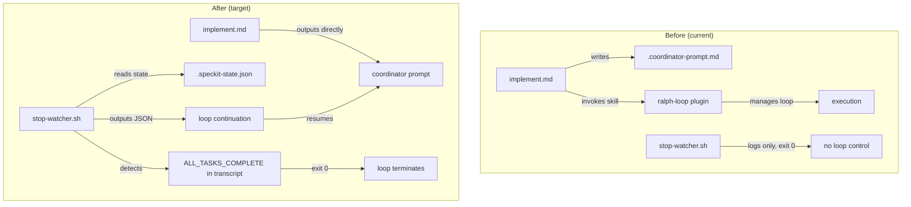

# Design: speckit-stop-hook

## Overview

Port the self-contained execution loop controller pattern from ralph-specum's stop-watcher.sh to ralph-speckit, adapting paths and naming conventions while keeping speckit's simpler fixed-directory structure.

## Architecture



## Components

### Component A: stop-watcher.sh (rewrite)

**Purpose**: Self-contained execution loop controller
**File**: `plugins/ralph-speckit/hooks/scripts/stop-watcher.sh`
**Action**: Rewrite (from 56 lines to ~160 lines)

**Responsibilities**:
1. Read hook input from stdin, extract CWD
2. Check settings file for enabled flag
3. Read `.specify/.current-feature` to find active feature
4. Read `.specify/specs/$FEATURE/.speckit-state.json`
5. Handle race conditions (mtime check)
6. Detect `ALL_TASKS_COMPLETE` in transcript
7. Validate state JSON (output error JSON if corrupt)
8. Check global iteration limit
9. Output JSON continuation prompt when tasks remain
10. Clean up orphaned temp files
11. Check `stop_hook_active` guard

**Logic Flow**:
```
stdin → parse CWD
  → check settings (exit 0 if disabled)
  → read .current-feature (exit 0 if missing)
  → read state file (exit 0 if missing)
  → race condition check (sleep 1 if mtime < 2s)
  → transcript detection (exit 0 if ALL_TASKS_COMPLETE found)
  → validate JSON (output error JSON if corrupt)
  → read state fields
  → check global iteration limit (exit 0 with stderr error if exceeded)
  → check stop_hook_active (exit 0 if true)
  → if phase=execution && taskIndex < totalTasks:
      output JSON {decision: "block", reason: <resume prompt>, systemMessage: <status>}
  → cleanup orphaned temp files
  → exit 0
```

### Component B: implement.md (modify)

**Purpose**: Start execution without ralph-loop dependency
**File**: `plugins/ralph-speckit/commands/implement.md`
**Action**: Modify

**Changes**:
1. Remove "Ralph Loop Dependency Check" section entirely
2. Remove `.coordinator-prompt.md` file writing (Step 1 of "Invoke Ralph Loop")
3. Remove ralph-loop skill invocation (Step 2 of "Invoke Ralph Loop")
4. Replace with: "Output coordinator prompt directly" (matching specum pattern)
5. Add design note about prompt duplication (stop-watcher abbreviated vs implement.md full)
6. Update "Output on Start" to remove ralph-loop references

### Component C: cancel.md (modify)

**Purpose**: Self-contained cancellation
**File**: `plugins/ralph-speckit/commands/cancel.md`
**Action**: Modify

**Changes**:
1. Remove `ralph-wiggum:cancel-ralph` skill invocation
2. Cleanup is just: delete `.speckit-state.json`, keep `.progress.md`
3. Update output template to remove ralph-loop references

### Component D: speckit-state.schema.json (modify)

**Purpose**: Allow new fields for forward compatibility
**File**: `plugins/ralph-speckit/schemas/speckit-state.schema.json`
**Action**: Modify

**Changes**:
1. Change `additionalProperties: false` to `additionalProperties: true`
2. Add `recoveryMode` property (boolean, default false)
3. Add `maxFixTasksPerOriginal` property (integer, default 3)
4. Add `fixTaskMap` property (object)

### Component E: plugin.json + marketplace.json (version bump)

**Purpose**: Major version bump for breaking change
**Files**: `plugins/ralph-speckit/.claude-plugin/plugin.json`, `.claude-plugin/marketplace.json`
**Action**: Modify

**Changes**:
- Bump version from `0.4.0` to `1.0.0`
- Update description to mention self-contained execution

### Component F: speckit-stop-hook.bats (new test file)

**Purpose**: Tests for speckit stop-watcher
**File**: `tests/speckit-stop-hook.bats`
**Action**: Create

**Structure**: Mirror `tests/stop-hook.bats` but adapted for speckit paths:
- `.specify/.current-feature` instead of `specs/.current-spec`
- `.specify/specs/$name/.speckit-state.json` instead of `specs/$name/.ralph-state.json`
- `ralph-speckit` prefix in log messages instead of `ralph-specum`
- Settings file at `.claude/ralph-speckit.local.md`

### Component G: speckit-helpers/setup.bash (new test helper)

**Purpose**: Test helpers for speckit-specific directory structure
**File**: `tests/speckit-helpers/setup.bash`
**Action**: Create

**Differences from `tests/helpers/setup.bash`**:
- Points to speckit stop-watcher script
- Creates `.specify/specs/test-feature/` structure
- Writes `.specify/.current-feature`
- State file named `.speckit-state.json`
- Settings file at `.claude/ralph-speckit.local.md`
- JSON extraction filters `[ralph-speckit]` not `[ralph-specum]`

## Data Flow

1. Claude Code session stops (natural or forced)
2. Stop hook receives JSON on stdin: `{cwd, stop_hook_active, transcript_path}`
3. Hook reads `.specify/.current-feature` → gets `$FEATURE_NAME`
4. Hook reads `.specify/specs/$FEATURE_NAME/.speckit-state.json` → gets execution state
5. If `phase=execution && taskIndex < totalTasks`: output JSON continuation prompt
6. Claude Code receives `{decision: "block", reason: <prompt>}` and resumes with prompt
7. Coordinator reads state, delegates task to spec-executor, updates state
8. Session stops again, loop repeats from step 1

## Technical Decisions

| Decision | Options | Choice | Rationale |
|----------|---------|--------|-----------|
| Settings file name | `ralph-speckit.local.md` vs shared | `ralph-speckit.local.md` | Plugin-specific, matches specum pattern |
| Version bump | 0.5.0 (minor) vs 1.0.0 (major) | 1.0.0 | Breaking change: removes ralph-loop dependency |
| Path resolver | Port path-resolver.sh vs skip | Skip | Speckit uses fixed `.specify/` path, no multi-dir needed |
| Test file location | Same dir as specum tests | `tests/speckit-stop-hook.bats` | Separate file, shared test framework |
| Continuation prompt | Full coordinator prompt vs abbreviated | Abbreviated | Matches specum design: full in implement.md, abbreviated in stop-watcher |

## File Structure

| File | Action | Purpose |
|------|--------|---------|
| `plugins/ralph-speckit/hooks/scripts/stop-watcher.sh` | Rewrite | Self-contained loop controller |
| `plugins/ralph-speckit/commands/implement.md` | Modify | Remove ralph-loop, output prompt directly |
| `plugins/ralph-speckit/commands/cancel.md` | Modify | Self-contained cancel (no external skill) |
| `plugins/ralph-speckit/schemas/speckit-state.schema.json` | Modify | Allow additional properties |
| `plugins/ralph-speckit/.claude-plugin/plugin.json` | Modify | Version bump to 1.0.0 |
| `.claude-plugin/marketplace.json` | Modify | Version bump to 1.0.0 |
| `tests/speckit-stop-hook.bats` | Create | Test suite for speckit stop-watcher |
| `tests/speckit-helpers/setup.bash` | Create | Test helpers for speckit directory structure |

## Error Handling

| Error | Handling | User Impact |
|-------|----------|-------------|
| Missing jq | Exit 0 silently | No loop control, manual resume needed |
| Missing .current-feature | Exit 0 silently | No active feature, nothing to continue |
| Missing state file | Exit 0 silently | No execution in progress |
| Corrupt state JSON | Output JSON error with recovery options | User sees error with fix instructions |
| Max global iterations | Stderr error, exit 0 | Loop stops, user must fix and re-run |
| stop_hook_active=true | Exit 0 silently | Prevents infinite re-invocation |
| State file race condition | Sleep 1s then proceed | Brief delay, no user impact |

## Existing Patterns to Follow

- **JSON output format**: `{decision: "block", reason: $REASON, systemMessage: $MSG}` from `plugins/ralph-specum/hooks/scripts/stop-watcher.sh:177-184`
- **Race condition handling**: mtime check pattern from `plugins/ralph-specum/hooks/scripts/stop-watcher.sh:54-67`
- **Transcript detection**: tail+grep pattern from `plugins/ralph-specum/hooks/scripts/stop-watcher.sh:72-84`
- **Settings check**: sed+awk frontmatter parsing from `plugins/ralph-specum/hooks/scripts/stop-watcher.sh:29-35`
- **Abbreviated resume prompt**: heredoc with state/resume/critical sections from `plugins/ralph-specum/hooks/scripts/stop-watcher.sh:156-173`
- **Test structure**: bats-core with setup.bash helpers from `tests/stop-hook.bats`
- **Implement prompt design note**: duplication rationale from `plugins/ralph-specum/commands/implement.md:116-121`
