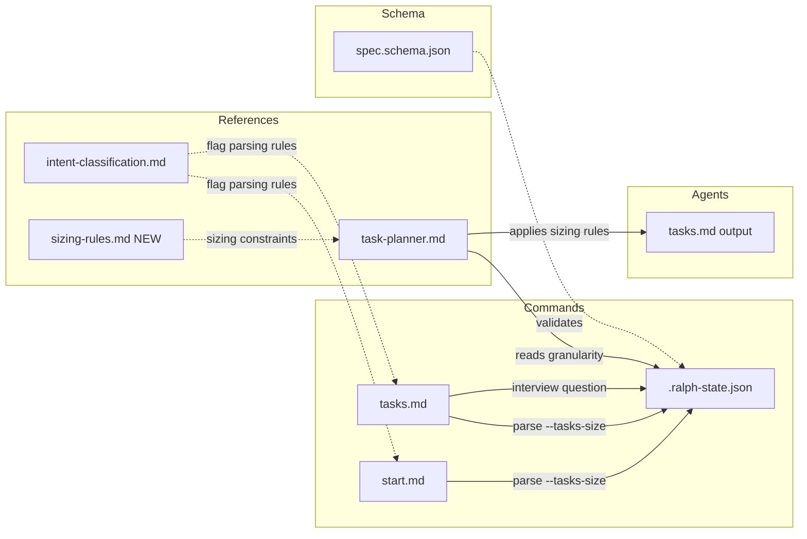
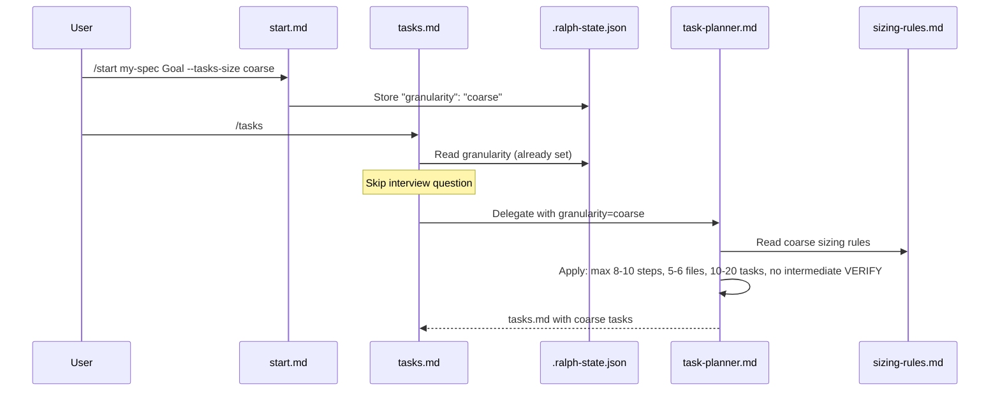
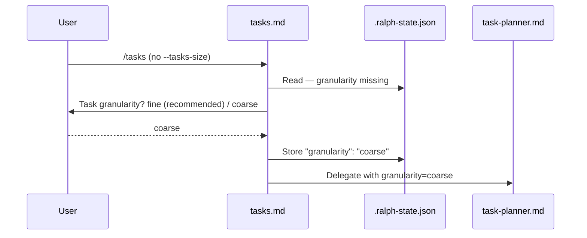

# Design: Task Granularity Levels

## Overview

Add a `--tasks-size fine|coarse` flag to `/start` and `/tasks` commands, storing the value as `granularity` in `.ralph-state.json`. A new reference file `references/sizing-rules.md` defines per-level sizing constraints; `task-planner.md` replaces its hardcoded "Task Sizing Rules" section with a conditional reference to this file. The tasks interview asks granularity preference when not set via flag.

## Architecture



## Data Flow



**Alternative flow -- no flag, asked during /tasks interview:**



## Components

### 1. `references/sizing-rules.md` (NEW)

**Purpose**: Single source of truth for per-level sizing constraints.

**Content:**

```markdown
# Sizing Rules

> Used by: task-planner agent

Determine the active granularity level from delegation context. Default: fine.

## Fine (default)

| Constraint | Value |
|-----------|-------|
| Target task count (POC) | 40-60+ |
| Target task count (TDD) | 30-50+ |
| Max Do steps | 4 |
| Max files per task | 3 |
| Intermediate [VERIFY] | Every 2-3 tasks |
| [P] markers | Yes |
| Final V4-V6 | Always |
| VE tasks | Per project type |

### Fine Split/Combine Rules

**Split if:**
- Do section > 4 steps
- Files section > 3 files
- Task mixes creation + testing
- Task mixes > 1 logical concern
- Verification requires > 1 unrelated command

**Combine if:**
- Task 1 creates a file, Task 2 adds a single import to that file
- Both tasks touch the exact same file with trivially related changes
- Neither task is meaningful alone

## Coarse

| Constraint | Value |
|-----------|-------|
| Target task count (POC) | 10-20 |
| Target task count (TDD) | 8-15 |
| Max Do steps | 8-10 |
| Max files per task | 5-6 |
| Intermediate [VERIFY] | None |
| [P] markers | Yes |
| Final V4-V6 | Always |
| VE tasks | Per project type |

### Coarse Split/Combine Rules

**Split if:**
- Do section > 10 steps
- Files section > 6 files
- Task mixes unrelated logical concerns
- Task crosses phase boundaries

**Combine if:**
- Multiple fine tasks touch the same component for the same concern
- Error handling + happy path are in the same component
- Setup + first usage are tightly coupled

### Coarse Guidance

- Each task remains a single logical concern (no bundling unrelated changes)
- Each task should be completable in a single focused session
- Combine what fine mode splits when they share a component and concern

## Shared Rules (both levels)

- 1 logical concern per task (always)
- Phase distribution ratios preserved proportionally
- [P] eligibility: zero file overlap, no output deps, not [VERIFY], no shared config
- Final verification sequence (V4-V6) always generated
- VE tasks generated per project type detection (independent of granularity)
- POC-first or TDD workflow selection unchanged by granularity
- Clarity test: each task executable without clarifying questions
- Simplicity principle: minimum code to achieve goal
- Surgical principle: touch only what the task requires
```

### 2. `agents/task-planner.md` (MODIFY)

**What changes**: Replace the hardcoded "Task Sizing Rules" `<mandatory>` section (lines 510-541) with a conditional reference.

**Current** (lines 510-541):
```markdown
## Task Sizing Rules

<mandatory>
Every task MUST satisfy these constraints:

**Size limits:**
- Max 4 numbered steps in Do section
- Max 3 files in Files section (exception: tightly-coupled test+impl pair = 1 logical file)
- 1 logical concern per task

**Split if:**
...

**Target task count:**
- Standard spec: 40-60+ tasks
- Phase distribution: Phase 1 = 50-60%, Phase 2 = 15-20%, Phase 3 = 15-20%, Phase 4-5 = 10-15%
...
</mandatory>
```

**Replacement:**
```markdown
## Task Sizing Rules

<mandatory>
Read `${CLAUDE_PLUGIN_ROOT}/references/sizing-rules.md` for sizing constraints.

**Determine granularity level**: Read `granularity` from the delegation context (passed by tasks.md coordinator). If not provided, default to `fine`.

Apply the sizing rules (task count, max steps, max files, [VERIFY] frequency) for the detected level. All shared rules apply regardless of level.

**Simplicity principle**: Each task should describe the MINIMUM code to achieve its goal. No speculative features, no abstractions for single-use code, no error handling for impossible scenarios. If 50 lines solve it, don't write 200.

**Surgical principle**: Each task touches ONLY what it must. No "while you're in there" improvements. No reformatting adjacent code. No refactoring unbroken functionality. Every changed file must trace directly to the task's goal.

**Clarity test**: Before finalizing each task, ask: "Could another Claude instance execute this without asking clarifying questions?" If no, add more detail or split further.
</mandatory>
```

Also update Quality Checklist at end of file:

**Current:**
```markdown
**POC-specific (GREENFIELD):**
- [ ] Total task count is 40+ (split further if under 40)

**TDD-specific (Non-Greenfield):**
- [ ] Total task count is 30+ (split further if under 30)
```

**New:**
```markdown
**POC-specific (GREENFIELD):**
- [ ] Fine: Total task count is 40+ (split further if under 40)
- [ ] Coarse: Total task count is 10+ (split further if under 10)

**TDD-specific (Non-Greenfield):**
- [ ] Fine: Total task count is 30+ (split further if under 30)
- [ ] Coarse: Total task count is 8+ (split further if under 8)
```

### 3. `commands/start.md` (MODIFY)

**Frontmatter change:**
```yaml
argument-hint: [name] [goal] [--fresh] [--quick] [--commit-spec] [--no-commit-spec] [--specs-dir <path>] [--tasks-size fine|coarse]
```

**State initialization**: When `--tasks-size` present and valid (`fine`|`coarse`), add `"granularity": "<value>"` to initial `.ralph-state.json`. When absent, omit the field entirely.

**Validation**: If `--tasks-size` has invalid value, log warning `"Invalid --tasks-size value '<value>', defaulting to fine"` and store `"granularity": "fine"`.

No other changes to start.md logic. The flag is parsed and stored; task-planner reads it later.

### 4. `commands/tasks.md` (MODIFY)

**Frontmatter change:**
```yaml
argument-hint: [spec-name] [--tasks-size fine|coarse]
```

**Step 1 addition** (after reading state): Check `$ARGUMENTS` for `--tasks-size`. If present and valid, update `granularity` in `.ralph-state.json` (overrides value from `/start`). Invalid value: warn, default to fine.

**Step 2 addition** (interview): Add granularity to brainstorming dialogue hints:

```markdown
- **Task granularity** -- fine (40-60+ small tasks, [VERIFY] every 2-3, ideal for parallel) or coarse (10-20 larger tasks, no intermediate [VERIFY], fewer tokens)? Fine is recommended.
```

Question asked only when:
1. Not `--quick` mode (quick defaults to fine silently)
2. `granularity` not already set in `.ralph-state.json`

Store response in `.progress.md` under interview section and update `.ralph-state.json`.

**Step 3 addition** (delegation): Include `granularity` value in delegation context to task-planner:

```markdown
- **Granularity**: [fine|coarse] (from .ralph-state.json)
```

### 5. `references/intent-classification.md` (MODIFY)

Add `--tasks-size` to argument parsing section:

```markdown
- **--tasks-size <fine|coarse>**: Task granularity level for task generation
```

Add examples:
```markdown
- `/ralph-specum:start user-auth Add OAuth2 --tasks-size coarse` -> Create with coarse granularity
- `/ralph-specum:start "Build auth" --quick --tasks-size coarse` -> Quick mode, coarse tasks
```

### 6. `schemas/spec.schema.json` (MODIFY)

Add `granularity` to `definitions.state.properties`:

```json
"granularity": {
  "type": "string",
  "enum": ["fine", "coarse"],
  "description": "Task sizing level: fine (40-60+ tasks) or coarse (10-20 tasks)"
}
```

Not added to `required` -- optional for backwards compatibility. Missing field = fine default.

### 7. Version Bumps

| File | Current | New |
|------|---------|-----|
| `plugins/ralph-specum/.claude-plugin/plugin.json` | 4.4.0 | 4.5.0 |
| `.claude-plugin/marketplace.json` | 4.4.0 | 4.5.0 |

Minor bump: new feature, no breaking changes.

## Technical Decisions

| Decision | Options Considered | Choice | Rationale |
|----------|-------------------|--------|-----------|
| Sizing rules location | Inline in task-planner.md; Separate reference file | Separate `references/sizing-rules.md` | User's explicit choice during design interview; keeps task-planner focused; rules independently readable |
| Flag name | `--granularity`, `--tasks-size`, `--task-size` | `--tasks-size` | User's explicit choice during requirements interview |
| Invalid flag handling | Hard error (abort), Silent default | Warning + default to fine | User's explicit choice during design interview; avoids blocking workflow |
| State field name | `tasksSize`, `granularity`, `taskGranularity` | `granularity` | Concise; already used in requirements and progress |
| Coarse [VERIFY] | None, Reduced frequency | No intermediate [VERIFY] | User's choice; maximizes token savings; V4-V6 still catches issues |
| TDD coarse count | Same as POC (10-20), Lower (8-15) | 8-15 | Proportional scaling from fine's 30-50; TDD has no throwaway prototyping |
| Quick mode default | Fine, Coarse | Fine (silent, no question) | User decision; fine is recommended default |
| Number of levels | 2 (fine/coarse), 3 (fine/balanced/coarse) | 2 (fine/coarse) | User scoped out auto and intermediate levels; simplicity first |

## File Structure

| File | Action | Purpose |
|------|--------|---------|
| `plugins/ralph-specum/references/sizing-rules.md` | Create | Per-level sizing constraints reference |
| `plugins/ralph-specum/agents/task-planner.md` | Modify | Replace hardcoded sizing with conditional reference |
| `plugins/ralph-specum/commands/start.md` | Modify | Parse `--tasks-size`, store in state |
| `plugins/ralph-specum/commands/tasks.md` | Modify | Parse `--tasks-size`, interview question, pass to planner |
| `plugins/ralph-specum/references/intent-classification.md` | Modify | Add `--tasks-size` to flag docs |
| `plugins/ralph-specum/schemas/spec.schema.json` | Modify | Add `granularity` field to state |
| `plugins/ralph-specum/.claude-plugin/plugin.json` | Modify | Version 4.4.0 -> 4.5.0 |
| `.claude-plugin/marketplace.json` | Modify | Version 4.4.0 -> 4.5.0 |

## Error Handling

| Error Scenario | Handling Strategy | User Impact |
|----------------|-------------------|-------------|
| Invalid `--tasks-size` value | Warn, default to fine, continue | Warning message, spec proceeds with fine |
| `granularity` missing from state (old spec) | Default to fine | Zero impact, backwards compatible |
| `/tasks` flag overrides `/start` value | `/tasks` flag wins, updates state | Expected per FR-8 |
| `--tasks-size` without a value | Treat as missing (no value) | Falls through to interview or default |
| task-planner can't read sizing-rules.md | Fine defaults hardcoded in planner as fallback | No user impact |

## Edge Cases

- **Re-running `/tasks` with different `--tasks-size`**: Updates state, regenerates tasks.md. Standard re-run behavior.
- **`--quick --tasks-size coarse`**: Works. Quick mode uses coarse. No interview question.
- **`--tasks-size fine` explicit**: Same as default but stored explicitly. No ambiguity.
- **TDD + coarse**: Triplets still individual tasks but broader. 8-15 total with fewer triplets per cycle.
- **[P] in coarse**: Same eligibility rules apply. Fewer tasks means fewer parallel groups, but they still form when eligible.

## Test Strategy

### Manual Verification

1. **Fine output**: `/start test-fine Goal --tasks-size fine` -> 40-60+ tasks, max 4 steps, [VERIFY] every 2-3
2. **Coarse output**: `/start test-coarse Goal --tasks-size coarse` -> 10-20 tasks, max 8-10 steps, no intermediate [VERIFY]
3. **Flag override**: `/start ... --tasks-size fine` then `/tasks --tasks-size coarse` -> state=coarse, coarse output
4. **Interview question**: `/tasks` without flag -> granularity question asked
5. **Interview skipped**: `/tasks --tasks-size coarse` -> no granularity question
6. **Quick mode**: `/start ... --quick` -> defaults to fine, no question
7. **Invalid value**: `/start ... --tasks-size mega` -> warning, defaults to fine
8. **Backwards compat**: Old spec without granularity in state -> fine behavior
9. **[P] in coarse**: Coarse output has [P] on eligible tasks
10. **V4-V6 always present**: Both modes end with V4/V5/V6

## Existing Patterns to Follow

- **Flag parsing**: Same `$ARGUMENTS` string matching as `--quick`, `--fresh`, `--commit-spec` (intent-classification.md)
- **State updates**: Same `jq` pattern to update `.ralph-state.json`
- **Reference file format**: Same `> Used by:` header + tables as quality-checkpoints.md, phase-rules.md
- **Interview questions**: Same one-at-a-time adaptive dialogue as goal-interview.md and tasks.md Step 2
- **Version bumps**: Both plugin.json and marketplace.json per CLAUDE.md rules

## Implementation Steps

1. Create `plugins/ralph-specum/references/sizing-rules.md` with fine/coarse tables and shared rules
2. Modify `plugins/ralph-specum/agents/task-planner.md` -- replace hardcoded sizing section with conditional reference, update quality checklist
3. Modify `plugins/ralph-specum/references/intent-classification.md` -- add `--tasks-size` to flag docs and examples
4. Modify `plugins/ralph-specum/schemas/spec.schema.json` -- add optional `granularity` field
5. Modify `plugins/ralph-specum/commands/start.md` -- parse `--tasks-size` flag, store in state init
6. Modify `plugins/ralph-specum/commands/tasks.md` -- parse flag, add interview question, pass to planner
7. Bump versions in `plugin.json` and `marketplace.json` (4.4.0 -> 4.5.0)
