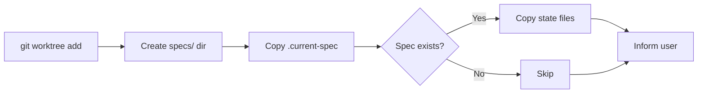

# Design: when-creating-worktree

## Overview

Add a state file copy block after `git worktree add` in start.md to propagate spec state to new worktrees.

## Architecture



## Components

### State Copy Block

**Purpose**: Copy gitignored state files to worktree after creation
**Location**: `plugins/ralph-specum/commands/start.md`, after `git worktree add`

**Responsibilities**:
- Create `specs/` directory in worktree
- Copy `.current-spec` if exists
- Create spec subdirectory in worktree
- Copy `.ralph-state.json` if exists
- Copy `.progress.md` if exists
- Report what was copied

## Data Flow

1. User chooses worktree option in start.md
2. `git worktree add "$WORKTREE_PATH" -b "feat/${SPEC_NAME}"` executes
3. State copy block runs (NEW)
4. User informed of worktree path and copied state
5. Command stops, user switches to worktree

## Technical Decisions

| Decision | Options | Choice | Rationale |
|----------|---------|--------|-----------|
| Copy method | `cp` vs `rsync` | `cp` | Simpler, no rsync dependency |
| Overwrite behavior | Overwrite vs Skip | Skip | Preserve existing worktree state |
| Error handling | Fail vs Warn | Warn | Don't block worktree creation for state issues |

## File Structure

| File | Action | Purpose |
|------|--------|---------|
| `plugins/ralph-specum/commands/start.md` | Modify | Add state copy block after worktree creation |

## Implementation Details

### Insertion Point

Insert after line ~128 in start.md (after `git worktree add`):

```bash
# Copy spec state files to worktree
if [ -d "./specs" ]; then
    mkdir -p "$WORKTREE_PATH/specs"

    # Copy .current-spec if exists
    if [ -f "./specs/.current-spec" ]; then
        cp "./specs/.current-spec" "$WORKTREE_PATH/specs/.current-spec"
    fi

    # If spec name known, copy spec state files
    if [ -n "$SPEC_NAME" ] && [ -d "./specs/$SPEC_NAME" ]; then
        mkdir -p "$WORKTREE_PATH/specs/$SPEC_NAME"

        # Copy state files (don't overwrite existing)
        [ -f "./specs/$SPEC_NAME/.ralph-state.json" ] && \
            [ ! -f "$WORKTREE_PATH/specs/$SPEC_NAME/.ralph-state.json" ] && \
            cp "./specs/$SPEC_NAME/.ralph-state.json" "$WORKTREE_PATH/specs/$SPEC_NAME/"

        [ -f "./specs/$SPEC_NAME/.progress.md" ] && \
            [ ! -f "$WORKTREE_PATH/specs/$SPEC_NAME/.progress.md" ] && \
            cp "./specs/$SPEC_NAME/.progress.md" "$WORKTREE_PATH/specs/$SPEC_NAME/"
    fi
fi
```

### Variables Available at Insertion Point

- `$WORKTREE_PATH` - Path to new worktree (e.g., `../repo-name-spec-name`)
- `$SPEC_NAME` - Spec name if provided (may be empty if inferred later)
- `./specs/` - Source specs directory

## Error Handling

| Error | Handling | User Impact |
|-------|----------|-------------|
| Source file missing | Skip silently | None, expected case |
| Target file exists | Skip (no overwrite) | Preserve existing state |
| Permission denied | Warn, continue | User informed, worktree still usable |
| mkdir fails | Warn, continue | User may need to copy manually |

## Existing Patterns to Follow

- **Gitignore pattern**: State files already gitignored (`.gitignore` lines 1-4)
- **Conditional file ops**: Match pattern in new.md lines 55-61 for gitignore handling
- **SPEC_NAME handling**: May be set or empty, code must handle both cases
